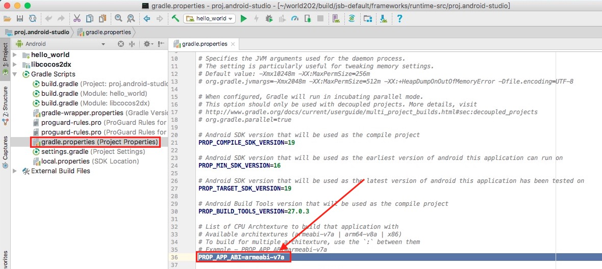
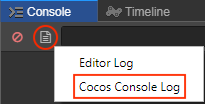

# Build and release games on Native platforms

Open `Project -> Build...` in the main menu and open `Build` panel.

Currently, there are four native platforms, which include: Android, iOS, Mac and Windows. The options of release games on iOS, Mac and Windows will only appear in concerning operating systems.


## Build Options

### Merge SpriteFrames in Atlas

Merge all the SpriteFrames in the same atlas into the same package. The option is disable by default. When enabled, it can reduce the number of SpriteFrame files that need to be downloaded when hot update. However if the number of SpriteFrame in the atlas is large, the startup time on the native platform may be extened.  

### Inline all SpriteFrames

When merging assets automatically, combine all SpriteFrame and the assets that are being relied on into the same package. It is recommended to enable this option in web. When enable, it will increase the overall game size slightly, consume a little bit of network traffic, but can significantly reduce the number of network requests. It is recommended to disable this option in native, because it will increase the package size used in hot update.

### MD5 Cache

Add MD5 information to all the resource file names after build to resolve the CDN cache problem during hot update.

After being enabled, if any resource fails to load, it is because the renamed new file can not be found. It is usually because some third party resources used in C++ was not loaded by cc.loader. If this happens, you can convert the url before loading, to fix the loading problem.

```cpp
auto cx = ScriptingCore::getInstance()->getGlobalContext();
JS::RootedValue returnParam(cx);
ScriptingCore::getInstance()->evalString("cc.loader.md5Pipe.transformURL('url')", &returnParam);

string url;
jsval_to_string(cx, returnParam, &url);
```

### Package Name

An input field named **package name** will appear in the **Build** panel after selecting Android platform, into which you can input the package name of your game (also called Bundle ID). The package name is usually arranged in the reverse order of the product's website url, such as: `com.mycompany.myproduct`.

**Notice**: Only numbers, letters and underscores can be included in the package name. Besides, the last section of package name should start with a letter, but not an underline or a number.


### API Level

API Level：Set up the API version used for compiling Android, with minimal support for android-16.

### APP ABI

APP ABI：To set up the CPU type that Android needs to support, you can select one or more options, and have a `armeabi-v7a`, `arm64-v8a`, `x86` three types.

**Attention**:
- After you select an ABI build, build another ABI without Clean, and the two ABI's so files will be packaged into apk. This is the default behavior of Android Studio. If you use Android Studio to import the project, after select an ABI build, then execute `Build -> Clean Project` and build another ABI. Only the latter ABI will be packaged into the apk.

- After the project is imported with Android Studio, it is an independent existence and does not depend on the **Build**. If you need to modify the ABI, you can directly modify the **PROP_APP_ABI** property in **gradle.properties**. As shown below:



### Keystore

Android requires that all APKs be digitally signed with a certificate before they can be installed. Cocos Creator provides a default keystore, Check the `Use Debug Keystore` to use the default keystore. If you need to customize the keystore, you can remove the `Use Debug Keystore` checkbox. Please refer to [official documents](https://developer.android.com/studio/publish/app-signing?hl=zh-cn).

### Encrypt JS

Encrypt the published script. After build, the JSC file is generated in the `src` directory, which is encrypted. And JS files will be backed up in the `js backups` directory for debugging, and will not enter the APP when packaged.

**JS Encryption Key**: This secret key will be used to encrypt js files. The project will generate the key randomly when created.

**Zip Compress**: You can reduce the size of your scripts by checking them


## Select source

There are two types of available engine templates in the dropdown menu of **template**, from which we can choose one:

- Default, build the project with the Cocos2d-x source version engine
- Link, unlike the default template, the link template does not copy the Cocos2d-x source to the build directory, but uses the shared cocos2d-x source code. This can effectively reduce the footprint of the build directory, and the cocos2d-x source changes can be shared.

### Source engine

The Cocos2d-x engine includes the source code engine. The scope of application is:

- The first time the source engine builds and compiles a project, it takes a long time to compile C++ code, depending on the configuration of the computer, which may take 5-20 minutes. After the same project has been compiled once, the time required for the next recompile is greatly shortened.
- The project built by the source engine, compiled and run using the native development environment (such as Android Studio, Xcode, etc.), is ready for debugging and error trapping.

Currently, Cocos Creator installation directory has included Cocos2d-x source code engine. If you want to know the progress of compiling, please click the log button of the **Console** and select the **Cocos Console Log** to open the appropriate log file.



## Build a Native Project

After selecting the release platform and initial scene, the project can now be built. Click the **Build** button on the bottom right corner, and start building workflow.


When compiling scripts and zipping resources, a progress bar will display on the top of the window. After the progress bar has reached 100%, please continue to wait unitl the building of the project in **console** is finished. If it's successful, the diary as showed below will display:

```bash
Built to "/myProject/tutorial-blackjack/build/tutorial-blackjack" successfully
```

Next, you can choose to directly open the original preview provided by Cocos Creator, or manually open the constructed native project in IDE of corresponding platform for further preview, adjustment and release.

## Compile and preview

Click the **Compile** button below to enter the compile process, if the template chooses the `default` source code engine, this compilation process will take a long time. When the compilation is successful, it will prompt:

`Compile native project successfully`

**Note: After the first compilation of the Android platform or version upgrade, it is recommended to open the project via Android Studio, download the missing tools according to the prompts, then compile and run.**

Then click the **Play** button on the bottom right corner, you can preview games of native platforms via the default method provided by Cocos Framework.


After clicking **Play** button, a part of the building work will be continued, the real time progress of which will be seen on the console.

The Mac/Windows platform runs the preview directly on the desktop, and the iOS platform calls the simulator to run the preview. Android platform must connect to real machine via USB and the preview can be run after USB debugging is turned on on the real machine.

The iOS platform recommends compiling with the Xcode connection true machine. After the build is complete, use Xcode to open the `frameworks\runtime-src\proj.ios_mac\.xcodeproj` file under the build directory and set the signature in the Xcode panel `General -> Signing`, select the connected device at the top left of Xcode and click the compile button to compile.


## Use an Native Project


Click the **open** button near the release path, the building release path will be opened in the document manager of operating system.

`jsb` of this path includes all the native build projects.


The red frames in the picture indicate projects of different native platforms. Next, only by using IDE(such as: Xcode, Visual Studio) that corresponds to the native platform to open these projects, can you make further operations like compilation, preview and release. For the usage instructions for native platform's IDE, please search related information on your own, which will not be discussed in detail here.

**Attention**：Projects that run debug mode builds on MIUI 10 systems may pop up a "Detected problems with API compatibility" prompt box, which is a problem introduced by the MIUI 10 system itself, you can use release mode build to solve the problem.

---

To know how to debug on a native platform:

Since Creator v1.7, please refer to [Debug JavaScript on Native Platform](debug-jsb.md).

If the Creator version is v1.6 below, please refer to [Native Platform Debugging](debug-native.md).