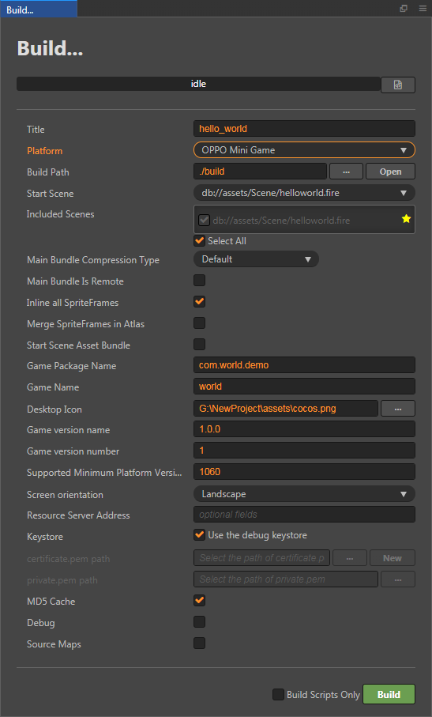
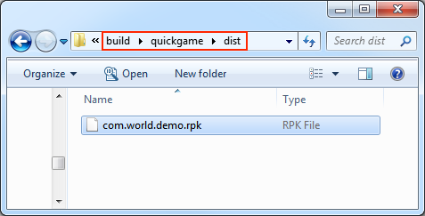

# Publish to OPPO Mini Games

## Environment Configuration

- Download [OPPO Mini Game Debugger [zh]](https://cdofs.oppomobile.com/cdo-activity/static/201810/26/quickgame/documentation/#/games/use?id=_2-%e5%ae%89%e8%a3%85-runtimeapk-%e5%8c%85%e5%88%b0-oppo-%e6%89%8b%e6%9c%ba%e4%b8%8a) and install it on your OPPO phone (Android 6.0 or above is recommended).

- Install [nodejs-8.1.4](https://nodejs.org/en/download/) or above, globally.

## Release Process

Use Cocos Creator to open the project that needs to be released. Open the **Build** panel from the **Menu bar -> Project**, select **OPPO Mini Game** in the **Platform** dropdown.



### Configuration Options

The specific filling rules for the relevant parameter configuration are as follows:

- **Main Bundle Compression Type**

  Set the compression type of the main package, please refer to the [built-in Asset Bundle — `main`](../asset-manager/bundle.md#the-built-in-asset-bundle) documentation for details.

- **Main Bundle Is Remote**

  This option is optional and needs to be used with the **Resource Server Address** option.<br>
  If set, the main package is configured as a remote package, and along with its related dependent resources are built into a built-in Asset Bundle — [main](../asset-manager/bundle.md#the-built-in-asset-bundle) under the **remote** folder of the release package directory. You need to upload the entire **remote** folder to the remote server.

- **Start Scene Asset Bundle**

  This option is optional.<br>
  If set, the start scene and its related dependent resources are built into the built-in Asset Bundle — [start-scene](../asset-manager/bundle.md#the-built-in-asset-bundle) to speed up the resource loading of the start scene. Please refer to the [Start Scene Loading](publish-wechatgame.md#speed-up-the-loading-of-the-start-scene) for details.

- **Game Package Name**

  **Game Package Name** is filled in according to the user's needs. It's required.

- **Game Name**

  **Game Name**, the name of the OPPO Mini Game, is required. And the **Title** at the top of the **Build** panel does not participate in the OPPO mini game packaging process.

- **Desktop Icon**

  **Desktop Icon** is required. Click the **...** button at the back of the input box to select the icon you want. When building, the Desktop Icon will be built into the __OPPO Mini Game__ project. Desktop Icon suggest using PNG pictures.

- **Game Version Name**

  This item is required. **Game Version Name** is the real version, such as: 1.0.0.

- **Game Version Number**

  This item is required. **Game Version Number** is different from the **Game Version Name**, and the **Game Version Number** is mainly used to distinguish the version update. Each time when you submit audit, the game version number is at least 1 higher than the value of the last submitted audit. It must not be equal to or less than the value of the last submitted audit, and it is recommended that the **Game Version Number** be recursively incremented by 1 each time when the audit is submitted. **Note**: The **Game Version Number** must be a positive integer.

- **Supported Minimum Platform Version Number**

  This item is required. According to the suggestions of OPPO Mini Game, this value is currently recommended for **1060**. Please refer to the [OPPO Mini Game Instructions [zh]](https://cdofs.oppomobile.com/cdo-activity/static/201810/26/quickgame/documentation/#/games/use) for details.

- **Resource Server Address**

  This option is optional and used to fill in the address of the remote server where the resources are stored.

  - If this option is left blank, the `build/quickgame/remote` folder in the release package directory will be packaged into the **rpk** package.

  - If this option is filled in, the `remote` folder will not be packaged into the built **rpk** package. You need to manually upload the `remote` folder to the filled in Resource Server Address after build.

  Refer to the Resource Management section at the bottom of the document for more details.

- **Keystore**

  When you check the **Keystore**, the default is to build the rpk package with a certificate that comes with Creator, which is used only for **debugging**. **Note**: When the rpk package is to be used to submit an audit, do not check the **Keystore** to build it.

  If you don't check the **Keystore**, you need to configure the signature files **certificate.pem path** and **private.pem path**, where you build a rpk package that you can **publish directly**. The user can configure two signature files by using the **...** button to the right of the input box. **Note**: These two signature files are not recommended to be placed in the `build/quickgame` directory of the publish package, otherwise the build directory will be emptied each time when it is built, resulting in file loss.

  There are two ways to generate a signature files:

    - Generated by the **New** button after the **certificate.pem path** in the **Build** panel.

    - Generated by the command line.

      The user needs to generate the signature file **private.pem**, **certificate.pem** through tools such as **openssl**.

      ```bash
      # Generate a signature file with the openssl command tool
      openssl req -newkey rsa:2048 -nodes -keyout private.pem   -x509 -days 3650 -out certificate.pem
      ```

      **Note**: **openssl** can be opened directly in the terminal in Linux or Mac environment, and in the Windows environment you need to install `openssl` and configure system environment variables. Restart Creator after the configuration is complete.

- **Custom npm folder path**

  This item is optional. Starting with **v2.0.10**, the global npm of the operating system can be automatically obtained and without manual setting. The way to obtain npm is:

  - **Windows**: Gets the path in the environment variable from the system.
  - **Mac**: Gets the path in the environment variable from the configuration file of Shell.

  If not, make sure the npm is properly installed and can be started directly in the command line environment. The obtained npm is used to provide an environment for building rpk. If the npm folder path cannot be found at building, Cocos Creator will only export the game project directory and will not generate the rpk package.

### Build

After the relevant options of the **Build** panel are set, click **Build**. After the build is complete, click the **Open** button behind the **Build Path** to open the build release package. You can see that the **quickgame** directory is generated under the default release path `build` directory, which is the exported OPPO Mini Game project directory and **rpk**, **rpk** package are in the `build/quickgame/dist` directory.



### Run the built rpk to the phone

Copy the generated mini-game **rpk** file to the `/sdcard/games` directory on your phone's SD card. Then open the **Mini Game Debugger** that has been installed before on the OPPO phone, click the **OPPO Mini Game** section, and then find the icon corresponding to the game name. If not found, click on the "More -> Refresh" button in the upper right corner to refresh.

**Note**: For Mini Game Debugger **v3.2** and above, you need to copy **rpk** to the `/sdcard/Android/data/com.nearme.instant.platform/files/games` directory of your phone. If there is no **games** directory, you need to create a new one. Please refer to the [Official Documentation [zh]](https://cdofs.oppomobile.com/cdo-activity/static/201810/26/quickgame/documentation/#/games/use?id=_3-%e6%96%b0%e5%bb%ba%e7%9b%ae%e5%bd%95) for details.


## Subpackage rpk

Subpackage loading, that is, splitting the game content into several packages according to certain rules, only downloading the necessary packages when starting up for the first time. This necessary package is called **main package**, and the developer can trigger in the main package to download other sub-packages, which can effectively reduce the time spent on the first boot. To use this function, you need to set [Mini Game Subpackage](subpackage.md) in Cocos Creator, and the package will be automatically subpackaged when the setting is completed.

After the build is complete, the subpackage directory is in the `build/quickgame/dist` directory. <br>
In this case, you need to create a new **subPkg** directory in the **sdcard** directory of the OPPO phone, and then copy the **.rpk** file in the `build/quickgame/dist` directory to the **subPkg** directory.

Then switch to the **Package Load** section of **Mini Game Debugger**, click Refresh at the top right to see the game name of the subpackage, click **Second Open** to use the same as the normal packaged **rpk**.


Subpackage rpk needs to be copied to the `/sdcard/subPkg` directory of the OPPO phone, and non-subpackage rpk needs to be copied to the `/sdcard/games` directory of the OPPO phone, both of which cannot be mixed.

**Note**: If the OPPO game debugger is **v3.2** or above, you need to copy the subpackage **rpk** to the `/sdcard/Android/data/com.nearme.instant.platform/files/subPkg` directory of your phone, if there is no **subPkg** directory, you need to create a new one. The **rpk** without subpackage is copied to the `/sdcard/Android/data/com.nearme.instant.platform/files/games` directory of your phone, both of which cannot be mixed.

## Resource Management for OPPO Mini Game Environment

**OPPO Mini Game** is similar to **WeChat Mini Game**. There are restrictions on the package size. The main package size limit for OPPO Mini Game is **10MB**, more than that must be downloaded via a network request.

Cocos Creator already helps developers with downloading, caching and version management of remote resources. The specific implementation logic and operation steps are similar to the WeChat Mini Game. Please refer to the [Resource Management for WeChat Mini Game](./publish-wechatgame.md#resource-management-for-the-wechat-mini-games) documentation for details.

## Related Reference Links

- [OPPO Developer Guides](https://developers.oppomobile.com/wiki/doc/index#id=88)
- [OPPO Mini Game Tutorial [zh]](https://cdofs.oppomobile.com/cdo-activity/static/201810/26/quickgame/documentation/#/games/quickgame)
- [OPPO Mini Game API Documentation [zh]](https://cdofs.oppomobile.com/cdo-activity/static/201810/26/quickgame/documentation/#/feature/account)
- [OPPO Mini Game Tool Download [zh]](https://cdofs.oppomobile.com/cdo-activity/static/201810/26/quickgame/documentation/#/games/use)
