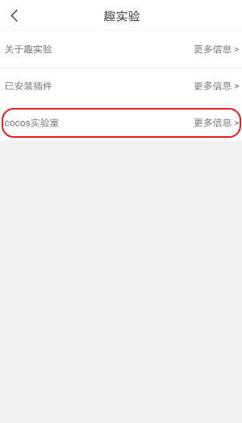

# Publish to QTT Mini Games

Starting with Cocos Creator v2.3.0, creating games for the QTT Mini Games is officially supported.

## Environment Configuration

- Download [QTT APP](https://game.qutoutiao.net/doc/index.html#/doc/debug_in_app) and install it on your Android device (Android Phone 6.0 or above is recommended).

## Release Process

Use **Cocos Creator** to open the project that needs to be released. Open the **Build** panel from the **Menu bar -> Project**, select **QTT Mini Game** in the **Platform** dropdown.

### Configuration Options

The specific filling rules for the relevant parameter configuration are as follows:

- **Main Bundle Compression Type**

  Set the compression type of the main package, please refer to the [built-in Asset Bundle — `main`](../asset-manager/bundle.md#the-built-in-asset-bundle) documentation for details.

- **Main Bundle Is Remote**

  This option is optional and needs to be used with the **Resource Server Address** option. 
  If set, the main package is configured as a remote package, and along with its related dependent resources are built into a built-in Asset Bundle — [main](../asset-manager/bundle.md#the-built-in-asset-bundle) under the **remote** folder of the release package directory. You need to upload the entire **remote** folder to the remote server.

- **Start Scene Asset Bundle**

  This option is optional. 
  If set, the start scene and its related dependent resources are built into the built-in Asset Bundle — [start-scene](../asset-manager/bundle.md#the-built-in-asset-bundle) to speed up the resource loading of the start scene. Please refer to the [Start Scene Loading](publish-wechatgame.md#speed-up-the-loading-of-the-start-scene) for details.

- **Game Package Name**

  **Game Package Name** is filled in according to the user's needs. It's required.

- **Game Name**

  **Game Name**, the name of the QTT Mini Game, is required. And the **Title** at the top of the **Build** panel does not participate in the QTT Mini Game packaging process.

- **Desktop Icon**

  **Desktop Icon** is required. Click the **...** button at the back of the input box to select the icon you want. When building, the Desktop Icon will be built into the **QTT Mini Game** project. Desktop Icon suggest using PNG pictures.

- **Game Version Name**

  This item is required. **Game Version Name** is the real version, such as: 1.0.0.

- **Game Version Number**

  This item is required. **Game Version Number** is different from the **Game Version Name**, and the **Game Version Number** is mainly used to distinguish the version update. Each time when you submit audit, the Game Version Number is at least 1 higher than the value of the last submitted audit. It must not be equal to or less than the value of the last submitted audit, and it is recommended that the **Game Version Number** be recursively incremented by 1 each time when the audit is submitted.
  
  > **Note**: the **Game Version Number** must be a positive integer.

- **Resource Server Address**

  This option is optional and used to fill in the address of the remote server where the resources are stored.

  - If this option is left blank, the `build/qtt-game/remote` folder in the release package directory will be packaged into the **cpk** package.

  - If this option is filled in, the `remote` folder will not be packaged into the built **cpk** package. You need to manually upload the `remote` folder to the filled in Resource Server Address after build.

  Refer to the Resource Management section at the bottom of the document for more details.

### Build

After the relevant options of the **Build** panel are set, click **Build**. After the build is complete, click the **Open** button behind the **Build Path** to open the build release package. You can see that the **qtt-game** directory is generated under the default release path `build` directory, which is the exported QTT Mini Game project directory and **cpk**, the **cpk** package is in the **/build/qtt-game** directory.

### Run the built cpk to the phone

- Open the QTT APP that has been installed before on your Android device, click **我的** in the bottom navigation bar. Then drag the page down to the bottom and click **设置** to enter the Settings page.

  

- Click the blank area on the right side of the navigation bar of the Settings page for 6 consecutive times to enter the **趣实验** page.

  

- Find **Cocos 实验室** on the **趣实验** page and click to enter the **Cocos 实验室** page.

  

- Open **game 包本地化开关** in the **Cocos 实验室** page, and you can see a file path displayed below. Then rename the cpk package generated by the **build** to `game_debug.cpk`, and place it under the file path of the Android device. **debug 开关** and **vconsole 开关** can be turned on or off as required.

  

- Fill in the applied **appid** and **game 版本号**

  **appid** is the applied game ID, which can be filled in at will in the debug environment. 
  **game 版本号** is the version characteristic value of the game package, normally generated by the platform. Here used for debugging purposes, and it is generally a random string of letters and numbers.

  > **Note**: a new value is re-entered for each replacement package.

- After setting, click the **打开游戏** button below to open the game.

  > **Note**: if you want to open the game again, you need to re-place the cpk package in the file path described above.

## Resource Management for QTT Mini Game Environment

**QTT Mini Game** is similar to **WeChat Mini Game**. There are restrictions on the package size. The main package size limit for QTT Mini Game is **4MB**, more than that must be downloaded via a network request.

Cocos Creator already helps developers with downloading, caching and version management of remote resources. The specific implementation logic and operation steps are similar to the WeChat Mini Game. Please refer to the [Resource Management for WeChat Mini Game](./publish-wechatgame.md#resource-management-for-the-wechat-mini-games) documentation for details.

## Related reference links

- [QTT Game Center](http://game.qutoutiao.net/official/home/prod/index.html)
- [QTT Mini Games Official Documentation](https://game.qutoutiao.net/doc/index.html#/)
- [QTT Mini Games Debugging Documentation](https://game.qutoutiao.net/doc/index.html#/doc/debug_in_app)
- [QTT Mini Games API Documentation](https://game.qutoutiao.net/doc/index.html#/doc/sdk)
