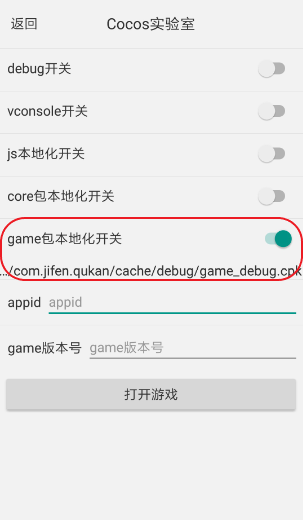

# Publishing to QTT Mini Games

Starting with Cocos Creator v2.3.0, creating games for the QTT Mini Games is officially supported.

## Environment Configuration

- Download [QTT APP](https://static-oss.qutoutiao.net/game/cocos/apk/qutoutiao_game_lab_version.apk) and install it on your Android device (Android Phone 6.0 or above is recommended).

## Release Process

1. Use **Cocos Creator** to open the project that needs to be released. Select **QTT Mini Game** in the **Platform** dropdown of the **Build...** panel.

    

The specific filling rules for the relevant parameter configuration are as follows:

- **Game Package Name**

  **Game Package Name** is filled in according to the user's needs. It's required.

- **Game Name**

  **Game Name**, the name of the QTT Mini Game, is required. And the **Title** at the top of the **Build** panel does not participate in the QTT Mini Game packaging process.

- **Desktop Icon**

  **Desktop Icon** is required. Click the **...** button at the back of the input box to select the icon you want. When building, the Desktop Icon will be built into the **QTT Mini Game** project. Desktop Icon suggest using PNG pictures.

- **Game Version Name**

  This item is required. **Game Version Name** is the real version, such as: 1.0.0.

- **Game Version Number**

  This item is required. **Game Version Number** is different from the **Game Version Name**, and the **Game Version Number** is mainly used to distinguish the version update. Each time when you submit audit, the Game Version Number is at least 1 higher than the value of the last submitted audit. It must not be equal to or less than the value of the last submitted audit, and it is recommended that the **Game Version Number** be recursively incremented by 1 each time when the audit is submitted. **Note**: The **Game Version Number** must be a positive integer.

- **Small Packet Mode**

  This item is optional. The in-package volume of the mini game contains code and resources that cannot exceed **6M**, and resources can be loaded via network requests. **Small Packet Mode** is to help users keep the script files in the mini game package, other resources are uploaded to the remote server, and downloaded from the remote server as needed. And the download, cache and version management of remote resources, Cocos Creator has already helped the user. What the user needs to do is the following steps:

  - When building, check the **Small Packet Mode** and fill in the **Small Packet Mode Server Path**.

  - **First game resource package into the game package**

      In the Small Packet Mode, due to too many resources on the launch scene, downloading and loading resources for a long time may result in a short black screen when entering the game for the first time. If **First game resource package into the game package** is checked, you can reduce the black screen time when you first enter the game. However, it should be noted that the `res/import` resource does not support split resource downloading at this time, and the entire `import` directory is also packaged into the first package.
  
      Developers can choose whether to check this item according to their needs. Then click on **Build**.

  - After the build is complete, click the **Open** button after the **Build Path** to upload the **qtt-game/res** directory under the release path to the packet mode server. For example, if the default publishing path is `build`, you need to upload the **build/qtt-game/res** directory.

  At this point, the **res** directory will no longer be included in the built-up rpk, and the resources in the res directory will be downloaded from the filled **Small Packet Mode Server Path** through the network request.

**2. Build**

After the relevant parameters of the **Build** panel are set, click **Build**. After the build is complete, click the **Open** button behind the **Build Path** to open the build release package. You can see that the **qtt-game** directory is generated under the default release path `build` directory, which is the exported QTT Mini Game project directory and **rpk**, the **rpk** package is in the **/build/qtt-game** directory.

**3. Run the built rpk to the phone**

- Open the QTT APP that has been installed before on your Android device, click **我的** in the bottom navigation bar. Then drag the page down to the bottom and click **设置** to enter the Settings page.

  

- Click the blank area on the right side of the navigation bar of the Settings page for 6 consecutive times to enter the **趣实验** page.

  

- Find **Cocos 实验室** on the **趣实验** page and click to enter the **Cocos 实验室** page.

  

- Open **game 包本地化开关** in the **Cocos 实验室** page, and you can see a file path displayed below. Then rename the cpk package generated by the **build** to `game_debug.cpk`, and place it under the file path of the Android device. **debug 开关** and **vconsole 开关** can be turned on or off as required.

  

- Fill in the applied **appid** and **game 版本号**

  **appid** is the applied game ID, which can be filled in at will in the debug environment. 
  **game 版本号** is the version characteristic value of the game package, normally generated by the platform. Here used for debugging purposes, and it is generally a random string of letters and numbers. **Note**: A new value is re-entered for each replacement package.
  
- After setting, click the **打开游戏** button below to open the game. **Note**: If you want to open the game again, you need to re-place the cpk package in the file path described above.

## Related reference links

- [QTT Mini Games Official Documentation](https://game.qutoutiao.net/doc/index.html#/)
- [QTT Mini Games Debugging Documentation](https://game.qutoutiao.net/doc/index.html#/doc/debug_in_app)
- [QTT Mini Games API Documentation](https://newidea4-gamecenter-frontend.1sapp.com/sdk/docs/#/sdk/api/pay)
