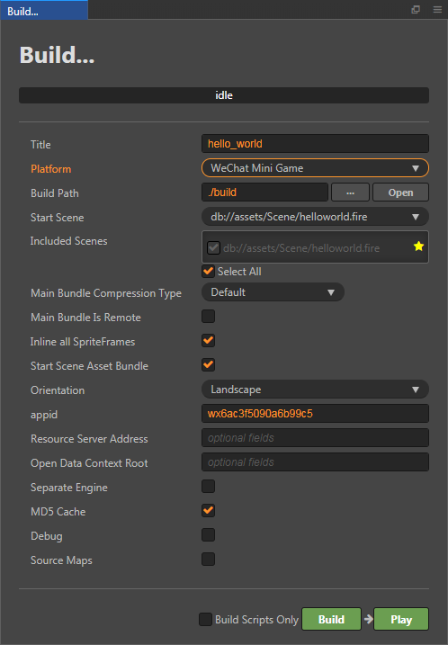
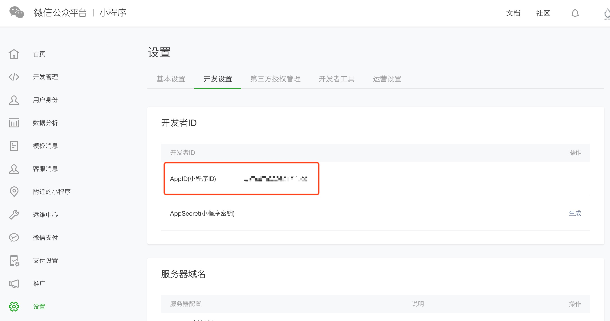
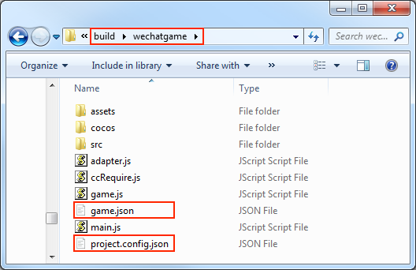
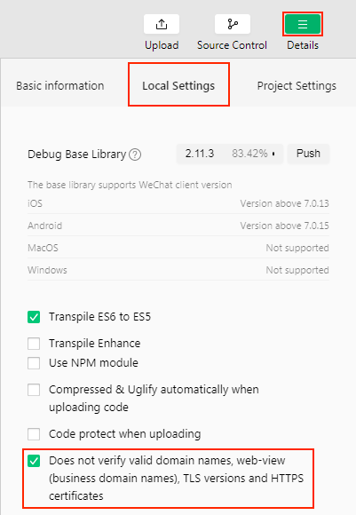

# Publish to WeChat Mini Games

The runtime environment of the WeChat Mini Game is an extension of the WeChat Mini Program, providing a WebGL interface encapsulation based on the mini program environment, greatly improving rendering capabilities and performance. However, since these interfaces are encapsulated by the WeChat team, they are not equivalent to the browser environment.

As the engine side, in order to make the developers' workload as easy as possible, our main tasks for developers include the following:

- The engine framework adapts to the WeChat Mini Game API, pure game logic level, users do not need any additional modifications.
- The Cocos Creator editor provides a fast packaging process, released directly as a WeChat Mini Game, and automatically evokes the developer tools of the mini game.
- Automatically load remote resources, cache resources, and cache resource version control.

In addition, the game submission, review and release process of the WeChat Mini Game is no different from the WeChat Mini Program. For details, please refer to the [WeChat Mini Game Developer Document](https://developers.weixin.qq.com/minigame/en/dev/guide/).

## Environment Configuration

- Download [WeChat DevTools](https://developers.weixin.qq.com/miniprogram/en/dev/devtools/download.html) and install it.

- Set the WeChat DevTools path in the [Native Develop](../getting-started/basics/editor-panels/preferences.md#native-develop) window. 
    > Mac: Cocos Creator -> Preferences -> Native Develop 
    > Windows: File -> Settings -> Native Develop

    

## Release Process

Use Cocos Creator to open the project that needs to be released. Select **WeChat Mini Game** in the **Platform** dropdown of the **Build** panel, fill in the mini game appid, and then click **Build**.

### Configuration Options

The specific filling rules for the relevant options configuration are as follows:

- **Main Bundle Compression Type**

  Set the compression type of the main package, please refer to the [built-in Asset Bundle — `main`](../asset-manager/bundle.md#the-built-in-asset-bundle) documentation for details.

- **Main Bundle Is Remote**

  This option is optional and needs to be used with the **Resource Server Address** option. 
  If set, the main package is configured as a remote package, and along with its related dependent resources are built into a built-in Asset Bundle — [main](../asset-manager/bundle.md#the-built-in-asset-bundle) under the **remote** folder of the release package directory. You need to upload the entire **remote** folder to the remote server.

- **Start Scene Asset Bundle**

  This option is optional. 
  If set, the start scene and its related dependent resources are built into the built-in Asset Bundle — [start-scene](../asset-manager/bundle.md#the-built-in-asset-bundle) to speed up the resource loading of the start scene. Please refer to the [Start Scene Loading](#speed-up-the-loading-of-the-start-scene) for details.

- **appid**

  The appid that is filled in by default in the **Build** panel is only for testing. If you want to use it for publishing, login to the [WeChat Official Accounts Platform](https://mp.weixin.qq.com/?lang=en_US) and find the appid.

  

- **Resource Server Address**

  This option is optional and used to fill in the address of the remote server where the resources are stored. You need to manually upload the **remote** folder from the release package directory to the filled resource server after build.

- **Open Data Context Root**

  This option is optional and used to access the [Open Data Context of WeChat Mini Games](publish-wechatgame-sub-domain.md).

### Run the Preview

- After building, click the **Open** button behind the **Build Path**. You can see that the WeChat Mini Game's project folder **wechatgame** is generated in the **build** directory of the release package, which includes the WeChat Mini Games environment configuration file `game.json` and `project.config.json`.

  

- Then click **Play**, and Creator will automatically open the WeChat DevTools to open the project.

  

  **Note**: If you have not run the WeChat DevTools on your Mac before, an `Please ensure that the IDE has been properly installed` error will result. You need to manually open the WeChat DevTools once before you can click the **Play** directly in the **Build** panel to enable it.

## Resource Management for the WeChat Mini Games

In the WeChat Mini Game environment, resource management is the most special part, and it differs from the browser in the following points:

1. The main package size of the WeChat Mini Game must not exceed **4MB**, including all the code and resources, and additional resources must be downloaded via a network request.
2. For the resources in the WeChat Mini Game package, they are not downloaded on demand in the mini game environment, but rather all the resources in the package are downloaded at once, and then the game page is launched.
3. You cannot download script files from a remote server.

This brings up two key issues, one is the downloading, caching and versioning of remote resources, and the other is the loading speed of the start scene. Let's look at the logic of this part below, note that this section is updated in v2.4, so if you are using a version before v2.4, please switch to the corresponding documentation branch.

### Downloading, Caching and Versioning of Remote Resources

As of v2.4.0, all resources are managed in an [Asset Bundle](../asset-manager/bundle.md). For downloading, caching, and versioning of remote resources, Creator has already done that for you. Let's look at the process of the engine downloading resources in the mini game environment:

1. Check if the resource is in the mini game package
2. If not, check if the resource is in the local cache
3. If not, check if the resource is in the temporary file
4. If not, download the resource from the remote server
5. After downloading the resource to the temporary file, use it directly
6. Slowly save the resource from the temporary file to the local cache for reuse in the background.
7. The local cache space is limited in size, and if the limit is exceeded, the resource will not be saved directly, instead an LRU algorithm is used to delete the oldest resources.

Once the cache space is full, all the resources that need to be downloaded cannot be saved, only the resources saved in the temporary files can be used. And when exiting the mini game, all the temporary files will be cleared, and when you run the mini game again, those resources will be downloaded again. And the cycle goes on and on. 
In addition, the problem that file saving failures due to cache limitation does not occur on the WeChat DevTools, because the WeChat DevTools does not limit the cache size, so testing the cache needs to be done in a real WeChat environment.

When the building's md5Cache option is set, the URL of the file will change with the change of the file content, so that when a new version of the game is released, the old resources in the cache will be invalidated, so the new resources will be requested from the server, which also achieves the effect of version control.

#### Upload Resources to the Remote Server

If you need to upload the resource to the remote server, configure the Asset Bundle where the resource is located as a remote package. The operation steps are as follows:

1. Rationalize the allocation of the resources, configure resource folders that need to be managed modularly as the Asset Bundles, and check **Is Remote Bundle** option. For details, see the [Configure the Asset Bundle](../scripting/asset-bundle.md#configuration) documentation.
    
    

2. If the main package needs to be configured as a remote package, check the **Main Bundle Is Remote** option in the **Build** panel.
3. Check **MD5 Cache**.
4. Set the **Resource Server Address**, and then click **Build**.

    

5. After building, upload the complete **remote** folder from the release package directory to the remote server you filled in the previous step.
6. Delete the **remote** folder in the local release package directory.
7. During the testing phase, you may not be able to deploy your project to the official server, so you will need to test it on the local server, please open the **Tools -> Project Details -> Local Settings** page in the menu bar of the WeChat DevTools and check **Does not verify valid domain names, web-view (business domain names), TLS versions and HTTPS certificates** option.

    

### Clear Cache Resources

If the cache resources exceed the WeChat Mini Game environment limits, you need to clear the resources manually, by using the methods `clearCache()`, `clearLRU()` and `removeCache(cacheId: string)` provided by `cc.assetManager.cacheManager` to clear the cache.
  - `clearCache()` -- Clears all cache resources in the cache directory, please use with caution.
  - `clearLRU()` -- Clears the least recently used cache in the cache directory for the application.
  - `removeCache(cacheId: string)` -- Removes the record of a resource from the cache with precision.

When you upgrade the engine version, the resources in the local cache are still the same from the previous old version of the engine and will not be emptied automatically. This may cause problems such as resource loading errors or rendering errors. There are two solutions:

  - Check the **MD5 Cache** option in the **Build** panel when building, this will ensure that the correct resources will be loaded.
  - Clear the previously cached resources manually.
    - Clear the cache with `cc.assetManager.cacheManager.clearCache()` on the physical device.
    - Click **Tools -> Clear Cache -> Clear All** option in the menu bar of the WeChat DevTools to clear the cache.

### Speed up the loading of the start scene

To improve the loading speed of the start scene when the main package resources are uploaded to the remote server, you can check the **Start Scene Asset Bundle** option in the **Build** panel during the build. 
After building, the start scene and its related dependent resources will be built into the `assets/start-scene` bundle of the release package directory. Instead of uploading to a remote server, the bundle is placed locally, and the engine will automatically load it from the local package at startup, to speed up the loading of the start scene.

## WeChat Mini Game Engine Plugin

Please refer to the [WeChat mini games engine plugin instructions](./wechat-engine-plugin.md) for details.

## WeChat Mini Game Subpackage Loading

WeChat Mini Game how to achieve subpackage loading, please refer to [Mini Game Subpackage](subpackage.md#wechat-mini-games).

## Platform SDK Access

In addition to pure game content, the WeChat Mini Game environment actually provides a very powerful native SDK interface, the most important of which is user, social, payment, etc. These interfaces are only available in the WeChat Mini Game environment, equivalent to other Third-party SDK interface for the platform. The porting of such SDK interfaces still needs to be handled by developers at this stage. Here are some of the powerful SDK capabilities provided by the WeChat Mini Games environment:

1. User interface: login, authorization, user information, etc.
2. WeChat payment
3. Forward and get forwarding information
4. File upload and download
5. Media: pictures, recordings, cameras, etc.
6. Other: location, device information, scan code, NFC, etc.

## Access to the Open Data Context of WeChat Mini Games

In order to protect its social relationship chain data, WeChat Mini Games has added the concept of **Open Data Context**, which is a separate game execution environment. The resources, engines, and programs in the Open Data Context are completely isolated from the main game. Developers can only access the `wx.getFriendCloudStorage()` and `wx.getGroupCloudStorage()` APIs provided by the WeChat in the Open Data Context to implement features such as leaderboards. For details, please refer to [Access to the Open Data Context of WeChat Mini Games](../publish/publish-wechatgame-sub-domain.md).

## Limitations of the WeChat Mini Games

The WeChat Mini Game does not support WebView.

## Reading

- [WeChat Mini Game Developer Document](https://developers.weixin.qq.com/minigame/en/dev/guide/)
- [WeChat Official Accounts Platform](https://mp.weixin.qq.com/?lang=en_US)
- [Mini Program API Documentation](https://developers.weixin.qq.com/minigame/en/dev/api/)
- [WeChat DevTools Download](https://mp.weixin.qq.com/debug/wxagame/en/dev/devtools/download.html)
- [WeChat Mini Game Performance Optimization [zh]](https://developers.weixin.qq.com/minigame/dev/guide/performance/perf-overview.html)
- [WeChat Cache Space Overflow Case](https://github.com/cocos-creator/WeChatMiniGameTest)
