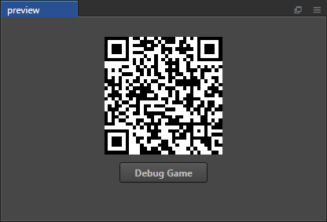
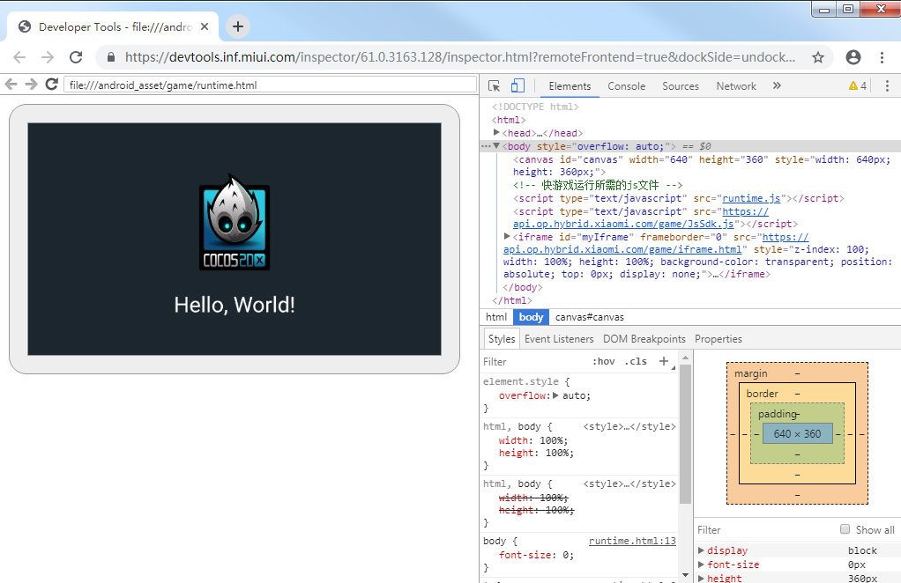

# Publish to Xiaomi Quick Games

## Environment Configuration

- Download [Xiaomi Quick Game Debugger and Xiaomi Quick Game Runtime Environment](https://forum.cocos.org/t/topic/81887), and install it on your Xiaomi device (recommended MIUI **8.5.0** or above)

- Install [Node.js](https://nodejs.org/en/download/) **8.1.4** or above, globally.

- Make sure the **npm** version that **Node.js** comes with is **5.2.0** minimum. Upgrade the **npm** command as follows:

  ```bash
  # View the npm version
  npm -v
  # If the lowest version of npm is below 5.2.0, you can upgrade npm using the following command.
  npm install npm@latest -g
  ```

## Release Process

1. Use **Cocos Creator** to open the project that needs to be released. Select **Xiaomi Quick Game** in the **Platform** dropdown of the **Build** panel.

    

The specific filling rules for the relevant parameter configuration are as follows:

- **App Package Name**: the format of the **App Package Name** is `com.yourcompany.projectname`. This option is required and will be filled in according to the developer's needs. 
  
  > **Note**: Starting from the platform version number **1062**, Xiaomi Quick Game needs to use the official **App Package Name**, otherwise the error of `Data loading exception, please click retry` will be reported during debugging. You can refer to the [Xiaomi Quick Game App Package Name Application](https://forum.cocos.org/t/topic/81887) documentation for details.

- **App Name**

  **App Name**, the name of the Xiaomi Quick Game, is required. And the **Title** at the top of the **Build** panel does not participate in the Xiaomi Quick Game packaging process.

- **Desktop Icon**

  This item is required. Click the **search icon** button at the back of the input box to select the icon you want. When building, the Desktop Icon will be built into the Xiaomi Quick Game project. It is suggested to use a `PNG` image for the **Desktop Icon**.

- **App Version Name**

  This item is required. **App Version Name** is the real version, such as: **1.0.0**.

- **App Version Number**

  This item is required. **App Version Number** is different from the **App Version Name**, and the **App Version Number** is mainly used to distinguish the version update. Each time when you submit audit, the **App Version Number** is at least 1 higher than the value of the last submitted audit. It must not be equal to or less than the value of the last submitted audit, and it is recommended that the **App Version Number** be recursively incremented by 1 each time when the audit is submitted. **Note**: The **App Version Number** must be a positive integer.

- **Supported Minimum Platform Version Number**

  This item is required. According to the requirements of Xiaomi Quick Games, this value must be greater than or equal to **1050** at present.

- **Small Packet Mode**

  This item is optional. The in-package volume of the quick game contains code and resources that cannot exceed 10M, and resources can be loaded via network requests. **Small Packet Mode** is to help users keep the script files in the quick game package, other resources are uploaded to the remote server, and downloaded from the remote server as needed. And the download, cache and version management of remote resources, Cocos Creator has already done that for developers. What the developer needs to do are the following steps:

  1. When building, check the **Small Packet Mode** and fill in the **Small Packet Mode Server Path**, then click **Build**.

  2. After the build is complete, click the **Open** button after the **Build Path** to upload the **xiaomi/res** directory under the release path to the small packet mode server. For example, if the default publishing path is `build`, you need to upload the **build/xiaomi/res** directory.

  At this point, the **res** folder will no longer be included in the `.rpk` file which is generated after the build, and the resources in the **res** folder will be downloaded from the filled **Small Packet Mode Server Path** through the network request.

- **Keystore**

  This item is optional. When you check the **Keystore**, the default is to build the rpk package with a certificate that comes with Cocos Creator, which is used only for **debugging**. **Note**: When the rpk package is to be used to submit an audit, do not check the **Keystore** to build it.
  
  If you don't check the **Keystore**, you need to configure the signature files **certificate.pem path** and **private.pem path**, where you build a rpk package that you can **publish directly**. The developer can configure two signature files by using the **search icon** button to the right of the input box.<br>
  
  > **Note**: These two signature files are not recommended to be placed in the `build/xiaomi` directory of the release package, otherwise the `build` directory will be emptied each time when it is built, resulting in file loss.

  There are two ways to generate a signature file:

  1. Generated by the **New** button after the **certificate.pem path** in the **Build** panel. After clicking the **New** button, fill in the information in the **certificate** panel that pops up. After the information is filled in, click **Save** button, the log `Generate certificate is complete!` will be output in the **Console** panel, indicating that the signature file is generated.

      

  2. Generated by the command line.

      The developer needs to generate the signature file `private.pem`, `certificate.pem` through tools such as **openssl**.

      ```bash
      # Generate a signature file with the openssl command tool
      openssl req -newkey rsa:2048 -nodes -keyout private.pem   -x509 -days 3650 -out certificate.pem
      ```

      > **Note**: **openssl** can be used directly in the terminal in Linux or Mac environment, and in the Windows environment you need to install `openssl` and configure system environment variables. Restart Creator after the configuration is complete.

**2. Build**

After the relevant parameters of the **Build** panel are set, click **Build**. After the build is complete, click the **Open** button behind the **Build Path** to open the build release package. You can see that the **xiaomi** directory is generated under the default release path `build` directory, which is the exported Xiaomi Quick Game project directory and **rpk**, the **rpk** package is in the **/build/xiaomi/dist** directory.

  

**3. Run the built rpk to the phone**

There are three ways to run rpk on your phone:

- **Method One**

  Click the **Run** button in the **Build** panel and wait for the QR Code interface to be generated:

  

  Then open the **Xiaomi Quick Game Debugger** that was installed before on your Xiaomi device. Click the **Scan code install** button to scan the QR Code to open the **rpk**.
  
  
  
- **Method Two**

  - First open **Settings-> Additional settings-> Developer options** on Xiaomi device, turn on **Developer options** and **USB debugging**.
  - Use a USB cable to connect your computer to your Xiaomi device.
  - Copy the generated quick game **rpk** file (located in the `build/xiaomi/dist` directory) to the `sdcard` directory of the Xiaomi device.
  - Open the **Xiaomi Quick Game Debugger** that has been installed before on your Xiaomi device, click **Local Install**, then find the **rpk** file from the `sdcard` directory of your Xiaomi device and select **Open**.
    
    

## Debugging

The debugging must be based on the physical device and must follow the strict **run the game first and then start the debugging function** sequence. After starting the game, leave Xiaomi device in the interface where the game is open to run. Then use the USB cable to connect your computer to the Xiaomi device, and the Xiaomi device needs to enable Developer options and USB Debugging.

There are two ways to start debugging.

1. Directly click the **Debug Game** button on the QR code interface.

    

    and the debugging interface will start automatically in Chrome.

    

2. Start debugging from the command line.

    - Specify to the release package directory `build/xiaomi` in the command line, and execute the command `npm run debug`. And the debugging interface will start automatically in Chrome.
    - If you want to open the debug interface manually, execute the command `npm run debug -- --print-only` and copy the generated URL address into Chrome to enable the debugging interface.

      ```bash
      # Specify to the release package directory
      cd E:\NewProject\build\xiaomi
      # Automatically opens the debugging interface on Chrome.
      npm run debug
      # manually opens the debugging interface on Chrome.
      npm run debug -- --print-only
      ```

## Resource Management for Alipay Mini Game Environment

**Xiaomi Quick Game** is similar to **WeChat Mini Game**. There are restrictions on the package size. Resources more than **5MB** must be downloaded via a network request.

Please refer to [Resource Management for WeChat Mini Game](./publish-wechatgame.md#resource-management-for-wechat-mini-game-environment) documentation for details.

## Subpackage rpk

Subpackage rpk can be used according to your needs. 

Subpackage loading, that is, splitting the game content into several packages according to certain rules, only downloading the necessary packages when starting up for the first time. This necessary package is called **main package**. And the developer can trigger in the main package to download other sub-packages, which can effectively reduce the time spent on the first boot.

To use this feature, you need to set up [Subpackage Configuration](../scripting/subpackage.md) in the Cocos Creator, and the package will be automatically subpackaged at build time after setting up.

When the build is complete, an `.rpk` file is generated in the `/build/xiaomi/dist` directory.

About the subpackage load packet size limit, please refer to the [Xiaomi Quick Game Subpackage Rules](https://forum.cocos.org/t/topic/81887).
