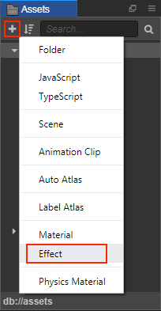
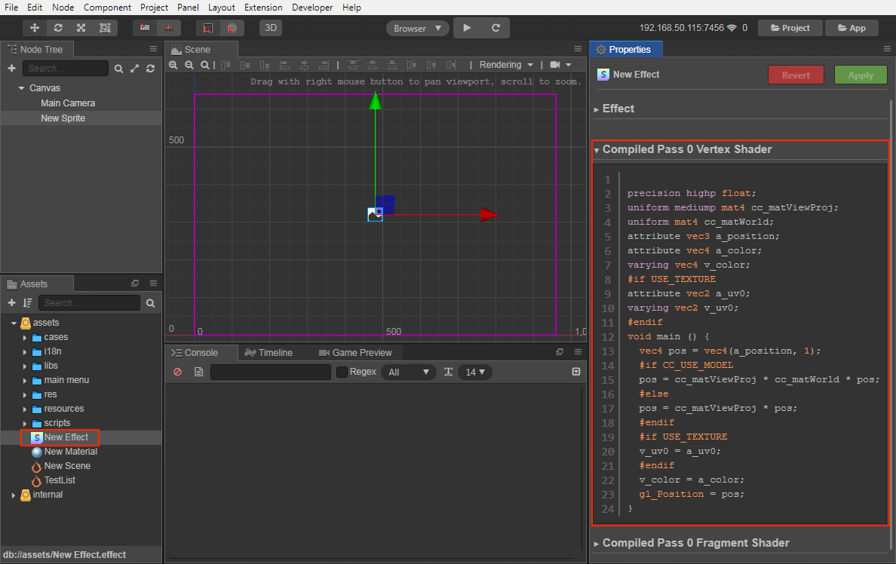

# Effect Reference

## Create Effect

Just click the **+** button at the top left of the **Assets**, and then select the **Effect**.

Another way is to select the folder in the **Assets** panel where you want to store the Effects, then right-click and select **Create -> Effect**.

## Usage of Effect

1. After creating the Effect, select the New Effect in the **Assets** panel, and you can preview the compiled `glsl` code in the **Properties** panel.

    

2. Select the Material in the **Assets** panel, and then you can see the new **New Effect** option in the Effect drop-down box of the **Properties** panel.

    

## Rules for writing

Cocos Creator's Effect writing rules is consistent with Cocos Creator 3D, it can be written using VS Code’s Cocos Effect plugin, but the built-in shader variable names are slightly different. Please refer to the [Documentation](https://docs.cocos.com/creator3d/manual/zh/material-system/effect-syntax.html) for details.
