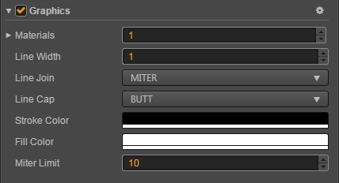

# Graphic System

This chapter will show the usage of Cocos Creator's graphic drawing component interface.

Create a new empty node, and then click the **Add Component** button below the **Properties** panel and select **Graphics** from **Add Renderer Component**. Then you can add the Graphics component to the node.

## Graphics API

### Path

| Method | Function Description
| -------------- | ----------- |
| [moveTo](../graphics/moveTo.md) (x, y)   | Move the path to a specified point in the canvas without creating a line
| [lineTo](../graphics/lineTo.md) (x, y)   | Add a new point, and then create a line from the point to the last specified point in the canvas
| [bezierCurveTo](../graphics/bezierCurveTo.md) (c1x, c1y, c2x, c2y, x, y) | Create cubic cubic Bezier curve
| [quadraticCurveTo](../graphics/quadraticCurveTo.md) (cx, cy, x, y)       | Create a second Bezier curve
| [arc](../graphics/arc.md) (cx, cy, r, a0, a1, counterclockwise)          | Create arc / curve (for creating circle or part of a circle)
| [ellipse](../graphics/ellipse.md) (cx, cy, rx, ry)                       | create an ellipse
| [circle](../graphics/circle.md) (cx, cy, r)                              | create a circle
| [rect](../graphics/rect.md) (x, y, w, h) | create a rectangle
| [close](../graphics/close.md) ()         | Create a path from the current point back to the starting point
| [stroke](../graphics/stroke.md) ()       | Draw a defined path
| [fill](../graphics/fill.md) ()           | Fill the current drawing (path)
| [clear](../graphics/clear.md) ()         | Clear all paths

### Color, Style

| Property | Description
| -------------- | ----------- |
| [lineCap](../graphics/lineCap.md)         | Set or return the end of the line end style
| [lineJoin](../graphics/lineJoin.md)       | the corner type created when setting or returning two lines intersecting
| [lineWidth](../graphics/lineWidth.md)     | Sets or returns the current line width
| [miterLimit](../graphics/miterLimit.md)   | Set or return the maximum miter length
| [strokeColor](../graphics/strokeColor.md) | Sets or returns the color of the stroke
| [fillColor](../graphics/fillColor.md)     | Set or return the color of the fill painting

## Third Party Library

The API of the Graphics component is designed according to the graphics interface of [Canvas](http://www.w3school.com.cn/tags/html_ref_canvas.asp), and there are many graphics libraries based on the Canvas, such as [paper.js](http://paperjs.org/), [raphael.js](http://dmitrybaranovskiy.github.io/raphael/). So if you port the underlying of the graphics libraries to the API of the graphics component, we can use the capabilities of these advanced libraries directly. Note, however, that the graphics component does not fully implement Canvas, and modifying the underlying backend of the graphics library requires a considerable understanding of the graphics library.

<!--
Here are some third-party advanced drawing libraries and related demo based on Graphics component extensions.
### ccc.raphael
- Github: https://github.com/2youyou2/ccc.raphael
- Demo: https://github.com/2youyou2/raphael-example
- Feature (continually updated)
 - Line deformation   
    
 - Dashed line   
    
 - Simplify the path   
    
 - Import svg   
    -->