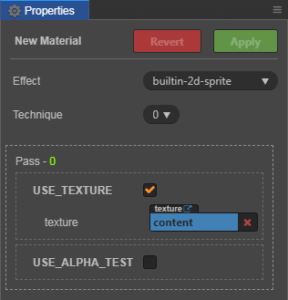
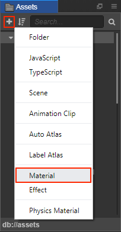

# Material

Material can be used to control the visual effects of Renderer components in the scene. In short, material is used to specify the properties of an object's surface, such as color, shininess, emissive, opacity and so on.



## Create material

Just click the **+** button at the top left of the **Assets**, and then select the **Material**.



Another way is to select the folder in the **Assets** panel where you want to store the materials, then right-click and select **Create -> Material**.

## Material Properties

| Properties | Explanation	             |
| ---------- | ---------------- |
| Effect     | All effect resources in the current project are listed in the Effect drop-down box, and you can select the effect resource used by the current material. And the other properties will be updated when the Effect is switched. |
| Technique  | All Techniques in the currently used Effect are listed in the Technique drop-down box.<br>There may be more than one Technique in an Effect, and each Technique is suitable for different situations. Such as less effective but better performace Technique is more suitable for mobile platforms.<br>The Pass list will be updated simultaneously when the Technique is switched. |
| Pass       | The Pass list lists all Passes in the currently used Technique.<br>Each Pass may have different properties and definitions that you can set separately. If the property is wrapped by a definition, you need to check the definition to see the corresponding property.

## Use material

1. After creating the Material, select the New Material in **Assets** panel, and then set the properties in the **Properties** panel. After that, click the **Apply** button on the top right.

2. Then select the node where the Renderer component you want to modify is attached to. And drag the New Material to the **Materials** property box of the Renderer component.

    

## Create material in script

Materials created in runtime can be divided into **Shared Material** and **Material Variant** types. If you change a Shared Material, it will affect all Material Variants synchronously.

Creating a Shared Material requires specifying the **effect** and **technique** index to use.

- `cc.Material.createWithBuiltin(effectName: string, techniqueIndex = 0)`

- `cc.Material.create(effectAsset: cc.EffectAsset, techniqueIndex = 0)`

Creating a Material Variant requires specifying the **Shared Material** and **the renderer component which own the Material Variant**.

- `cc.MaterialVariant.createWithBuiltin(materialName: string, owner: cc.RenderComponent)`
  
- `cc.MaterialVariant.create(material: cc.Material, owner: cc.RenderComponent)`

Code example:

```js
// Creating a Shared Material
let material = cc.Material.createWithBuiltin('unlit');
// Modifying the material affects the variant1 and variant2
material.setProperty('diffuseColor', cc.Color.WHITE);

let variant1 = cc.MaterialVariant.create(material);
// The diffuseColor modified by material variant1 overrides the diffuseColor modified by material
variant1.setProperty('diffuseColor', cc.Color.RED);

let variant2 = cc.MaterialVariant.create(material);
// The mainTiling modified by material variant2 only affects variant2.
variant2.setProperty('mainTiling', cc.v2(0.5, 0.5));
```

## Set material in script

The Material used in the Renderer component is a Material Variant, and make sure that the Material Variant is only used by itself.<br>
If the Material set in the Renderer component is a Shared Material or if the Material Variant is already used by another Renderer component, the Renderer component will recreates a Material Variant based on the incoming Material during the setup process.

```js
let variant1 = cc.MaterialVariant.createWithBuiltin(cc.Material.BUILTIN_NAME.SPRITE);

// Set the Material to the specified index, and in general the index of a 2D Renderer component is 0.
// Since variant1 does not specify it's owner render component, it will be used directly by renderComponent1 and set owner to renderComponent1
renderComponent1.setMaterial(index, variant1);

// Once variant1 already has owner, this will internally create a new Material Variant based on variant1.
// It's better to create a new variant2 to set it up
renderComponent2.setMaterial(index, variant1);

// get Material in the Renderer component
// material1 === variant1
// material2 !== variant1
let material1 = renderComponent1.getMaterial(index);
let material2 = renderComponent2.getMaterial(index);
```
