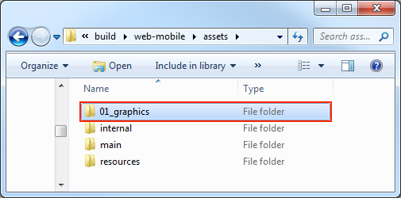
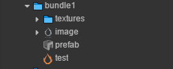

# Asset Bundle Loading

> Author：Santy-Wang

As gameplay becomes richer and the number of resources in the game increases, the need for developers to split up the package is growing, putting only the necessary content in the first package and reducing the size of the first package, while putting the rest of the content in the external dynamic acquisition. So starting with v2.4, Cocos Creator has introduced the **Asset Bundle** feature, which supports **code** and **resources**, **scene** partial loading.

Developers can divide the project's scene, resources, code, etc. into different Asset Bundles, which are not loaded at game launch but are manually loaded by the developer during the course of the game, thus effectively reducing the time-consuming game launch and making it as on-demand as possible.

For an introduction to Asset Bundle, see [Asset Bundle](../asset-manager/bundle.md).

## Configuration method

Cocos Creator's asset bundle are configured in folders, and when we select a folder, the folder-related configuration options appear in the **Property Checker**.


After checking the `Is Bundle` option of the folder, click **Apply** at the top right, the resources under this folder (containing code and other resources) and the resources outside the folder on which these resources are associated will be treated as the contents of the bundle. For example, if scene A is placed under the 'a' folder, check a `Is Bundle` and make sure. Then scene A and the resources it relies on are merged into bundle 'a'.

**Bundle priority** Options are described in [Asset Bundle](../asset-manager/bundle.md#priority) for details.

**Bundle Name** The option affects the name of the bundle after it is built, and this folder name is used by default.

**Compression Type** The option will determine the final output form of the Asset Bundle, see [Asset Bundle](../asset-manager/bundle.md#compression%20type).

**Configure as Remote Bundle** The option will determine whether or not the Asset Bundle is a remote bundle, when checked, the Asset Bundle will be placed under the remote folder after it is built and you should place the entire remote folder on the remote server. Also, if this option is checked, the bundle will not be built into the rpk on platforms like OPPO, vivo, Huawei, etc.

**Note**.
1. 4 bundles are built into the Creator: resources, internal, main, start-scene Please do not use these four names as settings for the **Bundle name**.
2. If you have configured Asset Bundle's compression type as a mini-game bundle, please do not remove it from the directory after the build, it will be handled by the corresponding platform such as WeChat.

## Construction

The Asset Bundle will only work after the project has been built and you will not be able to load an Asset Bundle other than the built-in Asset Bundle at the time of preview. Each folder is an Asset Bundle, and you can place the Asset Bundle folders on a remote server or locally, as well as configure them in Mini Game Subpackage for certain platforms such as WeChat.

**Example**: Configure the **cases/01_graphics** folder in the example project as Asset Bundle, and the **01_graphics** folder will be generated in the **assets** folder in the distribution directory after the project is built.

  

## Load Asset Bundle

The engine provides a unified api `cc.assetManager.loadBundle` to load the Asset Bundle. `loadBundle` requires an Asset Bundle name or url to be passed in.

**Note**.
1. **Bundle name** and the bundle's url are generally available as parameters for loading the bundle, but when reuse bundles from other projects, loading can only be done via the url.
2. if a bundle is placed on a remote server, please fill in **Resource Server Address** during the build.

When the Asset Bundle is loaded, the script in the Asset Bundle is executed and a callback is triggered that returns an error message and an instance of the `cc.AssetManager.Bundle` class that you can use to load the various resources in that bundle. 

```javascript
cc.assetManager.loadBundle('01_graphics', function (err, bundle) {
    if (err) {
        return console.error(err);
    }
    console.log('load bundle successfully.');
});

// Reuse bundles from other projects
cc.assetManager.loadBundle('https://othergame.com/remote/01_graphics', function (err, bundle) {
    if (err) {
        return console.error(err);
    }
    console.log('load bundle successfully.');
});
```

### Version of Asset Bundle

Sometimes you may need to update the Asset Bundle on a remote server, in which case you need a mechanism to bypass the existing cache files, the Asset Bundle continues the MD5 scheme of Cocos Creator on the update, when you need to update the Asset Bundle, check the **MD5 Cache** option in the build panel, then the file name of the `config` file in the constructed Asset Bundle will come with a Hash value. As shown in the figure.


When you load the Asset Bundle you **do not need** to provide an additional Hash value, Creator will look up the corresponding Hash value in `settings.js` and make the adjustment automatically,** but if you want to store the relevant version configuration information on the server and get the version information dynamically at startup for hot updates, you can also manually specify a version Hash value to be passed into `loadBundle`** and the incoming Hash value will prevail.

```js
cc.assetManager.loadBundle('01_graphics', { version: 'fbc07' }, function (err, bundle) {
    if (err) {
        return console.error(err);
    }
    console.log('load bundle successfully.');
});
```

At this point, you can bypass the old version of the file in the cache and re-download the latest version of Asset Bundle.

## Get Asset Bundle

When the Asset Bundle has been loaded, it will be cached and you can use the name to get the bundle. for example.

```js
let bundleA = cc.assetManager.getBundle('bundleA');
```

## Dynamically load resources via Asset Bundle

By loading Asset Bundle, we will get an instance of the `cc.AssetManager.Bundle` class. You can use this instance to dynamically load various resources in the Asset Bundle. It is loaded in the same way as a resource in the `resources` directory, and in fact `cc.resources` is an instance of an Asset Bundle.

Suppose an Asset Bundle is configured in the project, as shown in the figure.



### Dynamically load Asset

The `load` method is provided in Asset Bundle to load resources located in a directory set to Asset Bundle, with the same parameters as `cc.resources.load`, you just need to pass in the path of the resource relative to the Asset Bundle directory, and the end of the path **can not** contain the file extension.

```js
cc.assetManager.loadBundle('bundle1', function (err, bundle) {
    if (err) {
        return console.error(err);
    }
    // load prefab
    bundle.load(`prefab`, cc.Prefab, function (err, prefab) {
        var newNode = cc.instantiate(prefab);
        cc.director.getScene().addChild(newNode);
    });

    // load texture
    bundle.load(`image`, cc.Texture2D, function (err, texture) {
        console.log(texture)
    });
});
```

As with `cc.resources.load`, the `load` method can provide a type parameter, which is useful when there are resources with the same name or when loading a SpriteFrame. For example.

```js
    bundle.load(`image`, cc.SpriteFrame, function (err, spriteFrame) {
        console.log(spriteFrame);
    });
```

### Loading directory

The `loadDir` method is provided in Asset Bundle for loading multiple resources under the same path. The parameters of this method are similar to those of `cc.resources.loadDir`, you just need to pass the directory path relative to the Asset Bundle directory.

```js
    // Load all resources in the textures directory
    bundle.loadDir("textures", function (err, assets) {
        // ...
    });

    // Load all Texture resources in the textures directory
    bundle.loadDir("textures", cc.Texture2D, function (err, assets) {
        // ...
    });
```

### Loading scenes

The `loadScene` method is provided in the Asset Bundle for loading scenes in the Asset Bundle, you just need to pass in the scene name. The difference between `loadScene` and `cc.director.loadScene` is that `loadScene` will only load the scene in this bundle and will not run the scene, you will also need to use `cc.director.runScene` to run the scene.

```js
    bundle.loadScene('test', function (err, scene) {
        cc.director.runScene(scene);
    });
```

For another way to dynamically load resources, see [Acquire and load asset](load-assets.md). 

## Preloaded resources

In addition to scenes being able to preload, other resources are also able to preload. The loading parameters are the same as when loading normally, but it only goes to download the relevant resources and does not do the deserialization and initialization of the resources, so it consumes less performance and is suitable for use during the game. The `preload`, `preloadDir` interface is provided in the Asset Bundle to preload the resources in the bundle. The exact usage is the same as for preloading in cc.assetManager, as detailed in [Loading And Preloading](../asset-manager/preload-load.md).

## Release resources in Asset Bundle

After loading resources, all resources will be temporarily cached in `cc.assetManager` to avoid reloading resources, of course, the contents of the cache will take up memory, some resources may no longer be needed by the user and want to release them, here are some things to note when doing resource release.

Resources in the Asset Bundle can be released in three ways, the first is using the regular `cc.assetManager.releaseAsset` method.

```js
    bundle.load(`image`, cc.SpriteFrame, function (err, spriteFrame) {
        cc.assetManager.releaseAsset(spriteFrame);
    });
```

The second way is the `release` method in the Asset Bundle, which releases only the resources in the bundle by means of an incoming path and type, using the same arguments as `Bundle.load`.

```js
    bundle.load(`image`, cc.SpriteFrame, function (err, spriteFrame) {
        bundle.release(`image`, cc.SpriteFrame);
    });
```

The third method is the `releaseAll` method in the Asset Bundle, which is similar to `cc.assetManager.releaseAll`. The `releaseAll` method will release all resources already loaded in the Asset Bundle.

```js
    bundle.load(`image`, cc.SpriteFrame, function (err, spriteFrame) {
        bundle.releaseAll();
    });
```

**Note**: When you release a resource, Creator also handles the dependencies for that resource, so you don't have to manage the dependencies.

For a detailed description of releasing resources, see [Release Of Resources](../asset-manager/release-manager.md).

## Destroy Asset Bundle

When you no longer need a bundle, you can destroy it manually and it will be removed from the cache and must be reloaded again for the next use.

```js
cc.assetManager.removeBundle(bundle);
```

**Note**: Destroying an Asset Bundle does not release the resources already loaded in that bundle. If you want to release all loaded resources, use `Bundle.releaseAll` first.

```js
var bundle = cc.assetManager.getBundle('bundle1');
bundle.releaseAll();
cc.assetManager.removeBundle(bundle);
```

---

Continue on to read about [Plugin Script](plugin-scripts.md).