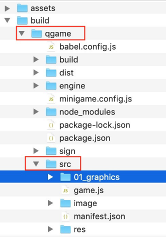

# Subpackage Loading

As gameplay becomes more and more rich, the amount of code in the game is increasing and developers are wanting to expand the size of their game package. At the same time, WeChat Mini Games also support the function of subpackage loading. So Cocos Creator provides a **subpackage loading** feature that supports subpackage loading of **code** and **resources**. Where **resource subpackage** is supported from **v2.0.7**. Subpackage loading currently only supports all kinds of mini games, such as WeChat Mini Games, OPPO Mini Games and so on.

**Subpackage Loading**, is the the game content being split into several packages according to certain rules. During the first startup, only the necessary packages are downloaded, also called the **main package**. Other subpackages are downloaded, as triggered, which can effectively reduce the time spent on the first boot.

## Configuration method

__Cocos Creator's__ uses a folder structure when configuring a **subpackage**. When a folder is selected, the relevant configuration options for the folder appear in the **Properties** tab:


After checking **Subpackage**, click __Apply__ at the top right, and the code in this folder will be treated as the contents of the __subpackage__. The **Subpackage Name** will be passed as the loaded name when the __subpackage__ is loaded. The name of this folder will be used by default.

**Note**: After being configured as a subpackage, only native resources, such as images and audio, will eventually be placed in the subpackage. JSON types of resources such as Prefab, AnimationClip, etc., will still be placed in the main package.

## Building

The function of **subpackaging** will only be avialable after the project is built. When previewing, it will be loaded according to the whole package. After the project is built, the corresponding subpackage file will be generated in the **subpackage** directory of release package directory.

**For example:** Configuring the **cases/01_graphics** folder in the example project as a **subpackage**. The **01_graphics** folder will be generated in **subpackages** in the release package directory after the project is built.


When building, all the **code** and **resources** under the **cases/01_graphics** subpackage folder are handled as follows:

  - **Code**: All code under the **cases/01_graphics** folder is merged into an entry script file named **01_graphics/game.js**, and the code is removed from the main package.
  - **Resources**: The **cases/01_graphics** subpackage resources are moved from the **res/raw-assets** folder to the **subpackages/01_graphics** directory under the release package directory.

## Loading a Subpackage

The engine provides a unified API `cc.loader.downloader.loadSubpackage` to load the resources (including code and other resources) inside the subpackage file. `loadSubpackage` needs to pass in the name of a subpackage. This name is the name of the subpackage that you configured in the project before. The default is the name of the subpackage folder.

When the subpackage is completed, a callback is triggered, and if the loading fails, an error message is returned.

```javascript
cc.loader.downloader.loadSubpackage('01_graphics', function (err) {
    if (err) {
        return console.error(err);
    }
    console.log('load subpackage successfully.');
});
```

If the loading is successful, the script in the subpackage will be executed and the resource loading path of the subpackage will be added to the engine. Developers can access all the resources in this subpackage in exactly the same way as accessing the main package, without having to worry about whether the resources were originally in the main package or in the subpackage.

## WeChat Mini Games

When building for the **WeChat Mini Game**, the configuration of the **subpackage** will be automatically generated into the **game.json** configuration file of the **WeChat Mini Games** release package according to the rules.


**Note**: WeChat Mini Games require a specific version to support the **subpackage** feature. WeChat 6.6.7 Client, 2.1.0 and above base library support, please update to the latest client version, developer tools please use version **1.02.1806120** and above. After updating the developer tools, don't forget to modify the version of __Details -> Project Settings -> Debug Base library__ to __2.1.0__ and above in the developer tools:


### Subpackage Load Packet Size Limit

At present, the size of the WeChat Mini Game subpackage has following restrictions:

- The size of all subpackage of the entire Mini Game can not exceed **8M**
- The size of single subpackage / main package can not exceed **4M**

Please refer to the [WeChat SubPackage Loading](https://developers.weixin.qq.com/minigame/en/dev/tutorial/base/subpackages.html?t=19010711) documentation for details.

## vivo Mini Games

When building for the **vivo Mini Game**, the configuration of the **subpackage** will be automatically generated into the **manifest.json** configuration file in the `qgame/src` directory of the **vivo Mini Games** release package according to the rules.


**Note**:

- Starting with **v2.1.3**, vivo Mini Game supports subpackage loading.
- Starting with **1051** version, **Quick App & vivo Mini Game Debugger** 
supports the subpackage loading of vivo Mini Game. Versions lower than 1051 do not support subpackage loading, but they are also compatible. If a subpackage is configured in the editor's **Properties**, it will not affect the normal operation of the game. Please refer to [vivo SubPackage Loading - old version compatibility](https://minigame.vivo.com.cn/documents/#/lesson/base/subpackage?id=%e8%80%81%e7%89%88%e6%9c%ac%e5%85%bc%e5%ae%b9) for details.
- Unlike the WeChat Mini Game, vivo Mini Game after the project is built, the corresponding subpackage file will be generated in the **src** directory of release package **qgame** directory.

  

### Subpackage Load Packet Size Limit

At present, the size of the vivo Mini Game subpackage has following restrictions:

- The size of all subpackage and main package of the entire Mini Game can not exceed **8M** (The compressed package includes entire package no more than **12M**)
- The size of single subpackage / main package can not exceed **4M**

Please refer to the [vivo SubPackage Loading](https://minigame.vivo.com.cn/documents/#/lesson/base/subpackage) for details.
