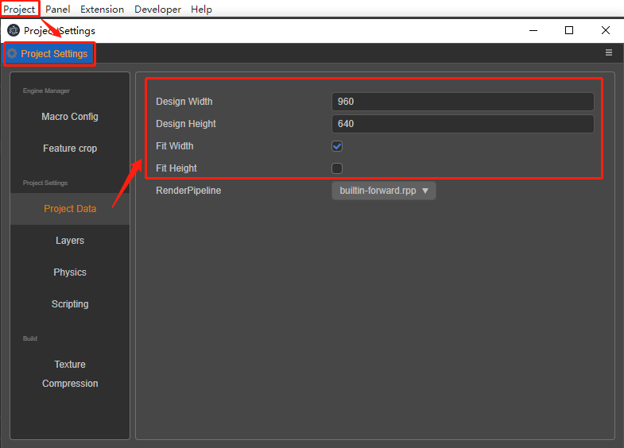

# Canvas Component Reference

The node where the **RenderRoot2D** component is located is the data collection entry point for the 2D rendering component, and the **Canvas** component inherits from the **RenderRoot2D** component, so the **Canvas** component is also the data collection entry point. There can be multiple Canvas nodes in the scene, **all 2D rendering elements must be rendered as children of RenderRoot2D**.

In addition to the data entry capability inherited from RenderRoot2D, the Canvas node itself is also an important component for screen adaptation, and plays a key role in multi-resolution adaptation in game production. Please refer to the [Multi-Resolution Adaptation](../engine/multi-resolution.md) documentation. The design resolution and adaptation scheme of Canvas are configured through **Project Settings**.

The Canvas itself has nothing to do with the camera, its main role is to adapt the screen as described above, so the rendering of the Canvas only depends on the camera corresponding to its node layer, so you can control the properties of the camera to determine the rendering effect of the nodes under the Canvas. 

## Canvas Properties

| Property | Function Description |
| :------------- | :---------- |
| CameraComponent | The camera associated with the Canvas. This camera does not necessarily render the content under the Canvas, but can be used in conjunction with the `AlignCanvasWithScreen` property to automatically change some of the Camera's parameters to align with the Canvas.
| AlignCanvasWithScreen | Whether the camera associated with the Canvas should be aligned with the Canvas, do not check this option if you want to control the camera position yourself (like side-scrolling games, etc.)

## Caution

If you encounter UI rendering errors, blurred screen, splash screen, etc., please refer to [Detailed Explanation](../engine/priority.md#detailed-explanation).
