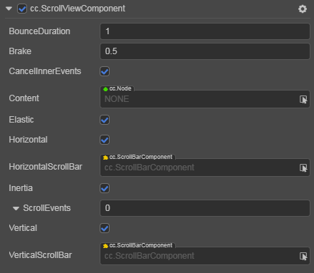
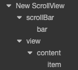

# ScrollView Component Reference

__ScrollView__ is a container with a scroll function. It provides a way to browse more contents within a limited display area. Generally, ScrollView will be used along with the __Mask__ component and the __ScrollBar__ component can also be added to show the current offset location within the browsing content.




Click the __Add Component__ button at the bottom of the __Inspector__ panel and select __UI/ScrollView__ to add the ScrollView component to the node.

To use `ScrollView`, please refer to the [ScrollView API](__APIDOC__/en/classes/ui.scrollview.html) documentation and the [scrollView](https://github.com/cocos-creator/test-cases-3d/tree/master/assets/cases/ui/06.scrollView) scene of the test-cases-3d project.

## ScrollView Properties

| Properties           | Function Explanation  |
| :-------------       | :----------           |
| BounceDuration       | Floating point number, the time duration for bounce back. The value range is __0-10__ |
| Brake                | Floating point number, the deceleration coefficient after scrolling. The value range is __0-1__. If set to 1, then the scrolling will stop immediately, if set to 0, then the scrolling will continue until the content border |
| CancelInnerEvents    | If it is set to true, then the scroll behavior will cancel the touch events registered on the child node. The default setting is true |
| Content              | A reference node for the inner content of the __ScrollView__. It could be a node containing a very large image or long texts. |
| Elastic              | Boolean value, whether to bounce back or not while scroll to the border. |
| Horizontal           | Boolean value, whether horizontal scroll is allowed or not |
| HorizontalScrollBar  | A reference node for creating a scroll bar showing the horizontal position of the content      |
| Inertia              | Is there an accelerating velocity when scrolling   |
| ScrollEvents         | Default list type is null. Each event added by the user is composed of the node reference, component name and a response function. Please see the __ScrollView Event__ section below for details     |
| Vertical             | Boolean value, whether vertical scroll is allowed or not |
| VerticalScrollBar    | A reference node for creating a scroll bar showing vertical position of the contents  |

### ScrollView Event


For event structure you can refer to the [Button](./button.md) documentation.

The ScrollView event callback will have two parameters, the first one is the ScrollView itself and the second one is the event type of ScrollView.

### ScrollBar Setting

ScrollBar is optional. You can choose to set either a Horizontal ScrollBar or a Vertical ScrollBar or of course set them both.

To build a connection, you can drag a node with the ScrollBar component in the __Hierarchy__ over to the corresponding field in ScrollView.

## Detailed Explanation

The ScrollView component can only work with the specified content node. It calculates location information during scrolling using both the designated scroll direction and the length of the content node in this direction.

The Content node can also set up the auto resize by adding a `Widget`, or it can arrange the layout of child nodes by adding a `Layout`, but these two components should not be added to a node at the same time to avoid unintentional consequences.

Normally a ScrollView node tree resembles the following:



The `view` here is used to define a scroll area that can be displayed. As a result, the Mask will normally be added to the `view`. Contents that can scroll can be put in the content node or added to its child node.

## Add a callback through the script code

### Method one

The event callback added by this method is the same as the event callback added by the editor, all added by code. First you need to construct a `EventHandler` object, and then set the corresponding `target`, `component`, `handler` and `customEventData` parameters.

```ts
import { _decorator, Component, ScrollView, EventHandler } from "cc";
const { ccclass, property } = _decorator;

@ccclass("example")
export class example extends Component {
    onLoad() {
        const scrollViewEventHandler = new EventHandler();
        // This node is the node to which your event handler code component belongs
        scrollViewEventHandler.target = this.node;
        // This is the script class name
        scrollViewEventHandler.component = 'example';
        scrollViewEventHandler.handler = 'callback';
        scrollViewEventHandler.customEventData = 'foobar';

        const scrollview = this.node.getComponent(ScrollView);
        scrollview.scrollEvents.push(scrollViewEventHandler);
    }

    callback(scrollview, eventType, customEventData){
        // here scrollview is a Scrollview component object instance
        // here the eventType === ScrollView.EventType enum
        // here the customEventData parameter is equal to the "foobar" you set before
    }
}
```

### Method two

By `scrollview.node.on('scroll-to-top', ...)` way to add.

```js
// Suppose we add an event handler callback to the onLoad method of a component and handle the event in the callback function:
import { _decorator, Component, ScrollView } from "cc";
const { ccclass, property } = _decorator;

@ccclass("example")
export class example extends Component {
    @property(ScrollView)
    scrollview: ScrollView | null = null;
    onLoad(){
        this.scrollview.node.on('scroll-to-top', this.callback, this);
    }

    callback(scrollView: ScrollView) {
        // The callback parameter is the ScrollView component, note that events registered this way cannot pass customEventData.
    }
}
```

Similarly, you can register events such as `scrolling`, `touch-up`, `scroll-began`, etc. The parameters of the callback function for these events are consistent with the parameters of `scroll-to-top`.
