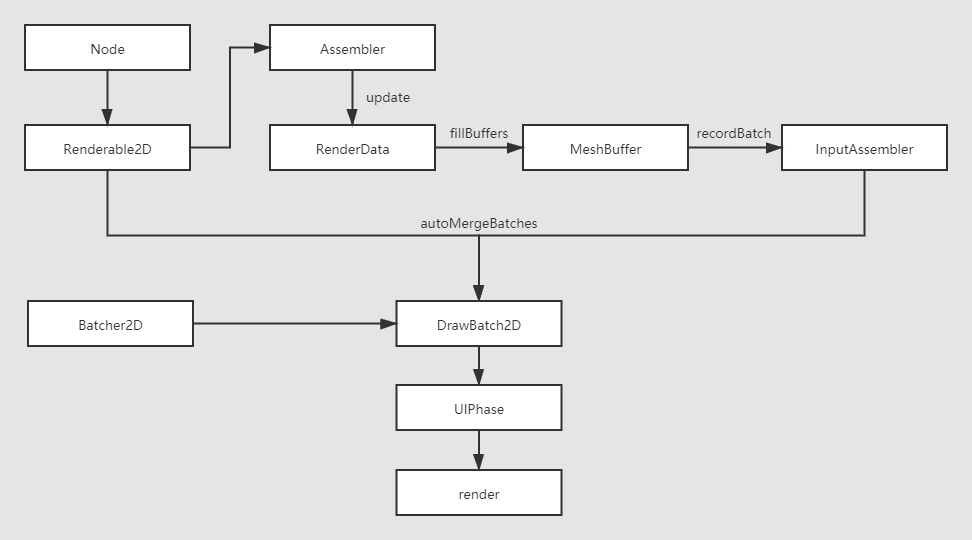

# 2D 渲染对象

所有具备渲染能力的 2D 对象是 2D 渲染对象。例如：Sprite、Label。2D 渲染对象的渲染要求有两点：

1. 自身带有 UITransform 组件
2. 需要为带有 RenderRoot2D/Canvas 组件节点的子节点

## 2D 对象渲染结构说明

RenderRoot2D 节点（带有 RenderRoot2D 组件）为 2D 对象数据收集的入口节点，所有的 2D 渲染对象需在 RenderRoot2D 节点下才会被渲染。由于 Canvas 组件本身继承 RenderRoot2D 组件，所以 Canvas 组件也可以作为数据收集的入口。2D 渲染节点必须带有 UITransform 组件，点击或者对齐策略等功能才能生效。

2D 渲染也支持对模型进行渲染，唯一的条件是带有模型组件（例如 `MeshRenderer`/`SkinnedMeshRenderer`）的节点必须添加 **UI/UIMeshRenderer** 组件才可以和 UI 在相同的管线上进行渲染。

2D 渲染流程如下：

## 2D 渲染对象可见性说明

2D 渲染对象在相机的可见性判断上和 3D 渲染对象并无区别，开发者需要自己设置节点的 Layer 属性并配合相机的 Visibility 属性进行分组渲染。只有当节点设置的 Layer 包含在相机的 Visibility 中时，节点才可以被该相机看见，详情请参考 [节点的可见性](../../concepts/scene/node-component.md#%E8%AE%BE%E7%BD%AE%E8%8A%82%E7%82%B9%E7%9A%84%E5%8F%AF%E8%A7%81%E6%80%A7)。如果一个场景中包含多个相机，请严格规划好相机的 Visibility，否则可能出现多个相机同时渲染相同的 Layer，导致节点重复渲染。

> **注意**：若项目是从 Cocos Creator 3D v1.2 升级到 v3.0 的，我们纠正了之前 Canvas 只会渲染其子节点的行为，在 v3.0 需要开发者自行管理节点的 Layer 和相机的 Visibility。之前在 v1.2 中使用了多 Canvas 渲染的项目可能需要做些调整以达到更合理的场景结构。

## 2D 渲染组件

本身拥有渲染能力的组件我们称为 2D 渲染组件，包括：

- [Sprite 组件参考](../../ui-system/components/sprite.md)
- [Label 组件参考](../../ui-system/components/label.md)
- [Mask 组件参考](../../ui-system/components/mask.md)
- [Graphics 组件参考](../../ui-system/components/graphics.md)
- [RichText 组件参考](../../ui-system/components/richtext.md)
- [UIStaticBatch 组件参考](../../ui-system/components/ui-static.md)
- [TiledMap 组件参考](../../editor/components/tiledmap.md)
- [TiledTile 组件参考](../../editor/components/tiledtile.md)
- [Spine（骨骼动画）Skeleton 组件参考](../../editor/components/spine.md)
- [DragonBones（龙骨）ArmatureDisplay 组件参考](../../editor/components/dragonbones.md)

## 2D 渲染组件规则介绍

- [渲染排序规则](../../ui-system/production-strategy/priority.md)
- [UI 合批规则说明](../../ui-system/production-strategy/ui-batch.md)
- [UI 材质说明](../../ui-system/production-strategy/ui-material.md)
