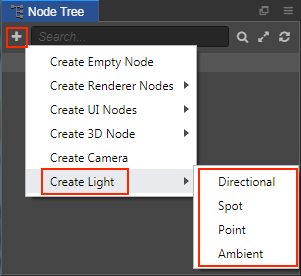
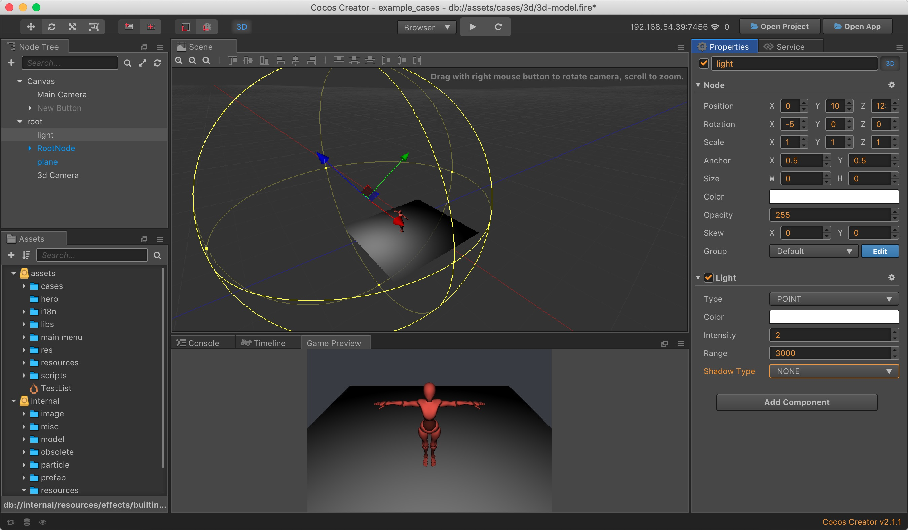
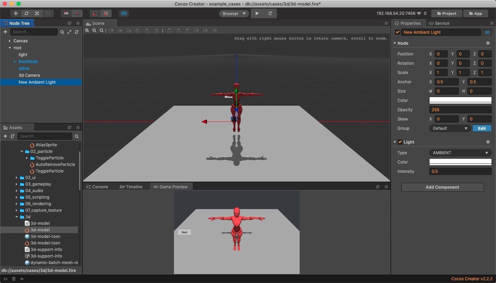
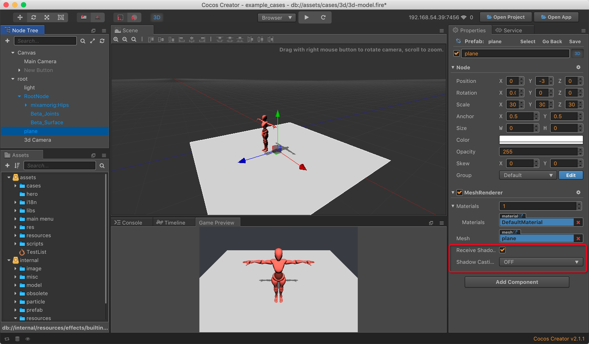

# 光照

在 3D 场景中添加光源可以使场景产生相应的光照和阴影效果，获得更好的视觉效果。建议点击编辑器左上方的 **3D** 按钮将 **场景编辑器** 切换至 3D 场景模式，以便更好地对光源进行编辑。

## 添加光源

添加光源有以下两种方式：

- 在 **层级管理器** 中点击左上角的 **+** 按钮，然后选择 **创建光源**，就可以创建一个包含有 **光源组件** 的节点到场景中。

  

- 在 **层级管理器** 中选择需要添加光源的节点，然后点击 **属性检查器** 下方的 **添加组件** 按钮，从 **渲染组件** 中选择 **Light**，即可添加 Light 组件到节点上。

  

## 光源类型

光源类型包括 **平行光**、**点光源**、**聚光灯**、**环境光** 四种。可以通过以下两种方式选择光源类型：

- 一种是在 **层级管理器** 中创建节点时直接选择 **Create Light -> 所需的光源类型（例如 Directional）** 即可。

  

  

- 另一种是在节点的 **属性检查器** 中添加 Light 组件之后，直接设置 Light 组件的 **type** 属性。

  

### 平行光

平行光是最常见的一种光源，光照效果不受 **光源位置** 和 **朝向** 的影响，适合用于实现太阳光（在下图中可以看到，平行光在平面上产生的光照亮度都是一样的）。但是旋转会影响到平行光照射的方向，而光照方向又会影响到模型接受光照的范围以及模型产生阴影的位置。

用户可以通过修改 **属性检查器** 中 Light 组件的 **Color** 属性来调整光源颜色，通过修改 **Indensity** 属性来调整光源强度。

### 点光源

点光源位于空间的一个点上，并向所有方向均匀的发散光线，接近于蜡烛产生的光线。光照强度会随着跟光源距离的增大而减小。在编辑器中可以看到光源位置和它的照射范围，如下图所示。

用户可以通过修改 **属性检查器** 中 Light 组件的 **Range** 属性来修改点光源的光照范围。

### 聚光灯

聚光灯是由一个点向一个方向发射一束光线，接近于手电筒产生的光线。比其他类型的光源多了 **Spot Angle** 属性，用于调整聚光灯的光照范围。

### 环境光

环境光可以均匀地照亮场景中的所有物体，帮助提升场景亮度，常用于解决模型背光面全黑的问题。环境光一般需要配合其他类型的光源一起使用，例如场景中只有一个平行光，那么在模型的背光源处会显得非常暗，加入环境光则可以提升模型背部的亮度，显得更加美观。

**注意**：

- 由于环境光是没有方向的，所以不能产生阴影。
- 环境光可以放在场景中的任意节点上，与坐标无关，放在任意位置都可以。

## 设置阴影

要使物体产生阴影，需要以下几个步骤：

1. 更改 **光源组件** 上的 **Shadow Type** 参数。**NONE** 表示光源不会生成阴影，**HARD** 表示光源会生成硬阴影。
2. 选择要生成阴影的 **MeshRenderer 组件**，更改 **Shadow Casting Mode** 参数。**OFF** 表示不会生成阴影，**ON** 表示会生成阴影
3. 选择要接受阴影的 **MeshRenderer 组件**，更改 **Receive Shadows** 参数，**True** 表示会接受阴影，反之则不会接受阴影。

假设我们希望在一个平面上显示一个模型的投影，那么各节点的参数设置可以参考下图：

1. 光源组件

    

2. 模型的 MeshRenderer 组件

    

3. 平面的 MeshRenderer 组件

    
