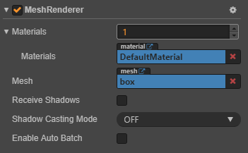

# Mesh Renderer 组件参考

> 文：youyou

Mesh Renderer 用于绘制网格资源，如果网格资源中含有多个子网格，那么 Mesh Renderer 中也需要有对应多的材质才能正确绘制网格。

## 属性



| 属性 | 功能说明 |
| :-- | :------ |
| Materials            | 网格资源允许使用多个材质资源，所有材质资源都存在 `materials` 数组中。<br>如果网格资源中有多个子网格，那么 Mesh Renderer 会从 `materials` 数组中获取对应的材质来渲染此子网格。 |
| Mesh                 | 指定渲染所用的网格资源 |
| Receive Shadows      | 指定当前模型是否会接收并显示其它物体产生的阴影效果  |
| Shadows Casting Mode | 指定当前模型是否会投射阴影 |
| Enable Auto Batch    | 是否开启自动合批。<br>开启时，能减少 Drawcall，适用于简单的模型。<br>关闭时，Drawcall 会上升，但能减少 CPU 的运算负担，适用于复杂的模型。 |

## 调试

网格的顶点数据一般都比较抽象，不太容易看出网格里面的三角形是如何分布的。这时候用户可以开启线框模式，用线段按照三角形的分布连接顶点与其他顶点，这样就比较容易看出网格顶点的数量和分布了。

```javascript
cc.macro.SHOW_MESH_WIREFRAME = true;
```
