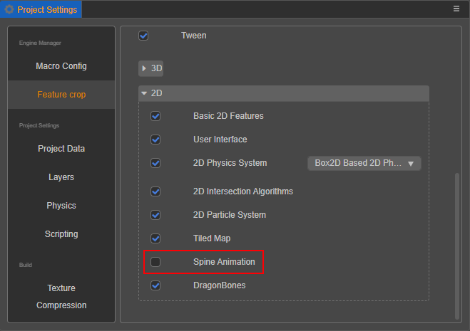

# CMake 使用简介

CMake 是一个跨平台的构建工具，可根据需要输出各种各样的 Makefile 或者 Project 文件。CMake 使用 `CMakeLists.txt` 来配置工程文件，开发者可以在这里集成 SDK 或者引用用于编译原生平台的库和配置，详情可参考 [二次开发](../editor/publish/native-options.md#%E4%BA%8C%E6%AC%A1%E5%BC%80%E5%8F%91)。

从 v3.0 开始，Creator 已经集成了 CMake 的输出过程和基础编写，本篇文档主要介绍原生平台上 `CMakeLists.txt` 的使用规则以及一些简单的示例。

## CMakeLists 的生成和使用

当选择某个原生平台进行构建时，项目目录 `native\engine` 目录下会生成 `当前构建的平台名称` 文件夹（例如 `android`），以及 `common` 文件夹。CMake 在第一次运行时将会在这两个目录下分别生成 `CMakeLists.txt` 文件，作用各不相同：

- `当前构建的平台名称` 文件夹：`CMakeLists.txt` 主要用于配置对应的构建平台。以 Android 平台为例：

    

- `common` 文件夹：`CMakeLists.txt` 主要用于配置整个项目。

    

`CMakeLists.txt` 的语法比较简单，由 **命令**、**注释** 和 **空格** 组成。其中命令是不区分大小写的，但命令中的参数和变量则是大小写敏感的。

那如何利用 CMake 将项目编译成动态库提供给其他项目 **使用** 呢？简单来说就是先把编译信息录入，然后 CMake 命令再根据 `CMakeLists.txt` 中的配置生成编译所需的 Makefile 文件。

下面我们以 Android 平台为例，具体看一下如何配置项目目录 `native/engine/android` 目录下的 `CMakeLists.txt`。

```CMake
# 设置 CMake 所需的最低版本。如果使用的 CMake 版本低于该版本，会提醒用户升级到该版本之后再执行 CMake。
cmake_minimum_required(VERSION 3.8)

# 声明项目名称
option(APP_NAME "Project Name" "cmakeTest")

# 声明项目名称以及支持的编程语言（CXX 代表 C++），若不指定则默认支持所有语言。支持的编程语言包括 C、C++ 和 JAVA。
project(${APP_NAME} CXX)

#include 从文件或模块加载和运行 CMake 代码
include(${CMAKE_CURRENT_LIST_DIR}/../common/CMakeLists.txt)

# 定义一个新变量 LIB_NAME 并设置为 “cocos”
set(LIB_NAME cocos)

# 定义一个变量 PROJ_SOURCES
set(PROJ_SOURCES
    ${CMAKE_CURRENT_LIST_DIR}/../common/Classes/Game.h
    ${CMAKE_CURRENT_LIST_DIR}/../common/Classes/Game.cpp
    ${CMAKE_CURRENT_LIST_DIR}/jni/main.cpp
)

# 如果在该路径下不存在 jsb_module_register.cpp，则复制这个路径下的 jsb_module_register.cpp 文件到目标文件夹中
if(NOT EXISTS ${CMAKE_CURRENT_LIST_DIR}/../common/Classes/jsb_module_register.cpp，则负责)
    file(COPY "${COCOS_X_PATH}/cocos/bindings/manual/jsb_module_register.cpp 文件到"
        DESTINATION ${CMAKE_CURRENT_LIST_DIR}/../common/Classes/)
endif()

# 添加新 element 到 PROJ_SOURCES 中
list(APPEND PROJ_SOURCES
    ${CMAKE_CURRENT_LIST_DIR}/../common/Classes/jsb_module_register.cpp
)

# 动态库 PROJ_SOURCES 生成链接文件到 LIB_NAME 中
add_library(${LIB_NAME} SHARED ${PROJ_SOURCES})

# 将目标文件 LIB_NAME 与库文件 cocos2d_jni 进行链接
target_link_libraries(${LIB_NAME}
    "-Wl,--whole-archive" cocos2d_jni "-Wl,--no-whole-archive"
    cocos2d
)

# 将包含目录添加到目标文件夹。
target_include_directories(${LIB_NAME} PRIVATE
    ${CMAKE_CURRENT_LIST_DIR}/../common/Classes
)
```

项目目录 `native/engine/common` 目录下的 `CMakeLists.txt` 文件的配置方法也是一致的，但是会多一些基础的配置。例如：

```CMake
option(USE_SPINE                "Enable Spine"                      ON)
```

构建后生成的发布包目录（例如 `build/android`）下有一个 `proj/cfg.cmake` 文件，用于存放当前项目的一些配置。因为 `CMakeLists.txt` 中有对 `cfg.cmake` 文件进行引入，所以当 `cfg.cmake` 文件中的配置做了修改，便会同步到 `CMakeLists.txt` 中，若是相同的配置，则直接覆盖。

```CMake
CMakeLists.txt

# 引入 cfg.cmake
include(${RES_DIR}/proj/cfg.CMake)
```

例如将编辑器主菜单 **项目 -> 项目设置 -> 功能裁剪** 中的 **Spine 动画** 去掉勾选：



则在再次构建时重新生成的 `cfg.make` 中就会将 `USE_SPINE` 设置为 `OFF`：


然后在编译时，CMake 便会根据配置（例如 `CMakeLists.txt` 以及 `CMakeLists.txt` 中引入的 `cfg.make` 等配置文件）生成 **CMakeCache.txt** 文件，该文件中包含了项目构建时 **需要依赖的各种输入参数**。


## CMakeLists 常用编译指令

### 查找编译头文件

找到编译头文件，CMake 即可指定编译给定目标时要使用的包含目录或目标文件夹：

```CMake
target_include_directories(<target> [SYSTEM] [BEFORE]
  <INTERFACE|PUBLIC|PRIVATE> [items1...]
  [<INTERFACE|PUBLIC|PRIVATE> [items2...] ...])
```

一般情况下，通过上述指令引用库路径便可作为外部依赖项引入到 CMake 中。例如：

```CMake
target_include_directories(${LIB_NAME} PRIVATE
    ${CMAKE_CURRENT_LIST_DIR}/../common/Classes
)
```

我们将 `Classes` 头文件库路径添加到了 `LIB_NAME` 中。

### 生成 target（执行文件）

上述 **查找编译头文件** 指令中的 `<target>` 是通过 `library`、`executable`、`自定义 command` 指令生成的执行文件。

- 通过 `library` 指令生成：

   `library` 指令通过将指定的源文件生成链接文件，然后添加到工程中去。

    ```CMake
    add_library(<name> [STATIC | SHARED | MODULE]
            [EXCLUDE_FROM_ALL]
            [source1] [source2 ...])
    ```

    - `name`：表示添加一个名为 <name> 的目标库，由命令中列出的源文件（source1、source2）构建而成，在项目中是全局唯一的。源文件若是在后续通过 [target_sources()](https://cmake.org/cmake/help/latest/command/target_sources.html?highlight=target_sources) 指定，那么这里就可以忽略。

    - `STATIC`（静态库）、`SHARED`（动态库）、`MODULE`（模块库）：用于指定要创建的库的类型。STATIC 库是对象文件的档案，用于连接其他目标。共享库是动态链接的，并在运行时加载。MODULE 库是插件，不被链接到其他目标中，但可以在运行时使用类似 dlopen 的功能动态加载。

    例如指定要创建的库为 SHARED：

    ```CMake
    add_library(${LIB_NAME} SHARED ${PROJ_SOURCES})
    ```

    更多关于 `library` 指令的内容，详情请参考 CMake 官方文档 [add_library](https://cmake.org/cmake/help/v3.16/command/add_library.html)。

- 通过 `executable` 指令生成：

    `executable` 指令是使用指定的源文件来生成目标可执行文件。

    ```CMake
    add_executable(<name> [WIN32] [MACOSX_BUNDLE]
                   [EXCLUDE_FROM_ALL]
                   [source1] [source2 ...])
    ```

    - `name`：可执行目标文件的名字，在一个 CMake 工程中，这个名字必须全局唯一。
    - `WIN32`：用于在 **Windows** 中创建一个以 `WinMain` 为入口的可执行目标文件（通常入口函数为 `main`），它不是一个 **控制台应用程序**，而是一个 **GUI 应用程序**。当使用 `WIN32` 时，可执行目标的 `WIN32_EXECUTABLE` 会被置为 `ON`。
    - `MACOSX_BUNDLE`：用于在 **macOS** 或者 **iOS** 下创建一个 GUI 可执行应用程序，当 `MACOSX_BUNDLE` 选项使用的时候，可执行目标的 `MACOSX_BUNDLE` 会被置为 `ON`。
    - `EXCLUDE_FROM_ALL`：用于指定可执行目标是否会被构建，当该选项使用的时候，可执行目标不会被构建。
    - `[source1] [source2 ...]`：构建可执行目标文件所需要的源文件。也可以通过 [target_sources()](https://cmake.org/cmake/help/latest/command/target_sources.html?highlight=target_sources) 继续为可执行目标文件添加源文件，要求是在调用 `target_sources` 之前，可执行目标文件必须已经通过 `add_executable` 或 `add_library` 定义了。

    示例如下：

    ```CMake
    add_executable(hello-world hello-world.cpp)
    ```

     更多关于 `executable` 指令的内容，详情请参考 CMake 官方文档 [add_executable](https://cmake.org/cmake/help/v3.16/command/add_executable.html?highlight=add_executable)。

- 通过 `自定义 command` 指令生成：

    `自定义 command` 指令是指将向生成的构建系统添加自定义构建规则。该命令主要用于两种场景下：

    - 添加定制命令来生成文件。
    - 为某个目标（如库或可执行程序）添加一个定制命令。

    ```CMake
    add_custom_command(OUTPUT output1 [output2 ...]
                   COMMAND command1 [ARGS] [args1...]
                   [COMMAND command2 [ARGS] [args2...] ...]
                   [MAIN_DEPENDENCY depend]
                   [DEPENDS [depends...]]
                   [BYPRODUCTS [files...]]
                   [IMPLICIT_DEPENDS <lang1> depend1
                                    [<lang2> depend2] ...]
                   [WORKING_DIRECTORY dir]
                   [COMMENT comment]
                   [DEPFILE depfile]
                   [JOB_POOL job_pool]
                   [VERBATIM] [APPEND] [USES_TERMINAL]
                   [COMMAND_EXPAND_LISTS])
    ```

    - `OUTPUT`：指定命令预期产生的输出文件。输出文件名称可以是 **绝对路径** 或者 **相对路径**（相对于当前的构建的源目录路径）。

    - `COMMAND`：指定要在构建时执行的命令行。

    示例如下：

    ```CMake
    add_custom_command(OUTPUT COPY_RES
            COMMAND ${CMAKE_COMMAND} -E copy_if_different ${abs} $<TARGET_FILE_DIR:${LIB_NAME}>/${filename}
        )
    ```

    使用 **add_custom_command** 时有以下两个限制：

    - 只有在相同的 `CMakeLists.txt` 中，指定了所有依赖于其输出的目标时才有效。

    - 对于不同的独立目标，使用 `add_custom_command` 的输出可以重新执行定制命令。这可能会导致冲突，应该避免这种情况的发生。

    更多关于 `add_custom_command` 指令的内容，详情请参考 CMake 官方文档 [add_custom_command](https://cmake.org/cmake/help/v3.16/command/add_custom_command.html?highlight=add_custom_command)。

### 链接库文件

`target_link_libraries` 里库文件的顺序符合 `gcc` 链接顺序的规则，即被依赖的库放在依赖它的库的后面。

```CMake
target_link_libraries(<target> [item1] [item2] [...]
                      [[debug|optimized|general] <item>] ...)
```

`item` 表示库文件没有后缀的名字。默认情况下，库依赖项是传递的。当这个目标链接到另一个目标时，链接到这个目标的库也会出现在另一个目标的连接线上。例如：

```CMake
target_link_libraries(${LIB_NAME}
    "-Wl,--whole-archive" cocos2d_jni "-Wl,--no-whole-archive"
    cocos2d
)
```

### 其他命令

- 打印调试日志消息

    ```CMake
    message(STATUS “my custom debug info”)
    ```

- 操作文件命令

    ```CMake
    file(COPY "${COCOS_X_PATH}/cocos/bindings/manual/jsb_module_register.cpp"
        DESTINATION ${CMAKE_CURRENT_LIST_DIR}/../common/Classes/)
    ```

    `COPY` 表示复制文件、目录以及符号链接到一个目标文件夹中。输入路径为相对于当前源码目录的路径。目标路径则是相对于当前的构建目录。

- 从文件或模块加载和运行 CMake 代码

    ```CMake
    include(${CMAKE_CURRENT_LIST_DIR}/../common/CMakeLists.txt)
    ```

## CMakeLists 使用示例

**Android.mk** 是 Android 源码编译系统的 Makefile，用于编译系统中 C++ 的动态库、静态库、可执行文件和 apk 等。接下来通过将 [腾讯云多媒体引擎 SDK](https://cloud.tencent.com/document/product/607/15216#cocos-creator-.E6.8E.A5.E5.85.A5) 中的一个 `Android.mk` 改写成 `CMakeLists.txt` 做一个简单的示例。

`Android.mk` 中的代码如下：

```
LOCAL_PATH := $(call my-dir)

include $(CLEAR_VARS)
LOCAL_MODULE := Pre_GMESDK
LOCAL_SRC_FILES := ./$(TARGET_ARCH_ABI)/libgmesdk.so
include $(PREBUILT_SHARED_LIBRARY)

include $(CLEAR_VARS)
LOCAL_MODULE := Pre_TRAE
LOCAL_SRC_FILES := ./$(TARGET_ARCH_ABI)/libtraeimp.so
include $(PREBUILT_SHARED_LIBRARY)

include $(CLEAR_VARS)
LOCAL_MODULE := Pre_PTT
LOCAL_SRC_FILES := ./$(TARGET_ARCH_ABI)/libsilk.so
include $(PREBUILT_SHARED_LIBRARY)

include $(CLEAR_VARS)
LOCAL_MODULE := Pre_MP3
LOCAL_SRC_FILES := ./$(TARGET_ARCH_ABI)/libgmecodec.so
include $(PREBUILT_SHARED_LIBRARY)
```

其中有一个 `LOCAL_PATH` 变量，表示源文件在开发树中的位置。构建系统提供的宏函数 `my-dir` 将返回当前目录（`Android.mk` 文件本身所在的目录）的路径：

```
LOCAL_PATH := $(call my-dir)
```

对应在 `CMakeLists.txt` 则表示为：

```
set(LOCAL_PATH ${CMAKE_CURRENT_SOURCE_DIR}/..)
```

在 `Android.mk` 中以下部分的代码：

```
include $(CLEAR_VARS)
LOCAL_MODULE := Pre_GMESDK
LOCAL_SRC_FILES := ./$(TARGET_ARCH_ABI)/libgmesdk.so
include $(PREBUILT_SHARED_LIBRARY)
```

对应在 `CMakeLists.txt` 中则表示为：

```CMake
add_library(Pre_GMESDK SHARED IMPORTED GLObal)
set_target_properties(Pre_GMESDK PROPERTIES
  IMPORTED_LOCATION ./${ANDROID_ABI}/libgmesdk.so
)
```

## 结语

CMake 的指令和用法还有很多，欢迎大家去探寻和学习，本篇文档只是做了简单的示例，开发者可针对自身的实际情况，对自己的工作流进行定制。未来 Cocos Creator 也会将 CMake 更多的功能集成到编辑器的 **构建发布** 面板中，方便使用。

更多关于 CMake 语法和接口的详细内容，请参考 [CMake 官方文档](https://cmake.org/cmake/help/v3.16/guide/tutorial/index.html)。
