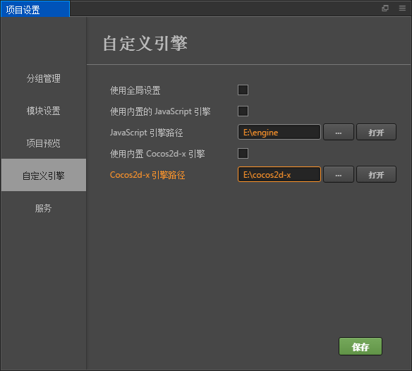
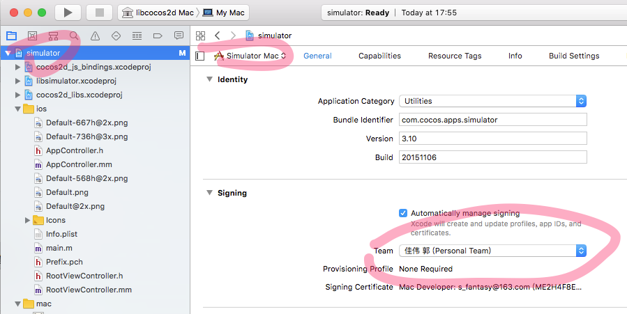

# 引擎定制工作流程

Cocos Creator 的引擎部分包括 JavaScript 和 Cocos2d-x 两个部分。全部都在 github 上开源。地址在：

- JavaScript 引擎：<https://github.com/cocos-creator/engine>
- Cocos2d-x 引擎：<https://github.com/cocos-creator/cocos2d-x-lite>

我们建议您通过 github 的 fork 工作流程来维护自己定制的仓库，具体操作方式请阅读 [github help: Fork A Repo](https://help.github.com/articles/fork-a-repo)。关于更多 github 相关工作流程请参考 [github help](https://help.github.com)。

## 1、定制 JavaScript 引擎

如果您只需要定制 Web 版游戏的引擎功能，或只需要修改纯 JavaScript 层逻辑（如 UI 系统，动画系统），那么您只要按照下面的流程修改 JS 引擎就可以了。

### 1.1、获取 JS 引擎

如果您仅需基于当前的版本做一些调整，那么在 Cocos Creator 内置的引擎基础上修改就可以了。点击 Creator 编辑器右上方的 **打开程序安装路径**，然后将内置的 **engine** 目录拷贝到本地其他路径。


如果您想获得官方正在开发中的最新版本，首先您需要从 github 上 fork 或者克隆 JavaScript 引擎的原始版本（地址见上文）。根据不同的 Creator 版本，还需要切换不同的分支，例如 Creator 1.6.2 对应的是引擎的 v1.6 分支，下载后存放到任意本地路径。


### 1.2、安装编译依赖

```bash
# 在命令行中进入引擎路径
cd /Users/yufang/engine
# 安装 gulp 构建工具
npm install -g gulp
# 安装依赖的模块
npm install
```

### 1.3、进行修改然后编译

接下来您可以定制引擎修改了，修改之后请在命令行中继续执行：

```bash
gulp build
```

该命令会在引擎目录下生成一个 `bin` 文件夹，并将引擎源码编译到 `bin` 目录下。


### 1.4、在 Cocos Creator 中使用定制版引擎

通过 `项目 -> 项目设置` 面板的 **自定义引擎** 选项卡，设置本地定制后的 JavaScript 引擎路径。


## 2、定制 Cocos2d-x 引擎

如果您需要定制渲染和原生接口相关的引擎功能，在修改 JS 引擎的基础上，还需要同步修改 Cocos2d-x 引擎。

### 2.1、获取 Cocos2d-x 引擎

如果您仅需要基于当前的版本做一些调整，那么在 Cocos Creator 内置的 Cocos2d-x 引擎基础上修改就可以了。操作步骤和获取 JS 引擎一致：点击 Creator 编辑器右上方的 **打开程序安装路径**，然后将内置的 **cocos2d-x** 目录拷贝到本地其他路径。

如果您想取得官方正在开发中的最新版本，需要从上文中指定的 github 仓库下载。和 JS 引擎类似，Cocos2d-x 引擎在使用前也请确认当前所在分支，例如 Cocos Creator v1.6.2 版本请使用 `v1.6` 分支。

### 2.2、初始化

下载或者克隆好 Cocos2d-x 引擎仓库后，在命令行进入引擎路径然后执行：

```bash
# 在命令行进入 Cocos2d-x 引擎路径
cd /Users/yufang/cocos2d-x-lite  
# 安装编译依赖
npm install
# 安装 gulp 构建工具
npm install -g gulp
# 初始化仓库
gulp init
```

- 如果遇到类似下方这样的报错，请手动下载该 zip 文件。出错原因是您的 python 自带的一个库版本太低，但是不太好升级，比较简单一些的方法是下载该 zip 文件，手动放到 Cocos2d-x 引擎仓库下并重命名为 `v3-deps-54.zip`（不需要解压该 zip 文件），再重新运行 `gulp init`。

```bash
> ==> Ready to download 'v3-deps-54.zip' from
> 'https://github.com/cocos-creator/cocos2d-x-lite-external/archive/v3-deps-54.zip'
> Traceback (most recent call last):
> ...
> URLError: <urlopen error [SSL: TLSV1_ALERT_PROTOCOL_VERSION] tlsv1 alert protocol version (_ssl.c:590)>
```

- 若遇到类似下方这样的报错，请手动下载该 zip 文件。手动放到 Cocos2d-x 引擎仓库 `tools/cocos2d-console` 目录下并重命名为 `creator-console-2.zip`（不需要解压该 zip 文件），再重新运行 `gulp init`。

```bash
> ==> Ready to download 'creator-console-2.zip' from
> 'https://github.com/cocos2d/console-binary/archive/creator-console-2.zip'
> Traceback (most recent call last):
> ...
> URLError: <urlopen error [SSL: TLSV1_ALERT_PROTOCOL_VERSION] tlsv1 alert protocol version (_ssl.c:590)>
```

### 2.3、在 Cocos Creator 中配置定制版引擎

通过 `项目 -> 项目设置` 面板的 **自定义引擎** 选项卡，设置使用您本地定制后的 Cocos2d-x 引擎路径。



### 2.4、修改引擎

接下来可以对 Cocos2d-x 引擎进行定制修改了，由于只有在 **构建发布** 过程中才会编译代码，所以修改引擎后可以直接打开 **构建发布** 面板，选择 `default` 或者 `link` 模板进行构建和编译。

### 2.5、编译预编译库和模拟器

- 如果想在 **构建发布** 面板中使用 `binary` 预编译库模板加速编译过程，就需要在 Cocos2d-x 引擎路径下执行：

```bash
# 通过 cocos console 生成预编译库
gulp gen-libs
```

- 要在模拟器中预览您的引擎修改，需要执行以下命令来重新编译模拟器

```bash
# 通过 cocos console 生成模拟器
gulp sign-simulator
gulp gen-simulator
gulp update-simulator-config
```

**注意**：`gulp sign-simulator` 是 v1.7.0 中的新增命令，只有 **Mac** 需要运行。该命令将直接在 XCode 中打开模拟器项目，然后请手动设置签名，并关闭 XCode。如果不想设置签名，请直接关闭 XCode。项目更改后，需要重新运行此命令。详情请见 [Build simulator](https://github.com/cocos-creator/cocos2d-x-lite/blob/develop/README.md#git-user-attention)。



## 3、JSB 绑定流程

如果您需要在 JavaScript 引擎和 Cocos2d-x 引擎同步修改内容，应该完成 JSB 绑定。

1.7 及 1.7 以上版本请参考

- [JSB 2.0 绑定教程](jsb/JSB2.0-learning.md)

1.6 及 1.6 以下版本请参考

- [Cocos 中的脚本绑定](https://zhuanlan.zhihu.com/p/20525026)
- [Cocos 中的自动绑定](https://zhuanlan.zhihu.com/p/20525109)