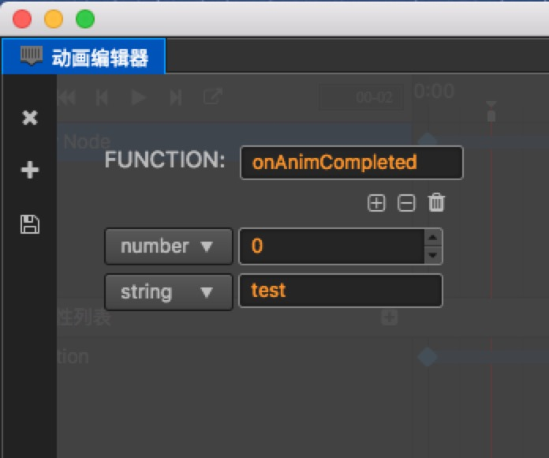

# 使用脚本控制动画

## Animation 组件

Animation 组件提供了一些常用的动画控制函数，如果只是需要简单的控制动画，可以通过获取节点的 Animation 组件来做一些操作。

### 播放动画

```javascript
var anim = this.getComponent(cc.Animation);

// 如果没有指定播放哪个动画，并且有设置 defaultClip 的话，则会播放 defaultClip 动画
anim.play();

// 指定播放 test 动画
anim.play('test');

// 指定从 1s 开始播放 test 动画
anim.play('test', 1);

// 使用 play 接口播放一个动画时，如果还有其他的动画正在播放，则会先停止其他动画
anim.play('test2');
```

Animation 对一个动画进行播放的时候会判断这个动画之前的播放状态来进行下一步操作。如果动画处于：
- **停止** 状态，则 Animation 会直接重新播放这个动画
- **暂停** 状态，则 Animation 会恢复动画的播放，并从当前时间继续播放下去
- **播放** 状态，则 Animation 会先停止这个动画，再重新播放动画

```javascript
var anim = this.getComponent(cc.Animation);

// 播放第一个动画
anim.playAdditive('position-anim');

// 播放第二个动画
// 使用 playAdditive 播放动画时，不会停止其他动画的播放。如果还有其他动画正在播放，则同时会有多个动画进行播放
anim.playAdditive('rotation-anim');
```

Animation 是支持同时播放多个动画的，播放不同的动画并不会影响其他的动画的播放状态，这对于做一些复合动画比较有帮助。

### 暂停、恢复、停止动画

```javascript
var anim = this.getComponent(cc.Animation);

anim.play('test');

// 指定暂停 test 动画
anim.pause('test');

// 暂停所有动画
anim.pause();

// 指定恢复 test 动画
anim.resume('test');

// 恢复所有动画
anim.resume();

// 指定停止 test 动画
anim.stop('test');

// 停止所有动画
anim.stop();
```

**暂停**、**恢复**、**停止** 几个函数的调用比较接近。

**暂停** 会暂时停止动画的播放，当 **恢复** 动画的时候，动画会继续从当前时间往下播放。<br>
而 **停止** 则会终止动画的播放，再次播放这个动画时会重新播放动画。

### 设置动画的当前时间

```javascript
var anim = this.getComponent(cc.Animation);

anim.play('test');

// 设置 test 动画的当前播放时间为 1s
anim.setCurrentTime(1, 'test');

// 设置所有动画的当前播放时间为 1s
anim.setCurrentTime(1);
```

你可以在任何时候对动画设置当前时间，但是动画不会立刻根据设置的时间进行状态的更改，需要在下一个动画的 **update** 中才会根据这个时间重新计算播放状态。

## AnimationState

**Animation** 只提供了一些简单的控制函数，希望得到更多的动画信息和控制的话，需要使用到 **AnimationState**。

### AnimationState 是什么？

如果说 **AnimationClip** 是作为动画数据的承载，那么 **AnimationState** 则是 **AnimationClip** 在运行时的实例，它将动画数据解析为方便程序中做计算的数值。<br>
**Animation** 在播放一个 **AnimationClip** 的时候，会将 **AnimationClip** 解析成 **AnimationState**。<br>
**Animation** 的播放状态实际都是由 **AnimationState** 来计算的，包括动画是否循环、怎么循环、播放速度等。

### 获取 AnimationState

```javascript
var anim = this.getComponent(cc.Animation);
// play 会返回关联的 AnimationState
var animState = anim.play('test');

// 或者直接获取
var animState = anim.getAnimationState('test');
```

### 获取动画信息

```javascript
var anim = this.getComponent(cc.Animation);
var animState = anim.play('test');

// 获取动画关联的 clip
var clip = animState.clip;

// 获取动画的名字
var name = animState.name;

// 获取动画的播放速度
var speed = animState.speed;

// 获取动画的播放总时长
var duration = animState.duration;

// 获取动画的播放时间
var time = animState.time;

// 获取动画的重复次数
var repeatCount = animState.repeatCount;

// 获取动画的循环模式
var wrapMode = animState.wrapMode

// 获取动画是否正在播放
var playing = animState.isPlaying;

// 获取动画是否已经暂停
var paused = animState.isPaused;

// 获取动画的帧率
var frameRate = animState.frameRate;
```

从 **AnimationState** 中可以获取到所有动画的信息，你可以利用这些信息来判断需要做哪些事情。

### 设置动画播放速度

```javascript
var anim = this.getComponent(cc.Animation);
var animState = anim.play('test');

// 使动画播放速度加速
animState.speed = 2;

// 使动画播放速度减速
animState.speed = 0.5;
```

**speed** 值越大速度越快，值越小则速度越慢

### 设置动画的循环模式与循环次数

```javascript
var anim = this.getComponent(cc.Animation);
var animState = anim.play('test');

// 设置循环模式为 Normal
animState.wrapMode = cc.WrapMode.Normal;

// 设置循环模式为 Loop
animState.wrapMode = cc.WrapMode.Loop;

// 设置动画循环次数为 2 次
animState.repeatCount = 2;

// 设置动画循环次数为无限次
animState.repeatCount = Infinity;
```

**AnimationState** 允许动态设置循环模式，目前提供了多种循环模式，这些循环模式可以从 **cc.WrapMode** 中获取到。

如果动画的 **WrapMode** 为 **Loop** 的话，需要与 **repeatCount** 配合使用才能达到效果。默认在解析动画剪辑的时候，如果动画循环类型为：
- **Loop** 类型，**repeatCount** 将被设置为 **Infinity**，即无限循环。
- **Normal** 类型，**repeatCount** 将被设置为 1。

## 动画事件

动画编辑器支持可视化编辑帧事件（如何编辑请参考 [这里](animation-event.md)），在脚本里书写动画事件的回调非常简单。动画事件的回调其实就是一个普通的函数，在动画编辑器里添加的帧事件会映射到动画根节点的组件上。

### 实例

假设在动画的结尾添加了一个帧事件，如下图：



那么在脚本中可以这么写：

```javascript
cc.Class({
    extends: cc.Component,

    onAnimCompleted: function (num, string) {
        console.log('onAnimCompleted: param1[%s], param2[%s]', num, string);
    }
});
```

将上面的组件加到动画的 **根节点** 上，当动画播放到结尾时，动画系统会自动调用脚本中的 `onAnimCompleted` 函数。动画系统会搜索动画根节点中的所有组件，如果组件中有实现动画事件中指定的函数的话，就会对它进行调用，并传入事件中填的参数。

## 注册动画回调

除了动画编辑器中的帧事件提供了回调外，动画系统还提供了动态注册回调事件的方式。目前支持的回调事件包括：
 - play：开始播放时
 - stop：停止播放时
 - pause：暂停播放时
 - resume：恢复播放时
 - lastframe：假如动画循环次数大于 1，当动画播放到最后一帧时
 - finished：动画播放完成时

当在 `cc.Animation` 注册了一个回调函数后，它会在播放一个动画时，对相应的 `cc.AnimationState` 注册这个回调，在 `cc.AnimationState` 停止播放时，对 `cc.AnimationState` 取消注册这个回调。

`cc.AnimationState` 其实才是动画回调的发送方，如果希望对单个 `cc.AnimationState` 注册回调，那么可以先获取到这个 `cc.AnimationState` 再单独对它进行注册。

### 实例

```javascript
var animation = this.node.getComponent(cc.Animation);

// 注册
animation.on('play',      this.onPlay,        this);
animation.on('stop',      this.onStop,        this);
animation.on('lastframe', this.onLastFrame,   this);
animation.on('finished',  this.onFinished,    this);
animation.on('pause',     this.onPause,       this);
animation.on('resume',    this.onResume,      this);

// 取消注册
animation.off('play',      this.onPlay,        this);
animation.off('stop',      this.onStop,        this);
animation.off('lastframe', this.onLastFrame,   this);
animation.off('finished',  this.onFinished,    this);
animation.off('pause',     this.onPause,       this);
animation.off('resume',    this.onResume,      this);

// 对单个 cc.AnimationState 注册回调
var anim1 = animation.getAnimationState('anim1');
anim1.on('lastframe',    this.onLastFrame,      this);
```

## 动态创建 Animation Clip

```javascript
var animation = this.node.getComponent(cc.Animation);
// frames 这是一个 SpriteFrame 的数组.
var clip = cc.AnimationClip.createWithSpriteFrames(frames, 17);
clip.name = "anim_run";
clip.wrapMode = cc.WrapMode.Loop;

// 添加帧事件
clip.events.push({
    frame: 1,               // 准确的时间，以秒为单位。这里表示将在动画播放到 1s 时触发事件
    func: "frameEvent",     // 回调函数名称
    params: [1, "hello"]    // 回调参数
});

animation.addClip(clip);
animation.play('anim_run');
```
