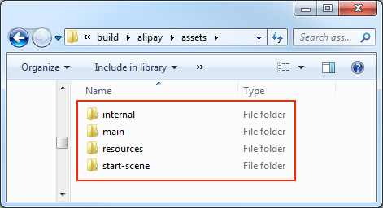
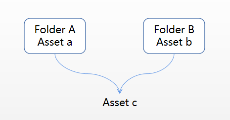
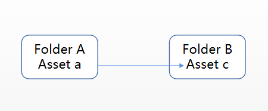

# Asset Bundle 介绍

> 文：Santy-Wang、Xunyi

从 v2.4 开始，Creator 正式支持 Asset Bundle 功能。Asset Bundle 作为资源模块化工具，允许开发者按照项目需求将贴图、脚本、场景等资源划分在多个 Asset Bundle 中，然后在游戏运行过程中，按照需求去加载不同的 Asset Bundle，以减少启动时需要加载的资源数量，从而减少首次下载和加载游戏时所需的时间。<br>
Asset Bundle 可以按需求随意放置，比如可以放在远程服务器、本地、或者小游戏平台的分包中。也可以跨项目复用，用于加载子项目中的 Asset Bundle。

## 内置 Asset Bundle

从 v2.4 开始，项目中所有的资源都会分类放在 Creator 内置的 4 个 Asset Bundle 中。与其他 Asset Bundle 一样，内置 Asset Bundle 也可以根据不同平台进行配置。



| 内置 Asset Bundle | 功能说明 | 配置 |
| :--------------- | :-- | :-------- |
| `internal`    | 存放所有内置资源以及其依赖资源 | 通过配置 **资源管理器** 中的 `internal -> resources` 文件夹 |
| `main`        | 存放所有在 **构建发布** 面板的 **参与构建场景** 中勾选的场景以及其依赖资源  | 通过配置 **构建发布** 面板的 **主包压缩类型** 和 **配置主包为远程包** 两项 |
| `resources`   | 存放 `resources` 目录下的所有资源以及其依赖资源  | 通过配置 **资源管理器** 中的 `assets -> resources` 文件夹 |
| `start-scene` | 如果在 **构建发布** 面板中勾选了 **初始场景分包**，则首场景将会被构建到 `start-scene` 中。具体内容可参考 [初始场景的资源加载](../publish/publish-wechatgame.md#%E5%88%9D%E5%A7%8B%E5%9C%BA%E6%99%AF%E7%9A%84%E5%8A%A0%E8%BD%BD%E9%80%9F%E5%BA%A6)。  | 无法进行配置 |

在构建完成后，内置 Asset Bundle 会根据配置决定它所生成的位置，具体的配置方法以及生成规则请参考 [配置 Asset Bundle](../scripting/asset-bundle.md#%E9%85%8D%E7%BD%AE%E6%96%B9%E6%B3%95)。

### 加载内置 Asset Bundle

内置 Asset Bundle 的加载有以下两种方式:

- 通过在 **构建发布** 面板配置 **资源服务器地址**
- 通过自定义构建模板功能修改 `main.js` 中的代码，如下所示：

```js
// ...

let bundleRoot = [];
// internal bundle 所在服务器地址
bundleRoot.push('http://myserver.com/assets/internal');
// 如果有 resources bundle, 则加入 resources bundle 所在服务器地址
bundleRoot.push('http://myserver.com/assets/resources');
// main bundle 所在服务器地址
bundleRoot.push('http://myserver.com/assets/main');

var count = 0;
function cb (err) {
    if (err) return console.error(err.message, err.stack);
    count++;
    if (count === bundleRoot.length + 1) {
        cc.game.run(option, onStart);
    }
}

cc.assetManager.loadScript(settings.jsList.map(function (x) { return 'src/' + x;}), cb);

for (let i = 0; i < bundleRoot.length; i++) {
    cc.assetManager.loadBundle(bundleRoot[i], cb);
}

```

## 优先级

当文件夹设置为 Asset Bundle 之后，会将文件夹中的资源以及文件夹外的相关依赖资源都合并到同一个 Asset Bundle 中。这样就有可能出现某个资源虽然不在 Asset Bundle 文件夹中，但因为同时被两个 Asset Bundle 所依赖，所以属于两个 Asset Bundle 的情况，如图所示：

 

另一种情况是某个资源在一个 Asset Bundle 文件夹中，但同时又被其他 Asset Bundle 所依赖，如图所示：



在这两种情况下，资源 c 既属于 Asset Bundle A，也属于 Asset Bundle B。那资源 c 究竟存在于哪一个 Asset Bundle 中呢？此时就需要通过调整 Asset Bundle 的优先级来指定了。<br>
Creator 开放了 10 个可供配置的优先级，编辑器在构建时将会按照优先级 **从大到小** 的顺序对 Asset Bundle 依次进行构建。

- 当同个资源被 **不同优先级** 的多个 Asset Bundle 引用时，资源会优先放在优先级高的 Asset Bundle 中，低优先级的 Asset Bundle 只会存储一条记录信息。此时低优先级的 Asset Bundle 会依赖高优先级的 Asset Bundle。<br>
如果你想在低优先级的 Asset Bundle 中加载此共享资源，必须在加载低优先级的 Asset Bundle **之前** 先加载高优先级的 Asset Bundle。
- 当同个资源被 **相同优先级** 的多个 Asset Bundle 引用时，资源会在每个 Asset Bundle 中都复制一份。此时不同的 Asset Bundle 之间没有依赖关系，可按任意顺序加载。所以请尽量确保共享的资源（例如 `Texture`、`SpriteFrame`、`Audio` 等）所在的 Asset Bundle 优先级更高，以便让更多低优先级的 Asset Bundle 共享资源，从而最小化包体。

四个内置 Asset Bundle 文件夹的优先级分别为：

| Asset Bundle | 优先级 |
| :--- | --- |
| `internal`    | 11 |
| `main`        | 7  |
| `resources`   | 8  |
| `start-scene` | 9  |

当四个内置 Asset Bundle 中有相同资源时，资源会优先存储在优先级高的 Asset Bundle — `internal` 文件夹中。建议其他自定义的 Asset Bundle 优先级 **不要高于** 内置的 Asset Bundle，以便尽可能共享内置 Asset Bundle 中的资源。

## 压缩类型

Creator 目前提供了 **默认**、**无压缩**、**合并所有 JSON**、**小游戏分包**、**Zip** 这几种压缩类型用于优化 Asset Bundle。所有 Asset Bundle 默认使用 **默认** 压缩类型，开发者可重新设置包括内置 Asset Bundle 在内的所有 Asset Bundle 的压缩类型。

| 压缩类型 | 功能说明 |
| :------ | ------ |
| **默认**         | 构建 Asset Bundle 时会将相互依赖的资源的 JSON 文件合并在一起，从而减少运行时的加载请求次数  |
| **无压缩**        | 构建 Asset Bundle 时没有任何压缩操作 |
| **合并所有 JSON** | 构建 Asset Bundle 时会将所有资源的 JSON 文件合并为一个，从而最大化减少请求数量，但可能会增加单个资源的加载时间  |
| **小游戏分包**     | 在提供了分包功能的小游戏平台，会将 Asset Bundle 设置为对应平台上的分包。具体内容请参考 [小游戏分包](../publish/subpackage.md)  |
| **Zip**          | 在部分小游戏平台，构建 Asset Bundle 时会将资源文件压缩成一个 Zip 文件，从而减少运行时的加载请求数量  |

如果开发者在不同平台对 Asset Bundle 设置了不同的压缩类型，那么在构建时将根据对应平台的设置来构建 Asset Bundle。

如果开发者在旧项目中使用了分包功能，也就是在 **属性检查器** 中勾选了 **配置为子包** 选项，那么当项目升级到 v2.4 之后，将自动转变为 Asset Bundle，并将 Asset Bundle 的压缩类型在支持的平台上设置为 **小游戏分包**。

## Asset Bundle 的构造

在构建时，配置为 Asset Bundle 的文件夹中的所有 **代码** 和 **资源**，会进行以下处理：

- **代码**：文件夹中的所有代码会根据发布平台合并成一个 `index.js` 或 `game.js` 的入口脚本文件，并从主包中剔除。
- **资源**：文件夹中的所有资源以及文件夹外的相关依赖资源都会放到 `import` 或 `native` 目录下。
- **资源配置**：所有资源的配置信息包括路径、类型、版本信息都会被合并成一个 `config.json` 文件。

构建后生成的 Asset Bundle 目录结构如下图所示：


### Asset Bundle 中的脚本

Asset Bundle 支持脚本分包。如果开发者的 Asset Bundle 中包含脚本文件，则所有脚本会被合并为一个 js 文件，并从主包中剔除。在加载 Asset Bundle 时，就会去加载这个 js 文件。

**注意**：
1. 有些平台不允许加载远程的脚本文件，例如微信小游戏，在这些平台上，Creator 会将 Asset Bundle 的代码拷贝到 `src/scripts` 目录下，从而保证正常加载。
2. 不同 Asset Bundle 中的脚本建议最好不要互相引用，否则可能会导致在运行时找不到对应脚本。如果需要引用某些类或变量，可以将该类和变量暴露在一个你自己的全局命名空间中，从而实现共享。

## FAQ
  
- **Q**：Asset Bundle 与 v2.4 之前的资源分包有什么区别？<br>
  **A**：
  1. 资源分包实际上是将一些图片和网格拆分出去单独放在一个包内，但这个包是不完整的、无逻辑的，无法复用。<br>
  Asset Bundle 是通过逻辑划分对资源进行模块化。Asset Bundle 中包含资源、脚本、元数据和资源清单，所以 Asset Bundle 是完整的、有逻辑的、可复用的，我们可以从 Asset Bundle 中加载出整个场景或其他任何资源。Asset Bundle 通过拆分，可以极大减少首包中的 json 数量以及 `settings.js` 的大小。

  2. 资源分包本质上是由小游戏平台控制的一项基础功能。例如微信小游戏支持分包功能，Creator 就在此基础上做了一层封装，帮助开发者设置资源分包，如果微信小游戏不支持分包功能了，则 Creator 也不支持。<br>
  Asset Bundle 则完全由 Creator 设计实现，是一个帮助开发者对资源进行划分的模块化工具，与游戏平台无关，理论上可支持所有平台。

  3. 资源分包与平台相关，意味着需要按照平台要求的方式设置，比如微信小游戏的分包无法放在远程服务器上，只能放在腾讯的服务器上。<br>
  而 Asset Bundle 不受这些限制，Asset Bundle 可以放在本地、远程服务器，甚至就放在微信小游戏的分包中。

- **Q**：Asset Bundle 是否支持大厅加子游戏的模式？<br>
  **A**：支持，子游戏的场景可以放在 Asset Bundle 中，在需要时加载，子游戏甚至可以在其它项目中预先以 Asset Bundle 的形式构建出来，然后在主项目中加载使用。

- **Q**：Asset Bundle 可以减少 `settings.js` 的大小吗？<br>
  **A**：当然可以。实际上从 v2.4 开始，打包后的项目完全是基于 Asset Bundle 的，`setting.js` 不再存储跟资源相关的任何配置信息，所有的配置信息都会存储在每个 Asset Bundle 的 `config.json` 中。每一个 `config.json` 只存储各自 Asset Bundle 中的资源信息，也就减小了首包的包体。可以简单地理解为所有的 `config.json` 加起来等于之前的 `settings.js`。

- **Q**：Asset Bundle 支持跨项目复用吗？<br>
  **A**：当然支持，不过需要满足以下条件：
  1. 引擎版本相同。
  2. Asset Bundle 中引用到的所有脚本都要放在 Asset bundle 下。
  3. Asset Bundle 没有其他外部依赖 bundle，如果有的话，必须加载。

- **Q**：Asset Bundle 支持分离首场景吗？<br>
  **A**：目前仅支持小游戏平台。你可以在 **构建发布** 面板中勾选 **初始场景分包**，则首场景会被放到内置 Asset Bundle 的 `start-scene` 中，从而实现分离首场景。

- **Q**：Asset Bundle 支持嵌套设置吗？比如 A 文件夹中有 B 文件夹，A 和 B 都可以设置为 Asset Bundle？<br>
  **A**：Asset Bundle 不支持嵌套。

更多关于 Asset Bundle 的配置方法、加载、获取等内容，可参考文档 [加载 Asset Bundle](../scripting/asset-bundle.md)。
