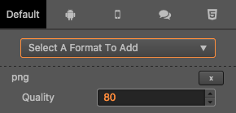
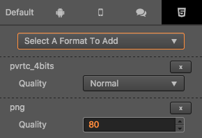

# 压缩纹理

Cocos Creator 支持导入多种格式的图片（比如 JPG，PNG，WEBP等），但是在实际游戏运行中，我们可能不会希望使用原始图片作为资源来加载。比如在手机平台上可能只需要原图 80% 或更少的画质，又或者是没有透明通道的图片可以转成 JPG 格式，这样可以减少很大一部分图片的存储空间。

默认情况下 Cocos Creator 在构建的时候是输出原始图片的，如果在构建时希望对某一张图片进行压缩，可以在资源管理器中选中这张图片，然后在属性管理器中对纹理格式进行编辑。

Cocos Creator 会在构建图片的时候查找当前图片是否进行了压缩纹理的配置，如果没有则继续查找是否做了默认（Default）的配置，如果没有则最后按原图输出，

如果查找到了压缩纹理的配置，那么会按找到的配置进行纹理压缩，在一个平台中你可以指定多种纹理格式，每种纹理格式在构建时都会根据原图压缩生成一张指定格式的图片。

这些生成的图片不会都被加载到引擎，引擎会根据 [cc.macro.SUPPORT_TEXTURE_FORMATS](https://github.com/cocos-creator/engine/blob/master/cocos2d/core/platform/CCMacro.js#L359) 中的配置来选择合适的格式进行加载。`cc.macro.SUPPORT_TEXTURE_FORMATS` 列举了当前平台支持的所有图片格式，引擎加载图片时会从生成的图片中找到在这个列表中`优先级靠前`（即排列靠前）的格式来加载。

## 示例

在上面的示例中，这张图片在默认平台中添加了 png，jpg 格式的配置，在 web 平台中添加了 webp 格式的配置，其他平台都没有添加配置。

那么只有在构建 web 平台的时候这张图片才会被压缩成 webp 格式，在构建其他平台的时候则会生成 png，jpg 两种格式的图片。
