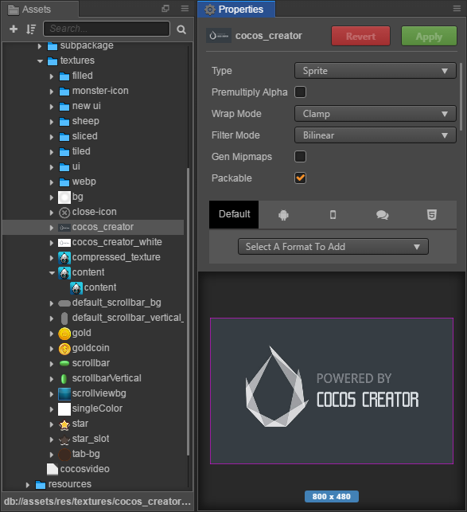
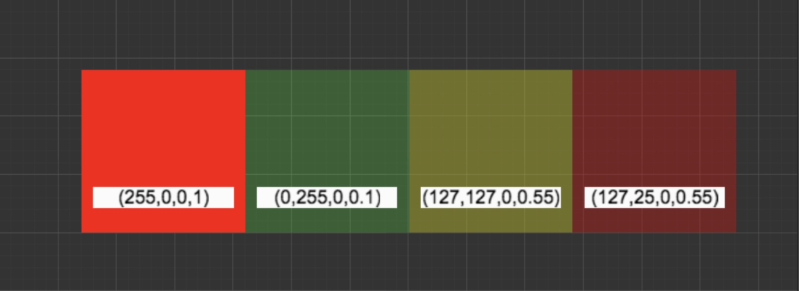

# 图像资源（Texture）

图像资源又经常被称作贴图、图片，是游戏中绝大部分图像渲染的数据源。图像资源一般由图像处理软件（比如 Photoshop，Windows 上自带的画图）制作而成并输出成 Cocos Creator 可以使用的文件格式，目前包括 **JPG** 和 **PNG** 两种。

## 导入图像资源

使用默认的资源导入方式就可以将图像资源导入到项目中，之后我们就可以在 **资源管理器** 中看到如下图所示的图像资源。

图像资源在 **资源管理器** 中会以自身图片的缩略图作为图标。在 **资源管理器** 中选中图像资源后，**属性检查器** 下方会显示该图片的缩略图。

## Texture 属性

| 属性 | 功能说明 |
| --- | --- |
| Type | 包括 Raw 和 Sprite 两种模式。**Raw** 模式表示只会生成贴图资源，**Sprite** 模式表示还会生成 SpriteFrame 子资源。|
| Premultiply Alpha | 是否开启 Alpha 预乘，勾选之后会将 RGB 通道预先乘以 Alpha 通道。 |
| Wrap Mode | 寻址模式，包括 **Clamp（钳位）**、**Repeat（重复）** 两种寻址模式 |
| Filter Mode | 过滤方式，包括 **Point（邻近点采样）**、**Bilinear（双线性过滤）**、**Trilinear（三线性过滤）** 三种过滤方式。     |
| genMipmaps  | 是否开启自动生成 mipmap  |
| packable    | 是否允许贴图参与合图      |

## Premultiply Alpha

Texture 的 Premultiply Alpha 属性勾选与否表示是否开启 Alpha 预乘，两种状态分别表示：

- **Premultiply Alpha（预乘 Alpha）**：表示 RGB 在存储的时候预先将 Alpha 通道与 RGB 相乘，比如透明度为 50% 的红色，RGB 为（255, 0, 0），预乘之后存储的颜色值为（127，0，0，0.5）。
- **Non-Premultiply Alpha（非预乘 Alpha）**：表示 RGB 不会预先与 Alpha 通道相乘，那么上面所述的透明度为 50% 的红色，存储的颜色值则为（255，0，0，0.5）。

那什么情况下需要使用 Premultiply Alpha？在图形渲染中透明图像通过 Alpha Blending 进行颜色混合，一般的颜色混合计算公式为：

**结果颜色 =（源颜色值 \* 源 alpha 值）+ 目标颜色值 \* (1 - 源 alpha 值)**

`result = source.RGB * source.A + dest.RGB * (1 - source.A);`

即颜色混合函数的设置为 `gl.blendFunc(gl.SRC_ALPHA, gl.ONE_MINUS_SRC_ALPHA)`。

当使用 Alpha 预乘之后，上述计算方式则简化为：

**结果颜色 = 源颜色值 + 目标颜色值 * (1 - 源 alpha 值)**

`result = source.RGB + dest.RGB * (1 - source.A);`

对应的颜色混合函数设置为 `gl.blendFunc(gl.ONE, gl.ONE_MINUS_SRC_ALPHA)`。

但是使用 Alpha 预乘并不仅仅是为了简化上述计算提高效率，还是因为 Non-Premultiply Alpha 的纹理图像不能正确的进行线性插值计算。

假设有两个相邻顶点的颜色，一个是顶点颜色为透明度 100% 的红色（255，0，0，1.0），另一个是顶点颜色为透明度 10% 的绿色（0，255，0，0.1），那么当图像缩放时这两个顶点之间的颜色就是对它们进行线性插值的结果。如果是 Non-Premultiply Alpha ，那么结果为：

`(255, 0, 0, 1.0) * 0.5 + (0, 255, 0, 0.1) * (1 - 0.5) = (127, 127, 0, 0.55)`

如果使用了 Premultiply Alpha ，绿色存储的颜色值变为（0，25，0，0.1），再与红色进行线性插值的结果为：

`(255, 0, 0, 1.0）* 0.5 +（0, 25, 0, 0.1）*（1 - 0.5）=（127, 12, 0, 0.55）`

对应的颜色值表现为：

观察上图之后可以看出，使用 Non-Premultiply Alpha 的颜色值进行插值之后的颜色偏绿，透明度为 10% 的绿色占的权重更多，透明度为100% 的红色占比反而更少，而使用 Premultiply Alpha 得到的插值结果才是正确并且符合预期的。因此，实际项目中可以根据图像的具体使用场景进行合适的选择。

## 寻址模式

一般来说，纹理坐标 UV 的取值范围为 \[0，1\] ，当传递的顶点数据中的纹理坐标取值超出 \[0，1\] 的范围时，就可以通过不同的寻址模式来控制超出范围的纹理坐标如何进行纹理映射，目前 Texture 提供两种寻址模式：

- **钳位寻址模式（Clamp）**

  将纹理坐标截取在 0 到 1 之间，只复制一遍 \[0，1\] 的纹理坐标。对于 \[0，1\] 之外的内容，将使用边缘的纹理坐标内容进行延伸。

- **重复寻址模式（Repeat）**

  对于超出 \[0，1\] 范围的纹理坐标，使用 \[0，1\] 的纹理坐标内容进行不断重复。

## 过滤方式

当 Texture 的原始大小与屏幕映射的纹理图像尺寸不一致时，通过不同的纹理过滤方式进行纹理单元到像素的映射会产生不同的效果。Texture 有三种过滤方式：

- **邻近点采样（Point）**

  使用中心位置距离采样点最近的纹理单元颜色值作为该采样点的颜色值，不考虑其他相邻像素的影响。优点是算法简单，计算量较小。缺点是当图像放大之后重新采样的颜色值不连续，会有明显的马赛克和锯齿。

- **双线性过滤（Bilinear）**

  使用距离采样点最近的 **2 x 2** 的纹理单元矩阵进行采样，取四个纹理单元颜色值的平均值作为采样点的颜色，像素之间的颜色值过渡更加平滑，但是计算量相比邻近点采样也稍大。

- **三线性过滤（Trilinear）**

  基于双线性过滤，对像素大小与纹理单元大小最接近的两层 Mipmap Level 分别进行双线性过滤，然后再对得到的结果进行线性插值计算采样点的颜色值。最终的采样结果相比邻近点采样和双线性过滤是最好的，但是计算量也最大。

  **注意**：当前引擎版本中三线性过滤与双线性过滤效果一致。

## genMipmaps

为了加快 3D 场景渲染速度和减少图像锯齿，贴图被处理成由一系列被预先计算和优化过的图片组成的序列，这样的贴图被称为 mipmap。mipmap 中每一个层级的小图都是原图的一个特定比例的缩小细节的复制品，当贴图被缩小或者只需要从远距离观看时，mipmap就会转换到适当的层级。

当贴图过滤方式设置为三线性过滤（trilinear filtering）时，会在两个相近的层级之间插值。因为渲染远距离物体时，mipmap 贴图比原图小，提高了显卡采样过程中的缓存命中率，所以渲染的速度得到了提升。同时因为 mipmap 的小图精度较低，从而减少了摩尔纹现象，可以减少画面上的锯齿。另外因为额外生成了一些小图，所以 mipmap 需要额外占用约三分之一的内存空间。

## packable

如果引擎开启了 [动态合图](../advanced-topics/dynamic-atlas.md) 功能，动态合图会自动将合适的贴图在开始场景时动态合并到一张大图上来减少 drawcall。但是将贴图合并到大图中会修改原始贴图的 uv 坐标，如果在自定义 effect 中使用了贴图的 uv 坐标，这时 effect 中的 uv 计算将会出错，需要将贴图的 packable 属性设置为 **false** 来避免贴图被打包到动态合图中。

## Texture 和 SpriteFrame 资源类型

在 **资源管理器** 中，图像资源的左边会显示一个和文件夹类似的三角图标，点击就可以展开看到它的子资源（sub asset），每个图像资源导入后编辑器会自动在它下面创建同名的 SpriteFrame 资源。

SpriteFrame 是核心渲染组件 **Sprite** 所使用的资源，设置或替换 **Sprite** 组件中的 `spriteFrame` 属性，就可以切换显示的图像。**Sprite** 组件的设置方式请参考 [Sprite 组件参考](../components/sprite.md)。

为什么会有 SpriteFrame 这种资源？Texture 是保存在 GPU 缓冲中的一张纹理，是原始的图像资源。而 SpriteFrame 包含两部分内容：记录了 Texture 及其相关属性的 Texture2D 对象和纹理的矩形区域，对于相同的 Texture 可以进行不同的纹理矩形区域设置，然后根据 Sprite 的填充类型，如 SIMPLE、SLICED、TILED 等进行不同的顶点数据填充，从而满足 Texture 填充图像精灵的多样化需求。而 SpriteFrame 记录的纹理矩形区域数据又可以在资源的属性检查器中根据需求自由定义，这样的设置让资源的开发更为高效和便利。除了每个文件会产生一个 SpriteFrame 的图像资源（Texture）之外，我们还有包含多个 SpriteFrame 的图集资源（Atlas）类型。参考 [图集资源（Atlas）文档](atlas.md) 来了解更多信息。

下面是 Texture 和 SpriteFrame 的 API 接口文档：

- [Texture 资源类型](../../../api/zh/classes/Texture2D.html)
- [SpriteFrame 资源类型](../../../api/zh/classes/SpriteFrame.html)

## 使用 SpriteFrame

直接将 SpriteFrame 或图像资源从 **资源管理器** 中拖拽到 **层级管理器** 或 **场景编辑器** 中，就可以直接用所选的图像在场景中创建 **Sprite** 节点。

之后可以拖拽其他的 SpriteFrame 或图像资源到该 **Sprite** 组件的 `Sprite Frame` 属性栏中，来切换该 Sprite 显示的图像。

在 **动画编辑器** 中也可以拖拽 SpriteFrame 资源到已创建好的 Sprite Frame 动画轨道上，详见 [编辑序列帧动画](../animation/sprite-animation.md) 文档。

### 图片黑边问题

当图片资源导入到编辑器中时，默认使用的过滤方式（Filter Mode）为线性插值（Bilinear）。而对于 Sprite 组件，默认的 SrcBlendFactor 为 SRC_ALPHA。在这种条件下，对于有半透明像素的 PNG 图片，在编辑器及预览时半透明边缘通常会有黑边问题。原因是因为低分辨率的图片在显示到更高分辨率的显示设备上时，会进行上采样（upsampling），也就是图像插值（interpolating）。在做像素插值时，半透明边缘与透明像素（0，0，0，0）插值之后会产生低透明度的黑色像素。避免图片的黑边问题通常有如下几种方式：

1. 过滤方式（Filter Mode）使用 Point 模式。（推荐使用, 需要能够接受该模式带来的锯齿问题）
2. 当图片在 PS 等工具中制作时，增加背景图层，图层颜色设置成与半透明边缘相同的颜色，然后设置背景图层的透明度为很低的值，如 **1/100**。（推荐使用）
3. 在图片导出时，设置为较高的分辨率，避免显示到设备时进行图像插值放大。（不推荐使用）
4. 引擎的自动图集提供了扩边选项，勾选该选项时，编辑器会自动对半透明图片边缘进行扩边处理，以此来避免黑边问题。需要注意的是，自动图集只有构建之后才会生效，在编辑器及预览时不会生效。其他图集打包工具一般也会有类似的处理选项（推荐使用）
5. 设置 Sprite 的 SrcBlendFactor 为 ONE，对图片进行预乘处理，但是可能会影响到图片的批次合并，需要开发者视使用场景决定。（需要同步勾选图片的 Premultiply Alpha 选项）

### 性能优化注意事项

使用单独存在的 Texture 作为 Sprite 资源，在预览和发布游戏时，将无法对这些 Sprite 进行批量渲染优化的操作。目前编辑器不支持转换原有的单张 Texture 引用到 Atlas 里的 SpriteFrame 引用，所以在开发正式项目时，应该尽早把需要使用的图片合成 Atlas（图集），并通过 Atlas 里的 SpriteFrame 引用来使用。

另外，引擎中的 `cc.macro.CLEANUP_IMAGE_CACHE` 字段表示是否将贴图上传至 GPU 之后删除 DOM Image 缓存。具体来说，我们通过设置 image.src 为空字符串来释放这部分内存。正常情况下，可以不需要开启这个选项，因为在 web 平台，Image 对象所占用的内存很小。但是在微信小游戏平台的当前版本，Image 对象会缓存解码后的图片数据，它所占用的内存空间很大。所以我们在微信小游戏平台默认开启了这个选项，在上传 GL 贴图之后立即释放 Image 对象的内存，避免过高的内存占用。
