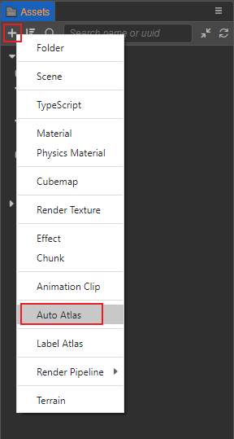

# 自动图集资源 (Auto Atlas)

**自动图集** 作为 Cocos Creator 自带的合图功能，可以将指定的一系列碎图打包成一张大图，具体作用和 Texture Packer 的功能很相近。

## 创建自动图集资源

在 **资源管理器** 中点击左上角的 **+** 创建按钮，然后选择 **自动图集配置**，即可在 **资源管理器** 中新建一个 **auto-atlas.pac** 资源。

**自动图集资源** 目前是以当前文件夹下的所有 **SpriteFrame** 作为碎图资源，然后在构建过程中将其打包成一个大的 **Sprite Atlas**，之后我们会增加其他的选择碎图资源的方式。如果碎图资源 **SpriteFrame** 有配置过，那么打包后重新生成的 **SpriteFrame** 将会保留这些配置。

## 配置自动图集资源

在 **资源管理器** 中选中一个 **自动图集资源** 后，**属性检查器** 面板将会显示 **自动图集资源** 的所有可配置项。

| 属性 |   功能说明
| :-------------- | :----------- |
| Max Width | 单张图集最大宽度
| Max Height | 单张图集最大高度
| Padding | 图集中碎图之间的间距
| Allow Rotation | 是否允许旋转碎图
| Force Squared | 是否强制将图集长宽大小设置成正方形
| Power of Two | 是否将图集长宽大小设置为二次方倍数
| Algorithm | 算法，图集打包策略，目前暂时只有一个选项 `MaxRects`
| Padding Bleed | 扩边，在碎图的边框外扩展出一像素外框，并复制相邻碎图像素到外框中。该功能也称作 **Extrude**
| Filter Unused Resources| 剔除未使用的图片，即构建时不包含未被引用的资源，默认勾选。仅在构建后生效
| Remove unused texture force in Bundle | 剔除在 Bundle 内未被使用的 Texture2D 资源，仅在构建后生效
| Remove unused image force in Bundle | 剔除在 Bundle 内未被使用的 image 资源，仅在构建后生效
| Remove unused sprite atlas in Bundle | 剔除在 Bundle 内未被使用的图集序列化信息，仅在构建后生效
| UseCompressTexture | 是否使用压缩纹理，详情请参考 [压缩纹理](compress-texture.md)。

其余属性与 Texture 是一样的，详情请参考 [纹理贴图](./texture.md#%E5%AD%90%E8%B5%84%E6%BA%90-texture2d-%E7%9A%84%E5%B1%9E%E6%80%A7%E9%9D%A2%E6%9D%BF)。

配置完成后可以点击 **预览** 按钮来预览打包的结果，按照当前自动图集配置生成的相关结果将会展示在 **属性检查器** 下面的区域。

> **注意**：每次配置完成后，需要重新点击 **预览** 才会重新生成预览图。

结果分为：

- Packed Textures：显示打包后的图集图片以及图片相关的信息，如果会生成的图片有多张，则会往下在 **属性检查器** 中列出来。
- Unpacked Textures：显示不能打包进图集的碎图资源，造成的原因有可能是这些碎图资源的大小比图集资源的大小还大导致的，这时候可能需要调整下图集的配置或者碎图的大小了。

## 生成图集

预览项目或者在 Cocos Creator 中使用碎图的时候都是直接使用的碎图资源，在 **构建项目** 这一步才会真正生成图集到项目中。正常情况下，生成图集资源后，会删除包体内原有的小图的 texture 和 image 图片资源，以下两种特殊情况会有特殊处理：

1. 当图集资源在 **Bundle** 目录下，除了正常生成图集资源以外，也会同时生成原始 spriteFrame 生成的 texture 以及 image 资源，如果对图集的资源有明确的使用范围 **请勾选对应的剔除选项以免造成包体过大**。

2. 当图集资源文件夹内任意 spriteFrame 依赖的 texture 被其他资源直接使用（例如被直接作为纹理贴图使用），被依赖的 texture 及其 image 资源将会被一同打包出来。

以上两种情况事实上都会增大包体，构建将会警告提示，如非必须，请不要这样使用。
