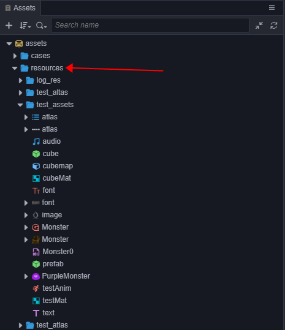
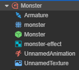

# 加载资源

## 动态加载 resources

通常我们会把项目中需要动态加载的资源放在 `resources` 目录下，配合 `resources.load` 等接口动态加载。你只要传入相对 resources 的路径即可，并且路径的结尾处 **不能** 包含文件扩展名。

```typescript
// 加载 Prefab
resources.load("test assets/prefab", Prefab, (err, prefab) => {
    const newNode = instantiate(prefab);
    this.node.addChild(newNode);
});

// 加载 AnimationClip
resources.load("test assets/anim", AnimationClip, (err, clip) => {
    this.node.getComponent(Animation).addClip(clip, "anim");
});
```

- 所有需要通过脚本动态加载的资源，都必须放置在 `resources` 文件夹或它的子文件夹下。`resources` 文件夹需要在 **assets 根目录** 下手动创建。如下所示：

  

  > **resources** 文件夹中的资源，可以引用文件夹外部的其它资源，同样也可以被外部场景或资源所引用。项目构建时，除了在 **构建发布** 面板中勾选的场景外，**resources** 文件夹中的所有资源，包括它们关联依赖的 **resources** 文件夹外部的资源，都会被导出。
  >
  > 如果一份资源仅仅是被 **resources** 中的其它资源所依赖，而不需要直接被 `resources.load` 调用，那么 **请不要** 放在 resources 文件夹中。否则会增大 `config.json` 的大小，并且项目中无用的资源，将无法在构建的过程中自动剔除。同时在构建过程中，JSON 的自动合并策略也将受到影响，无法尽可能合并零碎的 JSON。

  **注意**：从 v2.4 开始，`loader` 等接口不再建议使用，请使用最新的 `assetManager` 相关接口，升级文档请参考 [资源加载升级指南](asset-manager-upgrade-guide.md)。

### 加载 SpriteFrame 或 Texture2D

图片设置为 sprite-frame 或 texture 或其他图片类型后，将会在 **资源管理器** 中生成一个对应类型的资源。但如果直接加载 `test assets/image`，得到的类型将会是 `ImageAsset`。你必须指定路径到具体的子资源，才能加载到图片生成的 `SpriteFrame`：

```typescript
// 加载 SpriteFrame，image 是 ImageAsset，spriteFrame 是 image/spriteFrame，  texture 是 image/texture
resources.load("test assets/image/spriteFrame", SpriteFrame, (err, spriteFrame) => {
    this.node.getComponent(Sprite).spriteFrame = spriteFrame;
});
```

```typescript
// 加载 texture
resources.load("test assets/image/texture", Texture2D, (err: any, texture: Texture2D) => {
    const spriteFrame = new SpriteFrame();
    spriteFrame.texture = texture;
    this.node.getComponent(Sprite).spriteFrame = spriteFrame;
});
```

> 如果指定了类型参数，就会在路径下查找指定类型的资源。当你在同一个路径下同时包含了多个重名资源（例如同时包含 player.clip 和 player.psd）就需要声明类型。当你需要获取 “子资源”（例如获取 ImageAsset 的子资源 SpriteFrame），就需要指定子资源的路径。

### 加载图集中的 SpriteFrame

对从 TexturePacker 等第三方工具导入的图集而言，如果要加载其中的 SpriteFrame，则只能先加载图集，再获取其中的 SpriteFrame。这是一种特殊情况。

```typescript
// 加载 SpriteAtlas（图集），并且获取其中的一个 SpriteFrame
// 注意 atlas 资源文件（plist）通常会和一个同名的图片文件（png）放在一个目录下, 所以需要在第二个参数指定资源类型
resources.load("test assets/sheep", SpriteAtlas, (err, atlas) => {
    const frame = atlas.getSpriteFrame('sheep_down_0');
    sprite.spriteFrame = frame;
});
```

### 加载 FBX 或 glTF 模型中的资源

在将 FBX 模型或 glTF 模型导入编辑器后，会解析出该模型中包含的相关资源如网格，材质，骨骼，动画等，如下图所示：



你可以在运行时动态加载模型中的单一资源，只需指定到某个具体子资源的路径即可，如下所示：

```typescript
// 加载模型中的网格资源
resources.load("Monster/monster", Mesh, (err, mesh) => {
    this.node.getComponent(MeshRenderer).mesh = mesh;
});

// 加载模型中的材质资源
resources.load("Monster/monster-effect", Material, (err, material) => {
    this.node.getComponent(MeshRenderer).material = material;
});

// 加载模型中的骨骼
resources.load("Monster/Armature", Skeleton, (err, skeleton) => {
    this.node.getComponent(SkinnedMeshRenderer).skeleton = skeleton;
});
```

### 资源批量加载

`resources.loadDir` 可以加载相同路径下的多个资源：

```typescript
// 加载 test assets 目录下所有资源
resources.loadDir("test assets", function (err, assets) {
    // ...
});

// 加载 test assets 目录下所有 SpriteFrame，并且获取它们的路径
resources.loadDir("test assets", SpriteFrame, function (err, assets) {
    // ...
});
```

## 预加载资源

从 v2.4 开始，除了场景能够预加载之外，其他资源也可以预加载。预加载的加载参数与正常加载时一样，不过预加载只会去下载必要的资源，并不会进行资源的反序列化和初始化工作，所以性能消耗更小，适合游戏运行中使用。

`resources` 提供了 `preload` 和 `preloadDir` 用于预加载资源。

```typescript
resources.preload('test assets/image/spriteFrame', SpriteFrame);

// wait for while
resources.load('test assets/image/spriteFrame', SpriteFrame, (err, spriteFrame) => {
    this.node.getComponent(Sprite).spriteFrame = spriteFrame;
});
```

开发者可以使用预加载相关接口提前加载资源，不需要等到预加载结束即可使用正常加载接口进行加载，正常加载接口会直接复用预加载过程中已经下载好的内容，缩短加载时间。

关于预加载的说明，请参考 [预加载与加载](preload-load.md)。

## 加载远程资源和设备资源

在目前的 Cocos Creator 中，我们支持加载远程贴图资源，这对于加载用户头像等需要向服务器请求的贴图很友好，需要注意的是，这需要开发者直接调用 `assetManager.loadRemote` 方法。同时，如果开发者用其他方式下载了资源到本地设备存储中，也需要用同样的 API 来加载，上文中的 `resources.load` 等 API 只适用于应用包内的资源和热更新的本地资源。下面是这个 API 的用法：

```typescript
// 远程 url 带图片后缀名
let remoteUrl = "http://unknown.org/someres.png";
assetManager.loadRemote<ImageAsset>(remoteUrl, function (err, imageAsset) {
    const spriteFrame = new SpriteFrame();
    const texture = new Texture2D();
    texture.image = imageAsset;
    spriteFrame.texture = texture;
    // ...
});

// 远程 url 不带图片后缀名，此时必须指定远程图片文件的类型
remoteUrl = "http://unknown.org/emoji?id=124982374";
assetManager.loadRemote<ImageAsset>(remoteUrl, {ext: '.png'}, function (err, imageAsset) {
    const spriteFrame = new SpriteFrame();
    const texture = new Texture2D();
    texture.image = imageAsset;
    spriteFrame.texture = texture;
    // ...
});

// 用绝对路径加载设备存储内的资源，比如相册
const absolutePath = "/dara/data/some/path/to/image.png";
assetManager.loadRemote<ImageAsset>(absolutePath, function (err, imageAsset) {
    const spriteFrame = new SpriteFrame();
    const texture = new Texture2D();
    texture.image = imageAsset;
    spriteFrame.texture = texture;
    // ...
});

// 远程音频
remoteUrl = "http://unknown.org/sound.mp3";
assetManager.loadRemote(remoteUrl, function (err, audioClip) {
    // play audio clip
});

// 远程文本
remoteUrl = "http://unknown.org/skill.txt";
assetManager.loadRemote(remoteUrl, function (err, textAsset) {
    // use string to do something
});
```

目前的此类手动资源加载还有一些限制，对开发者影响比较大的是：

1. 这种加载方式只支持图片、声音、文本等原生资源类型，不支持 SpriteFrame、SpriteAtlas、TiledMap 等资源的直接加载和解析。（如需远程加载所有资源，可使用 [Asset Bundle](bundle.md))
2. Web 端的远程加载受到浏览器的 [CORS 跨域策略限制](https://developer.mozilla.org/en-US/docs/Web/HTTP/Access_control_CORS)，如果对方服务器禁止跨域访问，那么会加载失败，而且由于 WebGL 安全策略的限制，即便对方服务器允许 http 请求成功之后也无法渲染。
