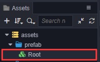
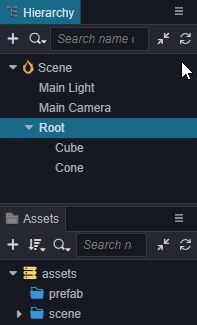
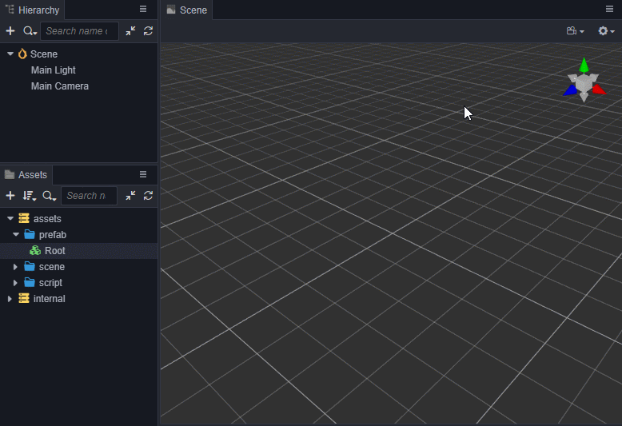
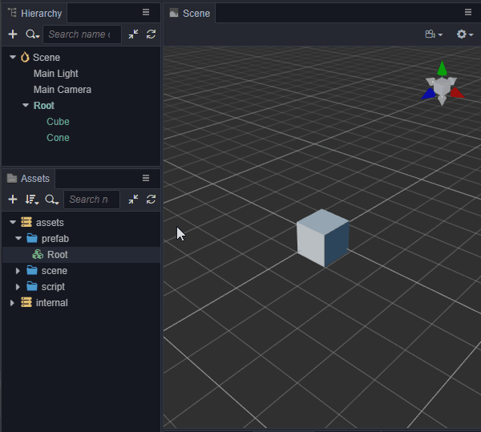
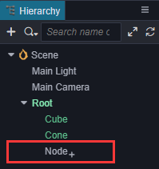

# 预制件（Prefab）

预制件用于存储一些可以复用的场景对象，它可以包含节点、组件以及组件上的数据。由预制件生成的实例既可以继承模板的数据，又可以有自己定制化的数据修改。

## 基础概念

名字 | 描述 | 示例
:---|:---|:---
预制件资源|在 **资源管理器** 中的预制件资源，是预制件的序列化文件。|
预制件实例|预制件资源被拖拽到 **层级管理器** 中就会生成一个预制件实例，它的根节点目前标记为亮绿色，它的子节点为暗绿色|
预制件编辑模式|双击预制件资源，会进入预制件的编辑模式，此时所有的非嵌套预制件节点都显示为暗绿色。可点击 **场景编辑器** 左上方的按钮来 **保存** 修改或者 **关闭** 编辑模式|
嵌套的预制件实例|一个预制件资源中的某个子节点是一另一个预制件资源的实例，则这个子预制件实例就是一个嵌套的预制件实例|

## 创建预制件

在场景中将节点编辑好之后，直接将节点从 `层级管理器` 拖到  `资源管理器` 中即可完成预制件资源的创建。 
完成创建后，原节点自动变为该预制件的实例，根节点呈现 `亮绿色`， 非嵌套预制件子节点呈现 `暗绿色`。

## 使用预制件

将节点从 `资源管理器` 拖到  `层级管理器` 或 `场景面板` 中可在场景中产生一个预制件的实例。 
场景中的预制件实例对象，数据源来自预制件资源的反序列化，所以它的数据默认同步了预制件资源，如果对预制件的实例中的各项属性进行修改，修改的数据会被存储在预制件实例中，所以不会影响到预制件资源和由它生成的其它预制件实例的数据。

## 进入预制件编辑模式

`资源管理器` 中双击预制件资源可从场景编辑模式切换到预制件编辑模式：
此时可以在编辑器中编辑预制件资源，编辑完成之后，点击场景编辑器中的 `保存` 即可保存编辑后的预制件资源，之后点击 `关闭` 可返回场景编辑模式。

## 预制件节点的状态

预制件节点在 `属性检查器` 呈现 `绿色` 表示与资源关联正常；呈现 `红色` 表示关联的资源不存在了。

## 场景中编辑预制件节点

### 通用操作
`层级管理器` 选中预制件节点，在 `属性检查器` 中顶部有可操作的几个按钮，鼠标上移会有该功能的文字提示，以下对红框区按钮的功能做说明：

图标|描述
---|---
|还原为普通节点。预制件节点可变为普通节点，即完全脱离和资源的关系。在顶部菜单 `节点` 中也有此功能的菜单项。
|定位资源。便于快速在 `资源管理器` 中定位到预制件资源。
|从资源还原。将当前预制件实例的数据还原为预制件资源中的数据，这里名字，位置，旋转不会还原为预制体资源中的数据。
|更新到资源。将当前预制件实例的所有数据更新到所关联的预制件资源中。

### 新增节点
在预制件实例下增加的新节点，在节点名字的右下角会有一个 `+` 标志，它的数据存储在预制件的实例下，所以不会影响关联的预制件资源的数据。

## 目前的一些限制
- 在预制件实例中添加/删除组件
- 在预制件实例中删除从预制件资源中创建的节点
- 在预制件实例中更改从预制件资源中创建的节点的层级关系
- 不允许预制件嵌套自己
