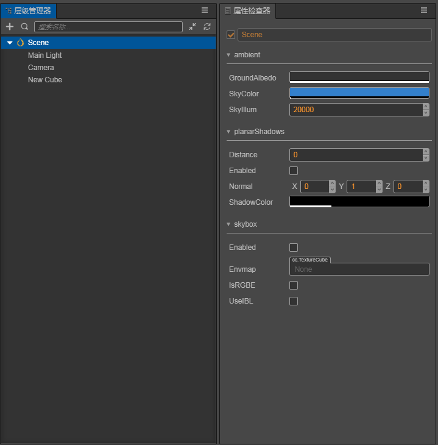

# 场景资源

在 Cocos Creator 3.0 中，游戏场景（Scene）是游戏开发时组织游戏内容的中心，也是呈现给玩家所有游戏内容的载体。而场景文件本身也作为游戏资源存在，并保存了游戏的大部分信息，也是创作的基础。

## 创建场景

创建场景目前有以下几种方式：

1. 在 **资源管理器** 中选中想要放置场景文件的文件夹，在文件夹目录上点击右键，然后选择 **创建 -> Scene** 即可。

    

    为了使项目具备良好的文件夹目录结构，强烈建议使用该方法创建场景。

2. 在 **资源管理器** 中点击左上角的 **+** 创建按钮，然后选择 **Scene** 即可。

    

3. 在编辑器上方的菜单栏中选择 **文件 -> 新建场景**，即可在 **场景编辑器** 中直接创建一个新场景。但 **资源管理器** 中不会出现新场景文件，需要在保存场景时弹出的 **保存场景** 窗口中手动保存场景文件，保存完成后才会在 **资源管理器** 的根目录下出现 `scene.scene` 场景文件。

    

## 保存场景

在保存场景的过程中，可通过快捷键 **Ctrl + S**（Windows）或 **Command + S**（Mac）来快速保存场景。

## 切换场景

在 **资源管理器** 中，通过双击场景文件打开场景。 
如果需要在游戏过程中切换场景，可通过 `director.loadScene` 等 API 来实现游戏中动态场景加载及切换，详情请参考 [API 文档](../../../api/zh/classes/core.director-2.html#loadscene)。

## 场景资源的属性

作为一个资源文件，在 **资源管理器** 中选中想要管理的场景时，可设置场景文件是否要异步加载资源

而在打开场景文件之后，scene 作为场景节点树的根节点，在 **层级管理器** 中选中 `Scene` 节点，在左侧的 **属性检查器** 中可设置整个场景相关的属性，包括环境光设置，阴影设置和天空盒设置。

各类属性的详细说明请见：
- [环境光](../concepts/scene/ambient.md)
- [阴影](../concepts/scene/shadow.md)
- [全局雾](../concepts/scene/fog.md)
- [天空盒](../concepts/scene/skybox.md)
