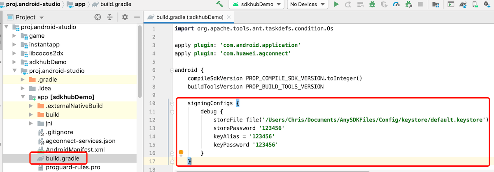
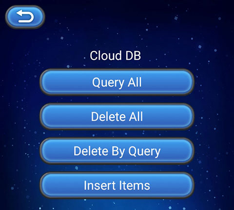

# 云数据库（AppGallery Connect）快速入门

传统的移动应用开发，开发者需要从头开始构建每一个服务，开发工作量大，门槛高。开发者在写应用逻辑之外，还需要解决数据管理、端云数据同步和服务器部署维护等难题。

华为 AppGallery Connect（简称 AGC） [云数据库](https://developer.huawei.com/consumer/cn/doc/development/AppGallery-connect-Guides/agc-clouddb-introduction) （Cloud DB）是一款端云协同的数据库产品，提供端云数据的协同管理、统一的数据模型和丰富的数据管理 API 接口等能力。在保证数据的可用性、可靠性、一致性，以及安全等特性基础上，能够实现数据在客户端和云端之间的无缝同步，并为应用提供离线支持，以帮助开发者快速构建端云、多端协同的应用。同时，Cloud DB 作为 AGC 解决方案的一部分，为 AGC 平台构建了 MBaaS（Mobile Backend as a Service，移动后端即服务）能力。从而让应用开发者聚焦于应用本身的业务，极大的提升开发者的生产效率。

### 申请开通服务

云数据库功能当前仍处于 Beta 开放状态，在使用此功能前，您需要请先 [下载表格](https://communityfile-drcn.op.hicloud.com/FileServer/getFile/cmtyManage/011/111/111/0000000000011111111.20200820101125.28511354479501521580745818636661:50510820025921:2800:48D4EDB65005C37D82E8C72C782C01520D12E31BE071FF183DF3D6E1B5E8E68C.xlsx?needInitFileName=true) 并填写，然后作为附件发送至 [agconnect@huawei.com](agconnect@huawei.com)，申请云数据库功能。

邮件标题请使用如下格式：**[云数据库]-[公司名称]-[开发者帐号 ID]-[应用 ID]**，开发者帐号 ID 及应用 ID 查询方法可参见 [查询应用信息](https://developer.huawei.com/consumer/cn/doc/appgallery_queryappinfo)。在收到您的申请后，华为运营人员会在 1-3 个工作日内给您答复。本邮箱地址仅处理 AGC 服务开通申请，其他咨询类问题请勿发送至本邮箱。

### 如何收费

云数据库属于资源消耗型服务，未来会基于数据记录条数、存储空间和网络的占用情况来进行收费。目前云数据库功能处于 Beta 测试期间，您可以 **免费** 使用。我们会在正式收费前一个月邮件通知并公告相关策略及费率。

开通云数据库服务时，系统默认为您提供如下配额的免费云数据库服务。

| 服务类别 | 配额 |  
| :--- | :--- |  
|  云侧存储容量  | 2GB | 
|  最大并发连接数  | 150 | 
|  云侧数据库每秒最大操作数  | 10 | 

首次开通云数据库，如果您的应用需要使用的资源大于免费配额，或者您已开通免费云数据库服务，但免费资源配额无法满足您当前应用的使用需求时 ，您可 [下载表格](https://communityfile-drcn.op.hicloud.com/FileServer/getFile/cmtyManage/011/111/111/0000000000011111111.20200820101125.28511354479501521580745818636661:50510820025921:2800:48D4EDB65005C37D82E8C72C782C01520D12E31BE071FF183DF3D6E1B5E8E68C.xlsx?needInitFileName=true) 并填写内容，然后作为附件发送至 [agconnect@huawei.com](agconnect@huawei.com) 申请云数据库功能。邮件标题格式：**[云数据库]-[公司名称]-[开发者帐号 ID]-[应用 ID]**，应用 ID 查询方法可参见 [查询应用信息](https://developer.huawei.com/consumer/cn/doc/appgallery_queryappinfo)。

### 更多信息

请参考以下文档：

  - [产品架构](https://developer.huawei.com/consumer/cn/doc/development/AppGallery-connect-Guides/clouddb-introduction_architecture)
  - [功能特性](https://developer.huawei.com/consumer/cn/doc/development/AppGallery-connect-Guides/clouddb-introduction_functions)
  - [技术指标](https://developer.huawei.com/consumer/cn/doc/development/AppGallery-connect-Guides/clouddb-introduction_technical_specifications)
  - [FAQ](https://developer.huawei.com/consumer/cn/doc/development/AppGallery-connect-Guides/clouddb-faq)

### 版本更新说明

- 当前版本：0.5.0_1.2.1.301

    - 集成华为 AGC 云数据库服务。

## 一键接入云数据库服务

### 开通服务

- 发送邮件 [申请开通服务](#申请开通服务)。

- 云数据库依赖于认证服务，所以在集成云数据库服务前，请先开通 [认证服务（AGC）](./agc-auth.md#%E5%BC%80%E9%80%9A%E6%9C%8D%E5%8A%A1)。

- 使用 Cocos Creator 打开需要接入云数据库服务的项目工程。

- 点击菜单栏的 **面板 -> 服务**，打开 **服务** 面板，选择 **云数据库**，进入服务详情页。然后点击右上方的 **启用** 按钮即可开通服务。详情可参考 [服务面板操作指南](./user-guide.md)。

  

- 参考 [管理对象类型](https://developer.huawei.com/consumer/cn/doc/development/AppGallery-connect-Guides/agc-clouddb-agcconsole-objecttypes#h1-1594195740754) 文档，导出 **JSON** 格式的对象类型文件，将其导入云数据库服务面板下方，**云数据库配置文件** 选项中。

  

### 配置华为参数文件

大部分的华为相关项目都需要用到 `agconnect-services.json` 配置文件。若有新开通服务等操作，请及时更新该文件。

- 登录 [AppGallery Connect](https://developer.huawei.com/consumer/cn/service/josp/agc/index.html) 后台，在 **项目列表 -> 应用列表** 中找到对应的应用。

- 在 **项目设置** 页面的 **应用** 区域，点击 `agconnect-services.json` 下载配置文件。`agconnect-services.json` 文件在下载或者更新完成后，**必须手动拷贝** 到工程目录的 `settings` 目录下。

  

**注意**：

1. 务必确认完成 [生成/配置签名证书指纹](https://developer.huawei.com/consumer/cn/doc/development/HMSCore-Guides/config-agc-0000001050166285#ZH-CN_TOPIC_0000001054452903__section21591342135811) 步骤，配置 SHA256 证书指纹。

2. 在构建时若勾选了 **调试模式**，开发者需要在 Android Studio 的 `app/build.gradle` 文件中，自行配置 Keystore 签名文件。

    

3. Cocos Creator v2.4.3 及以上版本，若 [发布到 HUAWEI AppGallery Connect](../publish/publish-huawei-agc.md)，开发者可直接在 **构建发布** 面板中选取下载或更新后的配置文件，不需要手动拷贝。

    

### 验证服务是否接入成功

- 完成 **云数据库** 服务接入步骤后，我们便可以通过在脚本中添加简单的代码，来验证接入是否成功。

  ```js
  //"test" 需替换为配置的对象类型名
  let db = huawei.agc.db;
  let config = db.AGCCloudDBZoneConfig.createConfig("test", db.SyncProperty.CLOUDDBZONE_CLOUD_CACHE);
  let query = db.AGCCloudDBZoneQuery.where("test", "queryTest");
  let zone = db.dbService.openCloudDBZone(config, true);
  let result = zone.querySync(query, huawei.agc.db.QueryPolicy.POLICY_QUERY_FROM_CLOUD_PRIOR);
  console.log('Cloud DB', 'query : ' + JSON.stringify(result));
  ```

- 下载测试用 [数据库文件](agc-clouddb/cdb-test.json)，将其导入后台。

  

- [发布到 Android 平台](../publish/publish-native.md)。请确保 **构建发布** 面板中的包名与华为后台设置的包名一致。

- 工程运行到手机后，若能在 Logcat 中看到数据输出，即为接入成功。

  

## Sample 工程

开发者可以通过 Sample 工程快速体验云数据库服务。

- 点击云数据库服务面板中的 **Sample 工程** 按钮，Clone 或下载 HUAWEI Sample 工程，并在 Cocos Creator 中打开。

- [开通服务](#%E5%BC%80%E9%80%9A%E6%9C%8D%E5%8A%A1) 时，配置一个名为 `test` 的 **对象类型名**。

- 参照上文开通云数据库并配置华为参数文件后，可通过 Creator 编辑器菜单栏的 **项目 -> 构建发布** 打开 **构建发布** 面板来构建编译工程。Creator v2.4.1 及以上版本，可 [发布到 HUAWEI AppGallery Connect](../publish/publish-huawei-agc.md)。Creator v2.4.1 以下的版本可 [发布到 Android 平台](../publish/publish-native.md)。

- Sample 工程运行到手机后，点击首页的 **DB** 按钮，即可进入功能界面进行测试。

  

## 开发指南

本文档对应 [使用入门](https://developer.huawei.com/consumer/cn/doc/development/AppGallery-connect-Guides/agc-clouddb-get-started)。

### 初始化

开发者使用云数据库时，需要先执行初始化操作。

#### 设置监听（可选）

若需要对错误返回进行处理，可设置 `error` 监听。

**示例**：

```js
huawei.agc.db.dbService.on("error", data => console.log("Cloud DB", `error : [${data.zoneId}][${data.typeName}] ${data.errCode}:${data.errMsg}`), this);
```

| 参数 | 说明 |  
| :--- | :--- |
| zoneId | Cloud DB zone 名称，表示一个唯一的数据存储区域 |
| typeName | 对象类型名称 |
| errCode | 错误 Code，可参考 [错误码](https://developer.huawei.com/consumer/cn/doc/development/AppGallery-connect-References/clouddb-agconnectclouddbexception#getCode) 文档。 |
| errMsg | 错误信息 |

若需要使用 [侦听实时更新](https://developer.huawei.com/consumer/cn/doc/development/AppGallery-connect-Guides/agc-clouddb-update-listen) 功能，可设置 `subscribe` 监听。

**示例**：

```js
huawei.agc.db.dbService.on("subscribe", data => console.log("Cloud DB", `error : [${data.zoneId}][${data.typeName}][${data.queryId}][${data.subscribeId}] ${data.result}`), this);
```

| 参数 | 说明 |  
| :--- | :--- |  
| zoneId | Cloud DB zone 名称，表示一个唯一的数据存储区域 |
| typeName | 对象类型名称 |
| queryId | 自定义查询 ID，用于查询接口 |
| subscribeId | 订阅器的 ID |
| result | 返回信息 |

#### 打开 Cloud DB zone

通过 `openCloudDBZone` 方法，打开已配置的 Cloud DB zone。

`openCloudDBZone(config: AGCCloudDBZoneConfig, isAllowToCreate: boolean): AGCCloudDBZone`

| 参数名 | 说明 |
| :--- | :--- |
| config | AGCCloudDBZoneConfig 对象，用于创建或者打开 Cloud DB zone 的配置文件 |
| isAllowToCreate | 是否允许创建 Cloud DB zone 对象 |

**示例**：

```js
let config = huawei.agc.db.AGCCloudDBZoneConfig.createConfig("test", huawei.agc.db.SyncProperty.CLOUDDBZONE_CLOUD_CACHE);
this._zone = huawei.agc.db.dbService.openCloudDBZone(config, true);
```

### 写入数据

开发者可以通过 `insertSync` 方法，**同步** 增加或修改数据。

`insertSync(objs : any[], typeName: string): number`

| 参数名 | 说明 |
| :--- | :--- |
| objs | 一个 Object 的列表，表示待写入的数据 |
| typeName | 对象类型名称 |

**示例**：

```js
let objs = [{id: "1", name: "name1"}, {id: "2", name: "name2"}];
let count = this._zone.insertSync(objs, "test");
console.log('Cloud DB', 'insert count : ' + count);
```

### 查看数据

开发者可以通过 `querySync` 方法，**同步** 查询数据。

`querySync(query: AGCCloudDBZoneQuery, policy: QueryPolicy): any[]`

| 参数名 | 说明 |
| :--- | :--- |
| objs | 一个 CloudDBZoneQuery 对象，表示查询条件 |
| policy | 查询的策略，指定查询的数据来源 |

**示例**：

```js
let query = huawei.agc.db.AGCCloudDBZoneQuery.where("test", "queryTest");
let result = this._zone.querySync(query, huawei.agc.db.QueryPolicy.POLICY_QUERY_FROM_CLOUD_PRIOR);
console.log('Cloud DB', 'query : ' + JSON.stringify(result));
```

也可以添加查询条件，支持方法可参考 [API 文档 - AGCCloudDBZoneQuery](https://docs.cocos.com/service/api/classes/huawei.agc.db.agcclouddbzonequery.html)。

**示例**：

```js
let query = huawei.agc.db.AGCCloudDBZoneQuery.where("test", "deleteTest").lessThan('id', "5");
```

### 删除数据

开发者可以通过 `deleteSync` 方法，**同步** 删除数据，支持添加查询条件。

`deleteSync(queryIdOrObjs: AGCCloudDBZoneQuery | any[], policy = QueryPolicy.POLICY_QUERY_FROM_CLOUD_PRIOR): number`

| 参数名 | 说明 |
| :--- | :--- |
| queryIdOrObjs | 一个 CloudDBZoneQuery 对象，表示查询条件，或者是一组要删除的对象 |
| policy | 查询的策略，指定查询的数据来源。仅在使用 AGCCloudDBZoneQuery 情况时使用 |

**示例**：

```js
let query = huawei.agc.db.AGCCloudDBZoneQuery.where("test", "deleteTest").lessThan('id', "5");
let count = this._zone.deleteSync(query, huawei.agc.db.QueryPolicy.POLICY_QUERY_FROM_CLOUD_PRIOR);
console.log('Cloud DB', 'delete count : ' + count);
```

也可以通过 `deleteAllSync` 方法，删除整个 Cloud DB zone 的数据。

`deleteAllSync(typeName: string): number`

| 参数名 | 说明 |
| :--- | :--- |
| typeName | 对象类型名称 |

**示例**：

```js
let count = this._zone.deleteAllSync("test");
this.console.log('Cloud DB', 'delete count : ' + count);
```

## API 文档

详细的功能接口和 API 说明，请参考 [云数据库 - API 文档](https://docs.cocos.com/service/api/modules/huawei.agc.db.html)。
