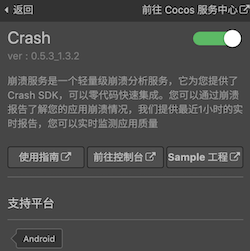
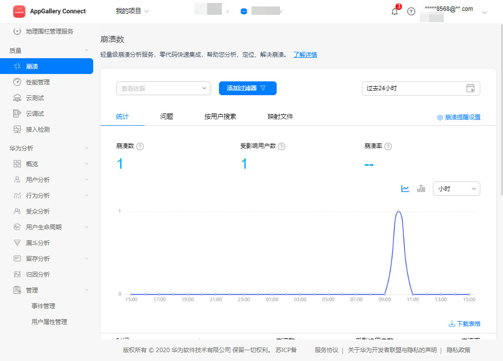

# 崩溃服务（AppGallery Connect）快速入门

华为 AppGallery Connect（简称 AGC）[崩溃服务](https://developer.huawei.com/consumer/cn/doc/development/AppGallery-connect-Guides/agc-crash-introduction) 是一个轻量级崩溃分析服务，开发者可以通过崩溃报告了解应用崩溃情况。并且提供了 Crash SDK，可以 **零代码** 快速集成。

### 主要功能

- 崩溃服务提供最近 1 小时内的实时报告，开发者可以实时监测应用质量。

- 崩溃服务会自动分类崩溃问题，开发者可以通过各崩溃问题的数据指标判断优先解决哪些问题。也可以通过查看具体某一次崩溃的数据和崩溃堆栈，分析崩溃发生时的应用版本、操作系统、设备等相关信息，有助于开发者快速、高效地定位并解决崩溃问题。

- 崩溃服务提供实时检测重大崩溃问题。开发者开启崩溃提醒后，AppGallery Connect 会在发生重大崩溃问题时向开发者发送邮件提醒。

## 一键接入崩溃服务

### 开通服务

- 使用 Cocos Creator 打开需要接入崩溃服务的项目工程。

- 由于崩溃服务在上报崩溃事件时使用了华为分析服务功能，所以在集成崩溃服务前，请先开通 [分析服务（HMS Core）](./hms-analytics.md#%E5%BC%80%E9%80%9A%E6%9C%8D%E5%8A%A1)。

- 点击菜单栏的 **面板 -> 服务**，打开 **服务** 面板，选择 **崩溃服务**，进入服务详情页。然后点击右上方的 **启用** 按钮即可开通服务。详情可参考 [服务面板操作指南](./user-guide.md)。

  

### 配置华为参数文件

大部分的华为相关项目都需要用到 `agconnect-services.json` 配置文件。若有新开通服务等操作，请及时更新该文件。

- 登录 [AppGallery Connect](https://developer.huawei.com/consumer/cn/service/josp/agc/index.html) 后台，在 **项目列表 -> 应用列表** 中找到对应的应用。
- 在 **项目设置** 页面的 **应用** 区域，点击 `agconnect-services.json` 下载配置文件。`agconnect-services.json` 文件在下载或者更新完成后，**必须手动拷贝** 到工程目录的 `settings` 目录下。

  

### 验证服务是否接入成功

通常情况下应用程序出现崩溃的概率较小，崩溃服务 SDK 提供了手动制造崩溃的方法，可以通过调用该方法来判断崩溃服务是否接入成功。

- 在脚本中添加代码。

  ```js
  console.log("Call crash method after 5 seconds.");
  this.scheduleOnce(function(){
      huawei.AGC.Crash.CrashService.testIt();
  },5);
  ```

- [发布到 Android 平台](../publish/publish-native.md)。请确保 **构建发布** 面板中的包名与华为后台设置的包名一致。

- 登录 [AppGallery Connect](https://developer.huawei.com/consumer/cn/service/josp/agc/index.html) 后台，打开对应项目，进入 **质量 -> 崩溃服务**，确认崩溃数据可以正常显示（通常会在 15 分钟内显示），即为接入成功。

  

## Sample 工程

开发者可以通过 Sample 工程快速体验崩溃服务。

- 点击崩溃服务面板中的 **Sample 工程** 按钮，Clone 或下载 HUAWEI Sample 工程，并在 Cocos Creator 中打开。

- 参照上文开通崩溃服务并配置华为参数文件后，可通过 Creator 编辑器菜单栏的 **项目 -> 构建发布** 打开 **构建发布** 面板来构建编译工程。Creator v2.4.1 及以上版本，可 [发布到 HUAWEI AppGallery Connect](../publish/publish-huawei-agc.md)。Creator v2.4.1 以下的版本可 [发布到 Android 平台](../publish/publish-native.md)。

- 需要在已安装 HMS Core 服务的华为或荣耀品牌手机上测试。

- Sample 工程运行到手机后，点击首页的 **Crash** 按钮，即可进入功能界面进行测试。

  

## 开发指南

崩溃服务无需代码层接入，以下为可选方法。

### 设置崩溃服务开关

`enableCrashCollection(enable: boolean): void`

是否开启崩溃服务，默认开启。开启时崩溃服务将会收集和上报崩溃信息。如果不需要使用崩溃服务，设置为关闭即可。

**参数说明**：

| 参数 | 说明 |  
| :---------- | :------------- |  
|  enable    | **false**：关闭崩溃服务<br>**true**：开启崩溃服务 | 

**示例**：

```js
huawei.AGC.Crash.CrashService.enableCrashCollection(false);
```

### 制造崩溃异常

`testIt(): void`

此方法用于创造测试用的崩溃。仅供开发者在测试崩溃实现时使用，**正式发布的应用中请勿使用**。

**示例**：

```js
huawei.AGC.Crash.CrashService.testIt();
```

## 服务使用参考文档

- [分析崩溃问题](https://developer.huawei.com/consumer/cn/doc/development/AppGallery-connect-Guides/agc-crash-locate)
- [接收崩溃提醒](https://developer.huawei.com/consumer/cn/doc/development/AppGallery-connect-Guides/agc-crash-notice)
- [获取 NDK 崩溃报告](https://developer.huawei.com/consumer/cn/doc/development/AppGallery-connect-Guides/agc-crash-report)
- [获取可阅读的崩溃报告](https://developer.huawei.com/consumer/cn/doc/development/AppGallery-connect-Guides/agc-crash-mapping)
- [自定义崩溃报告](https://developer.huawei.com/consumer/cn/doc/development/AppGallery-connect-Guides/agc-crash-customreport)
- [崩溃服务 FAQ](https://developer.huawei.com/consumer/cn/doc/development/AppGallery-connect-Guides/agc-crash-faq)

## API 文档

详细的功能接口和 API 说明，请参考 [崩溃服务 - API 文档](https://docs.cocos.com/service/api/modules/huawei.agc.crash.html)。


