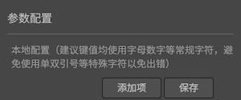

**注意**：此版本文档已归档不再维护，推荐您使用 [最新文档](https://service.cocos.com/document/zh/agc-remote.html)。

# 远程配置（AppGallery Connect）快速入门

华为 AppGallery Connect（简称 AGC）[远程配置](https://developer.huawei.com/consumer/cn/doc/development/AppGallery-connect-Guides/agc-remoteconfig-introduction) 服务，提供在线的配置项管理能力，开发者可以在线更改应用的行为和外观，无需用户下载应用更新。

应用集成客户端 SDK 后，可以定期获取云端管理台配置的配置项和配置参数值，实现客户端应用行为和 UI 的修改。

### 主要功能

- **配置项管理**：用于添加、删除、修改配置项。还可以通过直接 **复制** 其他的配置项来快速添加新的配置项。
- **配置条件管理**：用于添加、删除、修改配置条件，还可以通过直接 **复制** 其他的配置条件来快速添加新的条件。目前可设置的过滤条件包括：应用版本、设备语言、国家地区、用户受众群体、随机百分比用户、日期时间，后续可设置的过滤条件还会持续增加。
- **历史版本管理**：最多支持 90 天 300 个历史版本的管理和回滚能力。
- **权限管理**：默认帐号持有者、管理员、App 管理员、开发、运营这几种角色具备远程管理服务的权限。

### 应用场景

#### 不同地区展现不同语言

使用远程配置服务的 **国家地区** 条件和 **设备语言** 条件，设置在不同国家地区分配不同的参数值，从而呈现不同的内容。

#### 不同用户展现不同内容

使用远程配置服务的 **用户受众群体** 条件，协同高级分析（华为分析）服务，针对不同的用户群体推荐不同内容。例如对职场白领和学生推送不同的物品及页面布局。

#### 特定主题特定时间配置

使用远程配置服务的 **日期时间** 条件来更改应用的颜色、图片素材等，以配合特定的主题。例如在毕业季这个特殊的时间段设置一些特定的内容来吸引用户。

#### 功能发布

支持按用户百分比发布新功能。因为在同一时间面向所有用户发布新功能的风险很高，所以利用远程配置服务的 **随机百分比用户** 条件，可以实现按照百分比缓慢地向用户发布新功能，可以有效避免舆情或者及时修改调整。

### 版本更新说明

- 当前版本：0.5.1_1.4.1.300

    - 更新 SDK，添加本地配置入口。

- v0.5.0_1.4.0

    - 集成华为 AGC 远程配置服务。

## 一键接入远程配置

### 开通服务

- 使用 Cocos Creator 打开需要接入远程配置服务的项目工程。

- 点击菜单栏的 **面板 -> 服务**，打开 **服务** 面板，选择 **远程配置**，进入服务详情页。然后点击右上方的 **启用** 按钮即可开通服务。详情可参考 [服务面板操作指南](./user-guide.md)。

  

    - 服务面板中的 **参数配置**，请参考 [设置应用内默认值](#%E8%AE%BE%E7%BD%AE%E5%BA%94%E7%94%A8%E5%86%85%E9%BB%98%E8%AE%A4%E5%80%BC)。

- 登录 AppGallery Connect，点击 **我的项目**，在项目的应用列表中选择需要启动远程配置服务的应用，然后点击 **增长 -> 远程配置**，若首次使用请点击页面右上方的 **立即开通** 按钮来开通服务。

  

- 在开通远程配置服务时，系统会默认自动开通远程配置 API。如果需要手动控制是否开启远程配置 API，可参考文档 [开通服务](https://developer.huawei.com/consumer/cn/doc/distribution/app/agc-enable_service)。

  

### 配置华为参数文件

大部分的华为相关项目都需要用到 `agconnect-services.json` 配置文件。若有新开通服务等操作，请及时更新该文件。

- 登录 [AppGallery Connect](https://developer.huawei.com/consumer/cn/service/josp/agc/index.html) 后台，在 **项目列表 -> 应用列表** 中找到对应的应用。

- 在 **项目设置** 页面的 **应用** 区域，点击 `agconnect-services.json` 下载配置文件。`agconnect-services.json` 文件在下载或者更新完成后，**必须手动拷贝** 到工程目录的 `settings` 目录下。

  

- Cocos Creator v2.4.3 及以上版本，若 [发布到 HUAWEI AppGallery Connect](../publish/publish-huawei-agc.md)，开发者可直接在 **构建发布** 面板中选取下载或更新后的配置文件，不需要手动拷贝。

  

### 验证服务是否接入成功

- 完成 **远程配置** 服务接入步骤后，我们便可以通过在脚本中添加简单的代码，来验证接入是否成功。

  ```js
  let value = huawei.agc.rc.rcService.getValueAsString('test');
  console.log('Get config by key : test, value :' + value);
  ```

- [发布到 Android 平台](../publish/publish-native.md)。请确保 **构建发布** 面板中的包名与华为后台设置的包名一致。

- 工程运行到手机后，若能在 Logcat 中看到输出的值为 **testValue**，即为接入成功。

  

## Sample 工程

开发者可以通过 Sample 工程快速体验远程配置服务。

- 点击远程配置服务面板中的 **Sample 工程** 按钮，Clone 或下载 HUAWEI Sample 工程，并在 Cocos Creator 中打开。

- 参照上文开通远程配置服务并配置华为参数文件后，可通过 Creator 编辑器菜单栏的 **项目 -> 构建发布** 打开 **构建发布** 面板来构建编译工程。Creator v2.4.1 及以上版本，可 [发布到 HUAWEI AppGallery Connect](../publish/publish-huawei-agc.md)。Creator v2.4.1 以下的版本可 [发布到 Android 平台](../publish/publish-native.md)。

- 需要在已安装 HMS Core 服务的华为或荣耀品牌手机上测试。

- Sample 工程运行到手机后，点击首页的 **Remote** 按钮，即可进入功能界面进行测试。

  

## 开发指南

本文档对应 AppGallery Connect 文档 - [接入远程配置](https://developer.huawei.com/consumer/cn/doc/development/AppGallery-connect-Guides/agc-remoteconfig-dev-guide)，使用 JavaScript 调用时，请以本文档和 [API 文档](https://service.cocos.com/document/api/modules/huawei.agc.rc.html) 为准。

由于 Java SDK 的 `apply` 方法返回的是参数对象，无法在 JavaScript 层传递。所以 Creator 集成到服务面板的远程配置服务插件在封装时，使用了 `applyLastFetched` 和 `fetchAndApply` 方法来代替 Java SDK 的 `applyDefault` 和 `apply` 方法。

### 设置应用内默认值

开发者可以在远程配置对象中设置 [应用程序内的默认值](https://developer.huawei.com/consumer/cn/doc/development/AppGallery-connect-Guides/agc-remoteconfig-dev-guide#h1-1591760650143)，以便应用程序在连接到远程配置服务之前按照预期运行。如果云端未设置参数值，可以使用本地默认值，本地默认值在服务面板的 **参数配置** 中设置。



### 获取和更新云端参数值到本地

#### fetchAndApply

`fetchAndApply(intervalSeconds?: number): void`

远程配置服务插件封装了 `fetchAndApply` 方法，对应 Java SDK 的 `fetch` + `apply` 方法。

建议使用 `fetchAndApply` 方法来获取和更新云端参数值到本地。若获取配置数据失败，开发者可以通过 [setRemoteConfigListener](#setRemoteConfigListener) 监听器返回失败回调，**获取更新成功的情况下不会返回回调**。

**参数说明**：

| 参数 | 说明 |  
| :---------- | :------------- | 
|  intervalSeconds  | 获取数据的间隔时间，单位为秒，默认值为 -1，更新周期为 12 小时 | 

**示例**：

```js
huawei.agc.rc.rcService.fetchAndApply();
```

#### fetch

`fetch(intervalSeconds: number): void`

开发者也可以通过调用 `fetch` 方法获取 `setRemoteConfigListener` 回调，然后再调用 `applyLastFetched` 方法来更新参数值。但还是建议使用 `fetchAndApply` 方法。

**参数说明**：

| 参数 | 说明 |  
| :---------- | :------------- |  
|  intervalSeconds  | 获取数据的间隔时间，单位为秒，默认值为 -1 ，更新周期为 12 小时 | 

**示例**：

```js
huawei.agc.rc.rcService.fetch();
```

#### setRemoteConfigListener

`setRemoteConfigListener(listener: RemoteConfigListener): void`

`setRemoteConfigListener` 监听器用于返回从云端获取参数值是否成功的回调。开发者可以根据需要选择是否启用监听。

- 若使用 `fetchAndApply` 方法，则只有在获取参数值 **失败** 的情况下，`setRemoteConfigListener` 才会返回回调。
- 若使用 `fetch` 方法，无论获取参数值成功或者失败，`setRemoteConfigListener` 都会返回回调。开发者可以在返回成功回调后，调用 `applyLastFetched` 方法来更新云端参数值。

**示例**：

```js
huawei.agc.rc.rcService.fetch();
```

### 获取参数值

```js
getValueAsBoolean(key: String): Boolean {return false;}

getValueAsDouble(key: String): Number {return 0;}

getValueAsLong(key: String): Number {return 0;}

getValueAsString(key: String): String {return "";}
```

在设置默认值和更新云端参数值后，就可以调用以上方法中所需类型的方法获取参数值。远程配置服务插件封装时，提供了四种数据类型的接口，可根据需求进行使用。

**注意**：由于 JavaScript 层限制，远程配置服务插件不支持对应 Java SDK 的 `getValueAsBytArray` 方法。

**参数说明**：

| 参数 | 说明 |  
| :---------- | :------------- |  
|  key  | 远程配置服务配置的 Key 值 | 

**示例**：

```js
let value = huawei.agc.rc.rcService.getValueAsString('test');
console.log('Get config by key : test, value :' + value);
```

可通过 `getSource` 方法获取 Value 值的来源。数据可能有如下三种来源：

- `huawei.agc.rc.rcService.RemoteConfigSource.STATIC = 0`：获取的值是类型默认值
- `huawei.agc.rc.rcService.RemoteConfigSource.DEFAULT = 1`：获取的值是传入的本地默认值
- `huawei.agc.rc.rcService.RemoteConfigSource.REMOTE = 2`：获取的值是从云端同步下来的值

### 获取全部参数值

`getMergedAll(): any`

开发者可以获取全部本地默认值和云端参数值，若本地数据与云端数据的 Key 值相同，将获取该 Key 值的云端参数值。返回值为 JSON 对象。

**示例**：

```js
let values = huawei.agc.rc.rcService.getMergedAll();
console.log('Get all configs : ' + JSON.stringify(values));
```

### 重置参数值

`clearAll(): void`

用于清除所有的缓存数据，包括从云端获取的参数值和传入的默认值。

**示例**：

```js
huawei.agc.rc.rcService.clearAll();
```

### 加载流程

开发者可以通过如下两种方式进行数据刷新，具体的内容可参考 [加载流程](https://developer.huawei.com/consumer/cn/doc/development/AppGallery-connect-Guides/agc-remoteconfig-dev-guide#h1-1591760759854) 文档。

#### 获取数据后立刻生效

该方式对应 [fetchAndApply](#fetchAndApply) 方法。

#### 获取数据后下次启动生效

该方式对应 `fetch` 方法，开发者可以在任何时候 `fetch` 数据。但是当前的运行并不能生效，下一次应用启动时，上一次 `fetch` 的数据才会生效。这种方式无需异步等待即可使用最新的参数值。

若调用 `fetch` 且 [setRemoteConfigListener](#setRemoteConfigListener) 获取成功回调时，可调用 `applyLastFetched` 方法更新云端参数值。

`applyLastFetched(): void`

对应 Java SDK `loadLastFetched` + `apply` 方法，获取最近一次拉取成功的缓存数据，并生效配置参数。

**示例**：

```js
huawei.agc.rc.rcService.applyLastFetched();
```

### 设置开发者模式

`setDeveloperMode(isDeveloperMode: Boolean): void`

用于设置开发者模式，不限制客户端获取数据的次数，但云端仍将进行流量控制。

**参数说明**：

| 参数 | 说明 |  
| :---------- | :------------- |  
|  isDeveloperMode  | 是否设置为开发者模式 | 

**示例**：

```js
huawei.agc.rc.rcService.setDeveloperMode(true);
```

## API 文档

详细的功能接口和 API 说明，请参考 [远程配置服务 - API 文档](https://service.cocos.com/document/api/modules/huawei.agc.rc.html)。


