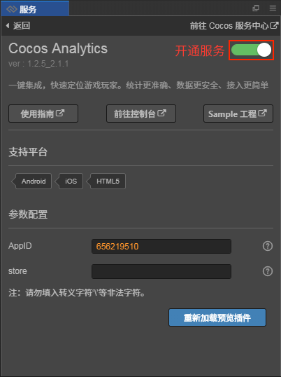
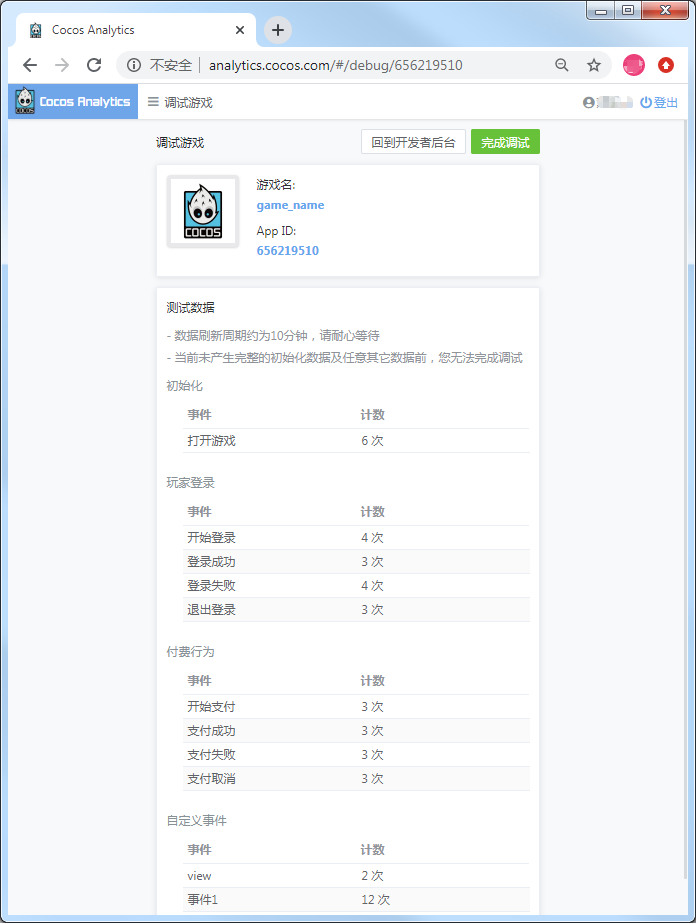

# Cocos 数据统计（Cocos Analytics）


[Cocos Analytics](https://www.cocos.com/analytics) 用于数据统计和行为分析，并且在后台提供了数据分析支持。只需要在 Cocos Creator 的 **服务** 面板中进行简单的设置就能开启 Cocos Analytics 统计服务，方便在游戏开发过程中快速接入。及时便捷地监测游戏生命周期中的运营情况，为您提供符合行业标准的运营分析指标，简单而实用，并在不断的完善中，让你可以更专注于游戏开发。目前支持 Android／iOS／Web／微信小游戏平台。

## 一键接入 Cocos Analytics 服务

### 开通 Cocos Analytics 服务

1. 使用 Cocos Creator 打开需要接入 Cocos Analytics 服务的项目工程。
2. 点击菜单栏的 **面板 -> 服务**，打开 **服务** 面板。设定 Cocos AppID 后，选择 Cocos Analytics 项，进入 Cocos Analytics 服务面板。然后点击右上方的 **启用** 按钮以开通服务。详情可参考 [Cocos Service 操作指南](./user-guide.md)。

    

3. 开通服务后，在 Cocos Analytics 服务面板可以看到新增了 **参数配置** 项，包括 **AppID** 和 **store** 两个参数，以及 **重新加载预览插件** 按钮：

    - AppID 会自动填入当前绑定的游戏 AppID。
    - store 为游戏分发渠道 ID，长度为 200。该项可以任意设置，只要确保在 [Cocos Analytics 数据中心](http://analytics.cocos.com/) 获取统计结果时能够区分即可。
    - 重新加载预览插件：Cocos Analytics 预览插件，开发者可以在浏览器预览中使用该 SDK。**暂时不支持模拟器**。

    参数配置完成后点击 **重新加载预览插件** 按钮，导入预览插件，即可完成接入工作。

### 验证 Cocos Analytics 接入是否成功

Cocos Analytics 服务接入完成后，我们可以通过在脚本中添加简单的代码来验证接入是否成功。

1. 在脚本中调用 Cocos Analytics 的开始登录方法 `loginStart`：

    ```js
    // 开启（关闭）本地日志的输出
    cocosAnalytics.enableDebug(true); 
    // 开始登录方法
    cocosAnalytics.CAAccount.loginStart({    
        // 获客渠道，指获取该客户的广告渠道信息 
        channel: '99888',
    });
    ```

2. 脚本修改完成并保存后，回到编辑器。在编辑器上方选择 **浏览器**，然后点击  [预览](../getting-started/basics/preview-build.md) 按钮，若能在控制台中看到初始化和登录日志，即可验证 Cocos Analytics 接入成功。

    

开发者可以通过 **构建发布** 面板根据需求选择 **Android／iOS／Web／微信小游戏** 平台进行 [构建编译](../publish/publish-native.md)。构建出来的发布包已经自动集成了 Cocos Analytics 服务。

游戏加载后，Cocos Analytics SDK 会在项目构建后的 `main.js` 文件中初始化，并且传入上面设置的参数。如果有批量发布的需要，也可以手动在 `main.js` 中修改这些参数。初始化后便可以直接调用 Cocos Analytics SDK，发送各种数据给服务器。

## Cocos Analytics Sample 的集成调试

- 点击 Cocos Analytics 服务面板中的 **Sample 工程** 按钮，Clone 或下载  [Cocos Analytics Sample 工程](https://github.com/CocosService/cocosAnalyticsDemo)，并在 Cocos Creator 中打开。

- 在 **服务** 面板中接入 Cocos Analytics 服务，具体可参考上部分章节内容介绍。

- 接入完成后，点击编辑器窗口正上方的  [预览](../getting-started/basics/preview-build.md) 按钮，即可在浏览器中调试该工程。

  

- 可将 Sample 工程中的所有按钮点击一遍，然后在 Cocos Analytics 服务面板点击 **前往控制台** 按钮前往 **调试游戏** 页面，刷新页面直至更新数据，数据刷新周期约为 **10** 分钟。请注意检查 **调试游戏** 页面中的 AppID 是否与 **服务** 面板中的一致。

  若在调试状态下，所有数据接口调试完成，可点击右上方的 **完成调试** 按钮，转为正式模式。**注意**：转为正式模式后无法再回到 **调试游戏** 页面。

  

## Cocos Analytics 调用方法说明

Cocos Analytics 插件加载时会调用 Cocos Analytics 初始化，无需再做初始化操作。

### 启用 Debug 输出模式

```js
//启用 Debug 输出模式，调试完成后可删除
cocosAnalytics.enableDebug(true);
```

### 登录模块

```js
// 开始登录
cocosAnalytics.CAAccount.loginStart({
    // 获客渠道，指获取该客户的广告渠道信息  
    channel: '99999', 
});

// 登录成功
cocosAnalytics.CAAccount.loginSuccess({
    userID: 'dddddddd',
    age: 1,             // 年龄
    sex: 1,             // 性别：1 为男，2 为女，其它表示未知
    channel: '99999',   // 获客渠道，指获取该客户的广告渠道信息
});
    
// 登录失败
cocosAnalytics.CAAccount.loginFailed({
    reason: '密码错误' // 失败原因
});
    
// 退出登录
cocosAnalytics.CAAccount.logout();
```

### 付费行为分析模块

```js
const paymentInfo = {
  amount: 100,                 // 现金金额或现金等价物的额度。例如 1 元传入 100，100 元则传入 10000
  orderID: 'od10001000111',    // 游戏平台订单 ID
  payType: '支付宝',            // 支付方式。如：支付宝、iOS IAP、银联支付等
  iapID: '大礼包',              // 商品 ID。玩家购买的充值包类型。例如：人民币 15 元 600 虚拟币包
  currencyType: 'CNY',         // 充值货币类型。请使用 ISO 4217 中规范的 3 位字母代码标记货币类型
  virtualCurrencyAmount: 1000, // 充值获得的虚拟币额度
  accountID: 'user1001',       // 消费的账号
  partner: '',                 // 账户渠道名称。例如：QQ、微信
  gameServer: '艾欧尼亚',       // 玩家充值的区服
  level: 10,                   // 玩家充值时的等级
  mission: '第 10 关',          // 玩家充值时所在的关卡或任务。亦可传入一个玩家打到的最高关卡
  reason: '英雄死亡'            // 充值失败的原因
};

// 开始支付
cocosAnalytics.CAPayment.payBegin(paymentInfo);

// 支付成功
cocosAnalytics.CAPayment.paySuccess(paymentInfo);

// 支付失败
cocosAnalytics.CAPayment.payFailed(paymentInfo);

// 支付取消
cocosAnalytics.CAPayment.payCanceled(paymentInfo);
```

### 自定义事件模块

```js
// 事件 ID（必填）可以任意填写, 不得超过 30 个字符
const eventID = "事件 1";

// 战斗失败原因
const eventFailedReason = "战斗异常";

const eventValue = {
    // 事件内容及标签可灵活自定义。后台根据事件内定义的标签进行相关统计和漏斗分析
    name: "突袭",
    player1: 1,
    player2: 1
};

// 事件开始
cocosAnalytics.CACustomEvent.onStarted(eventID, eventValue);

// 事件完成
cocosAnalytics.CACustomEvent.onSuccess(eventID, eventValue);

// 事件取消
cocosAnalytics.CACustomEvent.onCancelled(eventID, eventValue);

// 事件失败
cocosAnalytics.CACustomEvent.onFailed(eventID, eventValue, eventFailedReason);
```

## 各平台接入集成

根据游戏需求，参考以下 Cocos Analytics 官方文档来进行各平台接入集成。  

- [Android 平台接入集成](https://n-analytics.cocos.com/docs/android/index.html)
- [iOS 平台接入集成](https://n-analytics.cocos.com/docs/ios/index.html)
- [Web／微信小游戏平台接入集成](https://n-analytics.cocos.com/docs/h5/index.html)

详细的产品和 API 说明，请参考 [Cocos Analytics 产品文档](https://n-analytics.cocos.com/docs/)。

## 相关参考链接

- [Cocos 账户中心](https://account.cocos.com/#/)
- [Cocos Analytics 数据中心](http://analytics.cocos.com/)
- [Cocos Analytics 产品文档](https://n-analytics.cocos.com/docs/)
- [Cocos Analytics 事件列表](https://n-analytics.cocos.com/docs/analytics_event.html)
- [Cocos Analytics Sample 工程](https://github.com/CocosService/cocosAnalyticsDemo)
