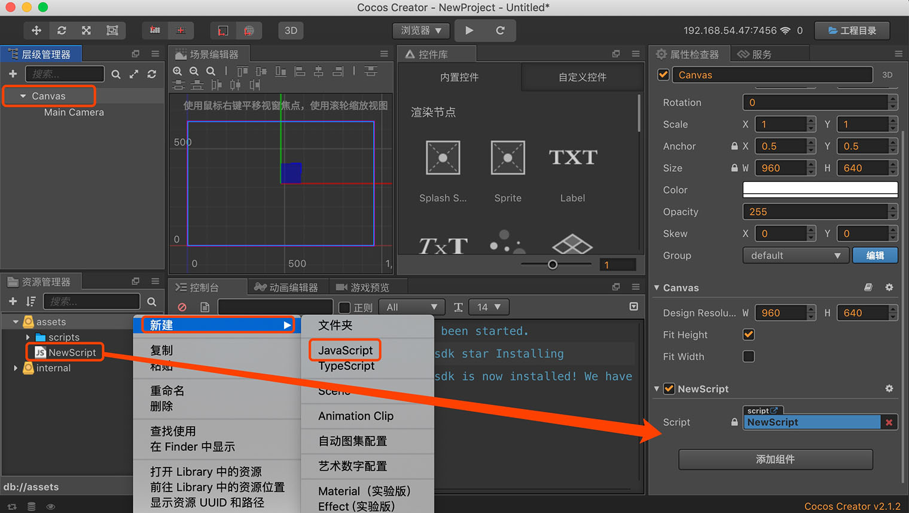

#快速开始
##内容简介
- 本文档面向 Cocos Creator 初学者，有一定基础的用户，可以直接参考 [**基础使用**](basic-user-guide.md) 文档。
- 本文档主要指导如何通过简单的操作，在一个 Cocos Creator 空白项目中，通过 Cocos Service 服务面板，一键接入 Cocos Analytics 的流程，并通过 Cocos Analytics 初始化成功信息，验证接入效果。
- 需要 v2.0.7 版本以上的 Cocos Creator。

##创建空白项目
- 如果还不了解如何获取和启动 Cocos Creator，请阅读 [安装和启动](/../../getting-started/install.md) 一节。
- 在 Dashboard 中，打开 **新建项目** 选项卡，选中 **空白项目** 模板，创建项目。

    

##一键接入 Cocos Analytics 服务
Cocos Creator v2.0.7 以上版本的 **Cocos Service 服务面板** 中，集成了 Cocos Analytics 服务。若项目已完成 [**Cocos AppID 设定**](./../setting-cocos-appid.md)，可以通过点击开通按钮的方式 **一键接入**。

若完成 [**Cocos AppID 设定**](./../setting-cocos-appid.md) 操作后，点击 **Cocos Analytics 服务面板**，再点击右上角 **开通服务按钮**，Cocos Service 将自动开通 Cocos Analytics 服务并生成所需参数。

服务开通后还需要配置 **Store - 游戏分发渠道 ID**，该值可以自定义，只需要在后台获取统计结果时能够区分即可。设置后点击 **重新加载预览插件** 按钮，导入预览插件，即可完成接入工作。


##脚本调试
完成 Cocos Analytics 服务接入步骤后，我们便可以在场景中添加简单的代码，验证 Cocos Analytics 的接入是否成功。

- 在左下角 **资源管理器 > assets** 右键，**新建 > JavaScript** ，添加脚本文件。
- 在左上角 **层级管理器** 中，选定 **Canvas** 。
- 将新建的 JS 文件拖动到右侧 **属性检查器** 面板中



- Cocos Analytics 的 SDK 已通过 **全局变量** 方式自动集成到工程，并在启动时自动调用初始化方法，无需额外处理。

- 现在我们修改脚本文件，例如在 onLoad 方法中打开 Debug 输出后，调用 Cocos Analytics 的开始登录方法，

```js
// NewScript.js

 cc.Class({
     extends: cc.Component,

     properties: {

     },

     onLoad: function () {
        cocosAnalytics.enableDebug(true); //开启(关闭)本地日志的输出
        cocosAnalytics.CAAccount.loginStart({ // 开始登录方法
        channel: '99888',   // 获客渠道，指获取该客户的广告渠道信息   
		});
     },

 });
```

- 可以直接在浏览器中 [**预览和构建**](/../../getting-started/basics/preview-build.md)  ，若能在日志中看到初始化和登录方法的日志，则可验证 Cocos Analytics 接入是否成功。


---

继续前往 [**基础使用**](basic-user-guide.md) 。


