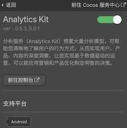

# 分析服务（HMS Core）

## 服务介绍

[华为分析服务](https://developer.huawei.com/consumer/cn/hms/huawei-analyticskit)（HUAWEI Analytics Kit）预置大量分析模型，可帮助您清晰地了解用户的行为方式，从而实现用户、产品、内容的深度洞察，让您实现基于数据驱动的运营，可以就应用营销和产品优化制定明智的决策。

端侧数据采集SDK，提供了如下能力：

- 提供埋点与上报接口，支持代码级自定义事件埋点与上报。
- 支持用户属性设置，最多保存25个用户属性。
- 支持自动事件采集与Session计算，预置事件ID与事件参数。

### 应用场景

- 预定义事件+自定义事件，灵活支撑用户行为分析。
- 基于对用户行为的洞察，使用受众群体构建能力，对受众群体开展相应的营销活动。
- 通过概览和通用的分析能力，有效衡量营销活动是否达到预期效果；并帮助您轻松获取常用指标和常见问题的答案。

## 一键接入分析服务

### 开通服务

- 使用 Cocos Creator 打开需要接入分析服务的项目工程。

- 点击菜单栏的 **面板 -> 服务**，打开 **服务** 面板，进入分析服务服务详情页，然后点击右上方的 **启用** 按钮即可。可参考 [一键开通服务](./user-guide.md#一键开通服务)。

- 参考 [配置 AppGallery Connect](https://developer.huawei.com/consumer/cn/doc/development/HMSCore-Guides/android-config-agc-0000001050163815) 文档，完成开发者注册、创建应用、开通华为分析服务参数配置和开启 API 步骤。

### 配置华为参数文件

大部分的华为相关项目都需要用到 `agconnect-services.json` 配置文件。若有新开通服务等操作，请及时更新该文件。

- 登录 [AppGallery Connect](https://developer.huawei.com/consumer/cn/service/josp/agc/index.html) 网站，点击 **我的项目**。
- 在项目列表中找到您的项目，在项目下的应用列表中选择您的应用。
- 在 **项目设置** 页面的 **应用**区域，点击 `agconnect-services.json` 下载配置文件。

我们将该文件统一放在工程下的 `/setting` 目录。

- Creator 2.4.3 以上版本可在 **构建** 面板直接配置该文件。
- Creator 2.4.3 以下版本，请将 `agconnect-services.json` 文件拷贝到工程目录下的 `/settings` 目录。

### 验证服务是否接入成功

- 完成 **分析服务** 接入步骤后，我们便可以通过在脚本中添加简单的代码来验证接入是否成功。

## Sample 工程

您可以通过 Sample 工程快速体验定位服务。

- 点击分析服务面板中的 **Sample 工程** 按钮，Clone 或下载 HUAWEI Sample 工程，并在 Cocos Creator 中打开。

- [开通服务](#开通服务) 并 [配置华为参数文件](#配置华为参数文件) 后，可通过 Creator 编辑器菜单栏的 **项目 -> 构建发布** 打开 **构建发布** 面板来构建编译工程。Creator 2.4.1 及以上版本，可参考 [发布到 HUAWEI AppGallery Connect](../../../publish/publish-huawei-agc.md)。旧版本用户可构建发布到 Android 平台。

- 需要在安装 HMS Core 服务的华为或荣耀品牌手机上测试。点击 Sample 首页的 **Analytics** 按钮，进入该功能界面进行测试。

    

## 开发指南

