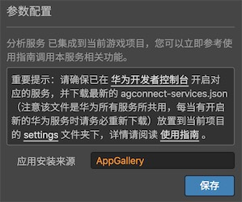

> **注意**：此版本文档已归档不再维护，请移步至 [最新版本](https://service.cocos.com/document/zh/hms-analytics.html)。

# 分析服务（HMS Core）

[华为分析服务](https://developer.huawei.com/consumer/cn/hms/huawei-analyticskit)（HUAWEI Analytics Kit）预置大量分析模型，可帮助开发者清晰地了解用户的行为方式，从而实现用户、产品、内容的深度洞察，让开发者实现基于数据驱动的运营，可以就应用营销和产品优化制定明智的决策。

端侧数据采集 SDK，提供了如下能力：

- 提供埋点与上报接口，支持代码级自定义事件埋点与上报。
- 支持用户属性设置，最多保存 25 个用户属性。
- 支持自动事件采集与 Session 计算，预置事件 ID 与事件参数。

### 应用场景

- 预定义事件 + 自定义事件，灵活支撑用户行为分析。
- 基于对用户行为的洞察，使用受众群体构建能力，对受众群体开展相应的营销活动。
- 通过概览和通用的分析能力，有效衡量营销活动是否达到预期效果；并帮助开发者轻松获取常用指标和常见问题的答案。

### 版本更新说明

- 当前版本：0.5.7_5.0.5.301

    - 新增部分预制事件及参数。
    
- v0.5.5_5.0.5.301

    - 更新分析服务 SDK 到版本 5.0.5.301。
    - 新增对设置应用安装来源的支持。
    - 新增 `setReportPolicies` 接口来设置上报策略。
    - 新增部分游戏行业和电商行业的预置事件及参数。
    - `setUserProfile` 方法中传入 `null` 或者 `undefined`，可以删除对应的用户属性。

- v0.5.3_5.0.1

    - 集成华为 HMS 分析服务。

## 一键接入分析服务

### 开通服务

- 使用 Cocos Creator 打开需要接入分析服务的项目工程。

- 点击菜单栏的 **面板 -> 服务**，打开 **服务** 面板，选择 **分析服务**，进入服务详情页。然后点击右上方的 **启用** 按钮即可开通服务。详情可参考 [服务面板操作指南](./user-guide.md)。

  

- 参考 [配置 AppGallery Connect](https://developer.huawei.com/consumer/cn/doc/development/HMSCore-Guides/android-config-agc-0000001050163815) 文档，完成开发者注册、创建应用、开通华为分析服务参数配置和开启 API 步骤。

- 在分析服务面板的 **参数配置** 中填写 **应用安装来源**。例如：应用的安装来源是华为应用市场，就可以填写 **AppGallery**。安装来源命名规范：支持英文字母、阿拉伯数字、下划线、中划线和空格，长度不超过 128 个字符。当命名仅包含数字时不能以空格为开头/结尾，

  

### 配置华为参数文件

大部分的华为相关项目都需要用到 `agconnect-services.json` 配置文件。若有新开通服务等操作，请及时更新该文件。

- 登录 [AppGallery Connect](https://developer.huawei.com/consumer/cn/service/josp/agc/index.html) 后台，在 **项目列表 -> 应用列表** 中找到对应的应用。

- 在 **项目设置** 页面的 **应用** 区域，点击 `agconnect-services.json` 下载配置文件。`agconnect-services.json` 文件在下载或者更新完成后，**必须手动拷贝** 到工程目录的 `settings` 目录下。

  

- Cocos Creator v2.4.3 及以上版本，若 [发布到 HUAWEI AppGallery Connect](../publish/publish-huawei-agc.md)，开发者可直接在 **构建发布** 面板中选取下载或更新后的配置文件，不需要手动拷贝。

  

### 验证服务是否接入成功

- 完成分析服务接入步骤后，无需改动代码，即可 [发布到 Android 平台](../publish/publish-native.md)。请确保 **构建发布** 面板中的包名与华为后台设置的包名一致。

- 工程运行到手机后，登录 [AppGallery Connect](https://developer.huawei.com/consumer/cn/service/josp/agc/index.html) 后台，打开对应项目，进入 **华为分析 -> 用户分析 -> 新增用户**，若能看到新开通的服务有新增用户信息（通常会在 10 分钟内显示），即为接入成功。

## Sample 工程

开发者可以通过 Sample 工程快速体验分析服务。

- 点击分析服务面板中的 **Sample 工程** 按钮，Clone 或下载 HUAWEI Sample 工程，并在 Cocos Creator 中打开。

- 参照上文开通分析服务并配置华为参数文件后，可通过 Creator 编辑器菜单栏的 **项目 -> 构建发布** 打开 **构建发布** 面板来构建编译工程。Creator v2.4.1 及以上版本，可 [发布到 HUAWEI AppGallery Connect](../publish/publish-huawei-agc.md)，Creator v2.4.1 以下的版本可 [发布到 Android 平台](../publish/publish-native.md)。

- 需要在已安装 HMS Core 服务的华为或荣耀品牌手机上测试。

- Sample 工程运行到手机后，点击首页的 **Analytics** 按钮，即可进入功能界面进行测试。

  

## 开发指南

分析服务预设了一些 [自动采集事件](https://developer.huawei.com/consumer/cn/doc/development/HMSCore-Guides/android-automatic-event-collection-0000001051757143)，无需开发者埋点或主动调用，即可实现此类事件的自动采集。

分析服务插件启动时，已调用 SDK 的初始化，开发者无需再做调用。

### 自定义事件（埋点）

`onEvent(eventId: any, params: any): void`

记录自定义事件（埋点）是分析服务的主要调用方法。针对自动采集事件、预置事件无法满足的个性化分析需求，开发者可上报自定义事件。

开发者可能有个性化的事件需要打点分析，分析服务也支持开发者自定义事件并扩展事件参数，或是对预定义事件新增个性化参数。

比如对教育类的应用，可以添加自定义事件 `begin_examination` 来表示 **进入新考试** 的事件，并给该事件增加参数 `exam_difficulty` 来定义 **考试难度**，以此满足特定业务场景的分析。

**参数说明**：

| 参数 | 说明 |  
| :---------- | :---------- |
| eventId | 事件标识符。自定义非空，由数字、字母、下划线组成，不能以数字开头，不能包含空格，长度不超过 256 字符，不能使用 [自动采集事件 ID](https://developer.huawei.com/consumer/cn/doc/development/HMSCore-Guides/android-automatic-event-collection-0000001051757143)，建议优先使用 [预置事件 ID](https://developer.huawei.com/consumer/cn/doc/development/HMSCore-Guides/ios-predefined-events-0000001051997159)。| 
| params | 	事件携带的信息。传入参数键值对个数不超过 2048，同时大小不超过 200KB。传入参数 key 值由数字、字母、下划线组成，不能以数字开头。| 

**示例**：

```js
let eventName = 'myEvent';
let params = {
    name: 'userName',
    age: 18,
    others: {
        stature: 199,
        level: 100
    }
};

huawei.hms.analytics.analyticsService.onEvent(eventName, params);
```

### 可选方法

#### 是否打开打点采集能力

`setAnalyticsEnabled(enable: boolean): void`

关闭后将不再记录任何数据。

**参数说明**：

| 参数 | 说明 |  
| :---------- | :---------- |  
| enabled | 是否打开采集开关，默认打开。<br>**true**：打开<br>**false**：关闭 | 

**示例**：

```js
huawei.hms.analytics.analyticsService.setAnalyticsEnabled(true);
```

#### 设置用户 ID

`setUserId(userId: string): void`

调用该接口时，如果旧 userId 不为空字符串且和新 userId 不同，会重新生成新的 Session 会话。若开发者不希望使用 `setUserId` 标识用户（如用户退出时），必须将 userId 设为 `null`。

用于应用标识用户的 ID，在分析的服务侧通过此标识进行关联用户数据。使用 userId 需要遵守相关隐私规范，请在开发者应用的隐私声明中进行声明。

**参数说明**：

| 参数 | 说明 |  
| :---------- | :---------- |  
| userId | 用户 ID，非空，长度不超过 256 字符。| 

**示例**：

```js
huawei.hms.analytics.analyticsService.setUserId("a123456");
```

#### 设置用户属性

`setUserProfile(name: string, value: string): void`

用户属性值将在整个应用程序的生命周期和会话期间保持不变。最多支持 25 个用户属性名称，如果后面设置属性有重复的 name，则刷新。

**参数说明**：

| 参数 | 说明 |  
| :---------- | :---------- |  
| name | 用户属性的标识符。非空，长度不超过 256 字符，不支持空格和不可见字符。| 
| value | 属性值。非空，长度不超过 256 字符。| 

**示例**：

```js
let name = 'profile1';
let value = 'value1';
huawei.hms.analytics.analyticsService.setUserProfile(name, value);
console.log('setUserProfile...', name, value);
```

#### 设置 Push Token

`setPushToken(token: string): void`

在通过 HMS Core 推送服务获取到 Push Token 后，开发者可以使用该方法保存 Push Token，以便定义用户，并创建 HCM 通知任务。

若通过 [SDKHub](./sdkhub.md) 接入 HMS Core 推送功能，调用 `startPush` 方法返回的回调即为所需的 **Push Token**。

**参数说明**：

| 参数 | 说明 |  
| :---------- | :---------- |  
| token | Push Token，非空，长度不超过 256 字符。| 

**示例**：

```js
huawei.hms.analytics.analyticsService.setPushToken("0864618033588744300007222600CN01");
```

#### 设置重新开始新 Session 的最短时间间隔

`setMinActivitySessions(time: number): void`

此方法设置的时间间隔，用于指定 App 在后台运行一段时间后，再次切回前台时生成新会话的时间。默认 30 秒。

**参数说明**：

| 参数 | 说明 |  
| :---------- | :---------- |  
| milliseconds | 最短 Session 刷新间隔。单位：毫秒。| 

**示例**：

```js
let value = 1000 * 60 * 60;
huawei.hms.analytics.analyticsService.setMinActivitySessions(value);
```

#### 设置 Session 超时时长

`setSessionDuration(time: number): void`

设置 Session 超时时长。App 一直在前台运行，当两个相邻事件的时间间隔超过此方法设置的阈值时，将生成一个新的会话。默认 30 分钟。

**参数说明**：

| 参数 | 说明 |  
| :---------- | :---------- |  
| milliseconds | 最短 Session 刷新间隔。单位：毫秒。| 

**示例**：

```js
let value = 1000 * 60 * 60;
huawei.hms.analytics.analyticsService.setSessionDuration(value);
```

#### 清除本地缓存的所有采集数据

`clearCachedData(): void`

清除本地缓存的所有采集数据，包括发送失败的缓存数据。

**示例**：

```js
huawei.hms.analytics.analyticsService.clearCachedData();
```

#### 获取 App Instance ID

`getAAID(): void`

从 AGC 服务中获取 App Instance ID，需使用 `huawei.hms.analytics.analyticsService.once` 获取单次回调，或者使用 `huawei.hms.analytics.analyticsService.on` 监听回调。

**示例**：

```js
huawei.hms.analytics.analyticsService.getAAID();
huawei.hms.analytics.analyticsService.once(huawei.hms.HMS_ANALYTICS_EVENT_LISTENER_NAME.GET_AAID, (result) => {
    console.log('getAAID...', JSON.stringify(result));
});
```

#### 获取预定义或者自定义的用户属性

`getUserProfiles(preDefined: boolean): void`

支持 A/B test 特性，获取预定义或者自定义的用户属性，需使用 `huawei.hms.analytics.analyticsService.once` 获取单次回调，或者使用 `huawei.hms.analytics.analyticsService.on` 监听回调。

**参数说明**：

| 参数 | 说明 |  
| :---------- | :---------- |  
| preDefined | 是否获取预定义用户属性，默认打开。<br>**true**：获取预定义用户属性<br>**false**：获取开发者自定义用户属性 | 

**示例**：

```js
huawei.hms.analytics.analyticsService.getUserProfiles();
huawei.hms.analytics.analyticsService.once(huawei.hms.HMS_ANALYTICS_EVENT_LISTENER_NAME.GET_USER_PROFILES, (result) => {
    console.log('getUserProfiles...', JSON.stringify(result));
});
```

#### 自定义进入页面事件

`pageStart(pageName: string, pageClassOverride: string): void`

自定义页面开始事件，只在非 Activity 的页面调用，Activity 页面会自动采集，无需调用。如果在 Activity 页面调用，会导致页面进出事件统计不准确。

调用本方法后，需要调用 `pageEnd` 方法配对使用。

**参数说明**：

| 参数 | 说明 |  
| :---------- | :---------- |  
| pageName | 当前页面名称，长度不超过 256 字符，不可为空。 | 
| pageClassOverride | 当前页面类名，长度不超过 256 字符，不可为空。 | 

**示例**：

```js
huawei.hms.analytics.analyticsService.pageStart("pageName1", "pageClassOverride1");
```

#### 自定义退出页面事件

`pageEnd(pageName: string): void`

**参数说明**：

| 参数 | 说明 |  
| :---------- | :---------- |  
| pageName | 当前结束的页面名称，长度不超过 256 字符，不可为空，需要和对应 pageStart 内传入的 pageName 相同。 | 

**示例**：

```js
huawei.hms.analytics.analyticsService.pageEnd("pageName1");
```

#### 设置自动上报策略

`setReportPolicies(...reportPolicies: ReportPolicy[])`

**参数说明**：

| 参数 | 说明 |  
| :---------- | :---------- |  
| policies | 支持四种上报策略，可以同时设置多个策略。<br>**ON_APP_LAUNCH_POLICY**：应用启动上报策略，当应用启动时会立即上报一次，此后每次应用启动时都会上报一次。<br>**ON_MOVE_BACKGROUND_POLICY**：应用切后台（包括应用退出）上报策略。<br>**ON_SCHEDULED_TIME_POLICY**：定时上报策略，根据指定的间隔时间轮循上报事件，取值范围为 60-1800 秒，如果设置的值超过给定范围则取边界值。<br>**ON_CACHE_THRESHOLD_POLICY**：阈值上报策略，缓存事件条数达到阈值时上报事件，取值范围为 30-1000 条（默认 30 条），如果设置的值超过给定范围则取边界值。| 

**说明**：

- 以上上报策略仅在 **非调试模式** 下生效。
- 应用切后台上报策略和阈值上报策略为默认策略，当没有设置上报策略时，这两种策略自动生效。如果设置了上报策略但是不包含应用切后台上报策略，此时应用切后台上报策略不会生效。
- 阈值上报策略为必选策略，无论设置什么策略，该策略都会生效，但是可以改变它的阈值。
- 多次调用设置上报策略的接口，会刷新上报策略，仅最后一次设置的策略生效，请谨慎多次调用。
- 当策略满足触发事件上报时，如果没有网络，则会将事件缓存在本地，等待下次条件满足继续上报。
- 上报策略持久化保存。
- 如果仅设置启动上报或者定时上报，然后卸载应用，可能会造成部分打点数据丢失。

**示例**：

```js
let ReportPolicy = huawei.hms.analytics.ReportPolicy;
let moveBackgroundPolicy = ReportPolicy.ON_MOVE_BACKGROUND_POLICY;
let scheduledTimePolicy = ReportPolicy.ON_SCHEDULED_TIME_POLICY;
scheduledTimePolicy.threshold = 600;
huawei.hms.analytics.analyticsService.setReportPolicies(moveBackgroundPolicy, scheduledTimePolicy);
```

#### 打开调试日志

`static enableLog(level?: LOG_LEVEL): void`

打开调试日志。若传入 level 参数，则可自定义输出的最小日志级别。

该方法在 `AnalyticsTools` 类中，请注意调用写法。

**参数说明**：

| 参数 | 说明 |  
| :---------- | :---------- |  
| level | 可选，指定调试日志的级别。<br>日志级别：<br>huawei.hms.LOG_LEVEL.debug，<br>huawei.hms.LOG_LEVEL.info，<br>huawei.hms.LOG_LEVEL.warn，<br>huawei.hms.LOG_LEVEL.error。 | 

**示例**：

```js
huawei.hms.analytics.AnalyticsTools.enableLog();

huawei.hms.analytics.AnalyticsTools.enableLog(huawei.hms.LOG_LEVEL.debug);
```

## API 文档

详细的功能接口和 API 说明，请参考 [分析服务 - API 文档](https://service.cocos.com/document/api/modules/huawei.hms.analytics.html)。
