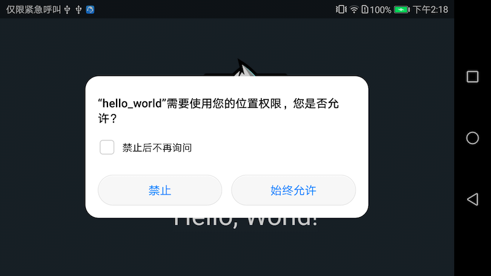

# 定位服务（HMS Core）

[华为定位服务](https://developer.huawei.com/consumer/cn/hms/huawei-locationkit)（HUAWEI Location Kit）采用 GPS、Wi-Fi、基站等多途径的混合定位模式进行定位，赋予应用开发者快速、精准地获取用户位置信息的能力，构建全球定位服务能力，助力开发者发展全球业务。当前华为定位服务的主要能力包含三个部分：融合定位、活动识别和地理围栏，开发者可以根据自己的需求，调用相应的能力。

- 融合定位：结合 GPS、Wi-Fi 和基站位置数据，为应用开发者提供一套简单易用的 API，方便开发者快速获取设备位置信息。

- 活动识别：通过加速度传感器、蜂窝网络信息、磁力计识别用户运动状态，便于开发者通过了解用户行为来调整应用程序。

- 地理围栏：应用开发者通过 API 设置感兴趣的位置区域，在指定操作（如离开、进入、驻留）发生时，即可及时收到一个通知。

### 主要功能

#### 请求位置更新

如果您的应用需要请求设备位置信息，您可以为您的应用申请位置权限，然后调用 HMS Core 的请求位置更新接口，设置不同的请求参数，根据您的需要指定定位方式，获取持续的位置信息回调。如果您获取位置信息后，想取消位置信息回调，可以调用移除位置更新接口，达到取消回调的目的。

#### 活动识别

如果您的应用需要获取设备的运动状态，例如：步行、跑步、骑自行车等，或者您的应用需要检测用户的运动状态变化，那么您可以为您的应用申请活动状态识别权限，通过调用活动状态识别更新接口，获取当前用户的活动状态。 如果您需要检测用户的运动状态变化，那么您可以调用活动状态转换接口，通过此接口您可以监听当前设备的活动状态转换。

#### 地理围栏

如果您对某些地点比较关注，您可以根据关注地点的位置，创建地理围栏，地理围栏可以感知当前设备所在位置和您的关注目标之间的距离，当用户进入围栏区域时，会向应用发起通知。同时，您可以检测用户在围栏内的停留时间，当用户在围栏内停留一段时间之后，再发起通知。

地理围栏同时支持页面操作，通过基于地图的拖拽和参数填写创建地理围栏，详情参见服务端开发。

## 一键接入定位服务

### 开通服务

- 使用 Cocos Creator 打开需要接入定位服务的项目工程。

- 点击菜单栏的 **面板 -> 服务**，打开 **服务** 面板，进入定位服务服务详情页，然后点击右上方的 **启用** 按钮即可。可参考 [一键开通服务](./user-guide.md#一键开通服务)。


- 参考 [AppGallery Connect配置](https://developer.huawei.com/consumer/cn/doc/development/HMS-Guides/account-preparation#h1-1573697333903) 文档，完成开发者注册、创建应用、生成和配置签名证书指纹和打开相关服务步骤。

- 定位服务可以直接使用，不需要在华为后台额外开通 API。

### 配置华为参数文件

大部分的华为相关项目都需要用到 `agconnect-services.json` 配置文件。若有新开通服务等操作，请及时更新该文件。

- 登录 [AppGallery Connect](https://developer.huawei.com/consumer/cn/service/josp/agc/index.html) 网站，点击 **我的项目**。
- 在项目列表中找到您的项目，在项目下的应用列表中选择您的应用。
- 在 **项目设置** 页面的 **应用**区域，点击 `agconnect-services.json` 下载配置文件。

我们将该文件统一放在工程下的 `/setting` 目录。

- Creator 2.4.3 以上版本可在 **构建** 面板直接配置该文件。
- Creator 2.4.3 以下版本，请将 `agconnect-services.json` 文件拷贝到工程目录下的 `/settings` 目录。

### 验证服务是否接入成功

- 完成 **定位服务** 接入步骤后，我们便可以通过在脚本中添加简单的代码来验证接入是否成功。

```
huawei.HMS.locationService.once(huawei.HMS.HMS_LOCATION_EVENT_LISTENER_NAME.HMS_LOCATION_PERMISSION, (result) => {
    if (result.code === huawei.HMS.HMSLocationActivityService.StatusCode.success) {
        console.log('获取权限成功');
    } else {
        console.log('获取权限失败', result.errMsg);
    }
});
huawei.HMS.locationService.requestLocationPermission();
```

- 代码添加后，[**打包发布**](../publish/publish-native.md) 到 **Android** 平台上运行，请确保发布的包名与华为后台设置的包名一致。

- 第一次运行一般会弹出申请位置权限对话框（见下图）即可验证接入成功。若已经申请过权限可在 Logcat 中查看日志。

    

## Sample 工程

您可以通过 Sample 工程快速体验定位服务。

- 点击定位服务面板中的 **Sample 工程** 按钮，Clone 或下载 HUAWEI Sample 工程，并在 Cocos Creator 中打开。

- [开通服务](#开通服务) 并 [配置华为参数文件](#配置华为参数文件) 后，可通过 Creator 编辑器菜单栏的 **项目 -> 构建发布** 打开 **构建发布** 面板来构建编译工程。Creator 2.4.1 及以上版本，可参考 [发布到 HUAWEI AppGallery Connect](../../../publish/publish-huawei-agc.md)。旧版本用户可构建发布到 Android 平台。

- 需要在安装 HMS Core 服务的华为或荣耀品牌手机上测试。点击 Sample 首页的 **Location** 按钮，进入该功能界面进行测试。

    

## 开发指南

定位服务所有 API 均走异步回调。可使用 `huawei.HMS.locationService.once` 获取单次回调或者 `huawei.HMS.locationService.on` 监听回调，下同。

### 定位服务

`huawei.HMS.locationService`

对应 [华为 HMS 文档 - 定位服务开发步骤](https://developer.huawei.com/consumer/cn/doc/development/HMSCore-Guides/location-develop-steps-0000001050746143)。

#### 检查应用权限

`checkLocationSettings(): void`

检查位置设置各开关是否可用。

**示例：**

```
huawei.HMS.locationService.once(huawei.HMS.HMS_LOCATION_EVENT_LISTENER_NAME.HMS_LOCATION_SETTINGS, (result) => {
    if (result.code === huawei.HMS.HMSLocationActivityService.StatusCode.success) {
        //todo
        console.log('检查应用权限成功');
    } else {
        //todo
        console.log('检查应用权限失败');
    }
});

huawei.HMS.locationService.checkLocationSettings();
```

#### 指定应用权限

`requestLocationPermission(): void`

动态申请位置权限方法。

**示例：**

```
huawei.HMS.locationService.once(huawei.HMS.HMS_LOCATION_EVENT_LISTENER_NAME.HMS_LOCATION_PERMISSION, (result) => {
    if (result.code === huawei.HMS.HMSLocationActivityService.StatusCode.success) {
        //todo
        console.log('指定应用权限成功');
    } else {
        //todo
        console.log('指定应用权限失败', result.errMsg);
    }
});
        
huawei.HMS.locationService.requestLocationPermission();
```

#### 持续获取位置信息

`requestLocationUpdates(): void`

如果您希望应用可以持续获取设备位置，需调用该方法。

**示例：**

```
huawei.HMS.locationService.once(huawei.HMS.HMS_LOCATION_EVENT_LISTENER_NAME.HMS_REQUEST_LOCATION_UPDATE, (result) => {
    if (result.code === huawei.HMS.HMSLocationActivityService.StatusCode.success) {
        //todo
        console.log('请求位置更新成功');
    } else {
        //todo
        console.log('请求位置更新失败', result.errMsg);
    }
});

huawei.HMS.locationService.requestLocationUpdates();
```

当您的应用程序不再需要接收位置更新时，应当停止位置更新，以便于降低功耗。

**示例：**

```
huawei.HMS.locationService.once(huawei.HMS.HMS_LOCATION_EVENT_LISTENER_NAME.HMS_REMOVE_LOCATION_UPDATE, (result) => {
    if (result.code === huawei.HMS.HMSLocationActivityService.StatusCode.success) {
        //todo
        console.log('取消持续定位成功');
    } else {
        //todo
        console.log('取消持续定位失败', result.errMsg);
    }
});

huawei.HMS.locationService.removeLocationUpdates();
```

#### 获取最后的已知位置

`getLastLocation(): void`

使用华为定位服务 API，您的应用程序可以获取设备最后的已知位置，大多情况下，该位置即为设备的当前位置。

**示例：**

```
huawei.HMS.locationService.once(huawei.HMS.HMS_LOCATION_EVENT_LISTENER_NAME.HMS_LAST_LOCATION, (location) => {
    if (location.code === huawei.HMS.HMSLocationActivityService.StatusCode.success) {
        //todo
        console.log('获取最后位置成功 lon:' + location.longitude + ",lat:" + location.latitude);
    } else {
        //todo
        console.log('获取最后位置失败', location.errMsg);
    }
});

huawei.HMS.locationService.getLastLocation();
```

#### 使用模拟位置信息功能

若需用到该功能，具体操作步骤：打开 **设置 -> 系统和更新 -> 开发人员选项 -> 选择模拟位置信息应用 -> 选择要 mock 的应用**（如果没有发现 “开发人员选项”，请执行如下操作：“设置 -> 关于手机 -> 版本号”，连续点击 “版本号” 7次，“开发人员选项” 会出现在 “系统与更新” 页面，再重复上述操作）。

在 AndroidManifest.xml 文件中配置模拟定位权限。

```
<uses-permission
android:name="android.permission.ACCESS_MOCK_LOCATION"
tools:ignore="MockLocation,ProtectedPermissions" />
```

**设置 mock 模式：**

`setMockMode(mockMode: boolean): void`

设置位置提供者是否使用位置模拟模式。为 true 时，将不再使用 GPS 或网络位置，最终直接返回通过 `setMockLocation` 设置的位置信息。

**传入参数：**

| 参数 | 含义 |  
| :---------- | :------------- |  
| mockMode | 是否打开 mock 模式 | 

**示例：**

```
huawei.HMS.locationService.once(huawei.HMS.HMS_LOCATION_EVENT_LISTENER_NAME.HMS_MOCK_MODE, (result) => {
    if (location.code === huawei.HMS.HMSLocationActivityService.StatusCode.success) {
        //todo
        console.log('设置 mock 模式成功');
    } else {
        //todo
        console.log('设置 mock 模式失败', result.errMsg);
    }
});

huawei.HMS.locationService.setMockMode(true);
```

**设置模拟位置信息**

`setMockLocation(latitude: string, longitude: string): void`

设置具体的模拟位置。必须在调用此方法之前调用 `setMockMode` 并设置为 true。

**参数说明：**

| 参数 | 说明 |  
| :---------- | :------------- |  
| latitude | 经度值 | 
| longitude | 纬度值 |

**示例：**

```
huawei.HMS.locationService.once(huawei.HMS.HMS_LOCATION_EVENT_LISTENER_NAME.HMS_MOCK_LOCATION, (result) => {
    if (location.code === huawei.HMS.HMSLocationActivityService.StatusCode.success) {
        //todo
        console.log('设置模拟位置信息成功');
    } else {
        //todo
        console.log('设置模拟位置信息失败', result.errMsg);
    }
});

//传入经纬度坐标
huawei.HMS.locationService.setMockLocation(24.4813889,118.1590724);
```

### 活动识别服务

`huawei.HMS.locationActivityService`

对应 [华为 HMS 文档 - 活动识别服务开发步骤](https://developer.huawei.com/consumer/cn/doc/development/HMSCore-Guides/activity-recognition-develop-steps-0000001050706110)。

#### 指定应用权限

`requestRecognitionPermission(): void`

[该权限](https://developer.huawei.com/consumer/cn/doc/development/HMSCore-Guides/activity-recognition-develop-steps-0000001050706110)属于危险权限，使用时需要动态申请。

**示例：**

```
huawei.HMS.locationActivityService.requestRecognitionPermission();
```

#### 注册活动识别更新

`createActivityIdentificationUpdates(intervalMillis: number): void`

[注册活动识别更新](https://developer.huawei.com/consumer/cn/doc/HMSCore-References-V5/activityidentificationservice-0000001050986183-V5#ZH-CN_TOPIC_0000001050986183__section177364246397)。

**参数说明：**

| 参数 | 说明 |  
| :---------- | :------------- |  
| intervalMillis | 活动检测更新间隔，对应 Java 侧 long 型。以毫秒为单位，值越大，活动检测越少，值越小，活动检测越频繁。 | 

**示例：**

```
huawei.HMS.locationActivityService.once(huawei.HMS.HMS_LOCATION_EVENT_LISTENER_NAME.HMS_CREATE_ACTIVITY_IDENTIFICATION_UPDATES, (result) => {
    if (result.code === huawei.HMS.HMSLocationActivityService.StatusCode.success) {
        //todo
        console.log('requestActivityUpdates...', 'success');
    } else {
        //todo
        console.log('requestActivityUpdates...', 'fail:', result.errMsg);
    }
});

huawei.HMS.locationActivityService.createActivityIdentificationUpdates(parseInt(time) || 5000);
```

#### 设置活动识别更新监听

需要设置监听来获取活动识别更新时的返回信息，无主动调用方法。

**示例：**

```
huawei.HMS.locationActivityService.on(huawei.HMS.HMS_LOCATION_EVENT_LISTENER_NAME.HMS_ACTIVITY_UPDATES, (result) => {
    //todo
    console.log('HMS_ACTIVITY_UPDATES', JSON.stringify(result));
}, this);

huawei.HMS.locationActivityService.on(huawei.HMS.HMS_LOCATION_EVENT_LISTENER_NAME.HMS_CONVERSION_UPDATES, (result) => {
    //todo
    console.log('HMS_CONVERSION_UPDATES...', JSON.stringify(result));
}, this);
```

#### 移除活动识别更新

`deleteActivityIdentificationUpdates(): void`

移除所有活动识别更新。

**示例：**

```
huawei.HMS.locationActivityService.once(huawei.HMS.HMS_LOCATION_EVENT_LISTENER_NAME.HMS_DELETE_ACTIVITY_IDENTIFICATION_UPDATES, (result) => {
    if (result.code === huawei.HMS.HMSLocationActivityService.StatusCode.success) {
        //todo
        console.log('removeActivityUpdates', 'success');
    } else {
        //todo
        console.log('removeActivityUpdates...', 'fail:', result.errMsg);
    }
}); 

huawei.HMS.locationActivityService.deleteActivityIdentificationUpdates();
```

#### 活动过渡更新

`createActivityConversionUpdates(params: any): void`

接口提供检测活动转换条件（进入、退出）的功能，例如需要检测用户从走路变为骑自行车的状态等。

**示例：**

```
huawei.HMS.locationActivityService.once(huawei.HMS.HMS_LOCATION_EVENT_LISTENER_NAME.HMS_CREATE_ACTIVITY_CONVERSION_UPDATES, (result) => {
    if (result.code === huawei.HMS.HMSLocationActivityService.StatusCode.success) {
        //todo
        console.log('createActivityConversionUpdates...', 'success');
    } else {
        //todo
        console.log('createActivityConversionUpdates...', 'fail:', result.errMsg);
    }
});
let cls = huawei.HMS.HMSConversionInfo;
let type = huawei.HMS.ACTIVITY_IDENTIFICATION_ENUM;
let params = [
    new cls(type.STILL, type.ENTER),
    new cls(type.STILL, type.LEAVE),
];

huawei.HMS.locationActivityService.createActivityConversionUpdates(param);
```

#### 移除活动过渡更新

`removeActivityConversionUpdates(): void`

移除活动过渡更新。

**示例：**

```
huawei.HMS.locationActivityService.once(huawei.HMS.HMS_LOCATION_EVENT_LISTENER_NAME.HMS_REMOVE_ACTIVITY_CONVERSION_UPDATES, (result) => {
    if (result.code === huawei.HMS.HMSLocationActivityService.StatusCode.success) {
        //todo
        console.log('removeActivityConversionUpdates...', 'success');
    } else {
        //todo
        console.log('removeActivityConversionUpdates...', 'fail:', result.errMsg);
    }
});

huawei.HMS.locationActivityService.removeActivityConversionUpdates();
```

### 地理围栏服务

`huawei.HMS.locationGeofenceService`

对应 [华为 HMS 文档 - 地理围栏服务开发步骤](https://developer.huawei.com/consumer/cn/doc/development/HMSCore-Guides/geofence-develop-steps-0000001050986159)。

#### 设置地理围栏监听

**示例：**

```
huawei.HMS.locationGeofenceService.on(huawei.HMS.HMS_LOCATION_EVENT_LISTENER_NAME.HMS_RECEIVE_GEOFENCE_DATA, (result) => {
    //todo
    console.log('HMS_RECEIVE_GEOFENCE_DATA...', JSON.stringify(result));
}, this);
```

#### 创建添加地理围栏的请求

**示例：**

```
huawei.HMS.locationGeofenceService.once(huawei.HMS.HMS_LOCATION_EVENT_LISTENER_NAME.HMS_CREATE_GEOFENCE_LIST, (result) => {
    if (result.code === huawei.HMS.HMSLocationActivityService.StatusCode.success) {
        //todo
        console.log('createGeofenceList', 'success');
    } else {
        //todo
        console.log('createGeofenceList...', 'fail:', result.errMsg);
    }
});
let cls = huawei.HMS.HMSGeofenceData;
let type = huawei.HMS.GEOFENCE_TYPE;
let list = [
    new cls(
        this.editBox.string,
        type.DWELL_GEOFENCE_CONVERSION | type.ENTER_GEOFENCE_CONVERSION | type.EXIT_GEOFENCE_CONVERSION,
        this.lat,
        this.lon,
        2000,
        60 * 60 * 1000,
        1000
)];
let requestType = huawei.HMS.HMS_LOCATION_GEOFENCEREQUEST;
let initType = requestType.EXIT_INIT_CONVERSION | requestType.ENTER_INIT_CONVERSION | requestType.DWELL_INIT_CONVERSION;
console.log('createGeofenceList...', 'params=', JSON.stringify(list), 'init type=', initType);

huawei.HMS.locationGeofenceService.createGeofenceList(list, initType);
```

#### 移除地理围栏

`removeWithIntent(): void`

**示例：**

```
huawei.HMS.locationGeofenceService.once(huawei.HMS.HMS_LOCATION_EVENT_LISTENER_NAME.HMS_REMOVE_GEOFENCE_WITH_INTENT, (result) => {
    if (result.code === huawei.HMS.HMSLocationActivityService.StatusCode.success) {
        //todo
        console.log('removeWithIntent', 'success');
    } else {
        //todo
        console.log('removeWithIntent...', 'fail:', result.errMsg);
    }
});

huawei.HMS.locationGeofenceService.removeWithIntent();
```

#### 通过 ID 移除地理围栏

`removeWithID(removeID: string): void`

**示例：**

```
huawei.HMS.locationGeofenceService.once(huawei.HMS.HMS_LOCATION_EVENT_LISTENER_NAME.HMS_REMOVE_GEOFENCE_WITH_ID, (result) => {
    if (result.code === huawei.HMS.HMSLocationActivityService.StatusCode.success) {
        //todo
        console.log('removeWithID', 'success');
    } else {
        //todo
        console.log('removeWithID fail:', result.errMsg);
    }
});

var removeID = "ID1";
huawei.HMS.locationGeofenceService.removeWithID(removeID);
```

## API 文档

