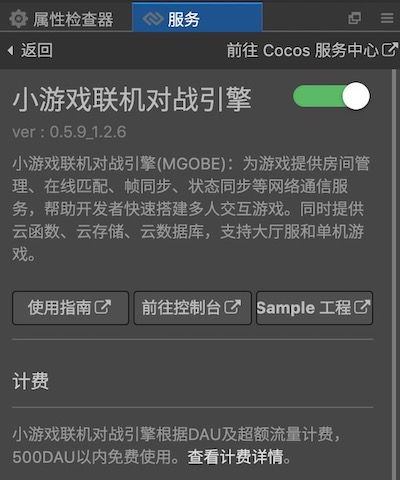
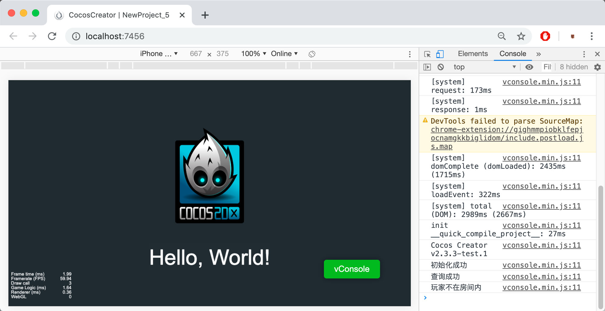
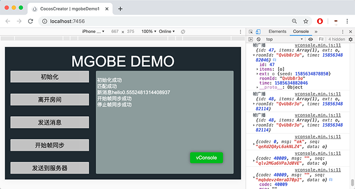
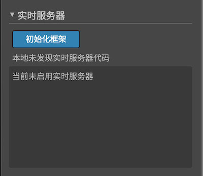
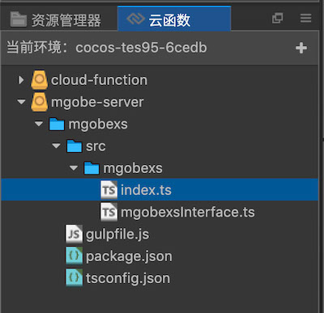

# 腾讯云 - 小游戏联机对战引擎 MGOBE 简介


[**小游戏联机对战引擎（Mini Game Online Battle Engine，MGOBE）**](https://cloud.tencent.com/product/mgobe) 为游戏提供房间管理、在线匹配、帧同步、状态同步等网络通信服务，帮助开发者快速搭建多人交互游戏。开发者无需关注底层网络架构、网络通信、服务器扩缩容、运维等，即可获得就近接入、低延迟、实时扩容的高性能联机对战服务，让玩家在网络上互通、对战、自由畅玩。MGOBE 适用于回合制、策略类、实时会话（休闲对战、MOBA、FPS）等游戏。

### 特性
- **实时云** ：依托腾讯云强大的网络、硬件资源，在国内多个地区部署云服务，使用多线 BGP 网络，并提供地域就近接入，确保更低延迟。
- **高可扩展性** ：自动伸缩的云服务，承接业务爆发式增长，从几十并发用户到上百万并发用户，页面一键扩容，无需购买服务器，无需服务器运维。
- **匹配机制** ：支持分数、模式、房间、地域多种匹配模式，还支持开发者自定义匹配机制，满足更多使用场景。
- **网络通信能力** ：支持帧同步和状态同步，快速、稳定实现客户端与其他客户端的通信。
- **快速接入** ：接口简单方便，只需要调用 JS 接口，即可快速实现房间管理、在线匹配、联网对战功能。
- **无忧定价** ：支持按量计费（每日最高在线、流量收费）和按套餐付费两种。从免费计划开始，随时调整配额。
- **实时服务器** ：房间管理会自动分配实时服务器，在实时服务器中运行实时对战和回合制游戏的逻辑，您无需购买服务器和运维，只需要填写游戏逻辑。
- **网络状态监控** ：实时网络监控，快速实现玩家掉线通知、弱网络通知和断线重连等功能。帮助开发者告知玩家所有玩家的网络状态，并在网络出现异常的情况下，及时作出相应处理。

### 应用场景
#### 帧同步应用场景

- **适用场景** ：实时会话游戏10人以内，棋牌，策略类回合制游戏。
- **优点** ：开发效率高，客户端同步指令给其他客户端。业务逻辑由客户端计算处理。


#### 状态同步应用场景

- **适用场景** ：实时会话游戏大于10人，棋牌，策略回合制游戏。
- **优点** ：容易防外挂，当人数比较多，客户端渲染压力大时，可以由服务端来处理。


## 一键接入 MGOBE 服务

### 开通 MGOBE 服务

1. 使用 Cocos Creator 打开需要接入 MGOBE 服务的项目工程。

2. 点击菜单栏的 **面板 -> 服务**，打开 **服务** 面板。设定 Cocos AppID 后，选择 MGOBE 项，进入 MGOBE 服务面板。然后点击右上方的 **启用** 按钮以开通 MGOBE 服务。详情可参考 [Cocos Service 操作指南](../user-guide.md)。

    

    **计费**：腾讯云 MGOBE 服务使用 **预付费** 模式，当你的服务使用超过服务商的免费部分，且账户余额不足时，会停止服务。这时候你需要在 Cocos 开发者账户中心进行 **预充值**。具体内容可参考 [计费与充值](../billing-and-charge.md)。

    开通服务后，Cocos Service 将自动开通 MGOBE 服务、联通腾讯云账号，并集成 MGOBE SDK 到游戏工程中。
    
    若之前没有在 Cocos Service 服务面板开通过腾讯云服务，跳转登录腾讯云控制台子账号的账号名，是您的 Cocos 账号的邮箱，初始密码会发到该邮箱和 Cocos 后台 站内信。建议登录后，将该子账号与微信绑定，之后便可使用微信扫码登录。
    
### 验证 MGOBE 接入是否成功

完成 MGOBE 服务接入步骤后，我们可以通过在脚本中添加简单的代码来验证 MGOBE 的接入是否成功。

1. 点击 MGOBE 服务设置面板中的 **前往控制台**，跳转到 [腾讯云 MGOBE 后台](https://www.matchvs.com/manage/)，获取接入参数 **游戏 ID** 、 **游戏 key** 和 **域名** ：

    

2. 在脚本中调用 MGOBE 的初始化，填入在 1 步骤中从 MGOBE 后台获取的 **游戏 ID** 、 **游戏 key** 和 **域名**：

    ```js
    const gameInfo = {
        // 替换 为控制台上的“游戏ID”
        gameId: '从 MGOBE 后台获取的 游戏 ID',
        secretKey: '从 MGOBE 后台获取的 游戏 key',
        openId: '玩家 ID ，可自定义',
	};

    const config = {
        // 替换 为控制台上的“域名”
        url: '从 MGOBE 后台获取的 域名',
        reconnectMaxTimes: 5,
        reconnectInterval: 1000,
        resendInterval: 1000,
        resendTimeout: 10000,
    };
    
    // 实例化 Room 对象
    const room = new MGOBE.Room();
    MGOBE.Listener.init(gameInfo, config, event => {
        if (event.code === 0) {
            console.log("初始化成功");
            // 初始化成功之后才能调用其他 API
            // 查询玩家自己的房间
            room.getRoomDetail(event => {
                if (event.code !== 0 && event.code !== 20011) {
                    return console.log(event);
                }
                console.log("查询成功");
                if (event.code === 20011) {
                    console.log("玩家不在房间内");
                } else {
                    // 玩家已在房间内
                    console.log("房间名", event.data.roomInfo.name);
                }
            });
        }
    });
    ```

3. 脚本修改完成并保存后，回到编辑器。在编辑器上方选择 **浏览器**，然后点击  [预览](../../getting-started/basics/preview-build.md) 按钮，若能在控制台中看到初始化和登录日志，即可验证 MGOBE 接入成功。

    
    
## MGOBE Sample 的集成调试
- 点击 MGOBE 服务面板中的 **Sample 工程** 按钮，Clone 或下载 [MGOBE Sample 工程](https://github.com/CocosService/mgobeDemo)，并在 Cocos Creator 中打开。

- 在 **服务** 面板中接入 MGOBE 服务，具体可参考上部分章节内容介绍。

- 脚本修改完成并保存后，回到编辑器。点击编辑器窗口正上方的  [预览](../getting-started/basics/preview-build.md) 按钮，即可在浏览器中调试该项目工程。



腾讯云 MGOBE 还提供了另一个 TypeScript 版的 Demo 版本，提供了更多功能展示，请参考 [**Cocos 引擎案例**](https://cloud.tencent.com/document/product/1038/40875)。

## 实时服务器面板使用说明

- 若需要使用实时服务器，创建服务后，请在 MGOBE 服务面板下方，点击 **初始化框架** 按钮，选择 JS 或者 TS 语言版本，进行本地框架代码初始化操作。

    

- MGOBE 与 TCB 共用云函数面板，若初始化框架后没有出现云函数面板，可以在 **菜单 -> 面板 -> 云函数** 中重新打开。 

- 以 TS 版本为例，初始化后，在云函数面板中会出现 `mgobe-server` ，即为 MGOBE 的实时服务器框架。`src/mgobexs/index.ts` 即为实时服务器主文件。

    

- 修改主文件后，可以在云函数任意层级右键，点击 **立即发布** ，上传代码，进行调试。

    

## 文档链接

- [**腾讯云 MGOBE 管理后台**](https://console.cloud.tencent.com/mgobe)
- [**小游戏联机对战引擎 MGOBE 简介**](https://cloud.tencent.com/product/mgobe)
- [**小游戏联机对战引擎产品详细信息**](https://cloud.tencent.com/product/mgobe/details)
- [**小游戏联机对战引擎计费概述**](https://cloud.tencent.com/document/product/1038/33293)
- [**小游戏联机对战引擎常见问题**](https://cloud.tencent.com/document/product/1038/42134)
- [**小游戏联机对战引擎文档与资源**](https://cloud.tencent.com/product/mgobe/developer)


更多文档可直接在 [**腾讯云文档中心 - 小游戏联机对战引擎**](https://cloud.tencent.com/document/product/1038) 中查阅

