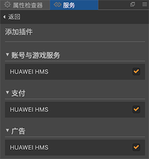
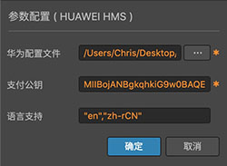
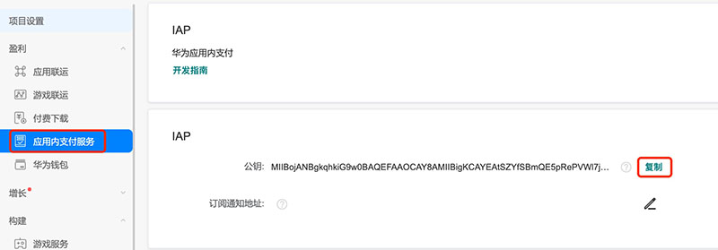

# HUAWEI HMS 插件

目前 SDKHub 提供的华为 HMS SDK 插件，包括了 [游戏服务](https://developer.huawei.com/consumer/cn/doc/development/HMS-Guides/game-introduction-v4)、[应用内支付服务](https://developer.huawei.com/consumer/cn/doc/development/HMS-Guides/iap-service-introduction-v4)、[广告服务](https://developer.huawei.com/consumer/cn/doc/development/HMS-Guides/ads-sdk-introduction) 和部分 [账号服务](https://developer.huawei.com/consumer/cn/doc/development/HMS-Guides/account-introduction-v4) 功能，用户需在 JS 层调用 SDKHub 接口，处理回调。

插件中的 **账号 & 游戏服务**、**支付服务**、**广告服务** 三大功能均可独立使用。

SDKHub 框架和插件中基本不涉及当前状态处理和服务端接口，例如当前用户是否登录等情况，需要游戏端进行判断，避免在用户未登录下，调用账号和游戏服务其他接口。华为 HMS SDK 插件中在支付情况下，做了本地验证，但用户需要登录或支付服务端验证（可选）时，请使用回调中的信息，自行到服务端进行验证。

- [校验登录签名接口](https://developer.huawei.com/consumer/cn/doc/development/HMS-References/verify-login-signature)
- [Order服务购买Token校验](https://developer.huawei.com/consumer/cn/doc/development/HMS-Guides/iap-order-service-purchase-token-verification-v4)

## 准备工作

- 参考 [AppGallery Connect配置](https://developer.huawei.com/consumer/cn/doc/development/HMS-Guides/account-preparation#h1-1573697333903) 文档，完成开发者注册、创建应用、生成和配置签名证书指纹和打开相关服务步骤。
- 集成 HMS Core SDK 的工作，SDKHub 会在构建时 **自动完成**，无需关注。
- 若需要使用支付功能，请提前准备好注册开发者本人的银行卡，需要填写相关收款信息。提交后审核可能需要 1-2 个工作日。
- 需要在安装 HMS 服务的华为或荣耀品牌手机上测试。

## SDKHub 操作

- 使用 Cocos Creator 打开需要接入 SDKHub 的项目工程。

- 点击菜单栏的 **面板 -> 服务**，打开 **服务** 面板。设定 Cocos AppID 后，选择 SDKHub，进入 SDKHub 服务面板。然后点击右上方的 **启用** 按钮以开通 SDKHub 服务。详情可参考 [Cocos Service 操作指南](https://docs.cocos.com/creator/manual/zh/cocos-service/user-guide.html)。

     

- 在 SDKHub 服务面板上添加一个新配置集
    
    

    

- 添加后点击 **配置插件** 按钮，勾选 **HUAWEI HMS** 所需相关服务插件。
 
    

- 点击 **插件** 下的配置按钮，填写所需的配置。

    

    

- `agconnect-services.json` 配置文件，创建项目后在开发者后台获取。

    
    
- [支付公钥](https://developer.huawei.com/consumer/cn/doc/development/HMS-Guides/appgallery_querypaymentinfo)，勾选支付服务时需要填写。

    
    
- [语言设置](https://developer.huawei.com/consumer/cn/doc/development/HMS-Guides/game-preparation-v4) 

    - 此项目可为设置为空，应用将默认支持所有 HMS SDK 支持的语言。
    - 填写格式为 **"en", "zh-rCN", "需要支持的其他语言"** 。
    - HMS SDK 支持的语言列表请参考 [HMS SDK 支持的语言](https://developer.huawei.com/consumer/cn/doc/development/HMS-Guides/hmssdk_supported_language)。


- 配置完成并接入相关接口后，即可在 Cocos Creator 顶部菜单 **项目 -> 构建发布** 中构建工程，在 Android Studio 中编译工程，进行测试。

- 若修改工程参数配置或者 JS 代码层，在构建发布面板重新构建，即可在 Android Studio 继续编译发布操作。

- 若需要删减服务插件配置（例如去掉支付功能），建议删除工程下的 `/build` 目录，重新构建。

## 获取测试用例

请点击服务面板 - Sample 工程按钮，或者到 [GitHub 地址](https://github.com/CocosService/sdkhubDemo) ，Clone 或下载测试用例。

## 接口文档

考虑过去苹果 IAP 审核方面等的问题经验，我们将支付关键字设为 `fee`。

### 公共部分

#### 获取对象

`getSupportPlugin` ：获取插件列表，可在判断是否含有 `User`、`Fee`、`Ads` 或 `Custom` 字段来判断是否存在该系统对象。

```
var plugins = SDKHub.AgentManager.getInstance().getSupportPlugin();
```

- `getUserPlugin` ：获取用户（账号和游戏）系统对象
- `getFeePlugin` ：获取支付系统对象
- `getAdsPlugin` ：获取广告系统对象

```
this.user = SDKHub.AgentManager.getInstance().getUserPlugin();
this.fee = SDKHub.AgentManager.getInstance().getFeePlugin();
this.ads = SDKHub.AgentManager.getInstance().getAdsPlugin();
```

`setListener`：设置该系统的统一回调，回调值和返回信息说明请参考下方各系统部分

一些提示性的回调，`msg` 中为 String 形式，仅供参考。而若是回调 `msg` 格式为 JSON，可能需要解析 JSON 内容，获取需要的参数。若回调值为失败情况，且存在 `rtnCode` 参数，则该参数为华为提供的回调值，可在华为文档中查找该回调值说明，个别接口可能需要做特殊处理。

```
this.user.setListener(this.onUserResult, this);

onUserResult:function(code, msg){ 
}
```

#### 扩展方法调用

`callFuncWithParam` 非框架原有的接口，使用该方法调用，需要传入的参数和方法名，请参考下方各系统说明文档。

```
// var params = 0; //若参数值需要单个数字或字符串等情况，也可能用此写法。
var params = {
    "id1" : "value1",
    "id2" : "value2",
    ······
};
this.xxx.callFuncWithParam("functionName", params);
```

例如华为 HMS 的 `getGamePlayerStats` 方法：

```
var params = 0;
this.user.callFuncWithParam("getGamePlayerStats", params);
```

#### 其他公共方法

`getPluginId` 获取系统对象 ID

```
var userPluginId = this.user.getPluginId();
var feePluginId = this.fee.getPluginId();
```

`getPluginVersion` 获取插件版本，例如 "1.0.0_4.0.3"，下划线前为插件的版本号，下划线后为接入平台 SDK 的版本号。

```
var userPluginVersion = this.user.getPluginVersion()
```

### 用户 & 游戏系统

华为系统的方法较多，大部分接口需要使用扩展方法调用，并大量返回扩展回调。需要配合参考华为官方对应的文档进行调用。

假定我们将该系统对象设置为 `this.user`，下同。

```this.user = SDKHub.AgentManager.getInstance().getUserPlugin();```

#### 回调

各系统回调中，若返回的 msg 为 JSON 格式，且有需要的返回值，请参考华为文档，在 msg 中解析 JSON 格式，获取所需的参数。

```
this.user.setListener(this.onUserResult, this);

onUserResult:function(code, msg){ 
    console.log("on user result action.");
    console.log("code: " + code);
    console.log("msg: " + msg);
    switch(code) {
        case 20000:
        //todo
        break;
    }
}
```

#### 登录

`login` 登录方法，对应 [游戏服务 - 游戏登录](https://developer.huawei.com/consumer/cn/doc/development/HMS-Guides/game-login-v4) 文档。

华为 HMS SDK 登录成功后，插件中会再调用 `getCurrentPlayer` 方法，获取当前玩家信息，通过回调返回给用户，用户也可以主动调用 `getUserInfo` 方法获取登录信息。此时可以根据获取的登录签名，调用 [校验登录签名接口](https://developer.huawei.com/consumer/cn/doc/development/HMS-References/verify-login-signature) 对玩家信息进行验签。

```js
this.user.login();
``` 

| 回调信息 | code | msg |
| --- | --- | --- |
| 登录成功 | SDKHub.UserRetCode.kLoginSuccess | JSON格式，用户信息，可用于服务端验证 |
| 登录失败 | SDKHub.UserRetCode.kLoginFail | 登录失败描述文字 |

#### 登出

`logout` 登出方法，对应 [账号服务 - 登出华为账号](https://developer.huawei.com/consumer/cn/doc/development/HMS-Guides/account-guide-v4#h1-1573729918116) 文档，游戏类型不一定需要使用该方法。

```
this.user.logout();
```

| 回调信息 | code | msg |
| --- | --- | --- |
| 登出成功 | SDKHub.UserRetCode.kLogoutSuccess | 登出成功描述文字 |
| 登出失败 | SDKHub.UserRetCode.kLogoutFail | 登录失败描述文字 |

#### 获取用户信息

调用 `login` 并完成登录后，插件中会再调用华为 HMS 的 `getCurrentPlayer` 方法，获取当前玩家信息，通过回调返回给用户，也可以调用本方法主动获取用户信息。可以根据获取的登录签名，调用 [校验登录签名接口](https://developer.huawei.com/consumer/cn/doc/development/HMS-References/verify-login-signature) 对玩家信息进行验签。

```
var userInfo = this.user.getUserInfo();
console.log("userInfo", JSON.stringify(userInfo));
```

#### 显示与隐藏浮标

`showToolBar` 和 `hideToolBar` ，对应 [游戏服务 - 浮标](https://developer.huawei.com/consumer/cn/doc/development/HMS-Guides/game-buoy-v4#h1-1576589973315) 文档。由于插件中已经在生命周期 `onResume` 和 `onPause` 调用这两个方法，正常用户也无需再做主动调用。

- 发布地区包含中国大陆的联运游戏，要求必须集成游戏浮标，游戏的所有界面都需要展示游戏浮标。
- 对于EMUI 9.1.1及以上版本的华为设备，HMS Core（APK）会自动展示游戏浮标而忽略本接口的请求，开发者无需关注。

```
this.user.showToolBar(0); //数字设计为浮标显示的方位，华为 HMS 没有使用到该参数，但需要传 0。

this.user.hideToolBar();
```

#### 成就

`showAchievement` 显示成就方法和 `unlockAchievement` 解锁成就方法，对应 [游戏服务 - 成就](https://developer.huawei.com/consumer/cn/doc/development/HMS-Guides/game-achievement) 文档。该模块类型和功能较多，用户需通过扩展方式，按以下参数传值调用。

`showAchievement` 显示成就

| 参数名 | 填写要求 | 说明 |
| --- | --- | --- |
| type | "0" | 若 type 传 1，则由应用自行展示成就列表界面，传 0 则由应用助手展示成就列表界面 |

```
var params = { "type": "0" }; 
this.user.showAchievements(params);
```

`unlockAchievement` 解锁成就

| 参数名 | 填写要求 | 说明 |
| --- | --- | --- |
| type | "visualizeWithResult" "growWithResult" "makeStepsWithResult" "reachWithResult" | 对应文档各子方法 |
| achievementId | "5D9580837D32CB59Cxxx" | 后台配置后生成的成就 ID |
| stepsNum | "50" | int 型，当前成就的步长，growWithResult 和 makeStepsWithResult 子方法需要该参数 |

```
//visualizeWithResult
var params1 = {
    "type": "visualizeWithResult",
    "achievementId": "5D9580837D32CB59CFEC89DAD39470CDF9B672033A2D6F14689BC01335818444"
};
this.user.unlockAchievement(params1);

//growWithResult
var params2 = {
    "type": "makeStepsWithResult",
    "achievementId": "5D9580837D32CB59CFEC89DAD39470CDF9B672033A2D6F14689BC01335818444",
    "stepsNum": "50"
};
this.user.unlockAchievement(params2);

//makeStepsWithResult
var params3 = {
    "type": "makeStepsWithResult",
    "achievementId": "5D9580837D32CB59CFEC89DAD39470CDF9B672033A2D6F14689BC01335818444",
    "stepsNum": "50"
};
this.user.unlockAchievement(params3);

//reachWithResult
var params4 = {
    "type": "reachWithResult",
    "achievementId": "5D9580837D32CB59CFEC89DAD39470CDF9B672033A2D6F14689BC01335818444"
};
this.user.unlockAchievement(params4);
```

#### 排行榜

`showLeaderBoard` 显示排行榜方法和 `submitScore` 提交分数方法，对应 [游戏服务 - 排行榜](https://developer.huawei.com/consumer/cn/doc/development/HMS-Guides/game-leaderboards-development) 功能文档。

`showLeaderBoard` 显示排行榜

| 参数名 | 填写要求 | 说明 |
| --- | --- | --- |
| type | "getRankingsIntent" "getRankingSummary" | 对应文档各方法：直接展示应用助手的排行榜和自行展示排行榜列表 |
| rankingId | "5D9580837D32CB59Cxxx" | 可选，如果需要获取所有排行榜就不要传该参数 |
| timeDimension | "1" | 可选，"getRankingsIntent" 情况下的指定时间维度，"0"：日，表示获取当天的排行榜数据。"1"：周，表示获取本周的排行榜数据。"2"：全部时间。需要与 rankingId 同时传入 |
| isRealTime | "1" | 可选，"getRankingSummary" 情况下指定获取方式。"0"：不联网，表示从本地缓存获取。"1"：联网，表示直接从游戏服务器获取。默认为 "1" |

```
var params1 = {
    "type": "getRankingsIntent",
};
this.user.showLeaderBoard(params1);

var params2 = {
    "type": "getRankingSummary",
    "rankingId":"2008EE56BB773FA325FFB1349D0D206A8B0EC3E9E2F0D32E786E574ADD10E7A1",
    "isRealTime": "1"
};
this.user.showLeaderBoard(params2);
```

`submitScore` 提交分数

| 参数名 | 填写要求 | 说明 |
| --- | --- | --- |
| type | "getRankingSwitchStatus" "setRankingSwitchStatus" "submitRankingScore" | 对应文档各方法 |
| stateValue | "1" | setRankingSwitchStatus 需要传入，排行榜开关状态，默认为 0，需设置为 1 才可提交分数 |
| rankingId | "5D9580837D32CB59Cxxx" | submitRankingScore 情况需要传入，后台配置后生成的排行榜 ID |
| score | "10000" | submitRankingScore 情况需要传入，要提交到排行榜的分数，long 型 |
| scoreTips | "金币" | submitRankingScore 情况可选，有自定义单位情况下需要传入 |

```
var params1 = {
    "type": "getRankingSwitchStatus",
};
this.user.submitScore(params1);

var params2 = {
    "type": "setRankingSwitchStatus",
    "stateValue": 1
};
this.user.submitScore(params2);

var params3 = {
    "type": "submitRankingScore",
    "rankingId":"2008EE56BB773FA325FFB1349D0D206A8B0EC3E9E2F0D32E786E574ADD10E7A1",
    "score": "15000",
    "scoreTips": "分数"
};
this.user.submitScore(params3);
```

#### 扩展方法

##### 华为帐号取消授权
`cancelAuthorization`，对应文档 [账号服务开发指南 - 华为帐号取消授权](https://developer.huawei.com/consumer/cn/doc/development/HMS-Guides/account-guide-v4#h1-1573730230709) 为了提升应用隐私安全，应用可以提供入口，供用户取消对应用的授权。

```
this.user.callFuncWithParam("cancelAuthorization");
```

##### 防沉迷相关方法：
`submitPlayerEventStart`、`submitPlayerEventEnd` 和 `getPlayerExtraInfo`，对应文档 [游戏服务 - 防沉迷](https://developer.huawei.com/consumer/cn/doc/development/HMS-Guides/game-anti-indulgence-v4)，中国大陆发布的游戏需要开发者按照上述通知结合游戏自身完成游戏防沉迷功能的开发。

当玩家登录游戏或从后台切到游戏前台时，调用 `submitPlayerEventStart`。游戏定期调用`getPlayerExtraInfo` 方法查询玩家附加信息。服务器允许的最高频率为10分钟查询一次，一般建议15分钟查询一次。当玩家退出游戏、从前台切到后台或游戏异常退出（进程终止、手机重启等）时，应用调用 `submitPlayerEventEnd` 上报玩家退出游戏事件。

```
this.user.callFuncWithParam("submitPlayerEventStart");

this.user.callFuncWithParam("getExtraInfo");

this.user.callFuncWithParam("submitPlayerEventEnd");
```

注意事项：
`submitPlayerEventStart` 和 `getPlayerExtraInfo` 如果回调中 retCode 返回 7002 或 7006 错误码，需进行如下处理：

- 7002：需判断是否为网络问题，如果不是网络问题则表示该帐号未在中国大陆注册，请直接放通，无需进行强制处理。

- 7006：表示该帐号未在中国大陆注册，请直接放通，无需进行强制处理。

##### 事件上报方法 
`submitEvent` 和 `getEvent` 对应文档 [游戏服务 - 事件上报](https://developer.huawei.com/consumer/cn/doc/development/HMS-Guides/game-events) 事件上报为开发者提供了收集玩家在游戏过程中产生的特定数据，上报并存储至华为游戏服务器，随后在AppGallery Connect上进行归纳分析的能力。

`submitEvent` 上报玩家的事件数据

| 参数名 | 填写要求 | 说明 |
| --- | --- | --- |
| eventId | "5D9580837D32CB59Cxxx" | 当前事件的ID，在配置事件时生成 |
| growAmount | "20" | 在已有事件数值的基础上要增量增加的数值 |

```
var params = {
    "eventId": "A29DB82609936BE9DBB44CF7AFBBAECD5D2B7F14A05FB2B37EF543E7622F7B7F",
    "growAmount": "20"
};
this.user.callFuncWithParam("submitEvent", params);
```

`getEvent` 获取玩家事件的数据

| 参数名 | 填写要求 | 说明 |
| --- | --- | --- |
| forceReload | "1" | 可选，"0"：不联网，表示从本地缓存获取。"1"：联网，表示直接从游戏服务器获取。默认为 "1" |
| eventIds | "eventId1, eventId2" | 传入事件 ID ，获取特定事件数据 |

```
var params = {
    "eventIds":"A29DB82609936BE9DBB44CF7AFBBAECD5D2B7F14A05FB2B37EF543E7622F7B7F"
};
this.user.callFuncWithParam("getEvent", params);
```

##### 玩家信息统计

`getGamePlayerStats`，对应文档 [游戏服务 - 玩家信息统计](https://developer.huawei.com/consumer/cn/doc/development/HMS-Guides/game-playerinfo-development)，玩家信息统计是指开发者可以从华为游戏服务器获取当前玩家在游戏中的多种统计信息，帮助开发者更深度了解玩家的游戏习惯，以便根据玩家的游戏进度、支付能力等构建更适合该玩家的游戏体验。

```
// 表示从本地缓存获取数据。本地缓存时间为5分钟，如果本地无缓存或缓存超时，则从游戏服务器获取
var params = 0; 
this.user.callFuncWithParam("getGamePlayerStats", params)
```

##### 获取游戏基本信息

`getGameSummary`，对应文档 [游戏服务 - 游戏基本信息](https://developer.huawei.com/consumer/cn/doc/development/HMS-Guides/game-baseinfo-development)，游戏基本信息是指游戏应用的相关信息，例如游戏的应用ID、游戏名称、游戏描述、游戏分类等。当开发者需要在游戏中使用游戏应用的信息时，可以从华为游戏服务器获取游戏基本信息。

```
// 如果已经获取过游戏基本信息，params = 0，调用 GameSummaryClient.getLocalGameSummary 获取本地缓存的当前游戏信息
// 如果未获取过游戏基本信息，params = 1 调用GameSummaryClient.getGameSummary 获取服务器保存的当前游戏信息
var params = 0; 
this.user.callFuncWithParam("getGamePlayerStats", params)
```

### 支付系统

假定我们将支付系统对象设置为 `this.fee`，下同。

`this.fee = SDKHub.AgentManager.getInstance().getFeePlugin();`

#### 回调

该系统回调中，若返回的 msg 为 JSON 格式，且有需要的返回值，请参考华为文档，在 msg 中解析 JSON 格式，获取所需的参数。

```
this.fee.setListener(this.onFeeResult, this);

onFeeResult:function(code, msg){ 
    console.log("on fee result action.");
    console.log("code: " + code);
    console.log("msg: " + msg);
    switch(code) {
        case 30000:
        //todo
        break;
    }
}
```

#### 发起购买

`feeForProduct` 发起购买方法，对应 [应用内支付服务 - 发起购买](https://developer.huawei.com/consumer/cn/doc/development/HMS-Guides/iap-development-guide-v4#h1-1576554485195) 文档。

| 参数名 | 填写要求 | 说明 |
| --- | --- | --- |
| Product_ID | "CProduct1" | 后台配置商品的商品 ID |
| priceType | "0" | 可选，0/1/2 分别对应消耗型商品，非消耗型商品和订阅型商品，不传则默认为 "0" |
| EXT | "50extra" | 可选，对应 setDeveloperPayload 方法，支付透传参数 |

```
var params =
{
    "Product_Id": "CProduct1",
    "priceType" : "0",
    "EXT" : "50extra"
}

this.fee.feeForProduct(params);
```

#### 扩展方法

##### 判断是否支持应用内支付方法

`isEnvReady`，在使用应用内支付之前，您的应用需要向华为 IAP 发送 isEnvReady 请求，以此判断用户当前登录的华为帐号所在的服务地，是否在华为 IAP 支持结算的国家或地区中。对应 [应用内支付服务 - 判断是否支持应用内支付](https://developer.huawei.com/consumer/cn/doc/development/HMS-Guides/iap-development-guide-v4#h1-1576554507764) 文档。

```
this.fee.callFuncWithParam("isEnvReady");
```

##### 展示商品信息方法

`obtainProductInfo`，若您使用在华为 AppGallery Connect 网站上配置的商品，则需要在您的应用中使用 `obtainProductInfo` 接口来获取此类商品的详细信息。对应 [应用内支付服务 - 展示商品信息方法](https://developer.huawei.com/consumer/cn/doc/development/HMS-Guides/iap-development-guide-v4#h1-1576554496306) 文档。

| 参数名 | 填写要求 | 说明 |
| --- | --- | --- |
| productIdList | "item1,item2" | 后台配置商品的商品 ID，若需传入多个以逗号分隔 |
| priceType | "0" | 可选，0/1/2 分别对应消耗型商品，非消耗型商品和订阅型商品，不传则默认为 0 |

```
var params = {
    "productIdList": "item1,item2", //后台配置的商品 ID
    "priceType": 0
};
this.fee.callFuncWithParam("obtainProductInfo", params);
```

##### 获取用户已购未发货的消耗型商品的购买信息

`obtainOwnedPurchases`，对应 [应用内支付服务 - 消耗型商品的补单机制](https://developer.huawei.com/consumer/cn/doc/development/HMS-Guides/iap-development-guide-v4#h1-1576554449972) 文档。获取用户已购未发货的消耗型商品的购买信息，若有存在用户已购未发货商品，会在回调中包含用商品购买信息及其签名数据。可使用公钥进行签名验证并做补发。

建议在游戏开始时调用，获取用户还有哪些购买商品没有发货并做处理。

```
var params = {0}; // int型，0/1/2 分别对应消耗型商品、非消耗型商品和订阅型商品
this.fee.callFuncWithParam("obtainOwnedPurchases", params);
```

##### 对已发货商品进行消耗

`consumeOwnedPurchase`，对应 [应用内支付服务 - 消耗型商品的补单机制](https://developer.huawei.com/consumer/cn/doc/development/HMS-Guides/iap-development-guide-v4#h1-1576554449972) 文档。确认商品已发货后，使用该接口消耗所有已发货商品，以此通知华为服务器更新商品的发货状态。对于消耗型商品，应用成功执行消耗之后，华为服务器会将相应商品重新设置为可购买状态，用户即可再次购买该商品。

该接口也可以通过服务端调用，可参考 [Order 服务确认购买](https://developer.huawei.com/consumer/cn/doc/development/HMS-References/iap-api-confirm-purchase-for-order-service-v4)。

```
//需要传入 String 型的 InAppPurchaseData
params = "{\"autoRenewing\":false,\"orderId\":\"2020062217560950540a857561.102164071\",\"packageName\":\"com.sdkboxv2.sample.huawei\",\"applicationId\":102164071,\"kind\":0,\"productId\":\"2\",\"productName\":\"10元宝\",\"purchaseTime\":1592902971000,\"purchaseTimeMillis\":1592902971000,\"purchaseState\":0,\"developerPayload\":\"test\",\"purchaseToken\":\"00000172e06a6ffc7e698a6c7c059648c71652874676a369b7d004c479c21a780b3537731ccbf846x434e.1.102164071\",\"consumptionState\":0,\"confirmed\":0,\"purchaseType\":0,\"currency\":\"CNY\",\"price\":1,\"country\":\"CN\",\"payOrderId\":\"sandbox202006230502513581D7E22\",\"payType\":\"4\"}";
this.fee.callFuncWithParam("consumeOwnedPurchase", params);
```

##### 查看用户购买历史

`obtainOwnedPurchaseRecord` ，对应 [应用内支付服务 - 查看用户购买历史](https://developer.huawei.com/consumer/cn/doc/development/HMS-Guides/iap-development-guide-v4#h1-1576554422714) 文档。对于消耗型商品，可使用该接口获取用户所有已消耗即已发货的商品信息

```
// int型，0/1/2 分别对应消耗型商品、非消耗型商品和订阅型商品
var params = {0};
this.fee.callFuncWithParam("obtainOwnedPurchaseRecord", params);
```

##### 提供订阅管理的页面跳转

`startIapActivity` ，对应 [订阅专用功能说明 - 提供订阅管理的页面跳转](https://developer.huawei.com/consumer/cn/doc/development/HMS-Guides/iap-subscription-functions-v4#h1-1576566818427) 文档。开发者的应用可以通过该接口跳转到华为IAP的管理订阅页面和编辑订阅页面。

| 参数名 | 填写要求 | 说明 |
| --- | --- | --- |
| reqType | "TYPE_SUBSCRIBE_EDIT_ACTIVITY" | 若传入 "TYPE_SUBSCRIBE_EDIT_ACTIVITY" 显示编辑订阅页面，若传入 "TYPE_SUBSCRIBE_MANAGER_ACTIVITY" 显示管理订阅页面 |

```
var params = {
    "reqType" : "TYPE_SUBSCRIBE_MANAGER_ACTIVITY"
};
this.fee.callFuncWithParam("startIapActivity", params);
```

### 广告系统

目前广告系统接入的是 [流量变现服务](https://developer.huawei.com/consumer/cn/doc/development/HMS-Guides/ads-sdk-introduction) 部分。接入广告形式为 [Banner](https://developer.huawei.com/consumer/cn/doc/development/HMS-Guides/ads-sdk-guide-banner)，[激励广告](https://developer.huawei.com/consumer/cn/doc/development/HMS-Guides/ads-sdk-guide-reward) 和 [插屏广告](https://developer.huawei.com/consumer/cn/doc/development/HMS-Guides/ads-sdk-guide-interstitial)。开屏广告若有需要用户可自己直接在工程中接入。

激励广告和插屏广告均需要先调用 `preloadAds` ，成功回调后再调用 `showAds`。Banner 广告可直接调用 `showAds`。

假定我们将广告系统对象设置为 `this.ads`，下同。

`this.ads = SDKHub.AgentManager.getInstance().getAdsPlugin();`

#### 回调

该系统回调中，若返回的 msg 为 JSON 格式，且有需要的返回值，请参考华为文档，在 msg 中解析 JSON 格式，获取所需的参数。

```
this.ads.setListener(this.onAdsResult, this);

onAdsResult:function(code, msg){ 
    console.log("on ads result action.");
    console.log("code: " + code);
    console.log("msg: " + msg);
    switch(code) {
        case 40000:
        //todo
        break;
    }
}
```

#### 预加载广告 

`preloadAds` 预加载广告方法

| 参数名 | 填写要求 | 说明 |
| --- | --- | --- |
| adType | "Interstitial"  "Reward"  | 广告类型 |
| adId | "testb4znbuh3n2" | 广告 ID |

```
var params = { "adType": "Interstitial", "adId": "testb4znbuh3n2" };
this.ads.preloadAds(params);
```

#### 显示广告

`showAds` 显示广告方法

| 参数名 | 填写要求 | 说明 |
| --- | --- | --- |
| adType | "Interstitial"  "Reward" "Banner"  | 广告类型 |
| adId | "testx9dtjwj8hp" | 广告 ID |
| pos | "0" | 广告位置，Banner 情况下可选，默认为 "0"，"0"：正下方，"1"：正中，"2"：正上方 |
| adSize | "BANNER_SIZE_360_144" | 广告尺寸，Banner 情况下可选，默认为 "BANNER_SIZE_360_57"，传入值可参考 [广告尺寸](https://developer.huawei.com/consumer/cn/doc/development/HMS-Guides/ads-sdk-guide-banner#h1-1576047688608) |

```
var params = { 
    "adType": "Banner", 
    "adId": "testw6vs28auh3"
    "pos": "0"
    "adSize": "BANNER_SIZE_360_144"
};
this.ads.showAds(params);
```


