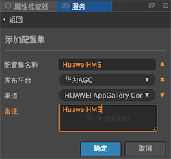
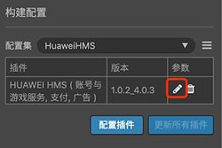

# HUAWEI HMS Core 插件使用指南

目前 SDKHub 提供的华为 HMS Core 插件，包括了 [游戏服务](https://developer.huawei.com/consumer/cn/hms/huawei-game)、[应用内支付服务](https://developer.huawei.com/consumer/cn/hms/huawei-iap/)、[广告服务](https://developer.huawei.com/consumer/cn/hms/huawei-adskit)、和部分 [账号服务](https://developer.huawei.com/consumer/cn/hms/huawei-accountkit)，开发者需在 JS 层调用 SDKHub 接口，处理回调。

插件中的 **账号 & 游戏服务**、**支付服务** 和 **广告服务** 均可独立使用。

SDKHub 框架和插件基本不涉及当前状态处理和服务端接口，例如当前用户是否登录等情况，需要游戏端进行判断，避免在用户未登录下，调用账号和游戏服务其他接口。华为 HMS Core 插件在支付情况下做了本地验证，但如果用户需要登录或支付服务端验证（可选），请使用回调中的信息，自行到服务端进行验证。

- [校验登录签名接口](https://developer.huawei.com/consumer/cn/doc/development/HMS-References/verify-login-signature)
- [Order 服务购买 Token 校验](https://developer.huawei.com/consumer/cn/doc/development/HMS-Guides/iap-order-service-purchase-token-verification-v4)

## 准备工作

- 参考 [AppGallery Connect 配置](https://developer.huawei.com/consumer/cn/doc/development/HMS-Guides/account-preparation#h1-1573697333903) 文档，完成开发者注册、创建应用、生成和配置签名证书指纹以及打开相关服务这几个步骤。
- 集成 HMS Core SDK，SDKHub 会在构建时 **自动完成**，无需手动操作。
- 若需要使用支付功能，请提前准备好注册开发者本人的银行卡，填写相关收款信息。提交后审核可能需要 1~2 个工作日。
- 需要在安装 HMS Core 服务的华为或荣耀品牌手机上测试。

## 开通 SDKHub

- 使用 Cocos Creator 打开需要接入 SDKHub 的项目工程。

- 点击菜单栏的 **面板 -> 服务**，打开 **服务** 面板。设定 Cocos AppID 后，选择 SDKHub，进入 SDKHub 服务面板。然后点击右上方的 **启用** 按钮以开通 SDKHub 服务。详情可参考 [Cocos Service 操作指南](../user-guide.md)。

   

- 在 SDKHub 服务面板上添加一个新配置集
    
  

  进入 **添加配置集** 页面，填写相关参数，填写完成后点击 **确定** 即可

  

- 添加完成后点击 **配置插件** 按钮，勾选所需的 **HUAWEI HMS Core** 相关服务插件。
 
  

- 点击 **插件** 行对应的编辑参数按钮，填写所需的配置。

  

  进入 **参数配置** 页面，填写所需的参数配置。

  

  - **华为配置文件**：创建项目后在 [AppGallery Connect 后台](https://developer.huawei.com/consumer/cn/service/josp/agc/index.html) 的 **我的项目 -> 项目设置 -> 常规 -> 应用** 中获取。

    
    
  - [支付公钥](https://developer.huawei.com/consumer/cn/doc/development/HMS-Guides/appgallery_querypaymentinfo)，勾选支付服务时需要填写。

    
    
  - [语言设置](https://developer.huawei.com/consumer/cn/doc/development/HMS-Guides/game-preparation-v4) 
    - 此参数为选填项。如果您的应用不需要设置只支持某些特定语言，该参数可以设置为空，应用将默认支持所有 HMS Core SDK 支持的语言。
    - 如果您的应用需要设置只支持某些特定语言，填写格式为 **"en", "zh-rCN", "需要支持的其他语言"** 。
    - HMS Core SDK 支持的语言列表请参考文档 [HMS SDK 支持的语言](https://developer.huawei.com/consumer/cn/doc/development/HMS-Guides/hmssdk_supported_language)。

- 配置完成并接入相关 API 接口后，即可通过 Creator 编辑器菜单栏的 **项目 -> 构建发布** 打开 **构建发布** 面板来构建编译工程。Creator 2.4.1 及以上版本，可参考 [发布到 HUAWEI AppGallery Connect](../../publish/publish-huawei-agc.md)。旧版本用户可构建发布到 Android 平台。

- 若需要修改工程参数配置或者 JS 代码层，修改完成后，在构建发布面板重新构建即可。

- 若需要删减服务插件配置（例如去掉支付功能），建议删除工程构建后生成的发布包 `build/jsb-link` 或者 `build/jsb-default` 目录，然后重新构建。

## 获取测试用例

点击 SDKHub 服务面板中的 **Sample 工程** 按钮，Clone 或下载，并在 Cocos Creator 中打开。使用方法可参考文档 [SDKHub Simple 工程](sdkhub.md#sample-%E5%B7%A5%E7%A8%8B)。

## 各系统 API 接口说明

### UserPlugin 用户 & 游戏系统

华为系统的方法较多，部分接口需要使用扩展方法调用，并返回扩展回调。可能需要配合参考 [SDKHub Sample 工程](https://github.com/CocosService/sdkhubDemo) 中的代码与华为官方对应的文档进行调用。

#### login

**登录方法**，可参考 [游戏服务 - 游戏登录](https://developer.huawei.com/consumer/cn/doc/development/HMS-Guides/game-login-v4) 文档。

华为 HMS Core SDK 登录成功后，插件中会再调用华为 HMS Core SDK 的 [getCurrentPlayer](https://developer.huawei.com/consumer/cn/doc/development/HMSCore-Guides-V5/game-login-0000001050121526-V5#ZH-CN_TOPIC_0000001051062343__section20387552101519) 方法，获取当前玩家信息，通过回调返回给用户，用户也可以主动调用 `getUserInfo` 方法获取登录信息。可读取 **userID** 参数作为用户唯一 ID。此时也可以根据获取的登录签名，调用 [校验登录签名接口](https://developer.huawei.com/consumer/cn/doc/development/HMS-References/verify-login-signature) 对玩家信息进行验签。

#### logout

**登出方法**，可参考 [账号服务 - 登出华为账号](https://developer.huawei.com/consumer/cn/doc/development/HMS-Guides/account-guide-v4#h1-1573729918116) 文档。HMS SDK 会清理华为帐号登录信息，游戏端需要自行判断登录状态。

#### getUserInfo

**获取用户信息方法**，HMS 插件将返回登录方法中的回调信息。

#### showToolBar / hideToolBar

**浮标方法**，可参考 [游戏服务 - 浮标](https://developer.huawei.com/consumer/cn/doc/development/HMS-Guides/game-buoy-v4#h1-1576589973315) 文档。由于插件中已经在生命周期 `onResume` 和 `onPause` 调用这两个方法，**用户无需再做主动调用**。

#### showAchievement

**显示成就方法**，可参考 [游戏服务 - 成就](https://developer.huawei.com/consumer/cn/doc/development/HMS-Guides/game-achievement) 文档。

**参数说明**：

| 参数名 | 填写要求 | 说明 |
| :--- | :--- | :--- |
| type | "getShowAchievementListIntent" "getAchievementList" | 直接跳转或执行展示成就列表 |
| forceReload | "1" | "getAchievementList" 情况可选参数： "0"：不联网，表示从本地缓存获取 "1"：联网，表示直接从游戏服务器获取。默认为 "1" |

#### unlockAchievement

**解锁成就方法**，可参考 [游戏服务 - 成就](https://developer.huawei.com/consumer/cn/doc/development/HMS-Guides/game-achievement) 文档。

**参数说明**：

| 参数名 | 填写要求 | 说明 |
| :--- | :--- | :--- |
| type | "visualizeWithResult" "growWithResult" "makeStepsWithResult" "reachWithResult" | 对应文档各子方法 |
| achievementId | "5D9580837D32CB59Cxxx" | 后台配置后生成的成就 ID |
| stepsNum | "50" | 当前成就的步长，growWithResult 和 makeStepsWithResult 情况需要该参数 |

#### showLeaderBoard

**显示排行榜方法**，可参考 [游戏服务 - 排行榜](https://developer.huawei.com/consumer/cn/doc/development/HMS-Guides/game-leaderboards-development) 文档。

**参数说明**：

| 参数名 | 填写要求 | 说明 |
| :--- | :--- | :--- |
| type | "getRankingsIntent" "getRankingSummary" "getCurrentPlayerRankingScore" "getPlayerCenteredRankingScores" "getMoreRankingScores" "getRankingTopScores" | 对应文档各子方法：直接展示应用助手的排行榜和自行展示排行榜列表等。 |
| rankingId | "5D9580837D32CB59Cxxx" | 可选，如果需要获取所有排行榜就不要传该参数。 |
| timeDimension | "1" | 可选，"getRankingsIntent" "getCurrentPlayerRankingScore" "getRankingTopScores" 情况下的指定时间维度。 "0"：日，表示获取当天的排行榜数据。 "1"：周，表示获取本周的排行榜数据。 "2"：全部时间。需要与 rankingId 同时传入。 |
| isRealTime | "1" | 可选，"getRankingSummary"、"getRankingTopScores"、getPlayerCenteredRankingScores 情况下指定获取方式。 "0"：不联网，表示从本地缓存获取。 "1"：联网，表示直接从游戏服务器获取。默认为 "1"。 |
| maxResults | "15" | "getMoreRankingScores"、"getPlayerCenteredRankingScores"、"getRankingTopScores" 必传参数每页的最大数量，支持取值为 1 ~ 21 的整数。 |
| offsetPlayerRank | "1" | "getMoreRankingScores" 必传，"getPlayerCenteredRankingScores" 与 "getRankingTopScores" 可选，从 offsetPlayerRank 指定的位置，根据 pageDirection 指定的数据获取方向获取一页数据，offsetPlayerRank 取值必须为大于等于 0 的整数。 例如 offsetPlayerRank 取值为 5，pageDirection 取值为 0，表示从排行榜的第 5 位分数向下获取一页数据。 |
| pageDirection | "0" | "getRankingTopScores"、"getPlayerCenteredRankingScores" 可选，数据获取方向。 "0"：下一页 "1"：上一页，默认为 "0" |

#### submitScore

**提交分数方法**，可参考 [游戏服务 - 排行榜](https://developer.huawei.com/consumer/cn/doc/development/HMS-Guides/game-leaderboards-development) 文档。

**参数说明**：

| 参数名 | 填写要求 | 说明 |
| :--- | :--- | :--- |
| type | "getRankingSwitchStatus" "setRankingSwitchStatus" "submitRankingScore" | 对应文档各子方法。 |
| stateValue | "1" | setRankingSwitchStatus 需要传入，排行榜开关状态，默认为 0，需设置为 1 才可提交分数。 |
| rankingId | "5D9580837D32CB59Cxxx" | submitRankingScore 情况需要传入，后台配置后生成的排行榜 ID |
| score | "10000" | submitRankingScore 情况需要传入，要提交到排行榜的分数，long 型。|
| scoreTips | "金币" | submitRankingScore 情况可选，有自定义单位情况下需要传入。 |

#### callFuncWithParam

需要通过扩展方法调用接口说明：

- `cancelAuthorization`

  **华为帐号取消授权**，可参考 [账号服务开发指南 - 华为帐号取消授权](https://developer.huawei.com/consumer/cn/doc/development/HMS-Guides/account-guide-v4#h1-1573730230709) 文档，为了提升应用隐私安全，应用可以提供入口，供用户取消对应用的授权。

  **回调说明**：

  | 扩展回调值 SDKHub.kUserExtension | msg 类型 | msg 说明 |
  | :--- | :--- | :--- |
  | + 122 | String | 取消登录授权成功描述 |
  | + 123 | String | 取消登录授权失败描述 |

- `submitPlayerEventStart`/`submitPlayerEventEnd`/`getPlayerExtraInfo`

  **防沉迷相关方法**，可参考 [游戏服务 - 防沉迷](https://developer.huawei.com/consumer/cn/doc/development/HMS-Guides/game-anti-indulgence-v4) 文档，中国大陆发布的游戏需要开发者按照上述通知结合游戏自身完成游戏防沉迷功能的开发。

  - 当玩家登录游戏或从后台切到游戏前台时，调用 `submitPlayerEventStart`。游戏定期调用 `getPlayerExtraInfo` 方法查询玩家附加信息。服务器允许的最高频率为 10 分钟查询一次，一般建议 15 分钟查询一次。当玩家退出游戏、从前台切到后台或游戏异常退出（进程终止、手机重启等）时，会调用 `submitPlayerEventEnd` 上报玩家退出游戏事件。

  - **注意**：`submitPlayerEventStart` 和 `getPlayerExtraInfo` 如果回调中 `retCode` 返回 7002 或 7006 错误码，需进行如下处理：
    - 7002：需判断是否为网络问题，如果不是网络问题则表示该帐号未在中国大陆注册，请直接放通，无需进行强制处理。
    - 7006：表示该帐号未在中国大陆注册，请直接放通，无需进行强制处理。

  **回调说明**：

  | 扩展回调值 `SDKHub.kUserExtension` | msg 类型 | msg 说明 |
  | :--- | :--- | :--- |
  | + 106 | JSON | 上报玩家进入游戏事件成功，可获取参数 transactionId |
  | + 107 | JSON / String | 上报玩家进入游戏事件失败 |
  | + 108 | JSON | 上报玩家退出游戏事件成功，可获取参数 traceId |
  | + 109 | JSON / String | 上报玩家退出游戏事件失败 |
  | + 110 | JSON | 查询玩家附加信息成功，可获取参数 isRealName、isAdult、playerId、playerDuration |
  | + 111 | JSON / String | 查询玩家附加信息失败 |

- `submitEvent`

  **事件上报方法**，可参考 [游戏服务 - 事件上报](https://developer.huawei.com/consumer/cn/doc/development/HMS-Guides/game-events) 文档。事件上报为开发者提供了收集玩家在游戏过程中产生的特定数据，上报并存储至华为游戏服务器，随后在 AppGallery Connect 上进行归纳分析的能力。

  **参数说明**：

  | 参数名 | 填写要求 | 说明 |
  | :--- | :--- | :--- |
  | eventId | "5D9580837D32CB59Cxxx" | 当前事件的 ID，在配置事件时生成，后台获取。 |
  | growAmount | "20" | 在已有事件数值的基础上要增量增加的数值。 |

  **回调说明**：

  | 扩展回调值 SDKHub.kUserExtension | msg 类型 | msg 说明 |
  | :--- | :--- | :--- |
  | + 112 | String | 调用事件上报回调，无成功或失败情况返回 |

- `getEvent`

  **获取玩家事件的数据**，可参考 [游戏服务 - 事件上报](https://developer.huawei.com/consumer/cn/doc/development/HMS-Guides/game-events) 文档。

  **参数说明**：

  | 参数名 | 填写要求 | 说明 |
  | :--- | :--- | :--- |
  | forceReload | "1" | 可选，默认为 "1"。 "0"：不联网，表示从本地缓存获取。 "1"：联网，表示直接从游戏服务器获取。 |
  | eventIds | "eventId1, eventId2" | 传入事件 ID，获取特定事件数据，通过逗号分隔。 |

  **回调说明**：

  | 扩展回调值 `SDKHub.kUserExtension` | msg 类型 | msg 说明 |
  | :--- | :--- | :--- |
  | + 114 | JSON | 获取事件数据成功，可获取参数 eventId。 |
  | + 115 | JSON / String | 获取事件数据失败描述 |

- `getGamePlayerStats`

  **玩家信息统计方法**，可参考 [游戏服务 - 玩家信息统计](https://developer.huawei.com/consumer/cn/doc/development/HMS-Guides/game-playerinfo-development) 文档，玩家信息统计是指开发者可以从华为游戏服务器获取当前玩家在游戏中的多种统计信息，帮助开发者更深度了解玩家的游戏习惯，以便根据玩家的游戏进度、支付能力等构建更适合该玩家的游戏体验。

  **参数说明**：

  | 参数名 | 填写要求 | 说明 |
  | :--- | :--- | :--- |
  | isRealTime | 0 | Number 型 1：是，表示从游戏服务器获取数据。 0：否，表示从本地缓存获取数据。本地缓存时间为5分钟，如果本地无缓存或缓存超时，则从游戏服务器获取。 |

  **回调说明**：

  | 扩展回调值 `SDKHub.kUserExtension` | msg 类型 | msg 说明 |
  | :--- | :--- | :--- |
  | + 116 | JSON | 获取事件数据成功，可获取参数 averageOnLineMinutes、daysFromLastGame、paymentTimes、onlineTimes、totalPurchasesAmountRange |
  | + 117 | JSON / String | 获取事件数据失败描述 |

- `getGameSummary`

  **获取游戏基本信息方法**，可参考 [游戏服务 - 游戏基本信息](https://developer.huawei.com/consumer/cn/doc/development/HMS-Guides/game-baseinfo-development) 文档。游戏基本信息是指游戏应用的相关信息，例如游戏的应用ID、游戏名称、游戏描述、游戏分类等。当开发者需要在游戏中使用游戏应用的信息时，可以从华为游戏服务器获取游戏基本信息。

  **参数说明**：

  | 参数名 | 填写要求 | 说明 |
  | :--- | :--- | :--- |
  | isLocal | 0 | Number 型 1：是，表示从游戏服务器获取数据。 0：否，表示从本地缓存获取数据。 |

  **回调说明**：

  | 扩展回调值 SDKHub.kUserExtension | msg 类型 | msg 说明 |
  | :--- | :--- | :--- |
  | + 118 | JSON | 获取事件数据成功，可获取参数 achievementCount, appId, descInfo, gameName, gameHdImgUri, gameIconUri, rankingCount, firstKind, secondKind |
  | + 119 | JSON / String | 获取事件数据失败描述 |

#### ReadSmsManager

**自动读取短信方法**，可选，可参考 [账号服务 - 自动读取短信验证码](https://developer.huawei.com/consumer/cn/doc/development/HMS-Guides/account-guide-v4#h1-1573730317319) 文档。本插件在 User 系统初始化时调用了请求开启短信读取服务，用户无需调用代码，**仅需处理回调**。

**回调说明**：

| 扩展回调值 SDKHub.kUserExtension | msg 类型 | msg 说明 |
| :--- | :--- | :--- |
| + 102 | String | 自动读取短信验证码初始化回调 |
| + 103 | String | 自动读取短信验证码超时回调 |
| + 104 | String | 返回读取的短信验证码信息 |

### FeePlugin 支付系统

考虑过去苹果 IAP 审核方面等的问题经验，我们将支付关键字设为 `fee`。

#### feeForProduct

`feeForProduct` **支付方法**，可参考 [应用内支付服务 - 发起购买](https://developer.huawei.com/consumer/cn/doc/development/HMS-Guides/iap-development-guide-v4#h1-1576554485195) 文档。由于华为现在要求商品都在后台配置，仅需要传以下参数。

**参数说明**：

| 参数名 | 填写要求 | 说明 |
| :--- | :--- | :--- |
| Product_ID | "CProduct1" | 后台配置商品的商品 ID。 |
| priceType | "0" | 可选，0/1/2 分别对应消耗型商品，非消耗型商品和订阅型商品，不传则默认为 "0"。 |
| EXT | "50extra" | 可选，对应 setDeveloperPayload，支付透传参数。 |

#### callFuncWithParam

需要通过扩展方法调用接口说明：

- `isEnvReady`

  **判断是否支持应用内支付方法**，在使用应用内支付之前，您的应用需要向华为 IAP 发送 isEnvReady 请求，以此判断用户当前登录的华为帐号所在的服务地，是否在华为 IAP 支持结算的国家或地区中。可参考 [应用内支付服务 - 判断是否支持应用内支付](https://developer.huawei.com/consumer/cn/doc/development/HMS-Guides/iap-development-guide-v4#h1-1576554507764) 文档。

  **回调说明**：

  | 扩展回调值 `SDKHub.kFeeExtension` | msg 类型 | msg 说明 |
  | :--- | :--- | :--- |
  | + 100 | JSON | 支持应用内支付情况描述 |
  | + 101 | JSON / String | 不支持应用内支付情况描述 |

- `obtainProductInfo`

  **展示商品信息方法**，若您使用在华为 AppGallery Connect 网站上配置的商品，则需要在您的应用中使用 `obtainProductInfo` 接口来获取此类商品的详细信息。可参考 [应用内支付服务 - 展示商品信息方法](https://developer.huawei.com/consumer/cn/doc/development/HMS-Guides/iap-development-guide-v4#h1-1576554496306) 文档。

  **参数说明**：

  | 参数名 | 填写要求 | 说明 |
  | :--- | :--- | :--- |
  | productIdList | "item1,item2" | 后台配置商品的商品 ID，若需传入多个以逗号分隔。 |
  | priceType | "0" | 可选，0/1/2 分别对应消耗型商品，非消耗型商品和订阅型商品，不传则默认为 0。 |

  **回调说明**：

  | 扩展回调值 SDKHub.kFeeExtension | msg 类型 | msg 说明 |
  | :--- | :--- | :--- |
  | + 102 | JSONArray | 返回商品信息成功，可解析 msg 展示商品 |
  | + 103 | JSON / String | 返回商品信息失败 |

- `obtainOwnedPurchases`

  **获取用户已购未发货的消耗型商品的购买信息**，可参考 [应用内支付服务 - 消耗型商品的补单机制](https://developer.huawei.com/consumer/cn/doc/development/HMS-Guides/iap-development-guide-v4#h1-1576554449972) 文档。获取用户已购未发货的消耗型商品的购买信息，若有存在用户已购未发货商品，会在回调中包含用商品购买信息及其签名数据。可使用公钥进行签名验证并做补发。

  建议在游戏开始时调用，获取用户还有哪些购买商品没有发货并做处理。

  **参数说明**：

  | 参数名 | 填写要求 | 说明 |
  | :--- | :--- | :--- |
  | type | 0 |  Number 型，0/1/2 分别对应消耗型商品、非消耗型商品和订阅型商品。 |

  **回调说明**：

  | 扩展回调值 SDKHub.kFeeExtension | msg 类型 | msg 说明 |
  | :--- | :--- | :--- |
  | + 106 | JSONArray | 可解析 Array，调用 consumeOwnedPurchase 方法  |
  | + 107 | JSON / String | 操作失败描述 |

- `consumeOwnedPurchase`

  **对已发货商品进行消耗**，可参考 [应用内支付服务 - 消耗型商品的补单机制](https://developer.huawei.com/consumer/cn/doc/development/HMS-Guides/iap-development-guide-v4#h1-1576554449972) 文档。确认商品已发货后，使用该接口消耗所有已发货商品，以此通知华为服务器更新商品的发货状态。对于消耗型商品，应用成功执行消耗之后，华为服务器会将相应商品重新设置为可购买状态，用户即可再次购买该商品。

  该接口也可以通过服务端调用，可参考 [Order 服务确认购买](https://developer.huawei.com/consumer/cn/doc/development/HMS-References/iap-api-confirm-purchase-for-order-service-v4) 文档。

  **回调说明**：

  | 扩展回调值 `SDKHub.kFeeExtension` | msg 类型 | msg 说明 |
  | :--- | :--- | :--- |
  | + 104 | String | 消耗品确认交易成功描述 |
  | + 105 | JSON / String | 消耗品确认交易失败描述 |

- `obtainOwnedPurchaseRecord`

  **查看用户购买历史**，可参考 [应用内支付服务 - 查看用户购买历史](https://developer.huawei.com/consumer/cn/doc/development/HMS-Guides/iap-development-guide-v4#h1-1576554422714) 文档。对于消耗型商品，可使用该接口获取用户所有已消耗即已发货的商品信息。

  **参数说明**：

  | 参数名 | 填写要求 | 说明 |
  | :--- | :--- | :--- |
  | type | 0 |  Number 型，0/1/2 分别对应消耗型商品、非消耗型商品和订阅型商品。 |

  **回调说明**：

  | 扩展回调值 `SDKHub.kFeeExtension` | msg 类型 | msg 说明 |
  | :--- | :--- | :--- |
  | + 118 | JSONArray | 返回购买历史信息 |
  | + 109 | JSON / String | 返回购买历史信息失败 |

- `startIapActivity`

  **提供订阅管理的页面跳转**，可参考 [订阅专用功能说明 - 提供订阅管理的页面跳转](https://developer.huawei.com/consumer/cn/doc/development/HMS-Guides/iap-subscription-functions-v4#h1-1576566818427) 文档。开发者的应用可以通过该接口跳转到华为 IAP 的管理订阅页面和编辑订阅页面。

  **参数说明**：

  | 参数名 | 填写要求 | 说明 |
  | :--- | :--- | :--- |
  | reqType | "TYPE_SUBSCRIBE_EDIT_ACTIVITY" | 若传入"TYPE_SUBSCRIBE_EDIT_ACTIVITY" 显示编辑订阅页面 若传入 "TYPE_SUBSCRIBE_MANAGER_ACTIVITY" 显示管理订阅页面。 |

  **回调说明**：

  | 扩展回调值 SDKHub.kFeeExtension | msg 类型 | msg 说明 |
  | :--- | :--- | :--- |
  | + 110 | JSON | 打开页面成功描述 |
  | + 111 | JSON / String | 打开页面失败描述 |

### AdsPlugin 广告系统

目前广告系统接入的是 [流量变现服务](https://developer.huawei.com/consumer/cn/doc/development/HMS-Guides/ads-sdk-introduction) 部分。接入广告形式为 [Banner](https://developer.huawei.com/consumer/cn/doc/development/HMS-Guides/ads-sdk-guide-banner)，[激励广告](https://developer.huawei.com/consumer/cn/doc/development/HMS-Guides/ads-sdk-guide-reward) 和 [插屏广告](https://developer.huawei.com/consumer/cn/doc/development/HMS-Guides/ads-sdk-guide-interstitial)。开屏广告若有需要用户可自己直接在工程中接入。

激励广告和插屏广告均需要先调用 `preloadAds`，收到成功回调后再调用 `showAds`。Banner 广告可直接调用 `showAds`。

#### preloadAds

预加载广告方法。

**参数说明**：

| 参数名 | 填写要求 | 说明 |
| :--- | :--- | :--- |
| adType | "Interstitial" "Reward"  | 广告类型 |
| adId | "testb4znbuh3n2" | 广告 ID |

#### showAds

显示广告方法。

**参数说明**：

| 参数名 | 填写要求 | 说明 |
| :--- | :--- | :--- |
| adType | "Interstitial" "Reward" "Banner"  | 广告类型 |
| adId | "testx9dtjwj8hp" | 广告 ID |
| pos | "0" | 广告位置，Banner 情况下可选，默认为 "0"。 "0"：正下方 "1"：正中 "2"：正上方。 |
| adSize | "BANNER_SIZE_360_144" | 广告尺寸，Banner 情况下可选，默认为 "BANNER_SIZE_360_57"，传入值可参考 [广告尺寸](https://developer.huawei.com/consumer/cn/doc/development/HMS-Guides/ads-sdk-guide-banner#h1-1576047688608) 文档。 |
