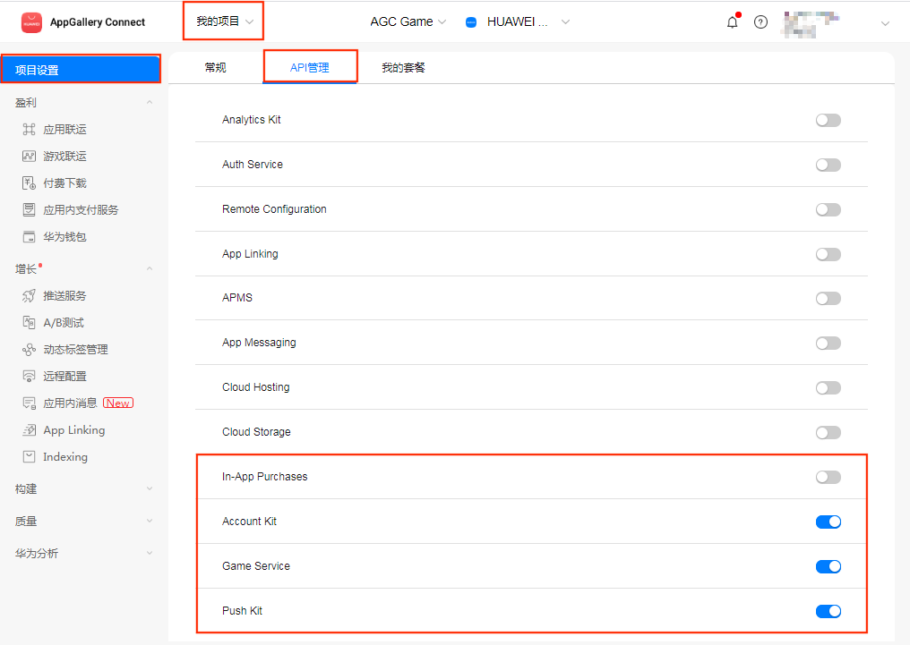
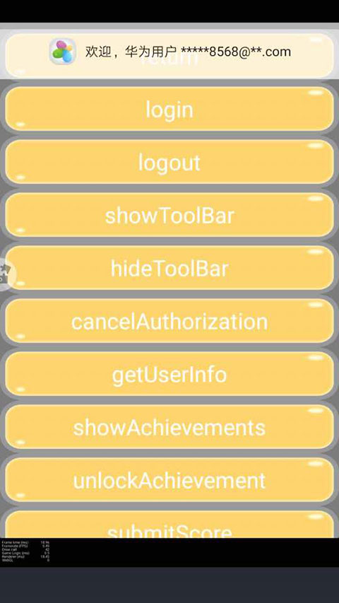
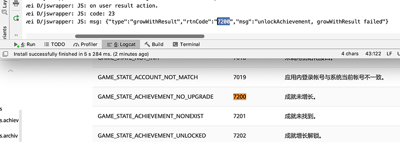

# HUAWEI HMS Core 插件使用指南

目前 Cocos SDKHub 提供的华为 HMS Core 插件，包括了 [游戏服务](https://developer.huawei.com/consumer/cn/hms/huawei-game)、[应用内支付服务](https://developer.huawei.com/consumer/cn/hms/huawei-iap/)、[广告服务](https://developer.huawei.com/consumer/cn/hms/huawei-adskit)、[推送服务](https://developer.huawei.com/consumer/cn/hms/huawei-pushkit) 和部分 [账号服务](https://developer.huawei.com/consumer/cn/hms/huawei-accountkit)，开发者需在 JS 层调用 Cocos SDKHub 接口，处理回调。

插件中的 **账号 & 游戏服务**、**支付服务**、**广告服务** 和 **推送服务** 均可独立使用。

Cocos SDKHub 框架和插件基本不涉及当前状态处理和服务端接口，例如当前用户是否登录等情况，需要游戏端进行判断，避免在用户未登录下，调用账号和游戏服务其他接口导致崩溃。华为 HMS Core 插件在支付成功情况下也做了本地验证。但如果用户需要登录或支付服务端验证（可选），请使用回调中的信息，自行到服务端进行验证。

- [校验登录签名接口](https://developer.huawei.com/consumer/cn/doc/development/HMS-References/verify-login-signature)
- [Order 服务购买 Token 校验](https://developer.huawei.com/consumer/cn/doc/development/HMS-Guides/iap-order-service-purchase-token-verification-v4)

## 准备工作

- 参考 [AppGallery Connect 配置](https://developer.huawei.com/consumer/cn/doc/development/HMS-Guides/account-preparation#h1-1573697333903) 文档，在 [华为开发者联盟后台](https://developer.huawei.com/consumer/cn/console) 注册开发者账号，创建游戏应用和 **生成和配置签名证书指纹**。在该游戏应用的 **我的项目 -> 项目设置 -> API 管理** 页面中开通 **Account Kit**、**In-App Purchases**、**Game Service**、**Push Kit** 服务。华为文档中的集成 HMS Core SDK 部分，Cocos SDKHub 会在构建时 **自动完成**，无需开发者手动操作。

     

- 若需要使用支付服务，请提前准备好注册开发者本人的银行卡，填写相关收款信息。提交后审核可能需要 1~2 个工作日。开通 **In-App Purchases** 服务后到后台 [配置商品信息](https://developer.huawei.com/consumer/cn/doc/development/HMSCore-Guides/config-product-0000001050033076)。支付服务支持 [沙盒测试](https://developer.huawei.com/consumer/cn/doc/HMSCore-Guides-V5/sandbox-testing-0000001050035039-V5)。请注意配置后的商品是否为 **有效** 状态。
    
- 若需要使用游戏服务，需要开发者 [配置成就和事件](https://developer.huawei.com/consumer/cn/doc/HMSCore-Guides-V5/config-agc-0000001050166285-V5#ZH-CN_TOPIC_0000001051142256__section122826183710)，获取对应的 ID。

- 需要在安装 HMS Core 服务的华为或荣耀品牌手机上测试。

## Sample 工程

开发者可以通过 Sample 工程快速体验 Cocos SDKHub。若开发者需要在自己的游戏工程中接入 HMS Core SDK，也可参考此流程。请先确保 [准备工作](#准备工作) 部分已经完成，并且已获取到所需参数。

- 点击 Cocos SDKHub 服务面板中的 **Sample 工程** 按钮，Clone 或下载，并在 Cocos Creator 中打开。

- 点击菜单栏的 **面板 -> 服务**，打开 **服务** 面板，选择 **Cocos SDKHub**，进入服务详情页。然后点击右上方的 **启用** 按钮即可开通服务。详情可参考 [服务面板操作指南](../user-guide.md)。

   

- 在 Cocos SDKHub 服务面板上添加一个新配置集
    
  

  进入 **添加配置集** 页面，填写相关参数，填写完成后点击 **确定** 即可

  

- 添加完成后点击 **配置插件** 按钮，勾选所需的 **HUAWEI HMS Core** 相关服务插件。
 
  

- 点击 **插件** 行对应的编辑参数按钮。

  

  进入 **参数配置** 页面，配置所需的参数。

  

  - **华为配置文件**：创建项目后在 [AppGallery Connect 后台](https://developer.huawei.com/consumer/cn/service/josp/agc/index.html) 的 **我的项目 -> 项目设置 -> 常规 -> 应用** 中获取。

    
    
  - [支付公钥](https://developer.huawei.com/consumer/cn/doc/development/HMS-Guides/appgallery_querypaymentinfo)，勾选支付服务时需要填写。

    
    
  - [语言支持](https://developer.huawei.com/consumer/cn/doc/development/HMS-Guides/game-preparation-v4) 
    - 此参数为选填项。如果开发者的应用不需要设置只支持某些特定语言，该参数可以设置为空，应用将默认支持所有 HMS Core SDK 支持的语言。
    - 如果开发者的应用需要设置只支持某些特定语言，填写格式为 **"en", "zh-rCN", "需要支持的其他语言"**。
    - HMS Core SDK 支持的语言列表请参考文档 [HMS SDK 支持的语言](https://developer.huawei.com/consumer/cn/doc/development/HMS-Guides/hmssdk_supported_language)。


- 请在工程中的 `config.js` 文件中，替换支付商品 ID `payProductId`、请求商品信息 ID 列表 `obtainProductIdList`、成就 ID `achievementId`、排行榜 ID `rankingId` 和 事件 ID `eventId`。以上参数均可在 AppGallery Connect 后台 配置生成，可参考 [配置商品信息](https://developer.huawei.com/consumer/cn/doc/development/HMSCore-Guides/config-product-0000001050033076) 与 [配置成就和事件](https://developer.huawei.com/consumer/cn/doc/HMSCore-Guides-V5/config-agc-0000001050166285-V5#ZH-CN_TOPIC_0000001051142256__section122826183710)。

- 配置完成并接入相关 API 接口后，即可通过 Creator 编辑器菜单栏的 **项目 -> 构建发布** 打开 **构建发布** 面板来构建编译工程。Creator 2.4.1 及以上版本，可参考 [发布到 HUAWEI AppGallery Connect](../../publish/publish-huawei-agc.md)。旧版本用户可构建发布到 Android 平台。

    
    
    

- 若需要修改工程参数配置或者 JS 代码层，修改完成后，在构建发布面板重新构建即可。

- 若需要删减服务插件配置（例如去掉支付功能），建议删除工程构建后生成的发布包 `build/jsb-link` 或者 `build/jsb-default` 目录，然后重新构建。

- Sample 中提供了一个简单的消耗型商品消耗 `consumeOwnedPurchase` 流程，可供开发者参考。

## 开发指南

开发时请先参考 [Cocos SDKHub - 开发指南](../sdkhub.md/#开发指南)，本章节作为 HMS Core SDK 插件特性的补充说明部分。

华为 HMS Core SDK 提供的方法较多，部分接口需要使用扩展方法调用，并返回扩展回调。需要配合参考 Cocos SDKHub Sample 工程中的代码与华为官方对应的文档进行调用。

Cocos SDKHub 的 Log 关键字为 `HUB_LOG`，仅在 **构建发布** 面板中的 **调试模式** 选项 **打开** 的情况下才会输出。可参考 [Cocos SDKHub - 调试信息输出](../sdkhub.md/#调试信息输出)。

接入 HMS Core SDK 后，在统一回调中需要判断返回的 msg 格式是否为 JSON 对象，JSON 对象中是否有 **retCode** 信息。该值为华为返回的错误码，可以通过该值到华为文档中查询错误信息。



### 账号与游戏插件

开发时请先参考 [Cocos SDKHub - 账号与游戏插件](../sdkhub.md/#账号与游戏插件)，本章节作为 HMS Core SDK 插件特性的补充说明部分。

当前用户是否登录等情况，需要游戏端进行判断，避免在用户未登录下，调用账号和游戏服务其他接口导致崩溃。

#### 登录

华为的登录回调中，可读取 **userID** 参数作为用户唯一 ID。此时也可以根据获取的登录签名信息，调用 [校验登录签名接口](https://developer.huawei.com/consumer/cn/doc/development/HMS-References/verify-login-signature) 对玩家信息进行服务端验签。

#### 浮标

HMS Core SDK 插件已在生命周期内调用 SDK 的浮标接口。**无需** 开发者调用 `showToolBar` 和 `hideToolBar` 浮标方法。

#### 成就

成就功能，可参考 [游戏服务 - 成就](https://developer.huawei.com/consumer/cn/doc/development/HMS-Guides/game-achievement) 文档。

**展示成就**

**参数说明**：

| 参数名 | 填写要求 | 说明 |
| :--- | :--- | :--- |
| type | "getShowAchievementListIntent"<br>"getAchievementList" | 直接跳转或执行展示成就列表 |
| forceReload | "1" | "getAchievementList" 情况可选参数：<br>"0"：不联网，表示从本地缓存获取<br>"1"：联网，表示直接从游戏服务器获取。<br>默认为 "1" |

**示例**：

```js
var params = {
    "type": "getAchievementList",
    "forceReload": "0"
};
sdkhub.getUserPlugin().showAchievements(params);
```

**解锁成就**

**参数说明**：

| 参数名 | 填写要求 | 说明 |
| :--- | :--- | :--- |
| type | "visualizeWithResult"<br>"growWithResult"<br>"makeStepsWithResult"<br>"reachWithResult" | 对应文档各子方法 |
| achievementId | "5D9580837D32CB59Cxxx" | 后台配置后生成的成就 ID |
| stepsNum | "50" | 当前成就的步长，growWithResult 和 makeStepsWithResult 情况需要该参数 |

**示例**：

```js
var params = {
    "type": "growWithResult",
    "achievementId": "5D9580837D32CB59CFEC89DAD39470CDF9B672033A2D6F14689BC01335818444",
    "stepsNum": "50"
};
sdkhub.getUserPlugin().unlockAchievement(params);
```

#### 排行榜

排行榜功能，可参考 [游戏服务 - 排行榜](https://developer.huawei.com/consumer/cn/doc/development/HMS-Guides/game-leaderboards-development) 文档。

**显示排行榜**

**参数说明**：

| 参数名 | 填写要求 | 说明 |
| :--- | :--- | :--- |
| type | "getRankingsIntent"<br>"getRankingSummary"<br>"getCurrentPlayerRankingScore"<br>"getPlayerCenteredRankingScores"<br>"getMoreRankingScores"<br>"getRankingTopScores" | 对应文档各子方法：直接展示应用助手的排行榜和自行展示排行榜列表等。 |
| rankingId | "5D9580837D32CB59Cxxx" | 可选，如果需要获取所有排行榜就不要传该参数。 |
| timeDimension | "1" | 可选，"getRankingsIntent" "getCurrentPlayerRankingScore" "getRankingTopScores" 情况下的指定时间维度。<br>"0"：日，表示获取当天的排行榜数据。<br>"1"：周，表示获取本周的排行榜数据。<br>"2"：全部时间。需要与 rankingId 同时传入。 |
| isRealTime | "1" | 可选，"getRankingSummary"、"getRankingTopScores"、getPlayerCenteredRankingScores 情况下指定获取方式。<br>"0"：不联网，表示从本地缓存获取。<br>"1"：联网，表示直接从游戏服务器获取。默认为 "1"。 |
| maxResults | "15" | "getMoreRankingScores"、"getPlayerCenteredRankingScores"、"getRankingTopScores" 必传参数每页的最大数量，支持取值为 1 ~ 21 的整数。 |
| offsetPlayerRank | "1" | "getMoreRankingScores" 必传，"getPlayerCenteredRankingScores" 与 "getRankingTopScores" 可选，从 offsetPlayerRank 指定的位置，根据 pageDirection 指定的数据获取方向获取一页数据，offsetPlayerRank 取值必须为大于等于 0 的整数。<br>例如 offsetPlayerRank 取值为 5，pageDirection 取值为 0，表示从排行榜的第 5 位分数向下获取一页数据。 |
| pageDirection | "0" | "getRankingTopScores"、"getPlayerCenteredRankingScores" 可选，数据获取方向。<br>"0"：下一页<br>"1"：上一页，默认为 "0" |

**示例**：

```js
var params = {
    "type": "getRankingTopScores",
    "rankingId": "2008EE56BB773FA325FFB1349D0D206A8B0EC3E9E2F0D32E786E574ADD10E7A1",
    "offsetPlayerRank": "1",
    "maxResults": "15",
    "pageDirection": "0",
    "timeDimension": "2"
};
sdkhub.getUserPlugin().showLeaderBoard(params);
```

**提交分数**

**参数说明**：

| 参数名 | 填写要求 | 说明 |
| :--- | :--- | :--- |
| type | "getRankingSwitchStatus"<br>"setRankingSwitchStatus"<br>"submitRankingScore" | 对应文档各子方法。 |
| stateValue | "1" | setRankingSwitchStatus 需要传入，排行榜开关状态，默认为 0，需设置为 1 才可提交分数。 |
| rankingId | "5D9580837D32CB59Cxxx" | submitRankingScore 情况需要传入，后台配置后生成的排行榜 ID |
| score | "10000" | submitRankingScore 情况需要传入，要提交到排行榜的分数，Java 侧为 `long` 型。|
| scoreTips | "金币" | submitRankingScore 情况可选，有自定义单位情况下需要传入。 |

---

**以下方法需要通过 [扩展方法调用](../sdkhub.md/#扩展方法调用)**。

#### 帐号取消授权

可参考 [账号服务开发指南 - 华为帐号取消授权](https://developer.huawei.com/consumer/cn/doc/development/HMS-Guides/account-guide-v4#h1-1573730230709) 文档，为了提升应用隐私安全，应用可以提供入口，供用户取消对应用的授权。

**方法名**：`cancelAuthorization`

**参数说明**：无需参数。

**示例**：

```js
sdkhub.getUserPlugin().callFuncWithParam("cancelAuthorization");
```

**回调说明**：

| 扩展回调值 `sdkhub.UserResultCode.kUserExtension` | msg 类型 | msg 说明 |
| :--- | :--- | :--- |
| + 122 | String | 取消登录授权成功描述 |
| + 123 | String | 取消登录授权失败描述 |

#### 防沉迷

防沉迷功能，可参考 [游戏服务 - 防沉迷](https://developer.huawei.com/consumer/cn/doc/development/HMS-Guides/game-anti-indulgence-v4) 文档，中国大陆发布的游戏需要开发者按照上述通知结合游戏自身完成游戏防沉迷功能的开发。

- 当玩家登录游戏或从后台切到游戏前台时，调用 `submitPlayerEventStart`。游戏定期调用 `getPlayerExtraInfo` 方法查询玩家附加信息。服务器允许的最高频率为 10 分钟查询一次，一般建议 15 分钟查询一次。当玩家退出游戏、从前台切到后台或游戏异常退出（进程终止、手机重启等）时，会调用 `submitPlayerEventEnd` 上报玩家退出游戏事件。

- **注意**：`submitPlayerEventStart` 和 `getPlayerExtraInfo` 如果回调中 `retCode` 返回 7002 或 7006 错误码，需进行如下处理：

  - 7002：需判断是否为网络问题，如果不是网络问题则表示该帐号未在中国大陆注册，请直接放通，无需进行强制处理。
  - 7006：表示该帐号未在中国大陆注册，请直接放通，无需进行强制处理。

**方法名**：

    - `submitPlayerEventStart` 上报玩家进入游戏事件
    - `submitPlayerEventEnd`上报玩家退出游戏事件
    - `getPlayerExtraInfo` 查询玩家附加信息

**参数说明**：无需参数。

**示例**：

```js
sdkhub.getUserPlugin().callFuncWithParam("submitPlayerEventStart");
sdkhub.getUserPlugin().callFuncWithParam("submitPlayerEventEnd");
sdkhub.getUserPlugin().callFuncWithParam("getPlayerExtraInfo");
```

**回调说明**：

| 扩展回调值 `sdkhub.UserResultCode.kUserExtension` | msg 类型 | msg 说明 |
| :--- | :--- | :--- |
| + 106 | JSON | `submitPlayerEventStart` 上报玩家进入游戏事件成功，可获取参数 transactionId |
| + 107 | JSON / String | 上报玩家进入游戏事件失败 |
| + 108 | JSON | 上报玩家退出游戏事件成功，可获取参数 traceId |
| + 109 | JSON / String | 上报玩家退出游戏事件失败 |
| + 110 | JSON | 查询玩家附加信息成功，可获取参数 isRealName、isAdult、playerId、playerDuration |
| + 111 | JSON / String | 查询玩家附加信息失败 |

#### 事件上报

事件上报功能，可参考 [游戏服务 - 事件上报](https://developer.huawei.com/consumer/cn/doc/development/HMS-Guides/game-events) 文档。事件上报为开发者提供了收集玩家在游戏过程中产生的特定数据，上报并存储至华为游戏服务器，随后在 AppGallery Connect 上进行归纳分析的能力。

**上报事件方法**

**方法名**：`submitEvent`

**参数说明**：

| 参数名 | 填写要求 | 说明 |
| :--- | :--- | :--- |
| eventId | "5D9580837D32CB59Cxxx" | 当前事件的 ID，在配置事件时生成，后台获取。 |
| growAmount | "20" | 在已有事件数值的基础上要增量增加的数值。 |

**示例**：

```js
var params = {
    "eventId": "A29DB82609936BE9DBB44CF7AFBBAECD5D2B7F14A05FB2B37EF543E7622F7B7F",
    "growAmount": "20"
};
sdkhub.getUserPlugin().callFuncWithParam("submitEvent", params);
```

**回调说明**：

| 扩展回调值 sdkhub.UserResultCode.kUserExtension | msg 类型 | msg 说明 |
| :--- | :--- | :--- |
| + 112 | String | 调用事件上报回调，无成功或失败情况返回 |

#### 获取玩家事件的数据

**方法名**：`getEvent`

**参数说明**：

| 参数名 | 填写要求 | 说明 |
| :--- | :--- | :--- |
| forceReload | "1" | 可选，默认为 "1"。<br>"0"：不联网，表示从本地缓存获取。<br>"1"：联网，表示直接从游戏服务器获取。 |
| eventIds | "eventId1, eventId2" | 可选，传入事件 ID，获取特定事件数据，通过逗号分隔。不传则返回所有事件数据。 |

**示例**：

```js
var params = {
    "eventId": "A29DB82609936BE9DBB44CF7AFBBAECD5D2B7F14A05FB2B37EF543E7622F7B7F,2008EE56BB773FA325FFB1349D0D206A8B0EC3E9E2F0D32E786E574ADD10E7A1",
    "foreReload": "0"
};
sdkhub.getUserPlugin().callFuncWithParam("getEvent", params);
```

**回调说明**：

| 扩展回调值 `sdkhub.UserResultCode.kUserExtension` | msg 类型 | msg 说明 |
| :--- | :--- | :--- |
| + 114 | JSON | 获取事件数据成功，可获取参数 eventId。 |
| + 115 | JSON / String | 获取事件数据失败描述 |

#### 玩家信息统计

玩家信息统计方法，可参考 [游戏服务 - 玩家信息统计](https://developer.huawei.com/consumer/cn/doc/development/HMS-Guides/game-playerinfo-development) 文档。玩家信息统计是指开发者可以从华为游戏服务器获取当前玩家在游戏中的多种统计信息，帮助开发者更深度了解玩家的游戏习惯，以便根据玩家的游戏进度、支付能力等构建更适合该玩家的游戏体验。

**方法名**：`getGamePlayerStats`

**参数说明**：

| 参数名 | 填写要求 | 说明 |
| :--- | :--- | :--- |
| isRealTime | 0 | Number 型<br>1：是，表示从游戏服务器获取数据。<br>0：否，表示从本地缓存获取数据。本地缓存时间为5分钟，如果本地无缓存或缓存超时，则从游戏服务器获取。 |

**示例**：

```js
var params = 0;
sdkhub.getUserPlugin().callFuncWithParam("getGamePlayerStats", params);
```

**回调说明**：

| 扩展回调值 `sdkhub.UserResultCode.kUserExtension` | msg 类型 | msg 说明 |
| :--- | :--- | :--- |
| + 116 | JSON | 获取事件数据成功，可获取参数 averageOnLineMinutes、daysFromLastGame、paymentTimes、onlineTimes、totalPurchasesAmountRange |
| + 117 | JSON / String | 获取事件数据失败描述 |

#### 游戏基本信息

获取游戏基本信息方法，可参考 [游戏服务 - 游戏基本信息](https://developer.huawei.com/consumer/cn/doc/development/HMS-Guides/game-baseinfo-development) 文档。游戏基本信息是指游戏应用的相关信息，例如游戏的应用ID、游戏名称、游戏描述、游戏分类等。当开发者需要在游戏中使用游戏应用的信息时，可以从华为游戏服务器获取游戏基本信息。

**方法名**：`getGameSummary`

**参数说明**：

| 参数名 | 填写要求 | 说明 |
| :--- | :--- | :--- |
| isLocal | 0 | Number 型<br>1：是，表示从游戏服务器获取数据。<br>0：否，表示从本地缓存获取数据。 |

**示例**：

```js
var params = 0;
sdkhub.getUserPlugin().callFuncWithParam("getGameSummary", params);
```

**回调说明**：

| 扩展回调值 `sdkhub.UserResultCode.kUserExtension` | msg 类型 | msg 说明 |
| :--- | :--- | :--- |
| + 118 | JSON | 获取事件数据成功，可获取参数 achievementCount, appId, descInfo, gameName, gameHdImgUri, gameIconUri, rankingCount, firstKind, secondKind |
| + 119 | JSON / String | 获取事件数据失败描述 |

#### 自动读取短信验证码

自动读取短信验证码方法，可选，可参考 [账号服务 - 自动读取短信验证码](https://developer.huawei.com/consumer/cn/doc/development/HMS-Guides/account-guide-v4#h1-1573730317319) 文档。本插件在 User 系统初始化时调用了请求开启短信读取服务，用户无需调用代码，**仅需处理回调**。

**回调说明**：

| 扩展回调值 `sdkhub.UserResultCode.kUserExtension` | msg 类型 | msg 说明 |
| :--- | :--- | :--- |
| + 102 | String | 自动读取短信验证码初始化回调 |
| + 103 | String | 自动读取短信验证码超时回调 |
| + 104 | String | 返回读取的短信验证码信息 |

### 支付插件

开发时请先参考 [Cocos SDKHub - 支付插件](../sdkhub.md/#支付插件)，本章节作为 HMS Core SDK 插件特性的补充说明部分。

HMS Core SDK 在 V3.0 后便不再支持支付服务端通知模式。目前支付流程是将支付回执先发给客户端，与苹果的 AppStore 的 In-App Purchase 较为接近。若用户从旧版本升级上来，请注意流程上的改动。

#### 支付商品

`feeForProduct` 支付方法，可参考 [应用内支付服务 - 发起购买](https://developer.huawei.com/consumer/cn/doc/development/HMS-Guides/iap-development-guide-v4#h1-1576554485195) 文档。

用户支付商品成功后，若为 **消耗型商品**，需要通过 [消耗型商品的补单机制](消耗型商品的补单机制-&-提供非消耗型商品对应的服务) 进行核销。否则该商品不能再次调用支付商品方法并返回错误。

支付服务支持 [沙盒测试](https://developer.huawei.com/consumer/cn/doc/HMSCore-Guides-V5/sandbox-testing-0000001050035039-V5)。

HMS Core SDK 目前支付流程中，支付后的回执直接返回客户端。Cocos SDKHub 插件也封装了客户端层的 [对返回结果验签](https://developer.huawei.com/consumer/cn/doc/development/HMSCore-Guides-V5/verifying-signature-returned-result-0000001050033088-V5)。若用户还需要再做服务端验证，请参考 [Order 服务购买 Token 校验](https://developer.huawei.com/consumer/cn/doc/development/HMS-Guides/iap-order-service-purchase-token-verification-v4)。

由于 HMS Core SDK 现在要求商品都在后台配置，通过商品 ID 调用支付方法，仅需要传以下参数。

**参数说明**：

| 参数名 | 填写要求 | 说明 |
| :--- | :--- | :--- |
| Product_ID | "CProduct1" | 后台配置商品的商品 ID。 |
| EXT | "50extra" | 可选，对应 文档 `setDeveloperPayload`，支付透传参数。 |
| priceType | "0" | 可选，0/1/2 分别对应消耗型商品，非消耗型商品和订阅型商品，不传则默认为 "0"。 |

---

**以下方法需要通过 [扩展方法调用](../sdkhub.md/#扩展方法调用)。**

#### 判断是否支持应用内支付

判断是否支持应用内支付方法，在使用应用内支付之前，开发者的应用需要向华为 IAP 发送 isEnvReady 请求，以此判断用户当前登录的华为帐号所在的服务地，是否在华为 IAP 支持结算的国家或地区中。可参考 [应用内支付服务 - 判断是否支持应用内支付](https://developer.huawei.com/consumer/cn/doc/development/HMS-Guides/iap-development-guide-v4#h1-1576554507764) 文档。

**方法名**：`isEnvReady`

**参数说明**：无需参数。

**示例**：

```js
sdkhub.getFeePlugin().callFuncWithParam("isEnvReady");
```

**回调说明**：

| 扩展回调值 `sdkhub.FeeResultCode.kFeeExtension` | msg 类型 | msg 说明 |
| :--- | :--- | :--- |
| + 100 | JSON | 支持应用内支付情况描述 |
| + 101 | JSON / String | 不支持应用内支付情况描述 |

#### 展示商品信息 

展示商品信息方法，若开发者使用在华为 AppGallery Connect 网站上配置的商品，则需要在开发者的应用中使用 `obtainProductInfo` 接口来获取此类商品的详细信息。可参考 [应用内支付服务 - 展示商品信息方法](https://developer.huawei.com/consumer/cn/doc/development/HMS-Guides/iap-development-guide-v4#h1-1576554496306) 文档。

**方法名**：`obtainProductInfo`

**参数说明**：

| 参数名 | 填写要求 | 说明 |
| :--- | :--- | :--- |
| productIdList | "item1,item2" | 后台配置商品的商品 ID，若需传入多个以逗号分隔。 |
| priceType | "0" | 可选，0/1/2 分别对应消耗型商品，非消耗型商品和订阅型商品，不传则默认为 0。 |

**示例**：

```js
var params = {
    "productIdList": conf.obtainProductIdList,
    "priceType": 0
};
sdkhub.getFeePlugin().callFuncWithParam("obtainProductInfo", params);
```

**回调说明**：

| 扩展回调值 sdkhub.FeeResultCode.kFeeExtension | msg 类型 | msg 说明 |
| :--- | :--- | :--- |
| + 102 | JSONArray | 返回商品信息成功，可解析 msg 展示商品 |
| + 103 | JSON / String | 返回商品信息失败 |

#### 消耗型商品的补单机制 & 提供非消耗型商品对应的服务

可参考 [应用内支付服务 - 消耗型商品的补单机制](https://developer.huawei.com/consumer/cn/doc/development/HMS-Guides/iap-development-guide-v4#h1-1576554449972) 文档。

- 若用户购买的是 **消耗型商品**，则需要在获得支付商品回调信息，或者 `obtainOwnedPurchases` 返回的未发货回调信息后，调用 `consumeOwnedPurchase`，对已发货商品进行消耗。
- 若用户购买的是 **非消耗型商品**，则需要在获得支付商品回调信息后发货，但无需进行消耗。其他时段需要调用 `obtainOwnedPurchases` 同步下已购买的非消耗品商品是否已在发货状态。
- 若用户购买的是 **订阅型商品**，则返回该用户在此应用下已有的订阅关系，包括以下几种订阅关系：

    - 续期（正常使用，下周期会续费）。
    - 到期（下一周期不再续费，这个周期过后就变成已过期）。
    - 已过期（订阅服务不能再使用，但是仍能从订阅关系历史中查到）。

建议在游戏开始时调用 `obtainOwnedPurchases` 方法，获取用户还有哪些已购 **消耗型商品** 尚未发货并做处理，已购 **非消耗型商品** 是否发货状态与购买信息同步。

`obtainOwnedPurchases` 获取的回调 Array 里的信息，与支付商品成功回调信息格式一致，包含用商品购买信息及其签名数据。可使用公钥进行签名验证并做补发。

`consumeOwnedPurchase` 消耗商品接口也可以通过服务端调用，可参考 [Order 服务确认购买](https://developer.huawei.com/consumer/cn/doc/development/HMS-References/iap-api-confirm-purchase-for-order-service-v4) 文档。

[Sample 工程](#Sample-工程) 中提供了一个简单的消耗型商品消耗流程，可供参考。

**查询用户所有已订购商品信息**

**方法名**：`obtainOwnedPurchases`

**参数说明**：

| 参数名 | 填写要求 | 说明 |
| :--- | :--- | :--- |
| type | 0 |  Number 型，0/1/2 分别对应消耗型商品、非消耗型商品、订阅商品。 |

**示例**：

```js
var params = 0;
sdkhub.getFeePlugin().callFuncWithParam("obtainOwnedPurchases", params);
```

**回调说明**：

| 扩展回调值 sdkhub.FeeResultCode.kFeeExtension | msg 类型 | msg 说明 |
| :--- | :--- | :--- |
| + 106 | JSONArray | 可解析 Array 中的，调用 consumeOwnedPurchase 方法  |
| + 107 | JSON / String | 操作失败描述 |

**对已发货商品进行消耗**

**方法名**：`consumeOwnedPurchase`

**参数说明**：

支付成功回调的 msg 转为 JSON 对象后，获取其中的 `inAppPurchaseData`。可参考 Sample 工程写法。

**示例**：

```js
params = conf.paymentReceipt[0]["inAppPurchaseData"];
sdkhub.getFeePlugin().callFuncWithParam("consumeOwnedPurchase", params);
```

**回调说明**：

| 扩展回调值 `sdkhub.FeeResultCode.kFeeExtension` | msg 类型 | msg 说明 |
| :--- | :--- | :--- |
| + 104 | String | 消耗品确认交易成功描述 |
| + 105 | JSON / String | 消耗品确认交易失败描述 |

#### 查看用户购买历史

查看用户购买历史方法，可参考 [应用内支付服务 - 查看用户购买历史](https://developer.huawei.com/consumer/cn/doc/development/HMS-Guides/iap-development-guide-v4#h1-1576554422714) 文档。对于消耗型商品，可使用该接口获取用户所有已消耗即已发货的商品信息。

**方法名**：`obtainOwnedPurchaseRecord`

**参数说明**：

| 参数名 | 填写要求 | 说明 |
| :--- | :--- | :--- |
| type | 0 |  Number 型，0/1/2 分别对应消耗型商品、非消耗型商品和订阅型商品。 |

**示例**：

```js
var params = 0;
sdkhub.getFeePlugin().callFuncWithParam("obtainOwnedPurchaseRecord", params);
```

**回调说明**：

| 扩展回调值 `sdkhub.FeeResultCode.kFeeExtension` | msg 类型 | msg 说明 |
| :--- | :--- | :--- |
| + 118 | JSONArray | 返回购买历史信息 |
| + 109 | JSON / String | 返回购买历史信息失败 |

#### 提供订阅管理的页面跳转 

提供订阅管理的页面跳转方法，可参考 [订阅专用功能说明 - 提供订阅管理的页面跳转](https://developer.huawei.com/consumer/cn/doc/development/HMS-Guides/iap-subscription-functions-v4#h1-1576566818427) 文档。开发者的应用可以通过该接口跳转到华为 IAP 的管理订阅页面和编辑订阅页面。

**方法名**：`startIapActivity`

**参数说明**：

| 参数名 | 填写要求 | 说明 |
| :--- | :--- | :--- |
| reqType | "TYPE_SUBSCRIBE_EDIT_ACTIVITY" | 若传入"TYPE_SUBSCRIBE_EDIT_ACTIVITY" 显示编辑订阅页面<br>若传入 "TYPE_SUBSCRIBE_MANAGER_ACTIVITY" 显示管理订阅页面。 |

**示例**：

```js
var params = {"reqType": "TYPE_SUBSCRIBE_MANAGER_ACTIVITY"};
sdkhub.getFeePlugin().callFuncWithParam("startIapActivity", params);
```

**回调说明**：

| 扩展回调值 sdkhub.FeeResultCode.kFeeExtension | msg 类型 | msg 说明 |
| :--- | :--- | :--- |
| + 110 | JSON | 打开页面成功描述 |
| + 111 | JSON / String | 打开页面失败描述 |

### 广告插件

开发时请先参考 [Cocos SDKHub - 广告插件](../sdkhub.md/#广告插件)，本章节作为 HMS Core SDK 插件特性的补充说明部分。

目前广告系统接入的是 [流量变现服务](https://developer.huawei.com/consumer/cn/doc/development/HMS-Guides/ads-sdk-introduction) 部分。接入广告形式为 [Banner](https://developer.huawei.com/consumer/cn/doc/development/HMS-Guides/ads-sdk-guide-banner)，[激励广告](https://developer.huawei.com/consumer/cn/doc/development/HMS-Guides/ads-sdk-guide-reward) 和 [插屏广告](https://developer.huawei.com/consumer/cn/doc/development/HMS-Guides/ads-sdk-guide-interstitial)。开屏广告若有需要用户可自己直接在工程中接入。

Reward 激励广告和 Interstitial 插屏广告均需要先调用 `preloadAds` 预加载方法，收到成功回调后，再调用 `showAds` 显示广告。Banner 条幅广告可直接调用 `showAds` 显示广告。

#### 预加载广告

**参数说明**：

| 参数名 | 填写要求 | 说明 |
| :--- | :--- | :--- |
| adType | "Interstitial"<br>"Reward"  | 广告类型 |
| adId | "testb4znbuh3n2" | 广告 ID |

**示例**：

```js
var params = { "adType": "Reward", "adId": "testx9dtjwj8hp" };
sdkhub.getAdsPlugin().preloadAds(params);
```

#### 显示广告

**参数说明**：

| 参数名 | 填写要求 | 说明 |
| :--- | :--- | :--- |
| adType | "Interstitial"<br>"Reward"<br>"Banner"  | 广告类型 |
| adId | "testx9dtjwj8hp" | 广告 ID |
| pos | "0" | 广告位置，Banner 情况下可选，默认为 "0"。<br>"0"：正下方<br>"1"：正中<br>"2"：正上方 |
| adSize | "BANNER_SIZE_360_144" | 广告尺寸，Banner 情况下可选，默认为 "BANNER_SIZE_360_57"，传入值可参考 [广告尺寸](https://developer.huawei.com/consumer/cn/doc/development/HMS-Guides/ads-sdk-guide-banner#h1-1576047688608) 文档。 |

**示例**：

```js
var params = { "adType": "Banner", "adId": "testw6vs28auh3", "pos": "0", "adSize": "BANNER_SIZE_360_144" };
sdkhub.getAdsPlugin().showAds(params);
```

### 推送插件

开发时请先参考 [Cocos SDKHub - 推送插件](../sdkhub.md/#推送插件)，本章节作为 HMS Core SDK 插件特性的补充说明部分。

调试推送功能时，需要调用 [开始推送](../sdkhub.md/#开始推送) `startPush` 方法，成功回调 msg 信息即为 `Push Token`，再到后台进行推送操作。

HMS Core SDK 不支持 [设置别名](../sdkhub.md/#设置别名) 和 [删除别名](../sdkhub.md/#删除别名) 功能。

HMS Core SDK 的 [设置标签](../sdkhub.md/#设置标签) 和 [删除标签](../sdkhub.md/#删除标签) 接口每次只能设置一条，若开发者按文档传入多个标签，则会有多次回调，该回调一般无需处理。

---

**以下方法需要通过 [扩展方法调用](../sdkhub.md/#扩展方法调用)。**

#### 设置是否显示通知栏消息

可参考 [推送服务 - 设置是否显示通知栏消息](https://developer.huawei.com/consumer/cn/doc/development/HMS-Guides/push-basic-capability#h2-1576658726104)。通知消息是由系统直接在通知中心下拉列表呈现的即时消息。开发者如果想控制应用是否允许显示通知栏消息，可以调用以下接口。如果开发者不调用此接口，系统默认是允许显示通知栏消息。

该功能无法获取当前状态，用户需要在需要的情况下主动调用。

**打开显示通知栏消息**

**方法名**：`turnOnPush`

**参数说明**：无需参数。

**示例**：

```js
sdkhub.getPushPlugin().callFuncWithParam("turnOnPush");
```

**回调说明**：

| 扩展回调值 `sdkhub.PushResultCode.kPushExtension` | msg 类型 | msg 说明 |
| :--- | :--- | :--- |
| + 100 | String | 打开显示通知栏消息方法调用成功描述 |
| + 101 | JSON / String | 打开显示通知栏消息方法调用失败描述 |

**关闭显示通知栏消息**

**方法名**：`turnOffPush`

**参数说明**：无需参数。

**示例**：

```js
sdkhub.getPushPlugin().callFuncWithParam("turnOffPush");
```

**回调说明**：

| 扩展回调值 `sdkhub.PushResultCode.kPushExtension` | msg 类型 | msg 说明 |
| :--- | :--- | :--- |
| + 102 | String | 关闭显示通知栏消息方法调用成功描述 |
| + 103 | JSON / String | 关闭显示通知栏消息方法调用失败描述 |

#### 发送上行消息

发送上行消息功能，可参考 [推送服务 - 发送上行消息](https://developer.huawei.com/consumer/cn/doc/development/HMS-Guides/push-upstreammessagesending) 文档。该方法仅提供客户端接口，若用户需要接入，需要参考文档完成服务端部分。

**方法名**：`sendMessage`

**参数说明**：

仅有 `messageId` 为必传，部分参数可对应文档 [RemoteMessage.Builder](https://developer.huawei.com/consumer/cn/doc/development/HMSCore-References-V5/remotemessage-builder-0000001050413831-V5)，传入指定参数便会调用相关方法。传入其他 Key 和 Value 值，便可用来上行给服务端。

| 参数名 | 填写要求 | 说明 |
| :--- | :--- | :--- |
| messageId | "mid123456"  | 需要保证该参数的唯一性 |
| messageType | "mType1" | 发送上行消息时设置的消息类型，SDK 不感知，直接透传 |
| collapseKey | "0" | 可选，设置消息分类标识，用于控制离线消息的覆盖功能.<br>"-1"：是，对于本应用的离线消息待用户上线后全部发送给用户。<br>"0"：对于本应用的离线消息待用户上线后按照华为推送系统默认策略发送给用户（一般是最新的一条）。<br>"1~100"：是对消息进行分组，例如如果开发者发送了10条消息，其中前5条的collapse_key为1，后5条的collapse_key为2，那么待用户上线后collapse_key为1和2的分别下发最新的一条消息给最终用户。 |
| sendMode | "1" | 可选，设置是否使用终端设备上Push的消息缓存重发能力。如果不设置则不支持消息缓存，比如当网络不可用时消息会直接丢弃。取值只有 "0" 与 "1"，"1" 表示使用消息缓存重发能力。 |
| receiptMode | "0" | 可选，设置上行消息发送到App服务器后的消息回执能力。取值只有 "0" 与 "1"，"1" 表示使用消息回执能力。 |
| ttl | "10000" | 可选，设置消息的最大缓存时间，单位秒，支持设置最大15天 [0, 1296000]。 |
| 其他 key 值 | 其他 Value 值 | 可传任意多组，上行给服务端的信息。 |

**示例**：

```js
 var params = {
    "messageId": "messageId" + Math.ceil(Math.random() * 100000),
    "messageType": "mType1",
    "collapseKey": "0",
    "sendMode": "1",
    "receiptMode": "1",
    "ttl": "10000",
    "key1": "value1",
    "key2": "value2",
    "key3": "value3"
}
sdkhub.getPushPlugin().callFuncWithParam("sendMessage", params);
```

**回调说明**：

| 扩展回调值 `sdkhub.PushResultCode.kPushExtension` | msg 类型 | msg 说明 |
| :--- | :--- | :--- |
| + 104 | String | 消息发送成功，返回 msgId |
| + 105 | String | 消息发送时发生错误，返回失败描述 |
| + 106 | String | 消息已经送达，返回 msgId |
