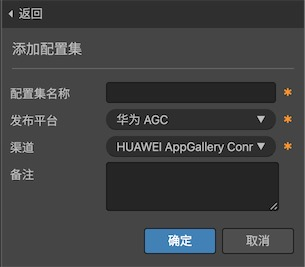

# SDKHub 快速入门

SDKHub 是一套帮助 Cocos Creator 用户快速接入原生平台 SDK 的接入框架。

游戏在开发完成准备发布到渠道上架时，通常需要接入渠道的 SDK，集成渠道的账户、支付、广告、游戏服务等功能。如果游戏同时要发布到多个渠道，由于同样的功能各家渠道的 SDK 接口却不尽相同，这会使开发者苦不堪言，需要编写很多兼容性代码来维护 SDK 集成工作。因此市面上出现了很多用来抽象这些 SDK 的 “超级 SDK”，例如 Cocos 官方之前推出的 AnySDK，不过后来由于一些原因 AnySDK 不再维护和更新了。

引擎团队为解决这一问题专门开发了 SDKHub 功能，可以完全用来替代 AnySDK。

使用 SDKHub 可以让开发者更快速地接入原生平台 SDK，例如 **账号 & 游戏**、**支付**、**广告**、**推送** 和 **自定义** 等 SDK。开发者只需要在 Cocos Service 服务面板中开通并集成 SDKHub 服务，然后通过 **构建发布** 面板构建工程，就可以快速的接入所需的原生 SDK。

## 产品原理

SDKHub 主要分为 **框架层** 和 **插件层** 两大部分，由 SDKHub 服务面板控制和配置。

- 框架层：实现了 JSB 绑定文件、插件和统一回调管理接口、各插件系统接口的统一封装定义和原生平台实现。
- 插件层：实现了框架层定义的各接口和原生平台 SDK 所需的各种其他接口，将原生平台 SDK 的回调进行统一封装，以及在构建工程时，调用安装脚本，对原生工程的原生平台 SDK 进行配置。

开发者在游戏层，仅需调用 SDKHub 中的方法以及处理统一封装的回调，极大的简化了开发者接入原生平台 SDK 的工作量。


## 开通服务

使用 Cocos Creator 打开需要接入 SDKHub 服务的游戏工程。点击菜单栏的 **面板 -> 服务**，打开 **服务** 面板，进入 SDKHub 服务详情页，然后点击右上方的 **启用** 按钮即可。详情请参考 [一键开通服务](./oneclick-provisioning.md)。


开通服务后，Cocos Service 将自动集成 SDKHub 框架到游戏工程中。

### 验证服务是否接入成功

- 完成 SDKHub 服务接入步骤后，我们便可以通过在脚本中添加简单的代码来验证 SDKHub 的接入是否成功。SDKHub 会自动初始化，但初始化需要时间。我们在脚本中使用 `scheduleOnce` 延时调用方法，调用 SDKHub 用户系统的登录方法。

  ```js
  this.scheduleOnce(function(){
      SDKHub.AgentManager.getInstance().getUserPlugin().login();
  },2);
  ```

- 脚本修改完成并保存后，回到编辑器。SDKHub 调试需要 [打包发布](../publish/publish-native.md) 到 **Android** 平台。若能在设备中看到 Debug 模式下的登录窗口，即可验证 SDKHub 接入成功。

  
    
## 平台 SDK 配置

上述操作只是将 SDKHub 的抽象层框架集成到游戏中，但并没有实质地集成我们所说的第三方 SDK。游戏需要发布到哪家渠道，需要集成哪些 SDK，都需要我们通过 SDKHub 服务详情页中的 **构建配置** 进行添加。


相关参数具体的配置规则如下：

- **配置集**

  配置集是 SDKHub 的一项重要功能。当我们需要将游戏发布到不同渠道，为不同渠道集成不同的 SDK 时，我们可以创建不同的 **配置集**。我们甚至可以为同一渠道创建多个配置集，以便管理多套不同的参数。然后在构建发布时，通过在构建发布面板的 **SDKHub 配置** 项中指定对应的配置集，即可构建出集成了不同 SDK 的游戏包。这让我们的游戏集成 SDK 工作妙不可言。

  创建配置集包括以下几个步骤：

  1. 如下图所示点击 **新建配置集**

      

  2. 进入 **添加配置集** 页面，填写相关参数，填写完成后点击 **确定** 即可

      

    - 配置集名称：通常直接使用渠道名称即可，也可以使用一个比较方便自已识记的名称。
    - 发布平台：用于设置配置集生效的平台，目前仅支持 **HUAWEI AppGallery Connect** 平台。
    - 渠道：需要构建发布的目标渠道，SDKHub 通常会自动添加渠道方要求的 SDK（插件）。

- **插件管理**

  开发者在创建完配置集后，需要选择并配置该配置集中所需集成的 SDK（插件），并填写原生平台 SDK 所需的参数，才能在构建发布后的工程中使用该平台 SDK 的功能。若不配置插件，则构建出的工程并没有太大实质意义，在调用 SDKHub 框架相关接口时将自动切换到 Debug 模式。

  

  - 配置插件：添加所需功能的插件，目前支持 **账号 & 游戏**、**支付** 、**广告** 和 **推送** 等类型插件。
  - 更新所有插件：若已下载的插件有线上更新版本，点此全部更新。
  - 编辑参数按钮：配置该平台 SDK 的参数。若填写不完整无法正常构建。具体的填写规则请查看对应平台的要求。

    

  - 删除参数按钮：删除当前填写的参数配置。

## 构建和编译

在创建好配置集，并为配置集配置好插件和参数后，我们需要在构建发布时，选择对应的配置集，才能最终编译出集成有 SDK 的游戏包。

打开 Cocos Creator 顶部菜单的 **项目 -> 构建发布**，当选择 **Android**、**iOS**、**HUAWEI AppGallery Connect** 等平台时（目前 SDKHub 暂时只支持这些原生平台），会显示 **SDKHub 配置** 项，并列出您在服务面板中创建的配置集（Creator v2.4.1 新增，之前的旧版本会默认使用 **服务** 面板中 SDKHub 面板选择的配置集），然后选择对应的配置集即可。


如果在编译时出现问题，可能是由于 Creator 原生编译环境配置不正确，可尝试在 **Android Studio** 或 **Xcode** 中直接编译工程，以便获得更多的调试信息。

## Sample 工程

您可以通过 Sample 工程快速体验 SDKHub。

- 点击 SDKHub 服务面板中的 **Sample 工程** 按钮，Clone 或下载 SDKHub Sample 工程，并在 Cocos Creator 中打开。

- 下面我们以集成 **HUAWEI HMS Core** 为例。需要完成以下前提：

  - 在 [华为开发者联盟后台](https://developer.huawei.com/consumer/cn/console) 注册开发者账号，创建游戏应用。在该游戏应用的 **我的项目 -> 项目设置 -> API 管理** 页面中开通 **Account Kit**、**In-App Purchases**、**Game Service**、**Push Kit** 服务。
      
    
      
  - 在 **项目设置** 页面中配置包名、生成并配置 SHA256 证书指纹，以及获得配置文件 `agconnect-services.json`。详情可参考文档 [AppGallery Connect 配置](https://developer.huawei.com/consumer/cn/doc/development/HMS-Guides/account-preparation#h1-1573697333903)。
      
  - 需要在安装了 **HMS Core 服务** 的华为或荣耀品牌手机上测试。

- 在 **服务** 面板中开通 SDKHub 服务。然后在 **构建配置** 中新建配置集。

  

- 进入 **添加配置集** 页面，填写相关参数，填写完成后点击 **确定** 即可。

  
    
- 添加完成后点击 **配置插件** 按钮，勾选 **HUAWEI HMS Core** 相关服务插件。

  

- 点击 **插件** 行对应的编辑参数按钮

  

  填写所需的参数配置。

  
    
- 配置完成后，即可构建到 **HUAWEI AppGallery Connect** 平台。在 **构建发布** 面板的 **平台** 项选择 **HUAWEI AppGallery Connect**，**SDKHub 配置** 选择刚才创建的配置集，然后构建编译工程，并运行到设备上进行测试。

  

- 若需要修改工程参数配置或者 JS 代码层，修改完成后，在 **构建发布** 面板重新构建即可。

- 若需要删减服务插件配置（例如去掉支付功能），建议删除工程构建后生成的发布包 `build/jsb-link` 或者 `build/jsb-default` 目录，然后重新构建。

## 使用说明

### 获取系统对象

SDKHub 框架目前支持账号 & 游戏、支付、广告、推送和自定义五种类型系统，获取插件系统对象方法，可参考 [API 文档](https://docs.cocos.com/service/api/zh/modules/_sdkhub_.sdkhub.html)。

其中 **广告** 和 **推送** 系统只支持单个插件。以广告系统为例，获取广告系统对象方法为：

```js
var ads = sdkHub.getAdsPlugin();
```

**账号 & 游戏**、**支付** 与 **自定义** 系统可支持接入多个插件，以账号 & 游戏系统为例，若只接入了单个插件，可直接使用 `getUserPlugin` 方法获取对象：

```js
var user = sdkHub.getUserPlugin();
```

若接入了多个账号 & 游戏系统，可以通过传入 `pluginId` 获取所需对象：

```js
var hwUser = sdkHub.getUserPlugin('HuaweiUser');
```

也可以通过 `getUserPlugins` 方法，直接获取该系统对象 Array，再做处理。

```js
var users = sdkHub.getUserPlugins();
```

### 标准接口调用

SDKHub 框架中已经对各系统归纳并封装定义了一些常用方法。例如公用方法中的 **获取插件 ID** `getPluginId`，账号 & 游戏系统中的 **登录** 方法 `login()`，支付系统中的 **支付商品** 方法 `feeForProduct` 等。以登录方法为例：

```js
sdkHub.getUserPlugin().login();
```

一些方法需要按 SDK 要求传入参数，请参考对应插件文档的 **参数传入与扩展回调说明**，以华为 HMS Core `showAchievement` 方法为例：

```js
var params = {
    "type": "getAchievementList",
    "forceReload": "1"
};
sdkHub.getUserPlugin().showAchievements(params);
```

各系统方法调用前，可以先调用 `isFunctionSupported` 检查插件是否支持该方法，再做调用。例如一些 SDK 没有游戏类型的 `showAchievements` 方法，我们可以通过代码先做判断。

```js
if (sdkHub.getUserPlugin().isFunctionSupported("showAchievements")) {
    var params = {"type": "getShowAchievementListIntent"};
    sdkHub.getUserPlugin().showAchievements(params);
}
```

### 扩展接口调用

若接入的 SDK 中的所需方法，不在 SDKHub 框架的封装定义中，则我们需要通过 **扩展接口调用** `callFuncWithParam` 方式，通过传入方法名与所需参数进行调用。

- 若调用方法不需要传入参数，以华为 HMS Core `cancelAuthorization` 方法为例：

```js
sdkHub.getUserPlugin().callFuncWithParam("cancelAuthorization");    
```

若调用方法需要按 SDK 要求传入参数，请参考对应插件文档的 **参数传入与扩展回调说明**，传入参数可能为数字、字符串，或者 JSON 对象。

- 以传入参数为 `Number` 的华为 HMS Core `cancelAuthorization` 方法为例：

```js
var params = 0;
sdkHub.getUserPlugin().callFuncWithParam("getGameSummary", params);
```

- 以传入参数为 JSON 对象的华为 HMS Core `submitEvent` 方法为例：

```js
var params = {
    "eventId": conf.eventId,
    "growAmount": "20"
};
sdkHub.getUserPlugin().callFuncWithParam("submitEvent", params);
```

若通过扩展方式调用的 SDK 方法，有直接返回值，则可调用 `callBoolFuncWithParam`、`callFloatFuncWithParam`、`callIntFuncWithParam`、
`callStringFuncWithParam` 等方法代替 `callFuncWithParam`：

```js
Boolean isTrue = sdkHub.getUserPlugin().callBoolFuncWithParam("functionName");
```

### 统一回调

SDKHub 将原生平台 SDK 的回调进行统一封装，用户需要在各系统设置监听并绑定方法，在绑定方法中统一处理回调逻辑。以用户系统为例：

```js
sdkHub.getUserPlugin().setListener(this.onUserResult, this);

onUserResult: function (code, msg) {
    switch (code) {
        case sdkHub.UserResultCode.kLoginSucceed:
console.log("kLoginSucceed", msg);
        break;
    }
}
```

各系统回调值可参考 [API 文档](https://docs.cocos.com/service/api/zh/modules/_sdkhub_.sdkhub.html)。

通过扩展接口调用的方法，可能需要使用扩展回调值。例如支付系统的扩展回调值为 `sdkHub.FeeResultCode.kFeeExtension = 30000`，华为 HMS Core `obtainOwnedPurchases` 方法成功的回调值为 `sdkHub.FeeResultCode.kFeeExtension + 106`。

由于不同 SDK 插件的不同方法，可能使用相同的回调值（例如上面的 + 106 回调）。如果一个游戏工程接入了不同的多个渠道，或者多个同类型插件，在处理扩展回调时，建议添加插件 ID 判断，保证该插件回调逻辑正确。

```js
case sdkHub.FeeResultCode.kFeeExtension + 106:
// Recommended to check the Plugin ID when using extended callbacks
    if (sdkHub.getFeePlugin().getPluginId() == "FeeHuawei"){
        console.log("HMS obtainOwnedPurchases");
    }
    break;
```

### 调试信息输出

SDKHub 的 Log 关键字为 `HUB_LOG`，仅在 **构建发布** 面板中的 **调试模式** 选项 **打开** 的情况下才会输出。若需要查看一些相关调试信息，可以在 **Logcat** 或者 **Xcode** 中筛选。


调试模式下可能会打印一些参数信息，产品上线时需关闭面板中的 **调试模式** 选项，以免一些参数信息泄露。


## API 文档

请参考 [API 文档](https://docs.cocos.com/service/api/zh/modules/_sdkhub_.sdkhub.html)。

