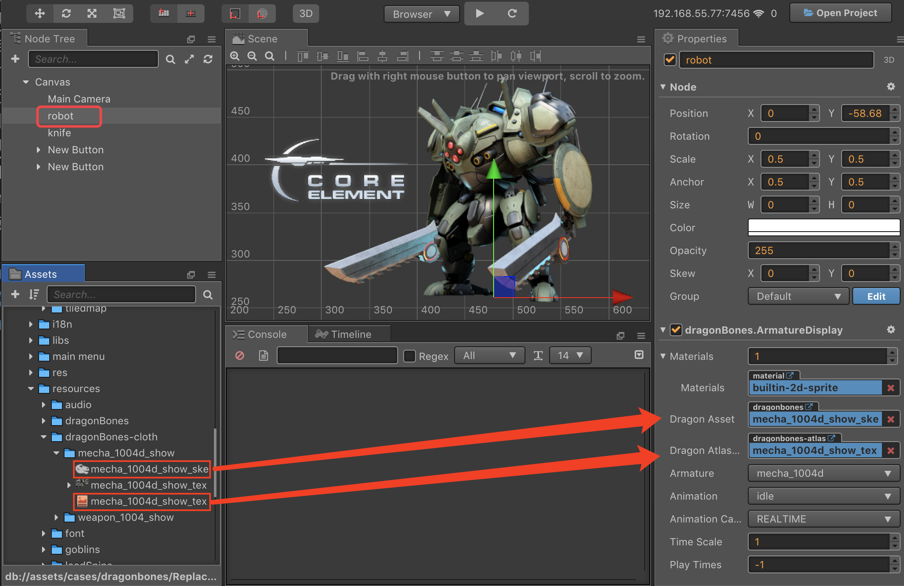
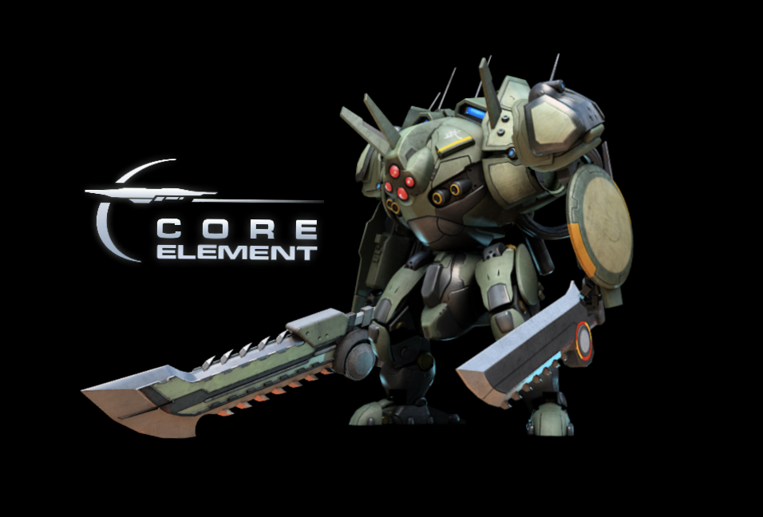

# DragonBones 组件参考

DragonBones 组件可以对骨骼动画（DragonBones）资源进行渲染和播放。


点击 **属性检查器** 下方的 **添加组件 -> 渲染组件 -> DragonBones** 按钮，即可添加 DragonBones 组件到节点上。

DragonBones 组件在脚本中的操作请参考 [example-cases](https://github.com/cocos-creator/example-cases) 中的 [DragonBones 测试例](https://github.com/cocos-creator/example-cases/tree/v2.0/assets/cases/dragonbones)。<br>DragonBones 相关的脚本接口请参考 [DragonBones API](../../../api/zh/modules/dragonBones.html)。

## DragonBones 属性

| 属性 |   功能说明
| --------------------- | ------------------ |
| Dragon Asset          | 骨骼信息数据，包含了骨骼信息（绑定骨骼动作，slots，渲染顺序，attachments，皮肤等等）和动画，但不持有任何状态。<br>多个 ArmatureDisplay 可以共用相同的骨骼数据。<br/>可拖拽 DragonBones 导出的骨骼资源到这里
| Dragon Atlas Asset    | 骨骼数据所需的 Atlas Texture 数据。可拖拽 DragonBones 导出的 Atlas 资源到这里
| Armature              | 当前使用的 Armature 名称
| Animation             | 当前播放的动画名称
| Animation Cache Mode  | 渲染模式，默认 `REALTIME` 模式。（v2.0.9 中新增）<br>`REALTIME` 模式，实时运算，支持 DragonBones 所有的功能。<br>`SHARED_CACHE` 模式，将骨骼动画及贴图数据进行缓存并共享，相当于预烘焙骨骼动画。拥有较高性能，但不支持动作融合、动作叠加、骨骼嵌套，只支持动作开始和结束事件。至于内存方面，当创建 N(N>=3) 个相同骨骼、相同动作的动画时，会呈现内存优势。N 值越大，优势越明显。综上 `SHARED_CACHE` 模式适用于场景动画，特效，副本怪物，NPC 等，能极大提高帧率和降低内存。<br>`PRIVATE_CACHE` 模式，与 `SHARED_CACHE` 类似，但不共享动画及贴图数据，所以在内存方面没有优势，仅存在性能优势。当想利用缓存模式的高性能，但又存在换装的需求，因此不能共享贴图数据时，那么 `PRIVATE_CACHE` 就适合你。
| Time Scale            | 当前骨骼中所有动画的时间缩放率
| Play Times            | 播放默认动画的循环次数。<br>-1 表示使用配置文件中的默认值；<br>0 表示无限循环；<br>>0 表示循环次数
| Premultiplied Alpha   | 图片是否启用贴图预乘，默认为 True。（v2.0.7 中新增）<br>当图片的透明区域出现色块时需要关闭该项。<br>当图片的半透明区域颜色变黑时需要启用该项
| Debug Bones           | 是否显示 bone 的 debug 信息
| Enable Batch          | 是否开启动画合批，默认关闭。（v2.0.9 中新增）<br>开启时，能减少 drawcall，适用于大量且简单动画同时播放的情况。关闭时，drawcall 会上升，但能减少 cpu 的运算负担，适用于复杂的动画。

**注意**：当使用 DragonBones 组件时，**属性检查器** 中 Node 组件上的 **Anchor** 与 **Size** 属性是无效的。

## DragonBones 换装

下面通过一个范例介绍 DragonBones 如何换装，此方法适用于 v2.0.10 或者 v2.1.1 及以上版本。我们将会通过替换插槽的显示对象，将图中的绿色框中的武器替换为红色框中的刀：


首先新建空节点 knife，添加 DragonBones 组件，并将刀的资源拖拽至属性框中。


再新建空节点 robot，添加 DragonBones 组件，并将机器人的资源拖拽至属性框中。



编写组件脚本，并添加到场景中，脚本代码如下：
```js
cc.Class({
    extends: cc.Component,

    properties: {
        robot: {
            type: dragonBones.ArmatureDisplay,
            default: null,
        },
        knife: {
            type: dragonBones.ArmatureDisplay,
            default: null,
        }
    },

    start () {
        let robotArmature = this.robot.armature();
        let robotSlot = robotArmature.getSlot("weapon_hand_r");
        let factory = dragonBones.CCFactory.getInstance();
        factory.replaceSlotDisplay(
            this.knife.getArmatureKey(), 
            "weapon", 
            "weapon_r", 
            "weapon_1004c_r", 
            robotSlot
        );
    },
});
```

设置好脚本属性，启动场景，可以看到机器人右手的刀已经被替换。

