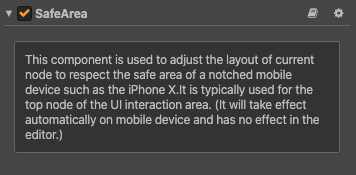

# SafeArea 组件参考

该组件会将所在节点的布局适配到 iPhone X 等异形屏手机的安全区域内，可适配 Android 和 iOS 设备，通常用于 UI 交互区域的顶层节点。

点击 **属性检查器** 下方的 **添加组件** 按钮，然后从 **UI 组件** 中选择 **SafeArea**，即可添加 SafeArea 组件到节点上。需要注意的是在添加 SafeArea 组件时，会自动添加 Widget 组件（如果节点上没有的话），且不能删除。

开发者只需要将 SafeArea 组件添加到节点上即可，该组件在启用时会通过 `cc.sys.getSafeAreaRect();` 获取当前 iOS 或 Android 设备的安全区域，并通过 Widget 组件实现适配。

**注意**：在使用 SafeArea 时若发现无效，请检查 **项目 -> 项目设置 -> 模块设置** 中的 SafeArea 模块是否有勾选。

具体用法可参考官方范例中的 [SafeArea](https://github.com/cocos-creator/example-cases/tree/v2.4.3/assets/cases/02_ui/16_safeArea) 测试例。
