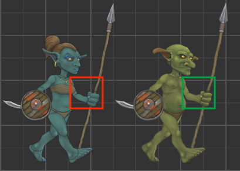
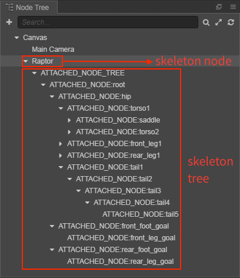
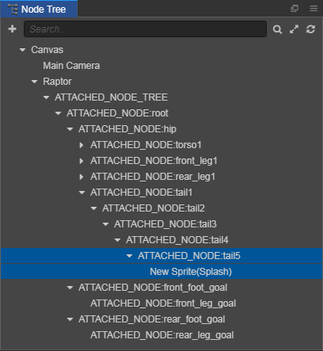

# Spine 组件参考

Spine 组件支持 Spine 导出的数据格式，并对骨骼动画（Spine）资源进行渲染和播放。


选中节点，点击 **属性检查器** 下方的 **添加组件 -> 渲染组件 -> Spine Skeleton** 按钮，即可添加 Spine 组件到节点上。

Spine 的脚本接口请参考 [Skeleton API](../../../api/zh/classes/Skeleton.html)。

## Spine 属性

| 属性 |   功能说明
| --------------------- | ------------------ |
| Skeleton Data         | 骨骼信息数据，拖拽 Spine 导出后的骨骼资源到该属性中
| Default Skin          | 选择默认的皮肤
| Animation             | 当前播放的动画名称
| Animation Cache Mode  | 渲染模式，默认 `REALTIME` 模式。（v2.0.9 中新增）<br>1. **REALTIME** 模式，实时运算，支持 Spine 所有的功能。<br>2. **SHARED_CACHE** 模式，将骨骼动画及贴图数据进行缓存并共享，相当于预烘焙骨骼动画。拥有较高性能，但不支持动作融合、动作叠加，只支持动作开始和结束事件。至于内存方面，当创建 N(N>=3) 个相同骨骼、相同动作的动画时，会呈现内存优势。N 值越大，优势越明显。综上 `SHARED_CACHE` 模式适用于场景动画，特效，副本怪物，NPC 等，能极大提高帧率和降低内存。<br>3. **PRIVATE_CACHE** 模式，与 `SHARED_CACHE` 类似，但不共享动画及贴图数据，所以在内存方面没有优势，仅存在性能优势。当想利用缓存模式的高性能，但又存在换装的需求，因此不能共享贴图数据时，那么 `PRIVATE_CACHE` 就适合你。
| Loop                  | 是否循环播放当前动画
| Premultiplied Alpha   | 图片是否启用贴图预乘，默认为 True。<br>当图片的透明区域出现色块时需要关闭该项，当图片的半透明区域颜色变黑时需要启用该项。
| Time Scale            | 当前骨骼中所有动画的时间缩放率
| Debug Slots           | 是否显示 slot 的 debug 信息
| Debug Bones           | 是否显示骨骼的 debug 信息
| Debug Mesh            | 是否显示 mesh 的 debug 信息
| Use Tint              | 是否开启染色效果，默认关闭。（v2.0.9 中新增）
| Enable Batch          | 是否开启动画合批，默认关闭。（v2.0.9 中新增）<br>开启时，能减少 Drawcall，适用于大量且简单动画同时播放的情况。<br>关闭时，Drawcall 会上升，但能减少 CPU 的运算负担，适用于复杂的动画。

**注意**：当使用 Spine 组件时，**属性检查器** 中 Node 组件上的 **Anchor** 与 **Size** 属性是无效的。

## Spine 换装

下面通过一个范例介绍 Spine 如何换装。我们将会通过替换插槽的 attachment 对象，将绿色框中的手臂替换为红色框中的手臂。



1. 首先在 **层级管理器** 中新建一个空节点，重命名为 goblingirl。在 **属性检查器** 中添加 Spine 组件，并将资源拖拽至 Spine 组件的 Skeleton Data 属性框中，然后将 Default Skin 属性设置成红色框中用于替换的皮肤。可更改 Spine 组件的 Animation 属性用于设置开发者想要播放的动画。

    

2. 再次新建一个空节点并重命名为 goblin，添加 Spine 组件，并将资源拖拽至 Spine 组件的 Skeleton Data 属性框中。然后将 Default Skin 属性设置成绿色框中想要替换的皮肤，如下图所示：

    

3. 在 **资源管理器** 中新建一个 JavaScript 脚本，编写组件脚本。脚本代码如下：

    ```js
    cc.Class({
        extends: cc.Component,

        properties: {
            goblin: {
                type: sp.Skeleton,
                default: null,
            },
            goblingirl: {
                type: sp.Skeleton,
                default: null,
            }
        },

        start () {
            let parts = ["left-arm", "left-hand", "left-shoulder"];
            for (let i = 0; i < parts.length; i++) {
                let goblin = this.goblin.findSlot(parts[i]);
                let goblingirl = this.goblingirl.findSlot(parts[i]);
                let attachment = goblingirl.getAttachment();
                goblin.setAttachment(attachment);
            }
        }
    });
    ```

4. 然后将脚本组件挂载到 Canvas 节点或者其他节点上，即将脚本拖拽到节点的 **属性检查器** 中。再将 **层级管理器** 中的 goblingirl 节点和 goblin 节点分别拖拽到脚本组件对应的属性框中，并保存场景。

    

5. 点击编辑器上方的预览按钮，可以看到绿色框中的手臂已经被替换。

    

## Spine 顶点效果

顶点效果只有当 Spine 处于 REALTIME 模式时有效，下面通过一个范例介绍 Spine 如何设置顶点效果。

1. 首先在 **层级管理器** 中新建一个空节点并重命名。然后在 **属性检查器** 中添加 Spine 组件，并将资源拖拽至 Spine 组件的 Skeleton Data 属性框中，设置好 Spine 组件属性。

2. 在 **资源管理器** 中新建一个 JavaScript 脚本，编写组件脚本。脚本代码如下：

    ```js
    cc.Class({
        extends: cc.Component,

        properties: {
            skeleton : {
                type: sp.Skeleton,
                default: null,
            }
        },

        start () {
            this._jitterEffect = new sp.VertexEffectDelegate();
            // 设置好抖动参数。
            this._jitterEffect.initJitter(20, 20);
            // 调用 Spine 组件的 setVertexEffectDelegate 方法设置效果。
            this.skeleton.setVertexEffectDelegate(this._jitterEffect);
        }
    });
    ```

3. 然后将脚本组件挂载到 Canvas 节点或者其他节点上，即将脚本拖拽到节点的 **属性检查器** 中。再将 **层级管理器** 中的节点拖拽到脚本组件对应的属性框中，并保存场景。

4. 点击编辑器上方的预览按钮，即可看到 Spine 动画的顶点抖动的效果。关于代码可参考 [SpineMesh](https://github.com/cocos-creator/example-cases/tree/master/assets/cases/spine) 范例。

## Spine 挂点

使用骨骼动画时，常在动画的某个部位挂节点，以实现节点与骨骼联动的效果。下面介绍如何使用挂点这一功能，把星星挂在龙的尾巴上，并随着龙的尾巴一起晃动。


1. 首先在 **层级管理器** 创建节点，并添加 Spine 组件。


2. 选中 **层级管理器** 中 Spine 组件所在节点，在 **属性检查器** 的 Spine 组件下方，点击 **生成挂点** 按钮，编辑器会在 Spine 组件所在节点下方，以节点树的形式生成所有骨骼。



3. 以目标骨骼节点作为父节点，创建子节点。



4. 制作完挂点后，删除无用的骨骼节点，以减少运行时计算开销。

以上是在编辑器中进行挂点的方法，下面介绍如何编写脚本生成挂点，脚本如下：

```js
    cc.Class({
        extends: cc.Component,

        properties: {
            skeleton : {
                type: sp.Skeleton,
                default: null,
            },
            // 将要添加到骨骼上的预制体
            targetPrefab : {
                type: cc.Prefab,
                default: null,
            },
            // 目标骨骼名称
            boneName: "",
        },

        generateAllNodes () {
            // 取得挂点工具
            let attachUtil = this.skeleton.attachUtil;
            attachUtil.generateAllAttachedNodes();
            // 由于同名骨骼可能不止一个，所以返回数组
            let boneNodes = attachUtil.getAttachedNodes(this.boneName);
            // 取第一个骨骼作为挂点
            let boneNode = boneNodes[0];
            boneNode.addChild(cc.instantiate(this.targetPrefab));
        },

        destroyAllNodes () {
            let attachUtil = this.skeleton.attachUtil;
            attachUtil.destroyAllAttachedNodes();
        },

        // 生成指定骨骼名称节点树的方法
        generateSomeNodes () {
            let attachUtil = this.skeleton.attachUtil;
            let boneNodes = attachUtil.generateAttachedNodes(this.boneName);
            let boneNode = boneNodes[0];
            boneNode.addChild(cc.instantiate(this.targetPrefab));
        },

        // 销毁指定骨骼名称节点的方法
        destroySomeNodes () {
            let attachUtil = this.skeleton.attachUtil;
            attachUtil.destroyAttachedNodes(this.boneName);
        }
    });
```