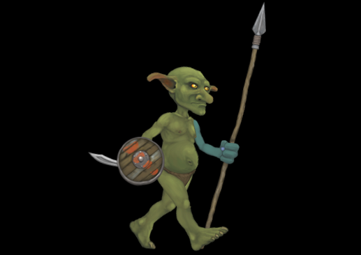

# Spine 组件参考

Spine 组件支持 Spine 导出的数据格式，并对骨骼动画（Spine）资源进行渲染和播放。


选中节点，点击 **属性检查器** 下方的 **添加组件 -> 渲染组件 -> Spine Skeleton** 按钮，即可添加 Spine 组件到节点上。

Spine 的脚本接口请参考 [Skeleton API](../../../api/zh/classes/Skeleton.html)。

## Spine 属性

| 属性 |   功能说明
| --------------------- | ------------------ |
| Skeleton Data         | 骨骼信息数据，拖拽 Spine 导出后的骨骼资源到该属性中
| Default Skin          | 选择默认的皮肤
| Animation             | 当前播放的动画名称
| Animation Cache Mode  | 渲染模式，默认 `REALTIME` 模式。（v2.0.9 中新增）<br>`REALTIME` 模式，实时运算，支持 Spine 所有的功能。<br>`SHARED_CACHE` 模式，将骨骼动画及贴图数据进行缓存并共享，相当于预烘焙骨骼动画。拥有较高性能，但不支持动作融合、动作叠加，只支持动作开始和结束事件。至于内存方面，当创建 N(N>=3) 个相同骨骼、相同动作的动画时，会呈现内存优势。N 值越大，优势越明显。综上 `SHARED_CACHE` 模式适用于场景动画，特效，副本怪物，NPC 等，能极大提高帧率和降低内存。<br>`PRIVATE_CACHE` 模式，与 `SHARED_CACHE` 类似，但不共享动画及贴图数据，所以在内存方面没有优势，仅存在性能优势。当想利用缓存模式的高性能，但又存在换装的需求，因此不能共享贴图数据时，那么 `PRIVATE_CACHE` 就适合你。
| Loop                  | 是否循环播放当前动画
| Premultiplied Alpha   | 图片是否启用贴图预乘，默认为 True。<br>当图片的透明区域出现色块时需要关闭该项，当图片的半透明区域颜色变黑时需要启用该项。
| Time Scale            | 当前骨骼中所有动画的时间缩放率
| Debug Slots           | 是否显示 slot 的 debug 信息
| Debug Bones           | 是否显示骨骼的 debug 信息
| Use Tint              | 是否开启染色效果，默认关闭。（v2.0.9 中新增）
| Enable Batch          | 是否开启动画合批，默认关闭。（v2.0.9 中新增）<br>开启时，能减少 Drawcall，适用于大量且简单动画同时播放的情况。关闭时，Drawcall 会上升，但能减少 CPU 的运算负担，适用于复杂的动画。

**注意**：当使用 Spine 组件时，**属性检查器** 中 Node 组件上的 **Anchor** 与 **Size** 属性是无效的。

## Spine 换装

下面通过一个范例介绍 Spine 如何换装，此方法适用于 v2.2.0 及以上版本。我们将会通过替换插槽的 attachment 对象，将绿色框中的手臂替换为红色框中的手臂。


首先新建空节点 goblingirl，添加 Spine 组件，并将资源拖拽至属性框中，设置好你想用于替换的皮肤。


再新建空节点 goblin，添加 Spine 组件，并将资源拖拽至属性框中。


编写组件脚本，并添加到场景中，脚本代码如下：
```js
cc.Class({
    extends: cc.Component,

    properties: {
        goblin: {
            type: sp.Skeleton,
            default: null,
        },
        goblingirl: {
            type: sp.Skeleton,
            default: null,
        }
    },

    start () {
        let parts = ["left-arm", "left-hand", "left-shoulder"];
        for (let i = 0; i < parts.length; i++) {
            let goblin = this.goblin.findSlot(parts[i]);
            let goblingirl = this.goblingirl.findSlot(parts[i]);
            let attachment = goblingirl.getAttachment();
            goblin.setAttachment(attachment);
        }
    }
});
```

设置好脚本属性，启动场景，可以看到绿色框中的手臂已经被替换。

