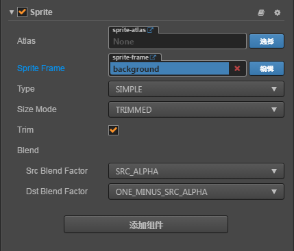

# Sprite 组件参考

Sprite（精灵）是 2D 游戏中最常见的显示图像的方式，在节点上添加 Sprite 组件，就可以在场景中显示项目资源中的图片。

点击 **属性检查器** 下面的 **添加组件** 按钮，然后从 **渲染组件** 中选择 **Sprite**，即可添加 Sprite 组件到节点上。

脚本接口请参考 [Sprite API](../../../api/zh/classes/Sprite.html)。

## Sprite 属性

| 属性 |   功能说明
| -------------- | ----------- |
| Atlas | Sprite 显示图片资源所属的 [Atlas 图集资源](../asset-workflow/atlas.md)。（Atlas 后面的 **选择** 按钮，该功能暂时不可用，我们会尽快优化）
| Sprite Frame | 渲染 Sprite 使用的 [SpriteFrame 图片资源](../asset-workflow/sprite.md)。（Sprite Frame 后面的 **编辑** 按钮用于编辑图像资源的九宫格切分，详情请参考 [使用 Sprite 编辑器制作九宫格图像](../ui/sliced-sprite.md)）
| Type | 渲染模式，包括普通（Simple）、九宫格（Sliced）、平铺（Tiled）、填充（Filled）和网格（Mesh）渲染五种模式
| Size Mode | 指定 Sprite 的尺寸 `Trimmed` 表示会使用原始图片资源裁剪透明像素后的尺寸 `Raw` 表示会使用原始图片未经裁剪的尺寸  `Custom` 表示会使用自定义尺寸。当用户手动修改过 `Size` 属性后，`Size Mode` 会被自动设置为 `Custom`，除非再次指定为前两种尺寸。
| Trim | 勾选后将在渲染时去除原始图像周围的透明像素区域，该项仅在 Type 设置为 Simple 时生效。详情请参考 [图像资源的自动剪裁](../asset-workflow/trim.md)
| Src Blend Factor | 当前图像混合模式
| Dst Blend Factor | 背景图像混合模式，和上面的属性共同作用，可以将前景和背景 Sprite 用不同的方式混合渲染，效果预览可以参考 [glBlendFunc Tool](http://www.andersriggelsen.dk/glblendfunc.php)

添加 Sprite 组件之后，通过从 **资源管理器** 中拖拽 Texture 或 SpriteFrame 类型的资源到 `Sprite Frame` 属性引用中，就可以通过 Sprite 组件显示资源图像。

如果拖拽的 SpriteFrame 资源是包含在一个 Atlas 图集资源中的，那么 Sprite 的 `Atlas` 属性也会被一起设置。

**若要动态更换 SpriteFrame 则需要先动态加载图片资源，然后再进行替换，详情请参考 [获取和加载资源：动态加载](../scripting/load-assets.md#%E5%8A%A8%E6%80%81%E5%8A%A0%E8%BD%BD)。**

## 渲染模式

Sprite 组件支持五种渲染模式：

- `普通模式（Simple）`：按照原始图片资源样子渲染 Sprite，一般在这个模式下我们不会手动修改节点的尺寸，来保证场景中显示的图像和美术人员生产的图片比例一致。

- `九宫格模式（Sliced）`：图像将被分割成九宫格，并按照一定规则进行缩放以适应可随意设置的尺寸(`size`)。通常用于 UI 元素，或将可以无限放大而不影响图像质量的图片制作成九宫格图来节省游戏资源空间。详细信息请阅读 [使用 Sprite 编辑器制作九宫格图像](../ui/sliced-sprite.md#-) 一节。

- `平铺模式（Tiled）`：图像将会平铺渲染，并且渲染结果受 spriteFrame 的 [九宫格配置](../ui/sliced-sprite.md#) 影响。渲染过程中 **Sprite** 的边缘部分将保持固定并且不会拉伸，而其余部分则会不断重复。

  
  
- `填充模式（Filled）`：根据原点和填充模式的设置，按照一定的方向和比例绘制原始图片的一部分。经常用于进度条的动态展示。

- `网格模式（Mesh）`：必须使用 **TexturePacker 4.x** 以上版本并且设置 ploygon 算法打包出的 plist 文件才能够使用该模式。

### 填充模式（Filled）

`Type` 属性选择填充模式后，会出现一组新的属性可供配置，让我们依次介绍他们的作用。

| 属性 |   功能说明
| -------------- | ----------- |
| Fill Type | 填充类型选择，有 `HORIZONTAL`（横向填充）、`VERTICAL`（纵向填充）和 `RADIAL` （扇形填充）三种。
| Fill Start | 填充起始位置的标准化数值（从 0 ~ 1，表示填充总量的百分比），选择横向填充时，`Fill Start` 设为 0，就会从图像最左边开始填充
| Fill Range | 填充范围的标准化数值（同样从 0 ~ 1），设为 1，就会填充最多整个原始图像的范围。
| Fill Center | 填充中心点，只有选择了 `RADIAL` 类型才会出现这个属性。决定了扇形填充时会环绕 Sprite 上的哪个点，所用的坐标系和 [Anchor 锚点](../content-workflow/transform.md#-anchor-) 是一样的。

#### Fill Range 填充范围补充说明

在 `HORIZONTAL` 和 `VERTICAL` 这两种填充类型下，`Fill Start` 设置的数值将影响填充总量，如果 `Fill Start` 设为 0.5，那么即使 `Fill Range` 设为 1.0，实际填充的范围也仍然只有 Sprite 总大小的一半。

而 `RADIAL` 类型中 `Fill Start` 只决定开始填充的方向，`Fill Start` 为 0 时，从 x 轴正方向开始填充。`Fill Range` 决定填充总量，值为 1 时将填充整个圆形。`Fill Range` 为正值时逆时针填充，为负值时顺时针填充。
