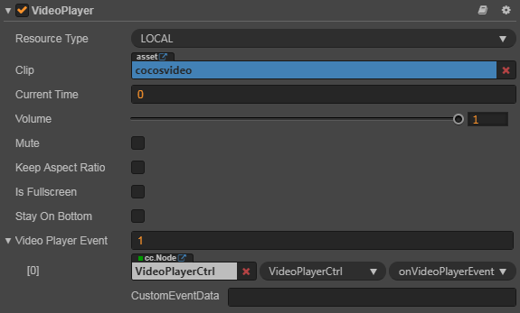
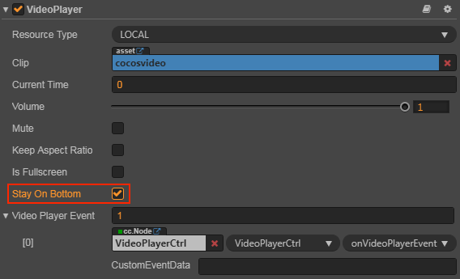
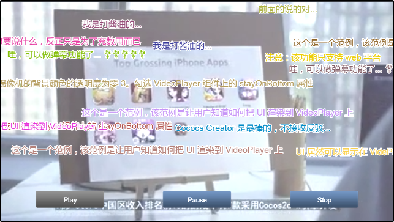

# VideoPlayer 组件参考

VideoPlayer 是一种视频播放组件，可通过该组件播放本地和远程视频。

**播放本地视频**：



**播放远程视频**：


点击 **属性检查器** 下面的 **添加组件** 按钮，然后从 **UI 组件** 中选择 **VideoPlayer**，即可添加 VideoPlayer 组件到节点上。

VideoPlayer 的脚本接口请参考 [VideoPlayer API](../../../api/zh/classes/VideoPlayer.html)。

## VideoPlayer 属性

| 属性                | 功能说明            |
| ------------------ | ------------------ |
| Resource Type      | 视频来源的类型，目前支持本地（LOCAL）视频和远程（REMOTE）视频 URL |
| Clip               | 当 Resource Type 为 LOCAL 时显示的字段，拖拽本地视频的资源到此处来使用 |
| Remote URL         | 当 Resource Type 为 REMOTE 时显示的字段，填入远程视频的 URL |
| Current Time       | 指定从哪个时间点开始播放视频  |
| Volume             | 视频的音量（0.0 ~ 1.0）|
| Mute               | 是否静音视频。静音时设置音量为 0，取消静音时恢复原来的音量 |
| Keep Aspect Ratio  | 是否保持视频原来的宽高比  |
| Is Fullscreen      | 是否全屏播放视频  |
| Stay On Bottom     | 永远在游戏视图最底层（该属性仅在 Web 平台生效）|
| Video Player Event | 视频播放回调函数，该回调函数会在特定情况被触发，比如播放中，暂时，停止和完成播放。详情见下方的 **VideoPlayer 事件** 章节或者 [VideoPlayerEvent API](../../../api/zh/classes/VideoPlayer.html#videoplayerevent)。|

**注意**：在 **Video Player Event** 属性的 **cc.Node** 中，应该填入的是一个挂载有用户脚本组件的节点，在用户脚本中便可以根据用户需要使用相关的 VideoPlayer 事件。

## VideoPlayer 事件

### VideoPlayerEvent 事件

| 属性             | 功能说明 |
| --------------- | ---------------    |
| target          | 带有脚本组件的节点。  |
| component       | 脚本组件名称。       |
| handler         | 指定一个回调函数，当视频开始播放后，暂停时或者结束时都会调用该函数，该函数会传一个事件类型参数进来。|
| customEventData | 用户指定任意的字符串作为事件回调的最后一个参数传入。 |

详情可参考 API 文档 [Component.EventHandler 类型](../../../api/zh/classes/Component.EventHandler.html)

### 事件回调参数

| 名称            | 功能说明                     |
| -------------- | -----------                 |
| PLAYING        | 表示视频正在播放中。           |
| PAUSED         | 表示视频暂停播放。             |
| STOPPED        | 表示视频已经停止播放。          |
| COMPLETED      | 表示视频播放完成。             |
| META_LOADED    | 表示视频的元信息已加载完成，你可以调用 getDuration 来获取视频总时长。 |
| CLICKED        | 表示视频被用户点击了。          |
| READY_TO_PLAY  | 表示视频准备好了，可以开始播放了。|

**注意**：在 iOS 平台的全屏模式下，点击视频无法发送 CLICKED 事件。如果需要让 iOS 全屏播放并正确接受 CLICKED 事件，
可以使用 Widget 组件把视频控件撑满。

详情可参考 [VideoPlayer 事件](../../../api/zh/classes/VideoPlayer.html#%E4%BA%8B%E4%BB%B6) 或者参考引擎自带的 example-cases 测试例中的 [09_videoplayer](https://github.com/cocos-creator/example-cases/tree/master/assets/cases/02_ui/09_videoplayer)。

## 详细说明

此控件支持的视频格式由所运行系统的视频播放器决定，为了让所有支持的平台都能正确播放视频，推荐使用 **mp4** 格式的视频。

### 通过脚本代码添加回调

#### 方法一

这种方法添加的事件回调和使用编辑器添加的事件回调是一样的。通过代码添加，首先你需要构造一个 `cc.Component.EventHandler` 对象，然后设置好对应的 `target`、`component`、`handler` 和 `customEventData` 参数。

```js
var videoPlayerEventHandler = new cc.Component.EventHandler();
videoPlayerEventHandler.target = this.node; //这个 node 节点是你的事件处理代码组件所属的节点
videoPlayerEventHandler.component = "cc.MyComponent"
videoPlayerEventHandler.handler = "callback";
videoPlayerEventHandler.customEventData = "foobar";

videoPlayer.videoPlayerEvent.push(videoPlayerEventHandler);

//here is your component file
cc.Class({
    name: 'cc.MyComponent'
    extends: cc.Component,

    properties: {
    },

	//注意参数的顺序和类型是固定的
    callback: function(videoplayer, eventType, customEventData) {
        //这里 videoplayer 是一个 VideoPlayer 组件对象实例
        // 这里的 eventType === cc.VideoPlayer.EventType enum 里面的值
        //这里的 customEventData 参数就等于你之前设置的 "foobar"
    }
});
```

#### 方法二

通过 `videoplayer.node.on('ready-to-play', ...)` 的方式来添加

```js
//假设我们在一个组件的 onLoad 方法里面添加事件处理回调，在 callback 函数中进行事件处理:
cc.Class({
    extends: cc.Component,

    properties: {
       videoplayer: cc.VideoPlayer
    },

    onLoad: function () {
       this.videoplayer.node.on('ready-to-play', this.callback, this);
    },

    callback: function (event) {
       //这里的 event 是一个 EventCustom 对象，你可以通过 event.detail 获取 VideoPlayer 组件
       var videoplayer = event.detail;
       //do whatever you want with videoplayer
       //另外，注意这种方式注册的事件，也无法传递 customEventData
    }
});
```

同样的，用户也可以注册 `meta-loaded`、`clicked`、`playing` 等事件，这些事件的回调函数的参数与 `read-to-play` 的参数一致。

关于完整的 VideoPlayer 的事件列表，可以参考 [VideoPlayer API](../../../api/zh/classes/VideoPlayer.html)。

## 如何实现 UI 在 VideoPlayer 上渲染

可通过以下三个步骤实现 UI 在 VideoPlayer 上显示：

1. 开启 `cc.macro.ENABLE_TRANSPARENT_CANVAS = true`（设置 Canvas 背景支持 alpha 通道）。
2. 在 **属性检查器** 中设置摄像机的 `backgroundColor` 属性透明度为 **0**。
3. 在 **属性检查器** 中勾选 VideoPlayer 组件上的 **stayOnBottom** 属性。

    

**注意**：

- 该功能仅支持 **Web** 平台。
- 各个浏览器具体效果无法保证一致，跟浏览器是否支持与限制有关。
- 开启 **stayOnBottom** 后，将无法正常监听 `VideoPlayerEvent` 中的 `clicked` 事件。

详情可参考引擎自带的 example-cases 测试例中的 [09_videoplayer/videoPlayer-stayOnBotton](https://github.com/cocos-creator/example-cases/tree/master/assets/cases/02_ui/09_videoplayer)。最终效果如下图所示：



## 支持平台

由于不同平台对于 VideoPlayer 组件的授权、API、控制方式都不同，还没有形成统一的标准，所以目前只支持 Web、iOS、Android、微信小游戏、Facebook Instant Games 以及 Google Play Instant 平台。

#### 关于自动播放的问题

由于 Android，IOS 移动端的浏览器以及微信自带的浏览器为了用户更好的体验，规定不自动播放音频视频，如果要想达到自动播放效果，需要单独处理。用户可以通过创建一个全局的触摸事件用于播放视频

```js
cc.Class({
    extends: cc.Component,
    properties: {
       videoplayer: cc.VideoPlayer
    },

    onStart () {
       let canvas = cc.find('Canvas');
       canvas.on('touchstart', this.playVideo, this);
    },
    
    playVideo () {
      this.videoplayer.play();
    }
});
```
