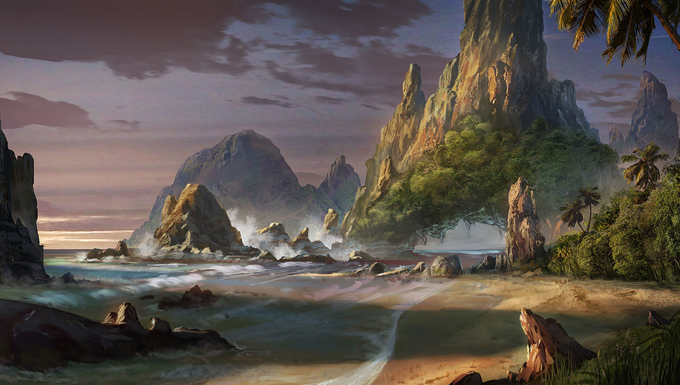

# 场景制作工作流程

场景是游戏中的环境因素的抽象集合，是创建游戏环境的局部单位，游戏开发设计人员通过在编辑器中制作一个场景，来表现游戏中的一部分世界内容。通常一个简单的游戏在一个场景里构建就足够了，但是对于一个复杂的游戏，一个场景往往满足不了需求，那么就可以在不同的设计区域使用一个场景。例如：当前设计的是一个仙侠类游戏，游戏里有多个帮派，每个帮派都有自己的地界，同时还存在不同的等级用来做任务升级的野外探险区。此时，就可以让每个帮派地界都使用一个场景，不同等级划分的野外探险区也都使用一个场景，每个场景通过不同的环境、角色、障碍物等元素来体现这个场景的特色。主角可以通过场景里的传送门或者其它方式前往不同的场景。因此，一个项目也支持创建任意数量的场景。

## 场景结构

Cocos Creator 通过节点树和节点组件系统实现了自由的场景结构。其中 Node 负责管理节点树的父子关系以及空间矩阵变换 Transform，这样可以轻松地在场景中管理和摆放所有的实体节点。组件系统赋予了节点各种各样的高级功能，比如模型渲染（MeshRenderer 组件）、动画（Animation 组件）、光源（Light 组件）、地形（Terrain 组件）等。当创建一个场景时，场景中默认有一个 `Main Camera` 节点（带有 Camera 组件）和 `Main Light` 节点（带有 DirectionalLight）。Camera 组件是 3D 场景中的必要元素，Camera 组件代表的是游戏中的玩家视角，没有 Camera 就什么也看不见。DirectionalLight 组件则代表游戏世界里的主光源，可以模拟游戏环境昼夜更替、晴天、阴天等效果。

## 场景制作相关工作流程

- [节点和组件](node-component.md)
- [使用场景编辑器搭建场景](scene-editing.md)
- [预制](../../asset/prefab.md)
- [天空盒](skybox.md)
- [光照和阴影](../../concepts/scene/light.md)
