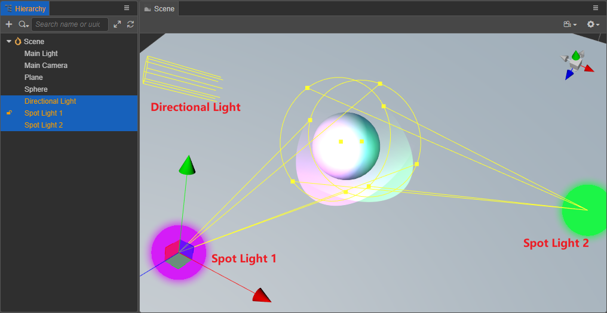
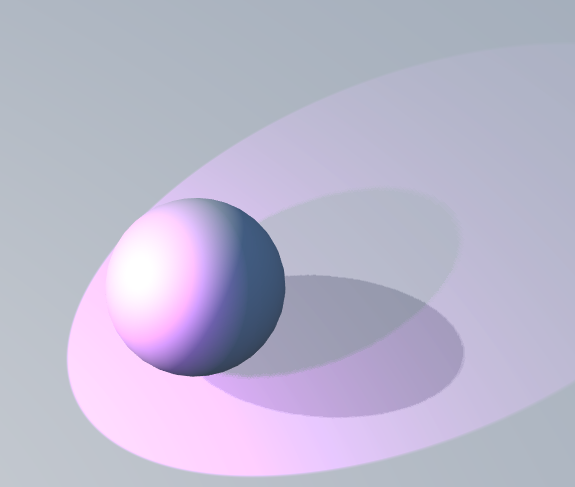
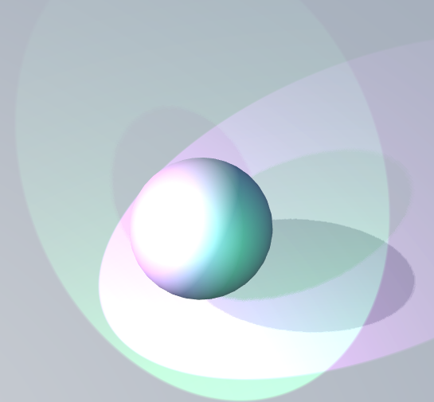

# 基于多 Pass 的多光源支持

下面以 Creator 中默认的光照材质 `default-material.mtl` 为例，介绍如何实现基于多 Pass 的多光源支持。

首先在 **层级管理器** 中新建一个 **Sphere 球体** 节点，然后继续添加一个平行光，两个聚光灯，将它们设置环绕在球体周围，如下图所示：

场景搭建完成后，选择编辑器上面的浏览器预览，可以在左下角看到 Draw Call。

我们可以通过第三方软件，例如 RenderDoc，打开 Frame Debug 来看看这些到底是如何渲染到屏幕上的:

由上图可以看出来，第一遍，先渲染 `Directional Light` ：

第二遍，渲染 `Spot Light 1` 的光照效果：

第三遍，渲染 `Spot Light 2` 的光照效果：

这种渲染方式便是支持多种光照模型的 Forward-Pipeline。Forward 一般由两个 Pass 组成：

- 第一个 Pass 是 BasePas，用来绘制一个平行光带来的光照。

- 第二个 Pass 叫 LightPass，用于渲染剩余光源的光照。

因此，当一个物体同时背多个灯光照射时，Draw Call 也会增加。
