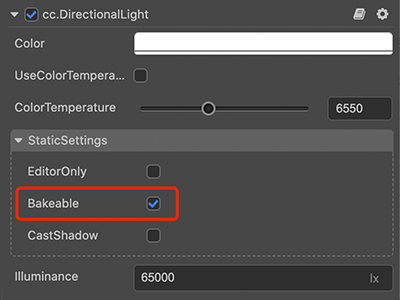
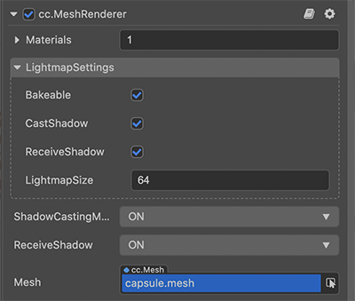
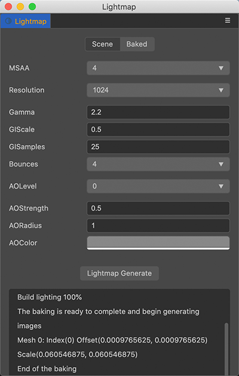
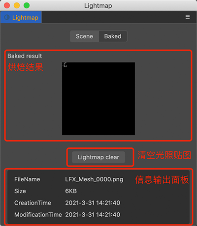
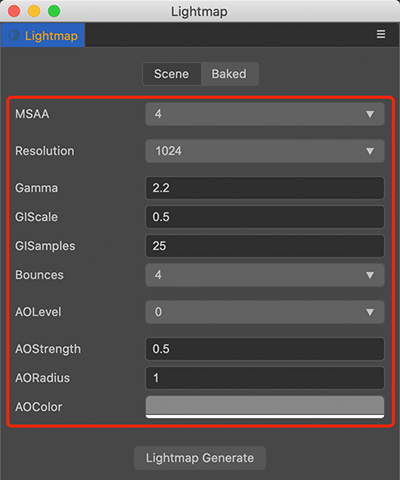

# 光照贴图

在光源固定的场景，使用光照贴图，可以减少实时光源的运算，从而提高场景运行效率。

光照贴图需要预先通过 **烘焙** 生成。

## 生成光照贴图

1. 在 **层级管理器** 中，选择 **光源组件**。在该组件的 **属性检查器** 中，勾选 **StaticSettings -> Bakeable** 选项（目前只支持一个主方向光源）。

    

	| 参数 | 说明 |
    | :--- | :--- |
	| EditorOnly | 是否只在编辑器中生效 |
	| Bakeable | 是否烘焙静态光照 |
	| CastShadow | 是否投射静态阴影 |

2. 设置 [MeshRenderer 组件](./../../engine/renderable/model-component.md) 的光照图属性。
	
	
	
	| 参数 | 说明 |
    | :--- | :--- |
	| Bakeable | 是否烘焙静态光照 |
	| CastShadow | 是否投射静态阴影 |
	| RecieveShadow | 是否接受静态阴影 |
	| LightMapSize | 光照图大小 |

3. 点击编辑器上方菜单栏的 **项目 -> 光照贴图**，设置好对应参数后，可点击 **生成光照贴图** 按钮，并选择对应存储文件夹（需要设置在 `/assets` 目录下），即可 **烘焙** 生成光照贴图。

    

4. 生成后可在 **光照贴图** 面板中的 **Baked** 页面查看。

    

	- **烘焙结果**：显示烘焙后的光照贴图。
	- **清空光照贴图**：点击按钮可删除生成的光照贴图。
	- **信息输出面板**：显示每张光照贴图的信息（文件名、大小等）。

    **注意**：模型在开启 lightmap 前，需要包含两套 uv，第二套 uv 用来 access lightmap，同时材质也需要勾选 lightmap 选项才能应用模型烘焙后的阴影信息。

### 参数说明

烘焙生成光照贴图过程中，将根据面板设置的各参数，计算并生成结果：

| 参数 | 说明 |
| :--- | :--- |
| MSAA | 多重采样，可选值包括：1、2、4、8 |
| Resolution | 烘焙贴图尺寸，可选值包括：128、256、512、1024、2048 |
| Gamma | Gamma 矫正值 |
| GIScale | 全局光照缩放系数 |
| GISamples | 全局光照采样系数 |
| AOLevel | AO（Ambient Occlusion，环境光遮蔽）级别 |
| AOStrength | AO 强度 |
| AORadius | AO 半径 |
| AOColor | AO 颜色 |
