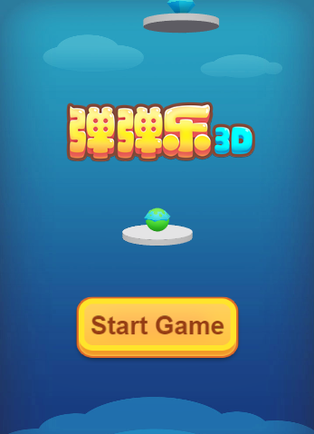
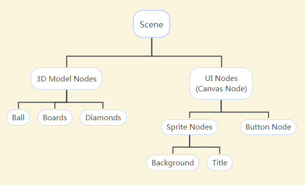
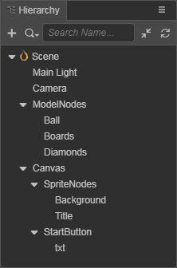

# 节点层级和渲染顺序

通过前面的内容，我们了解了通过节点和组件的组合，能够在场景中创建多种元素。当场景中的元素越来越多时，我们就需要通过节点层级来将节点按照逻辑功能归类，并按需排列它们的显示顺序。

## 了解层级管理器

创建和编辑节点时，**场景编辑器** 可以展示直观的可视化场景元素。而节点之间的层级关系则需要使用 **层级管理器** 来检查和操作。请先阅读 [层级管理器](../../editor/hierarchy/index.md) 面板介绍，来掌握 **层级管理器** 的使用方法。

## 节点树

通过 **层级管理器** 或运行时脚本的操作，建立的节点之间的完整逻辑关系，就叫做节点树。

我们用一个简单的游戏场景来看一下什么是节点树。下图中包括背景图像、一个主角（小球）、标题、跳板、钻石和开始游戏的按钮：

每个视觉元素都是一个节点，通常我们不会把所有节点平铺在场景上，而是会按照一定的分类和次序（比如根据自己的喜好）组织成节点树，例如：

我们把显示在上层的叫做父节点，显示在下层的叫做子节点。在 **层级管理器** 中，上图的节点树就会是这个样子：

因为 Creator 3.0 的 UI 节点需要其任意上级节点至少得有一个含有 UITransform 组件，在创建时若不符合规则，便会自动添加一个 Canvas 节点作为它的父级，所以上图中的节点树便将 UI 节点都统一放在了 Canvas 节点下。然后根据类别分别创建父节点，并将同类节点放在一个父节点下，从而构建出的节点树。

在实际游戏项目中我们还可以根据需要采用其他方式（例如游戏逻辑）来组织节点树。

## 节点渲染顺序

3D 节点的渲染与距离相机的 Z 坐标值，透明度等有关系。 
UI 节点的渲染和遮挡关系则受节点树的影响，在 **层级管理器** 中会按照节点排列顺序从上到下依次渲染，也就是说显示在列表上面的节点在场景中会被下面的节点遮盖住。因此，子节点永远都会遮盖住父节点。详情可参考 [UI 渲染排序规则](../../ui-system/production-strategy/priority.md)。

其他渲染相关可参考：
- [图形渲染](../../module-map/graphics.md)
- [粒子渲染](../../particle-system/renderer.md)
- [模型分组渲染](../../engine/renderable/model-component.md#%E6%A8%A1%E5%9E%8B%E5%88%86%E7%BB%84%E6%B8%B2%E6%9F%93)

## 性能考虑

注意，虽然说父节点可以用来组织逻辑关系甚至是当做承载子节点的容器，但节点数量过多时，场景加载速度会受影响，因此在制作场景时应该避免出现大量无意义的节点，尽可能合并相同功能的节点。
