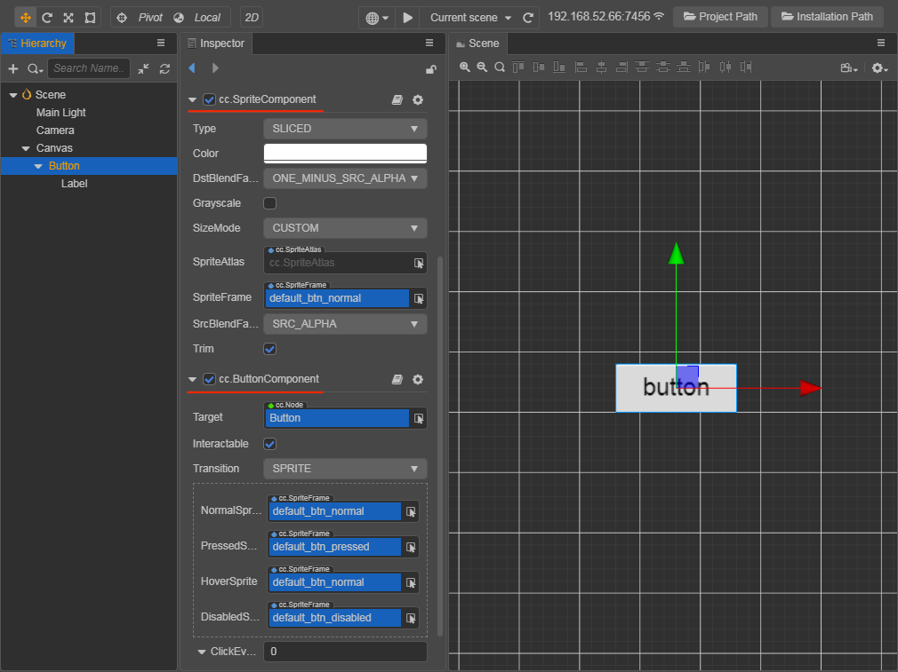
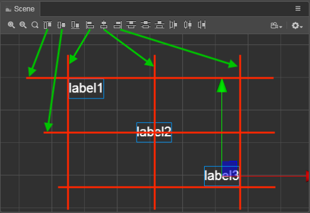
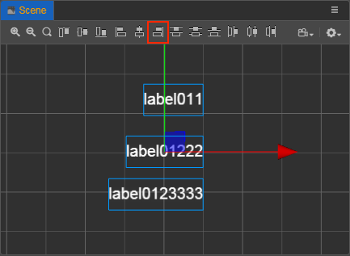

# 使用场景编辑器搭建场景图像

本文将介绍使用 [场景编辑器](../../editor/scene/index.md) 创建和编辑场景图像时的工作流程和技巧。

## 使用节点创建菜单快捷添加基本节点类型

当我们开始在场景中添加内容时，一般会先从 **层级管理器** 的 **创建节点菜单** 开始，也就是点击左上角的 **+** 按钮弹出的菜单，从几个简单的节点分类中选择我们需要的基础节点类型并添加到场景中。

添加节点时，在 **层级管理器** 中选中的节点将成为新建节点的父节点，如果你选中了一个折叠显示的节点然后通过菜单添加了新节点，需要展开刚才选中的节点才能看到新添加的节点。

### 空节点

选择 **创建节点菜单** 中的 **创建空节点** 就能够创建一个不包含任何组件的节点。空节点可以作为组织其他节点的容器，也可以用来挂载开发者编写的逻辑和控制组件。另外在下文中我们也会介绍如何通过空节点和组件的组合，创造符合自己特殊要求的控件。

### 3D 对象

选择 **创建节点菜单** 中的 **创建 3D 对象** 可以创建编辑器自带的一些比较基础的静态模型控件，目前包括立方体、圆柱体、球体、胶囊、圆锥体、圆环体、平面和四方形。若需要创建其他类型的模型，可参考 [MeshRenderer 组件](../../engine/renderable/model-component.md)。

### UI 节点

选择 **创建节点菜单** 中的 **创建 UI** 可以创建 UI 节点。Creator 3.0 的 UI 节点需要其任意上级节点至少得有一个含有 UITransform 组件，在创建时若不符合规则，便会自动添加一个 Canvas 节点作为它的父级。并且每一个 UI 节点本身也会带有 UITransform 组件。

所以 Canvas 节点是 UI 渲染的 **渲染根节点**，所有渲染相关的 UI 节点都要放在 Canvas 下面，这样做有以下好处：

- Canvas 能提供多分辨率自适应的缩放功能，以 Canvas 作为渲染根节点能够保证我们制作的场景在更大或更小的屏幕上都保持较好的图像效果，详见 [多分辨率适配方案](../..//ui-system/production-strategy/multi-resolution.md)相关文档。
- Canvas 节点会根据屏幕大小自动居中显示，所以 Canvas 下的 UI 节点会以屏幕中心作为坐标系的原点。根据我们的经验，这样设置会简化场景和 UI 的设置（比如让按钮元素的文字默认出现在按钮节点的正中），也能让控制 UI 节点位置的脚本更容易编写。

#### 2D 渲染节点

通过 **创建节点菜单** 可以创建像 ParticleSystem（粒子）、Sprite（精灵）、Label（文字）、Mask（遮罩）等由节点和基础渲染组件组成的节点类型。

这里的基础 2D 渲染组件，是无法用其他组件的组合来代替的。需要注意的是每个节点上只能添加一个渲染组件，重复添加会导致报错。但是可以通过将不同渲染节点组合起来的方式实现复杂的界面控件，比如下面的 UI 控件节点。

#### UI 控件节点

从 **创建节点菜单** 中的 **UI** 类别里可以创建包括 Button（按钮）、Widget（对齐挂件）、Layout（布局）、ScrollView（滚动视图）、EditBox（输入框）等节点在内的常用 UI 控件。

UI 节点大部分都是由渲染节点组合而成的，比如我们通过菜单创建的 Button 节点，就包括了一个包含 Button + Sprite 组件的按钮背景节点，加上一个包含 Label 组件的标签节点：

使用菜单创建基础类型的节点，是快速向场景中添加内容的推荐方法，之后我们还可以根据需要对使用菜单创建的节点进行编辑，创造我们需要的组合。

关于 UI 节点的更多内容，可参考 [UI 结构说明](../../2d-object/ui-system/index.md)。

### 逻辑节点的归属

除了有具体渲染等任务的节点之外，建议在场景根目录设置一些节点只负责挂载脚本，执行游戏逻辑，不包含任何渲染等相关内容。通常我们将这些节点放置在场景根层级，和 Canvas 节点并列，方便协作的时候其他开发者能够第一时间找到游戏逻辑并进行相关的数据绑定。

## 提高场景制作效率的技巧

**场景编辑器** 包括 3D 和 2D 两种视图，3D 视图用于 3D 场景编辑，2D 视图则主要用于 UI 节点等 2D 元素的编辑，可通过编辑器左上方工具栏中的 3D/2D 按钮切换场景视图。 
以下几种快捷方式对两种视图都适用：

- 在 **层级管理器** 里选中一个节点，然后双击或者按 <kbd>F</kbd> 就可以在 **场景编辑器** 中聚焦这个节点。
- 选中一个节点后按 <kbd>Cmd/Ctrl + D</kbd> 会在该节点相同位置复制并粘贴一个同样的节点，当我们需要快速制作多个类似节点时可以用这个命令提高效率。
- 在 **场景编辑器**/**层级管理器** 中，按住 <kbd>Cmd/Ctrl</kbd> 键依次点击你想要的节点，就可以同时选中多个节点。<kbd>Shift</kbd> 键则可以连选节点，不需要一个一个选中。

### 对齐/平均分布节点

当 **场景编辑器** 为 **2D** 视图时，左上角有一排按钮可以用来在选中多个节点时将这些节点对齐或者平均分布。具体的规则如下：

假设三个 Label 节点都已经选中，从左到右的 6 个对齐按钮会依次将这些节点：

- 顶部对齐，按照最靠近上方的边界对齐（而不是最上方的节点的上边界）
- 垂直居中对齐，按照整体的水平中线对齐
- 底部对齐，按照最靠近下方的边界对齐
- 左对齐，按照最靠近左边的边界对齐
- 水平居中对齐，按照整体的垂直中线对齐
- 右对齐，按照最靠近右边的边界对齐

后半部分从左到右的 6 个分布按钮会依次将这些节点：

- 顶部分布，按照节点的上边界平均分布
- 垂直居中分布，按照节点的水平中线平均分布
- 底部分布，按照节点的下边界平均分布
- 左分布，按照节点的左边界平均分布
- 水平居中分布，按照节点的垂直中线平均分布
- 右分布，按照节点的右边界平均分布

**注意**：不管是一开始测定左右边界和中线还是之后将每个节点对齐/平均分布时的参照，都是节点约束框的中心或某条边界，而不是节点的位置坐标。

例如下图中我们将三个宽度不同的 Label 节点向右对齐后，得到的是三个节点约束框的右边界对齐，而不是三个节点位置的 `x` 坐标变成一致。

## 场景显示效果

目前还支持在场景中设置天空盒、全局雾效果以及阴影等，以便更好地丰富场景，渲染并展示场景环境。具体可参考：

- [天空盒](./skybox.md)
- [全局雾效](./fog.md)
- [阴影](./shadow.md)
